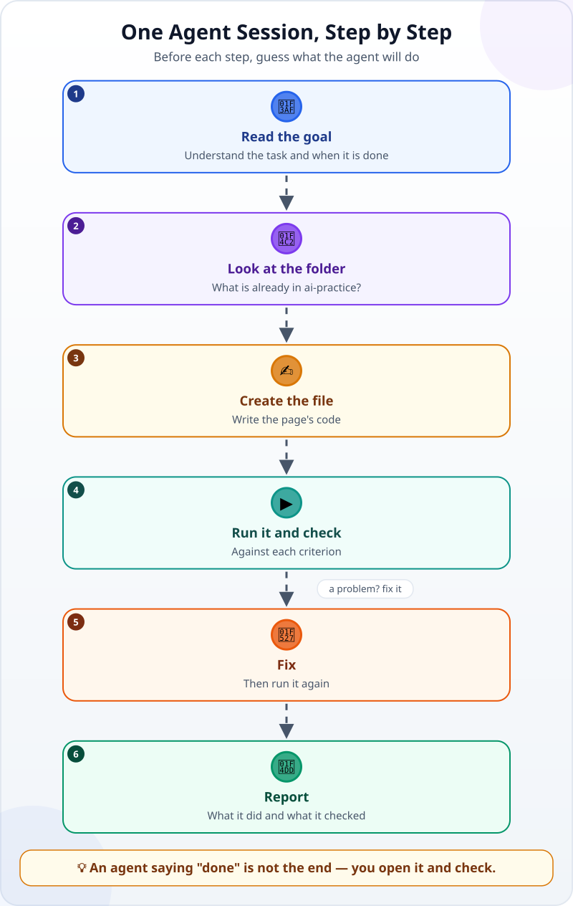
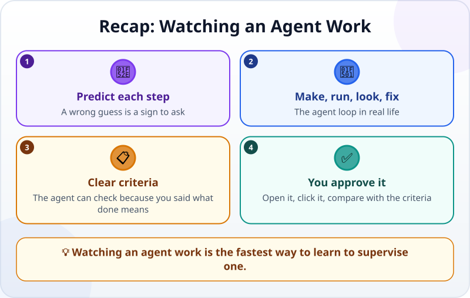

🌐 [Tiếng Việt](../../vi/lessons/watch-an-agent-build.md) · **English** · [日本語](../../ja/lessons/watch-an-agent-build.md)

# Watch an AI Agent Build and Check a Tiny Web Page

<!-- section: objective -->
## Lesson Objective

By the end of this lesson, you will be able to:

- Retell the steps of an agent session: read the goal → look at the folder → create the file → run it and check → fix → report.
- **Watch with a purpose**: predict the next step, then compare it with what the agent actually does.
- Explain why an agent saying "done" is not the end, and check the result against your own criteria.

<!-- section: hook -->
## Why It Matters

You already know that an agent works in a [think → act → observe loop](agent-parts-and-loop.md). This lesson shows that loop on a real task: building a tiny web page.

It is like your first day at a new job: you sit next to an experienced colleague and watch them do the task once. You do not have to do it yet, but you learn **what normal looks like** — so later you notice at once when something is off.

<!-- section: concept -->
## Core Idea

### One session, step by step

1. **Read the goal:** the agent restates the task and what "done" means. If it has misunderstood, this is the cheapest moment to correct it.
2. **Look at the folder:** the agent checks what is already there before writing, so it does not overwrite an existing file.
3. **Create the file:** the agent writes code — instructions for the computer — into the file.
4. **Run it and check:** the agent tries what it made and compares it with each criterion, if its tools let it open the page and click around.
5. **Fix:** when something is wrong it fixes it, then runs it again. Steps 4 and 5 may repeat several times.
6. **Report:** the agent says what it did, **what it checked — and what it did not check**.

### Watch with a purpose: predict, then compare

Do not just watch. Before each step, ask yourself: *"If I were doing this, what would I do next?"* Then compare with what the agent does:

- **You guessed right:** you are learning how agents work.
- **You guessed wrong:** either you have learned a new way of working, or the agent is going off track — that is the moment to ask.

### Four things to look for

- Does the agent **look before it writes**?
- Does it **run** what it made?
- Does it **compare with your criteria**, or only see that it "seems to work"?
- Does the report say clearly **what was not checked**?

<!-- section: example -->
## Real Example

Hana works in an office in Tokyo and is new to AI. She wants a tiny web page that shows a work tip, and gives the job to an agent in her practice folder, `ai-practice`:

> *"Create one file, `tips.html`, that shows a work tip, with a 'Next tip' button to change it. Done when: (1) it opens in a browser, one file only; (2) it has 5 tips, and the button changes the tip; (3) the text is large enough to read on a phone."*

The session goes like this (shortened):

1. 🎯 The agent restates the goal and the 3 criteria.
2. 📂 It looks at `ai-practice`: only a `README.txt`, so nothing will be overwritten.
3. ✍️ It creates `tips.html` with 5 tips and a button.
4. ▶️ It opens the page and clicks: **the button does not change the tip**. The error message says the button calls a named piece of code that does not exist — the name has a one-letter typo.
5. 🔧 It fixes the name and opens the page again: the button changes the tip. It narrows the window to phone width: the text is still readable.
6. 📝 It reports: *"Created `tips.html`. Checked: it opens, it has 5 tips, the button changes the tip, the text is readable in a narrow window. Not checked: on a real phone."*

Hana checks the result against her 3 criteria. She keeps clicking "Next tip" — and on the **5th click** the tip box is **empty**. The agent only clicked a few times, so it never met this bug. Hana tells it; the agent makes the tips start again after the last one, then clicks through a full round itself to check.

What Hana takes away: an agent can only check what it **sees**. The clearer the criteria — say, *"after 10 clicks in a row there is always a tip"* — the more thoroughly the agent checks itself, and the final check is still yours.

<!-- section: try-it -->
## Try It Yourself

Nothing to install; about 3 minutes. Tuấn gives an agent this task: *"Create `countdown.html`, which says how many days are left until the summer holiday (August 10). Done when: it opens in a browser; the number matches the calendar."* So far the agent has:

1. Restated the goal and the 2 criteria.
2. Looked at the `ai-practice` folder.
3. Created `countdown.html`.

**Your guess:** what should the agent do next? And when it says it is done, what should Tuấn check himself?

Suggested answer

- **Next step:** open the page and compare the number with the calendar — for example, count the days another way and compare the two results.
- **Tuấn's own check:** open the file, count the days on a calendar himself and compare with the number on the page. If the page is off by one day, or shows a negative number, that is a bug to report.

<!-- section: misconceptions -->
## Common Misconceptions

- **"If the agent says it is done, it is done."** — The report tells you what the agent checked. Read the *not checked* part closely, then check the result against your own criteria.
- **"If the agent fixes its own errors, I do not need to watch."** — It fixes the errors it can see: the typo came with a clear error message. A bug that only shows on the 5th click takes a person — or a clear criterion — to find.
- **"Watching an agent work is a waste of time."** — The first few times, watching closely teaches you what normal looks like. Later you only need to look at a few key moments: the goal, the check results, the report.

<!-- section: recap -->
## The Lesson in One Picture

<!-- section: takeaways -->
## Key Takeaways

- An agent session: read the goal → look at the folder → create the file → run it and check → fix → report.
- Watch with a purpose: predict each step; a wrong guess is a sign to ask.
- The agent can check because you said *what done means*; the clearer your criteria, the more thoroughly it checks.
- An agent saying "done" is not the end: you open it, click it and compare it with your criteria.

<!-- section: quiz -->
## Quick Check

**Question 1.** Why should an agent look at the folder before creating a file?

- A) To know what is already there and avoid overwriting an existing file
- B) To slow down and be careful
- C) Because the computer requires it

**Question 2.** In the example, why did the agent not find the empty-tip bug itself?

- A) Because the agent cannot read code
- B) Because Hana did not let the agent click the button
- C) Because it only clicked a few times, not enough for the bug to show

**Question 3.** The agent reports: *"Created the file. Not checked on a real phone."* What should you do?

- A) Ignore that sentence, since the agent said it is done
- B) If it matters to you, check that part yourself or ask the agent to check more
- C) Delete the file and start again

Show answers

1. **A** — looking before writing keeps the agent from overwriting what is there.
2. **C** — an agent can only check what it sees; a criterion like "after many clicks there is always a tip" would have helped it find the bug.
3. **B** — the *not checked* part of a report is yours: check it yourself, or ask for more.

<!-- section: sources -->
## Recommended Sources

- Anthropic — [Best practices for Claude Code](https://code.claude.com/docs/en/best-practices): give the agent a way to verify its own work, such as tests or a screenshot to compare; without one, "looks done" is the only signal, and you become the one who has to notice every mistake.
- Anthropic — [Building Effective AI Agents](https://www.anthropic.com/engineering/building-effective-agents) (December 2024): at each step an agent needs "ground truth" from its environment — tool results, code execution — to assess its progress.
