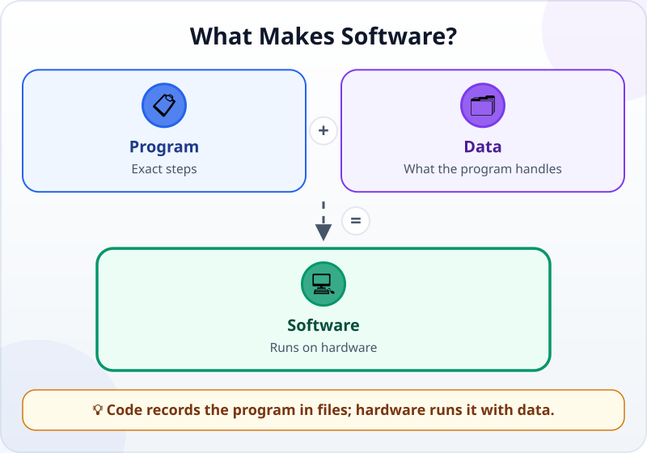
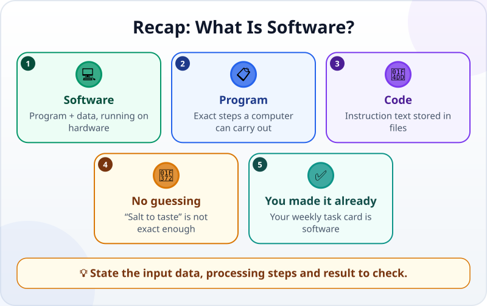

🌐 [Tiếng Việt](../../vi/lessons/what-is-software.md) · **English** · [日本語](../../ja/lessons/what-is-software.md)

# What Is Software? A Program Is Like a Recipe

<!-- section: objective -->
## Lesson Objective

By the end of this lesson, you will be able to:

- Tell software, programs, code, data and hardware apart at a basic level.
- Explain why a computer needs exact steps instead of vague human instructions.
- Recognize that a small thing you made can also be software.

<!-- section: hook -->
## Why It Matters

Mai wants a computer to prepare a task list. She thinks, “This is easy—just sort it neatly.” But what does **neatly** mean: by date, importance or name? A person may guess from the situation; a computer needs a clear method.

This matters when Mai directs an agent. The agent can write plenty of code, but if Mai does not know what a product contains, she cannot say precisely what to change or notice that the agent changed the wrong thing.

<!-- section: concept -->
## Core Idea

### Hardware runs software

**Hardware** is physical: a phone, laptop, memory and processor. **Software** is the programs and data the hardware uses. A calendar app, spreadsheet and website are all software. Without hardware, software has no machine to run on; without software, the machine does not yet know what work to do.

**Data** is what a program works with: task names, dates, completion states, document text or pictures. Two people can run the same program but see different lists because their data differs.

### A program is a set of exact steps

A **program** is a set of step-by-step instructions a computer can carry out. A task-card program might receive a list, put unfinished work first, then display every task on the screen.

A computer follows described steps quickly and repeatedly. It does not automatically use life experience to fill in ambiguity. “Sort it sensibly” is not an exact enough rule. “Put unfinished tasks first; within each group, put earlier dates first” is much clearer.

### Code is the program's text

**Code** is text that expresses those steps in a programming language. Code is usually kept in project **files**, where people and agents can read it, edit it and inspect changes. When the code runs, the computer carries out the program and produces a result on screen or in a file.

You do not need to write every line yourself yet. Variables, conditions, loops and functions appear in [Variables, Functions, Conditions, Loops: Four Common Building Blocks](programming-building-blocks.md). For now, remember: a program is the instructions; code is the text that records them.

<!-- section: analogy -->
## Simple Analogy

A program is like a **recipe**. Ingredients are like data; the kitchen and tools are like hardware; the written recipe is like code; the finished dish is like the output.

A cook understands “salt to taste” because they taste, draw on experience and adjust. A computer does not know how much “to taste” is. An instruction for a computer must be more like “add 2 grams of salt and stir for 10 seconds.” Each input needs a clear processing step and a checkable result.

The analogy has a limit: a cook has senses and can improvise, while a computer only follows processing allowed by its program. An agent can help turn your request into code, but the finished product still runs according to its code and data, not an intention you never stated.

<!-- section: example -->
## Real Example

In [Your First Agent Session: Build a One-File Task Card](first-agent-session.md), Mai asked an agent to create a weekly task card in the `ai-practice` practice folder. It was not merely “a pretty page.” It was software she had already made:

1. **Data** was fictional work such as “Draft the update” and whether each item was done.
2. **Code** was the text in the file the agent created to describe content, appearance and behavior.
3. The **program** was the instructions the browser carried out to turn code and data into a task card.
4. **Hardware** was the laptop running the browser and displaying the result.

When Mai asks to “put unfinished tasks first,” the agent must change instructions in the code. When she only changes “Draft the update” to “Send the update,” the data changes while the program's behavior may stay the same. Telling these changes apart helps Mai describe work clearly.

<!-- section: misconceptions -->
## Common Misconceptions

- **“Software is only code.”** — Software also needs data to work with, and hardware to run it.
- **“A program and code are completely separate things.”** — A program is instructions; code is text used to record them. In everyday conversation, the words are sometimes used almost interchangeably.
- **“The computer will understand what I mean.”** — It does not automatically understand “nice,” “sensible” or “to taste.” Turn that intent into observable, checkable criteria.
- **“Only large products count as software.”** — A one-file task card is still software when a computer runs its instructions and data.

<!-- section: recap -->
## The Lesson in One Picture

<!-- section: takeaways -->
## Key Takeaways

- Software is programs plus data, running on hardware.
- A program is exact steps; a computer cannot follow “salt to taste.”
- Code is the program's text and is usually stored in files.
- The weekly task card in `ai-practice` is software you already made.

<!-- section: quiz -->
## Quick Check

**Question 1.** Which description of software is most accurate?

- A) Only machines that have screens
- B) Programs and data running on hardware
- C) Only large apps sold to many people

**Question 2.** Why is “salt to taste” a poor instruction for a computer?

- A) It gives no exact amount and processing step
- B) Computers cannot process numbers
- C) Every program must be about cooking

**Question 3.** What is code?

- A) The physical parts inside a laptop
- B) All data entered by a user
- C) Text that records a program's instructions

Show answers

1. **B** — software includes programs and data, and needs hardware to run.
2. **A** — “to taste” relies on a cook's judgment, not an exact step for a computer.
3. **C** — code is the text describing instructions, usually stored in files.

