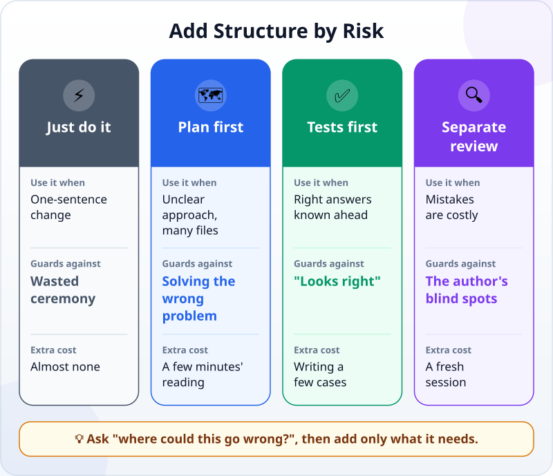
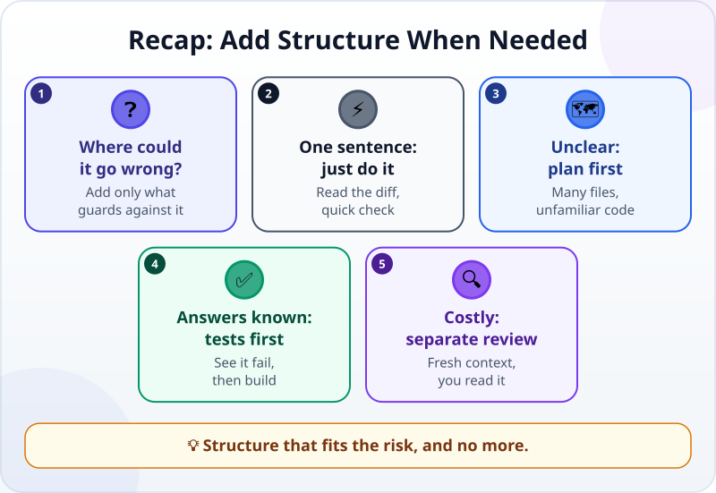

🌐 [Tiếng Việt](../../vi/lessons/workflow-frameworks.md) · **English** · [日本語](../../ja/lessons/workflow-frameworks.md)

# Add Structure When the Task Needs It: Plans, Tests First, Reviews

<!-- section: objective -->
## Lesson Objective

By the end of this lesson, you will be able to:

- Choose between four ways of working — **just do it**, **plan first**, **tests first**, **separate review** — based on a task's risk.
- Say which risk each one guards against, and what it costs.
- Write a "tests first" request: cases with right answers known in advance, see the test fail, and only then build.

<!-- section: hook -->
## Why It Matters

Hana reads online about a "standard process" for working with AI: always write a requirements document, then a plan, then tests, then a review, and only then build. She tries it on changing the color of the heading on her task card. It takes forty minutes, for a one-line change.

The next week she does the opposite: she hands over an overtime calculator directly, no plan, no tests. The result works — until the day there is a night shift.

More structure is not always better, and less is not always faster. It should **fit the risk** of the task.

<!-- section: concept -->
## Core Idea

### Start with the question: where could this go wrong?

You already have the basic workflow [explore → plan → build → verify](explore-plan-build-verify.md). This lesson is about **dosage**: how much structure to add for a specific task. Each thing you add guards against a different risk.



### Just do it

The Claude Code guidance (September 2026) puts it simply: **if you could describe the change in one sentence, skip the plan.** Change a heading color, fix a typo, add a line to a list. Hand it over, read the diff, open it once to look — done.

### Plan first — against doing the wrong thing

When you are unsure how to approach it, when the change touches many files, or when you do not know that part of the code, the biggest risk is that the agent correctly solves the **wrong** problem. A plan you read first costs a few minutes, much less than redoing an afternoon spent going the wrong way.

### Tests first — against "looks right"

When you **already know the right answers** for a few cases — a bug to reproduce, numbers you worked out by hand — turn them into [tests](testing-basics.md) **before** any code exists:

1. Write the cases and their right answers.
2. Run the tests: they must **fail** (there is no code yet, or the old code still has the bug). Seeing them fail is evidence that the tests really check something.
3. Only then let the agent build, until the tests pass.

The Claude Code guidance suggests exactly this for bug fixes: write a failing test that reproduces the issue, then fix it. Software people call this *test-driven development* (TDD).

### Separate review — against the author's blind spots

Authors find it hard to see their own mistakes — agents too, because they remember why they took each step. When mistakes are costly (money, data, something many people use), or when the agent has worked alone for a long time, get a review **in a fresh context**: another session that sees only the diff and the criteria, not the reasoning that led to them. Then you read what that review found.

### Many names, one question

Online you will find many "frameworks" with their own names, templates and steps. Most are different combinations of the three things above. You do not need to collect them. For each task, ask: **where could this go wrong?** — and add only what guards against that risk. Too much also has a price: it is slower, and the context fills with documents nobody needs.

<!-- section: analogy -->
## Simple Analogy

Going shopping. Popping to the corner shop for salt: just go. Going to a big market you have never visited: look at a map first — that is a **plan**. Shopping for a family holiday dinner: write a list before you go, and check off each item when you get home — that is **tests first**. Buying with the company's money: someone else checks the receipt — that is a **separate review**.

Nobody writes a list to buy salt, and nobody shops for a holiday dinner without one.

Where the comparison breaks down: shopping is slow, so every extra step feels expensive. An agent works very fast, so a plan or a test usually costs only a few minutes — much less than it feels like. Do not skip a step a task really needs just because it feels like extra work.

<!-- section: example -->
## Real Example

Hana has three tasks this week, all in `ai-practice` with made-up data.

**Task 1 — change the color of the task card's heading.** It fits in one sentence. **Just do it**: read the one-line diff, open the page and look. Two minutes.

**Task 2 — calculate overtime from a timesheet.** Hana already knows the right answers for a few days, so she chooses **tests first**. The made-up rule: work beyond 8 hours a day counts as overtime, and the 1-hour lunch break does not count.

```text
Before writing any code, create check_overtime.py with these cases
(start time, end time, 1-hour break, beyond 8 hours is overtime):
- 9:00 → 19:30: 1.5 hours of overtime
- 8:30 → 17:30: 0 hours of overtime
- 9:00 → 22:00: 4 hours of overtime
- 22:00 → 7:00 the next day (night shift): 0 hours of overtime
Run it and show me that it FAILS (there is no code yet). Do not write the calculation yet.
```

The tests fail, as expected. Hana continues: *"Now write overtime.py until all four cases pass."* The agent writes it and runs the tests: three cases pass, the **night shift** fails — the code subtracted 22:00 from 7:00 and got a negative number. The agent fixes it so the end time can fall on the next day, runs the tests again: all four pass. This is exactly the bug that last week's "just do it" let through.

**Task 3 — share the overtime tool with the team.** From now on, a mistake affects many people. Hana opens **a new session** and asks for a **separate review**: *"Read overtime.py and check_overtime.py. Compare them with the rule: beyond 8 hours is overtime, 1-hour lunch break. Find missing cases. Do not change anything."* The review points out a case with no test: typing an end time of 7:30 instead of 17:30, with a start of 9:00, the code reads it as a 22.5-hour night shift and counts 13.5 hours of overtime — without any warning. Hana decides: a shift longer than 16 hours should show an error so the person can check what they typed. She adds that case to the tests, lets the agent fix the code until it passes, and only then shares it with the team.

Three tasks, three different doses. None of them used the full "standard process".

<!-- section: misconceptions -->
## Common Misconceptions

- **"With AI, you always need a plan."** — For a change you can describe in one sentence, a plan only slows you down. Keep it for tasks where the approach is unclear or many files are touched.
- **"Tests written afterwards are just as good as tests written first."** — Tests written afterwards are easily written to match the code that exists, mistakes included. Write them first and see them fail, and you know they really check something.
- **"The agent already checked its work, so no separate review is needed."** — The agent checks according to how it understood the task. A fresh session that sees only the diff and the criteria often spots what the author missed.

<!-- section: recap -->
## The Lesson in One Picture



<!-- section: takeaways -->
## Key Takeaways

- Ask first: where could this go wrong? Then add only what guards against that risk.
- Describable in one sentence: just do it, read the diff, check quickly.
- Unclear approach or many files: plan first.
- Right answers known in advance: write tests first, see them fail, then build.
- Mistakes are costly: a separate review in a fresh context, then you read the result.

<!-- section: quiz -->
## Quick Check

**Question 1.** Which task should you **just do**, without a plan?

- A) Fixing a typo in the page title
- B) Adding an export feature that touches four files you have never read
- C) Rewriting the salary calculation for the whole department

**Question 2.** Why run a test and see it **fail** before the code exists?

- A) To get the agent used to failure
- B) To be sure the test really checks something
- C) Because the tool requires it

**Question 3.** Hana is about to share the overtime tool with her team. Why does she open a **new** session for the review?

- A) Because the old session ran out of battery
- B) Because a new session will fix the code faster
- C) Because a new session sees only the diff and the criteria, not the reasoning behind them, so it spots what was missed more easily

<details>
<summary>Show answers</summary>

1. **A** — it fits in one sentence; a plan only slows it down.
2. **B** — a test that has never failed may not be checking anything.
3. **C** — authors, agents included, easily overlook their own mistakes; a fresh context sees the result with different eyes.

</details>

<!-- section: sources -->
## Recommended Sources

- Anthropic — [Best practices for Claude Code](https://code.claude.com/docs/en/best-practices) (English, as of September 2026): planning is most useful when you are unsure of the approach, when the change modifies multiple files, or when you are unfamiliar with the code; if you could describe the diff in one sentence, skip the plan; for a bug, write a failing test that reproduces it, then fix it; add a review step in a fresh context that sees only the diff and the criteria before treating the work as done.
