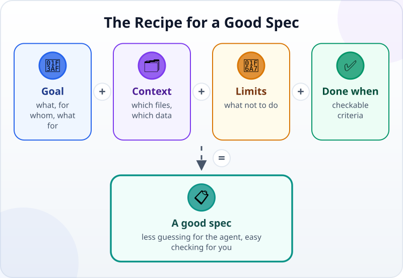
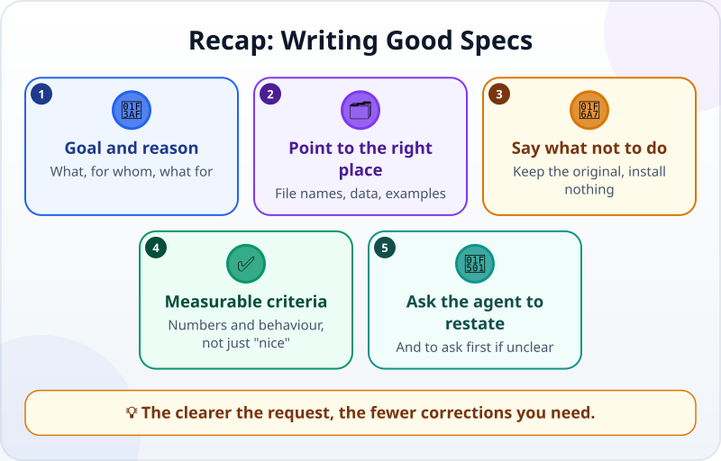

🌐 [Tiếng Việt](../../vi/lessons/writing-good-specs.md) · **English** · [日本語](../../ja/lessons/writing-good-specs.md)

# Writing Good Specs: The Task and Its Definition of Done

<!-- section: objective -->
## Lesson Objective

By the end of this lesson, you will be able to:

- Write a request (a spec) in four parts: **goal**, **context**, **constraints** and **acceptance criteria**.
- Turn a vague criterion ("nice", "fast", "correct") into one you can check.
- Use that spec to hand work to an agent and check the result yourself.

<!-- section: hook -->
## Why It Matters

You have seen that how well an agent can check itself depends on the criteria you give it. Anthropic's guidance puts it simply: the agent can infer intent, but it cannot read your mind — the more precise your instructions, the fewer corrections you need.

This lesson turns that habit into a recipe you can use for any task, from a tiny web page to a monthly report.

<!-- section: concept -->
## Core Idea

### The four-part recipe



- **Goal:** what, for whom, what for. Knowing the reason helps the agent choose a better approach.
- **Context:** which files, which data, what already exists. Name the file instead of "the file from the other day".
- **Constraints (limits):** what not to do, and the limits: *do not change the original file*, *install nothing*, *work only in `ai-practice`*.
- **Acceptance criteria (done when):** specific, checkable conditions, starting with *"Done when…"*.

### Vague criteria and checkable ones

A simple test: **could someone else check your criterion on their own, without asking you?**

| Vague | Checkable |
|---|---|
| The page looks nice | Readable on a phone without zooming in |
| It runs fast | Opens a 1,000-row file in under 2 seconds on my computer |
| The numbers are right | The total of the first 3 rows matches my own sum |
| It is easy to use | A colleague who has never seen it can do it without asking |

### Ask the agent to restate, and to ask first

End every spec with one sentence: *"Before you start, restate the goal and the criteria in your own words. If anything is unclear, ask me first."* A misunderstanding caught here is the cheapest one — before the agent spends a whole session heading the wrong way.

<!-- section: try-it -->
## Try It Yourself

About 12 minutes, in `ai-practice`, with made-up data only.

Mai messages the agent: *"Make me a summary of this month's expenses."* Rewrite it as a spec.

**1. Create made-up data (2 minutes)** — ask the agent:

```text
Create expenses.csv with 20 made-up expense rows for September 2026,
with the columns date, category, amount.
category is one of: Travel, Meals, Stationery, Other. amount is in Vietnamese dong.
```

**2. Write the spec from this outline (5 minutes):**

```text
Goal:
Context:
Constraints:
Done when:
1.
2.
3.
Before you start, restate the goal and the criteria. If anything is unclear, ask me first.
```

**3. Compare with the sample** below — yours need not match; it needs all four parts and checkable criteria.

**4. Hand it over and check (5 minutes):** send your spec to the agent, approve changes one by one, then check each criterion yourself. Write your evidence:

- *I can show…* `summary.csv` open in a spreadsheet.
- *I checked…* the grand total matches the total of the `amount` column; Travel matches my own sum.
- *I would not use this when…* for example: the data mixes several currencies.

<details>
<summary>Sample spec</summary>

```text
Goal: a summary of September 2026 expenses by category, for my month-end report.
Context: the data is in expenses.csv in this folder (columns date, category, amount). It is made up.
Constraints: do not change expenses.csv; write the result to a new file, summary.csv;
ask me before installing anything.
Done when:
1. summary.csv has one row per category (4 rows) and a Total row.
2. Total equals the sum of the amount column in expenses.csv.
3. The Travel amount matches the sum I add up myself.
Before you start, restate the goal and the criteria. If anything is unclear, ask me first.
```

</details>

<!-- section: misconceptions -->
## Common Misconceptions

- **"The longer the request, the better."** — Not longer: complete. A few short bullet points are easier to check than a long paragraph.
- **"The agent can come up with the criteria."** — It can suggest some, but deciding what done means is your job.
- **"Every request needs a full spec."** — When you only want to explore (*"what could be improved in this file?"*), an open question is useful. When you hand over work that needs a result, write all four parts.
- **"A spec is written once."** — When checking teaches you something new (like a bug that only shows on the 5th click), add it to the criteria for next time.

<!-- section: recap -->
## The Lesson in One Picture



<!-- section: takeaways -->
## Key Takeaways

- Spec = **goal** + **context** + **constraints** + **acceptance criteria**.
- A good criterion is one someone else can check: numbers and behaviour, not a general "nice" or "fast".
- End a spec by asking the agent to restate the goal and criteria and to ask first if anything is unclear.
- Learned something new while checking? Add it to the criteria.

<!-- section: quiz -->
## Quick Check

**Question 1.** Which criterion can be checked?

- A) "The Total equals the sum of the `amount` column."
- B) "The report looks professional."
- C) "The agent works carefully."

**Question 2.** Which part of a spec does "do not change the original file" belong to?

- A) Goal
- B) Context
- C) Constraints

**Question 3.** Why ask the agent to restate the goal before it starts?

- A) To make the agent faster
- B) To catch misunderstandings early, while they are cheap to fix
- C) To make the session longer

<details>
<summary>Show answers</summary>

1. **A** — anyone can compare two numbers; B and C are impressions that cannot be checked.
2. **C** — constraints are what not to do, and the limits.
3. **B** — correcting one restatement costs far less than a session spent going the wrong way.

</details>

<!-- section: sources -->
## Recommended Sources

- Anthropic — [Best practices for Claude Code](https://code.claude.com/docs/en/best-practices), section *Provide specific context in your prompts*: the more precise your instructions, the fewer corrections you need; reference specific files, mention constraints and describe what "fixed" looks like. Vague prompts can still help when you are exploring.
