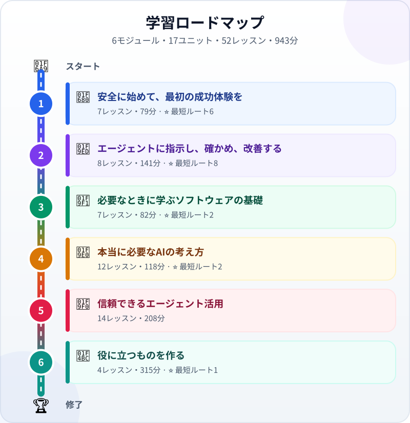

<!-- Generated by `python -m src.main build` from course/data/ and the lesson files. Do not edit by hand: CI fails when this file is out of date. -->

🌐 [Tiếng Việt](../vi/README.md) · [English](../en/README.md) · **日本語**

# ゼロから学ぶエージェント型コーディング

> 「ソフトウェアとは？」から、AIエージェントにソフトウェアづくりを任せ、その結果を自分で確かめられるようになるまで——3か国語で学ぶ。

**対象：** AIやプログラミングをまだ知らない社会人・学生・ソフトウェア以外の分野のエンジニアで、 AIエージェントを使って自分のツールを作ったり仕事を自動化したりしたい人。 プログラミングの経験は不要です。AIにコードを書かせ、それを確かめ、結果に責任を持てるだけの 知識を身につけます。日本で学ぶ・働くベトナムの方、日本企業と仕事をする方に特におすすめです。

**6モジュール・17ユニット・52レッスン・893分** · [3か国語の用語集](glossary.md)

_リンクのあるレッスンは読めます。そのほかは執筆中です。_

## ⭐ 最短ルート

まずはここから：19レッスン・347分。AIエージェントに仕事を任せ、その結果を自分で確かめられるようになります。下の表では⭐がついています。ほかのレッスンは必要になったときに学べます。

1. [チャットボットからAIエージェントへ：答えるだけでなく、仕事をするAI](lessons/chatbot-to-agent.md) — 8分
2. [頭脳・道具・ループ：AIエージェントは何でできている？](lessons/agent-parts-and-loop.md) — 8分
3. [AIエージェントが小さなWebページを作って確かめる様子を見よう](lessons/watch-an-agent-build.md) — 10分
4. [練習環境を選ぶ：ブラウザ、個人のPC、会社のPC](lessons/choose-your-learning-setup.md) — 10分
5. [エージェントに任せる前に：安全・要確認・禁止を分ける](lessons/data-safety-and-permissions.md) — 10分
6. はじめてのエージェント体験：1ファイルのタスクカードを作る — 25分
7. 新しい考え方：あなたはタイピストではなくリーダー — 8分
8. 良い指示書の書き方：タスクと完了条件 — 12分
9. 4ステップのワークフロー：調べる→計画する→作る→検証する — 12分
10. ファイル・フォルダ・パス：パソコンの中の地図 — 10分
11. エージェントの変更（差分）を読んでレビューする — 15分
12. 「たぶん合っている」をチェックに変える — 12分
13. エラーメッセージを読み、探偵のようにデバッグする — 12分
14. プロジェクト：自分のWebページ — 60分
15. データの形：JSON・CSV・YAML — 10分
16. Git：プロジェクト全体の「元に戻す」ボタン — 15分
17. ハルシネーション：AIが自信満々に間違える理由 — 10分
18. コンテキストウィンドウ：AIの短期記憶 — 10分
19. プロジェクト：事務作業を自動化する（表計算 → レポート） — 90分

## 1. 🚀 安全に始めて、最初の成功体験を

🎯 AIエージェントとチャットボットの違いを知り、自分の環境で安全に練習する方法を選び、エージェントに最初の小さな成果物を作らせて自分で確かめる。

### 1.1 エージェントにできること

| # | レッスン | 種類 | 時間 |
|---|---|---|---|
| 1.1.1 | ⭐ [チャットボットからAIエージェントへ：答えるだけでなく、仕事をするAI](lessons/chatbot-to-agent.md) | 📖 解説 | 8分 |
| 1.1.2 | ⭐ [頭脳・道具・ループ：AIエージェントは何でできている？](lessons/agent-parts-and-loop.md) | 📖 解説 | 8分 |
| 1.1.3 | ⭐ [AIエージェントが小さなWebページを作って確かめる様子を見よう](lessons/watch-an-agent-build.md) | 🎬 デモ | 10分 |

### 1.2 安全な学び方を選ぶ

| # | レッスン | 種類 | 時間 |
|---|---|---|---|
| 1.2.1 | ⭐ [練習環境を選ぶ：ブラウザ、個人のPC、会社のPC](lessons/choose-your-learning-setup.md) | 🛠️ 実習 | 10分 |
| 1.2.2 | ⭐ [エージェントに任せる前に：安全・要確認・禁止を分ける](lessons/data-safety-and-permissions.md) | 📖 解説 | 10分 |

### 1.3 はじめての成果物

| # | レッスン | 種類 | 時間 |
|---|---|---|---|
| 1.3.1 | ⭐ はじめてのエージェント体験：1ファイルのタスクカードを作る | 🛠️ 実習 | 25分 |
| 1.3.2 | 学ぶルートを選び、学習ログをつける | 🛠️ 実習 | 8分 |

## 2. 🧭 エージェントに指示し、確かめ、改善する

🎯 エージェントに明確な仕事を渡し、すべての変更を証拠で確かめ、最初の意味のあるプロジェクトを完成させる。

### 2.1 明確に仕事を渡す

| # | レッスン | 種類 | 時間 |
|---|---|---|---|
| 2.1.1 | ⭐ 新しい考え方：あなたはタイピストではなくリーダー | 📖 解説 | 8分 |
| 2.1.2 | ⭐ 良い指示書の書き方：タスクと完了条件 | 🛠️ 実習 | 12分 |
| 2.1.3 | ⭐ 4ステップのワークフロー：調べる→計画する→作る→検証する | 🛠️ 実習 | 12分 |

### 2.2 結果を確かめる

| # | レッスン | 種類 | 時間 |
|---|---|---|---|
| 2.2.1 | ⭐ ファイル・フォルダ・パス：パソコンの中の地図 | 🛠️ 実習 | 10分 |
| 2.2.2 | ⭐ エージェントの変更（差分）を読んでレビューする | 🛠️ 実習 | 15分 |
| 2.2.3 | ⭐ 「たぶん合っている」をチェックに変える | 🛠️ 実習 | 12分 |
| 2.2.4 | ⭐ エラーメッセージを読み、探偵のようにデバッグする | 🛠️ 実習 | 12分 |

### 2.3 最初のプロジェクト

| # | レッスン | 種類 | 時間 |
|---|---|---|---|
| 2.3.1 | ⭐ プロジェクト：自分のWebページ | 🚀 プロジェクト | 60分 |

## 3. 🧱 必要なときに学ぶソフトウェアの基礎

🎯 エージェントが作ったもの（ファイル、フォルダー、データ、コード、変更履歴）を、監督して安全に元に戻せる程度に理解する。

### 3.1 ファイルとプロジェクト

| # | レッスン | 種類 | 時間 |
|---|---|---|---|
| 3.1.1 | ソフトウェアとは？プログラムはレシピのようなもの | 📖 解説 | 8分 |
| 3.1.2 | プロジェクトの解剖：フロントエンド・バックエンド・データベース・API | 📖 解説 | 10分 |
| 3.1.3 | ⭐ データの形：JSON・CSV・YAML | 🛠️ 実習 | 10分 |

### 3.2 コードと変更履歴

| # | レッスン | 種類 | 時間 |
|---|---|---|---|
| 3.2.1 | 変数・関数・条件分岐・ループ：プログラムの4つの部品 | 📖 解説 | 12分 |
| 3.2.2 | ⭐ Git：プロジェクト全体の「元に戻す」ボタン | 🛠️ 実習 | 15分 |
| 3.2.3 | ターミナルはこわくない：最初の安全な5つのコマンド | 🛠️ 実習 | 15分 |

### 3.3 セキュリティの基本

| # | レッスン | 種類 | 時間 |
|---|---|---|---|
| 3.3.1 | 安全の基本：APIキー・パスワード・個人情報 | 📖 解説 | 12分 |

## 4. 🧠 本当に必要なAIの考え方

🎯 流暢なAIの答えがなぜ間違いうるか、エージェントに何が見えていて道具をどう使うかを知る。より深い理論は任意。

### 4.1 上手に頼み、根拠を求める

| # | レッスン | 種類 | 時間 |
|---|---|---|---|
| 4.1.1 | プロンプトの基本：AIに伝わる話し方 | 🛠️ 実習 | 12分 |
| 4.1.2 | ⭐ ハルシネーション：AIが自信満々に間違える理由 | 📖 解説 | 10分 |
| 4.1.3 | ⭐ コンテキストウィンドウ：AIの短期記憶 | 📖 解説 | 10分 |
| 4.1.4 | 次のトークンの予測：LLMのシンプルな秘密 | 📖 解説 | 10分 |
| 4.1.5 | ツール呼び出し：LLMが現実のボタンを押すしくみ | 🎬 デモ | 10分 |

### 4.2 AIの基礎 · _任意_

| # | レッスン | 種類 | 時間 |
|---|---|---|---|
| 4.2.1 | 1枚でわかるAIの系統図：機械学習からLLMまで | 📖 解説 | 8分 |
| 4.2.2 | 機械はどうやって「学ぶ」？データ・学習・モデル | 📖 解説 | 10分 |
| 4.2.3 | RAG：AIに資料を調べさせる | 🎬 デモ | 10分 |
| 4.2.4 | プロンプト・RAG・ファインチューニング：どれを選ぶ？ | 📖 解説 | 10分 |

### 4.3 モデルを知る · _任意_

| # | レッスン | 種類 | 時間 |
|---|---|---|---|
| 4.3.1 | トークン：AIは文章を小さな断片で読む | 🎬 デモ | 8分 |
| 4.3.2 | 「考える」モデル：推論（リーズニング）とは？ | 📖 解説 | 10分 |
| 4.3.3 | モデルの選び方：大きさ・速さ・コスト | 🛠️ 実習 | 10分 |

## 5. 🧰 信頼できるエージェント活用

🎯 エージェントを頼れる同僚にする：適切な進め方、適切なコンテキスト、明確な権限、そして自動チェック。

### 5.1 仕組みとしてのエージェント開発

| # | レッスン | 種類 | 時間 |
|---|---|---|---|
| 5.1.1 | 従来のコーディングとエージェント型コーディング | 📖 解説 | 8分 |
| 5.1.2 | バイブコーディングとエージェント型コーディングの違い | 📖 解説 | 8分 |
| 5.1.3 | 実際のセッションでエージェントのループをたどる | 🎬 デモ | 10分 |
| 5.1.4 | 話題性ではなく環境でツールを選ぶ | 📖 解説 | 10分 |
| 5.1.5 | 必要なときに型を足す：計画、テスト先行、レビュー | 📖 解説 | 10分 |

### 5.2 最小限のハーネス

| # | レッスン | 種類 | 時間 |
|---|---|---|---|
| 5.2.1 | モデル＋ハーネス＝エージェント：馬と手綱 | 📖 解説 | 10分 |
| 5.2.2 | コンテキストエンジニアリング：必要な情報を必要なときに | 🛠️ 実習 | 12分 |
| 5.2.3 | エージェントのためのプロンプトエンジニアリング：システムプロンプトと指示 | 🛠️ 実習 | 12分 |
| 5.2.4 | フックと権限：自動のガードレール | 🛠️ 実習 | 12分 |
| 5.2.5 | テストとCI：機械に機械をチェックさせる | 🎬 デモ | 12分 |

### 5.3 さらに深い実践 · _発展_

| # | レッスン | 種類 | 時間 |
|---|---|---|---|
| 5.3.1 | プロジェクトの記憶と再利用できるスキル | 🛠️ 実習 | 15分 |
| 5.3.2 | エージェントとワークフロー：複数のエージェントが必要なのはいつ？ | 📖 解説 | 12分 |
| 5.3.3 | MCP：AIのためのUSB-Cポート | 🎬 デモ | 12分 |
| 5.3.4 | Evals：エージェントの品質を採点する | 🛠️ 実習 | 15分 |

## 6. 💼 役に立つものを作る

🎯 学んだことを使って、検証できる事務作業を自動化する。発展プロジェクトは希望に応じて。

### 6.1 事務作業を自動化する

| # | レッスン | 種類 | 時間 |
|---|---|---|---|
| 6.1.1 | ⭐ プロジェクト：事務作業を自動化する（表計算 → レポート） | 🚀 プロジェクト | 90分 |
| 6.1.2 | プロジェクトのふりかえりと証拠のまとめ | 🛠️ 実習 | 15分 |

### 6.2 発展プロジェクト · _発展_

| # | レッスン | 種類 | 時間 |
|---|---|---|---|
| 6.2.1 | プロジェクト：エージェント用の小さなMCPツールを作る | 🚀 プロジェクト | 90分 |
| 6.2.2 | 卒業プロジェクト：あなた自身のアイデア | 🚀 プロジェクト | 120分 |
