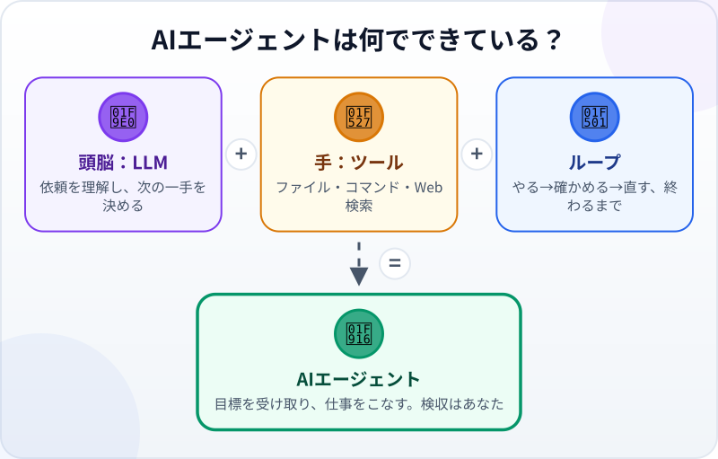
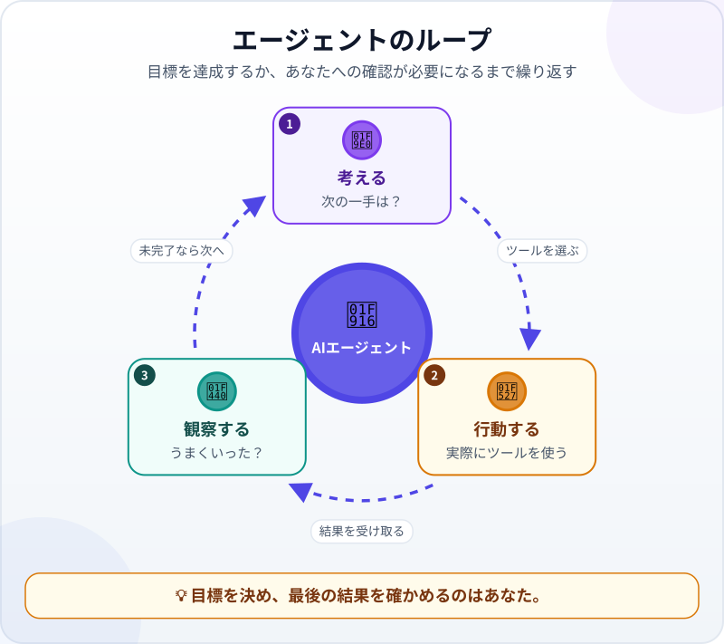
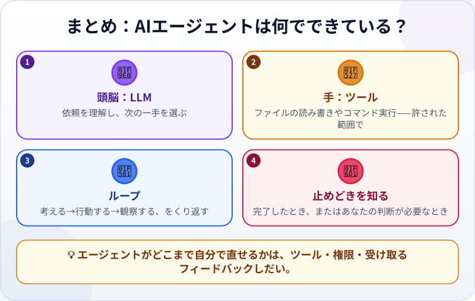

🌐 [Tiếng Việt](../../vi/lessons/agent-parts-and-loop.md) · [English](../../en/lessons/agent-parts-and-loop.md) · **日本語**

# 頭脳・道具・ループ：AIエージェントは何でできている？

<!-- section: objective -->
## この授業のゴール

この授業を終えると、次のことができるようになります。

- AIエージェントの3つの部品、**頭脳（LLM）**・**手（ツール）**・**ループ**を説明できる。
- 「*考える→行動する→観察する*」のループと、それがいつ止まるべきかを説明できる。
- エージェントが自分のミスをどこまで直せるかは、ツール・権限・受け取るフィードバックしだいである理由がわかる。

<!-- section: hook -->
## なぜ大事なの？

[エージェントが手順を代わりに実行してくれる](chatbot-to-agent.md)ことは、もう知っています。でも、言語モデルそのものが生み出すのは出力（文章、または「ツールを使いたい」という*要求*）だけです。それなのに、エージェントはどうやって**ファイルを開いたり**、**プログラムを動かしたり**できるのでしょう？

答えは、エージェントの組み立て方にあります。3つの部品がわかれば、エージェントに何ができて、何ができず、いつあなたの出番なのかを予想できるようになります。

<!-- section: concept -->
## 本題

### AIエージェントの式

- **頭脳＝LLM（大規模言語モデル）：** 依頼を理解し、推論し、次の一手を決めます。生み出すのは出力（文章、またはツールを使う要求）で、それ自体は実際の操作ではありません。
- **手＝ツール：** エージェントが実際に行うことを**許された**操作です。ファイルの読み書き、コマンドの実行、Web検索、ほかのサービスの呼び出しなど。モデルは、エージェントのソフトウェアが用意したツールの中から、使いたいものを*要求*できます。その要求を認めるかどうかを決め、実際にボタンを押すのはそのソフトウェアです。
- **ループ：** エージェントは一回動いて終わりではありません。目標を達成するまでくり返します。

### 「考える→行動する→観察する」のループ

1. **考える：** 次の一手は何か？
2. **行動する：** ツールを使う。たとえば、Webページを開いて試す。
3. **観察する：** 結果を読む。ページは動いたか、エラーメッセージは出ていないか。

そして1に戻ります。ループが**止まる**のは、目標を達成したとき、あなたにしか決められない判断（たとえばデータの削除）に行き当たったとき、または権限や打つ手がなくなったときです。

### 自分で直すのは魔法ではない

エージェントが直せるのは、自分で**観察できた**ミスだけです。プログラムの実行を許されていなければエラーは見えませんし、エラーメッセージや明確なチェックがなければ、間違っていることにも気づけません。つまり、どこまで直せるかは**ツール**・**権限**・**フィードバック**しだいです。そして最後に確かめるのは、やはりあなたです。

<!-- section: analogy -->
## 身近なたとえ

注文した料理を作っている料理人を思い浮かべてください。

- **頭脳**は料理人の経験です。次に何をすればよいかを知っています。
- **手**は包丁やコンロ、鍋です。これがなければ、経験は紙の上にとどまります。
- **ループ**は、味つけ→味見→調整→もう一度味見、をちょうどよくなるまでくり返すことです。「*辛いものは大丈夫ですか？*」のような質問は、お客さんに聞きます。

このたとえの弱点：料理人はいつでも味見ができますが、エージェントが「味見」できるのは、ツールが見せてくれるものだけです。

<!-- section: example -->
## 具体例

あなたが渡す目標：*「旅行フォルダの写真50枚を、撮影日で 2026-09-01_01.jpg のような名前に変えて」*

1. **考える：** 各写真の撮影日が必要だ。**行動する：** ファイルの一覧を出す。**観察する：** 写真は50枚、そのうち3枚には撮影日がない。
2. **考える：** その3枚の名前はどうする？ これはあなたが決めることなので、エージェントは**質問します**。「*この3枚は、ファイルの作成日を使ってもいいですか？*」 あなたは了承します。
3. **行動する：** 名前を変える。**観察する：** もう一度フォルダの一覧を出し、50ファイルが正しい形式の名前になっていることを確かめる。
4. 目標を達成したのでループは止まり、エージェントは行った作業を報告します。

あなたはさっと確認します。何枚か写真を開いて、名前と撮影日が合っているかを見ます。

<!-- section: misconceptions -->
## よくある誤解

- **「LLMが自分でファイルを開く」** — 違います。LLMはツールを使う*要求*を出すだけです。認めるかどうかを決めて実行するのはエージェントのソフトウェアで、それも許された範囲の中だけです。
- **「どのエージェントも、自分のエラーに気づいて直せる」** — 結果を観察できるツールと、直す権限があるときだけです。それでも、直し方が間違っていることがあります。

<!-- section: recap -->
## 1枚でわかるこのレッスン

<!-- section: takeaways -->
## まとめ

- エージェント＝**LLM**（頭脳）＋**ツール**（手）＋「考える→行動する→観察する」の**ループ**。
- ループが止まるのは、仕事が終わったとき、またはあなたの判断が必要なとき。
- エージェントが自分のミスをどこまで直せるかは、ツール・権限・フィードバックしだい。最後に確かめるのはあなた。

<!-- section: quiz -->
## 確認クイズ

**問1.** ファイルを作るなど、エージェントが実際の作業をできるのはどの部品のおかげ？

- A) LLM
- B) ツール
- C) チャット画面

**問2.** エージェントがWebページを直していますが、ページを開いて試すことは許されていません。いちばん起こりやすいことは？

- A) それでも確実にすべてのエラーを見つける
- B) 結果を観察できないので、エラーを見落とすかもしれない
- C) 自分で権限を増やす

**問3.** エージェントがループを止めて、あなたに質問すべきなのはいつ？

- A) コードを一行書くたびに
- B) データの削除のように、あなたにしか決められない判断が必要なとき
- C) 決して質問しない

答えを見る

1. **B** — LLMは要求を出すだけで、実際にファイルを作るのはツールです。
2. **B** — 結果を観察できなければ、間違いに気づけません。直せるかどうかはツールとフィードバックしだいです。
3. **B** — 重要な判断や、元に戻しにくい判断はあなたのものです。

<!-- section: sources -->
## 参考資料

- Anthropic — [Building Effective AI Agents](https://www.anthropic.com/engineering/building-effective-agents)（英語、2024年12月）：エージェントは多くの場合、環境からのフィードバックをもとにツールを使うLLMがループの中で動くもので、行き詰まると人間に確認するために止まることもある、と説明しています。
- IBM — [What is Agentic AI?](https://www.ibm.com/think/topics/agentic-ai)（英語）
