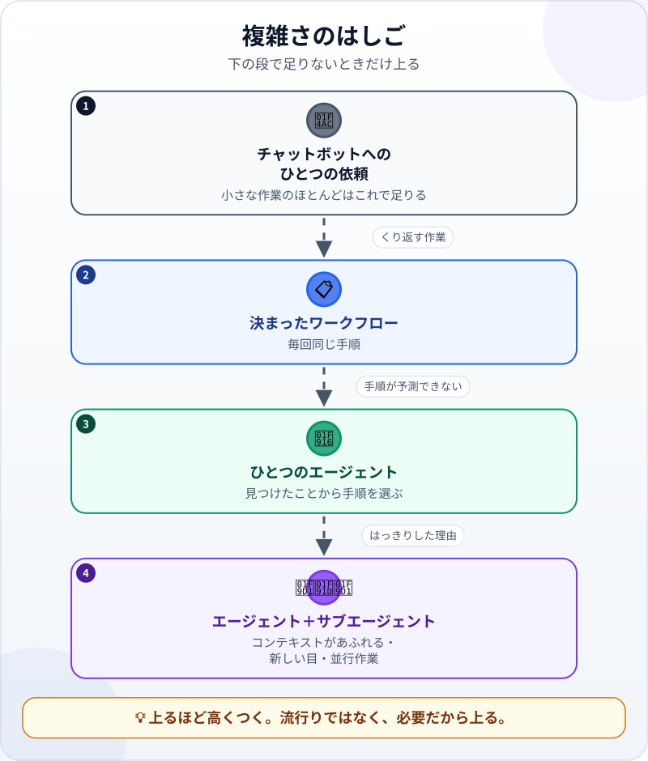
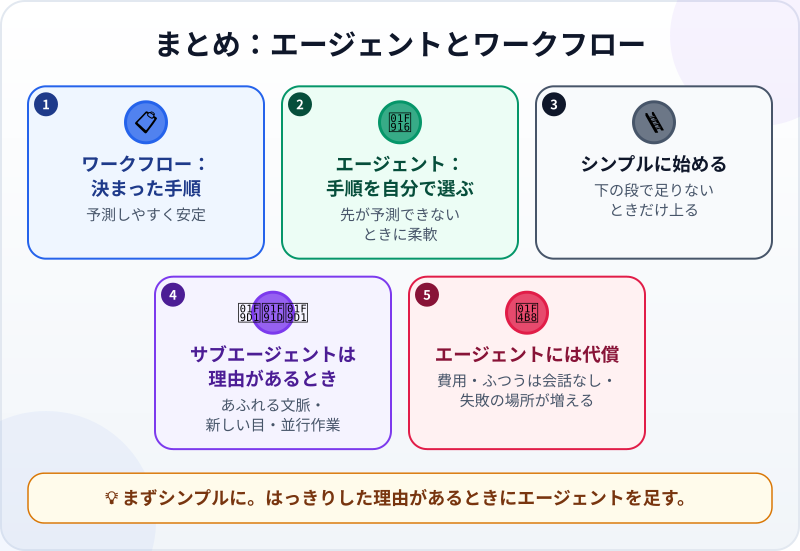

🌐 [Tiếng Việt](../../vi/lessons/agents-and-workflows.md) · [English](../../en/lessons/agents-and-workflows.md) · **日本語**

# エージェントとワークフロー：複数のエージェントが必要なのはいつ？

<!-- section: objective -->
## この授業のゴール

この授業を終えると、次のことができるようになります。

- **ワークフロー**（あらかじめ決めた手順）と**エージェント**（モデルが手順を決める）を見分けられる。
- 4段の「はしご」を使って、仕事をこなせる一番シンプルな方法を選べる。
- **サブエージェント**（補助のエージェント）が本当に役立つ3つの場面と、その代償を挙げられる。

<!-- section: hook -->
## なぜ大事なの？

フイさんは、10のエージェントが会社のように働く動画を見ました。サークルの**月刊の会報**も同じようにしたくなります。5つのエージェントに、1つずつ役割を。

でも会報はA4 1枚、3つの予定ファイルから月に1回作るだけです。5つのエージェントは正しい道具でしょうか。それとも、家族の夕食に料理人を5人雇うようなものでしょうか。

<!-- section: concept -->
## 本題

### ワークフローとエージェント

Anthropic（2024年12月）は、2種類のシステムを区別しています。

- **ワークフロー：** 手順があらかじめ、コードやあなたによって決まっています。モデルは各手順を行いますが、手順は選びません。例：[プロジェクトの記憶と再利用できるスキル](memory-and-skills.md)のマイさんの月次レポートのスキル。
- **エージェント：** 次の一手と使うツールを、モデルが**自分で決めます**。[エージェントのループ](the-agent-loop.md)で見たとおりです。

ワークフローは、はっきりした作業では予測しやすく、エージェントは、手順を事前に予測できないときに柔軟です。

### シンプルに始める

Anthropicの助言：うまくいく**一番シンプルな方法**を探し、必要なときだけ複雑さを足す。

下の段で足りないときだけ、1段ずつ上ります。

1. チャットボットへの**ひとつの依頼** ―― 1回聞いて1回答える。ツールもループもなし。
2. **決まったワークフロー** ―― 同じ手順をくり返す作業。
3. **ひとつのエージェント** ―― 途中で見つけたことによって手順が変わる作業。
4. **エージェント＋サブエージェント** ―― 下の3つのような、はっきりした理由があるときだけ。

### サブエージェントが役立つ3つの場面

**サブエージェント**は、メインのエージェントが立ち上げる助っ人で、仕事の一部を**自分のコンテキスト**で行います。Claude Codeのドキュメント（2026年9月時点）は使う理由を挙げています。よくあるのは次の3つです。

- **わき道の作業がメインのコンテキストをあふれさせる** ―― 何百ものファイルの検索、長いログの読みこみ。サブエージェントは最後の答えだけを返すので、短い要約を頼んでおきます。
- **新しい目が必要** ―― 結果と基準だけを見るレビュー。[必要なときに型を足す](workflow-frameworks.md)で学んだとおりです。
- **独立した部分を並行して進められる。**

### エージェントを足すたびの代償

- **費用が増える：** サブエージェントはそれぞれ自分で依頼を送り、同じ利用上限に数えられます。
- **ふつうは会話なしで始まる：** Claude Code（2026年9月時点）のふつうのサブエージェントが受け取るのは、依頼と、設定で読みこまれるもの（ふつうはプロジェクトの指示ファイル）だけです。ツールによっては（Claude Codeのフォークモードも）会話を引き継ぐので、自分のツールを確かめましょう。
- **失敗の場所が増える：** 受け渡しのたびに情報が抜けることがあり、最後の結果はやはりあなたが確かめます。

<!-- section: analogy -->
## 身近なたとえ

大きなレストランの厨房には、料理長、何人かの料理人、出す前に味見をする人がいます。毎晩何百皿も作るなら理にかなっています。でも家族の夕食に料理人を5人雇えば、指示とぶつかり合いと費用が増えるだけです。小さな台所でも残す価値があるのは、**その料理を作っていない人がもう一度味見をすること**です。

このたとえが当てはまらないところ：新しい料理人は厨房のことを見聞きできます。ふつうのサブエージェントは、メインのエージェントとのあなたの会話が聞こえないので、そこから必要なことは依頼に書いておく必要があります。

<!-- section: example -->
## 具体例

フイさんは毎月、3つの行事予定ファイル（`ai-practice` の架空のデータ）を読み、A4 1枚の会報を書き、日時と場所を確かめ、`newsletter_month_X.md` に保存します。5つのエージェントの計画の代わりに、はしごを1段ずつ上ります。

- **ひとつの依頼？** ほぼ足ります。でも毎月同じ手順のくり返しです。
- **決まったワークフロー？** そのとおり。`monthly-newsletter` というスキルを書きます。3つのファイルを読み、型どおりに書き、保存する。
- **サブエージェント？** 予定ファイルは短く、並行して進める部分もありません。でもサークル全員が日時を頼りにするので、**新しい目**は必要です。スキルの最後の手順：「*新しいサブエージェントにこう頼む：会報のすべての日時と場所を、3つの予定ファイルと比べる。食い違いだけを報告し、何も変えない。*」

最初の月、レビュー役は1か所を報告しました。ピクニックが*10月17日（土）*、予定ファイルでは*10月18日（日）*。フイさんは直し、送る前に会報全体を自分でも読みます。5つのエージェントではなく、ワークフロー1つとレビュー役1人。安く、受け渡しが少なく、新しい目は必要な場所にあります。

<!-- section: misconceptions -->
## よくある誤解

- **「エージェントが多いほど賢い」** ―― 1つ足すたびに、費用と受け渡しが増えます。今風だからではなく、はっきりした理由があるときに足します。
- **「サブエージェントは、メインのエージェントに話したことを知っている」** ―― Claude Codeのふつうのサブエージェントには、その会話は見えません（ほかのツールでは違うこともあります）。新しい人への依頼と同じくらい、はっきり書きます。
- **「レビュー役のエージェントがいれば、自分で読まなくていい」** ―― ミスを見つける助けになりますが、最後の結果はあなたの責任です。

<!-- section: recap -->
## 1枚でわかるこのレッスン

<!-- section: takeaways -->
## まとめ

- ワークフロー：あらかじめ決めた手順。エージェント：モデルが手順を選ぶ。
- シンプルに始め、下の段で足りないときだけ、より複雑な段に上る。
- サブエージェントが役立つのは、わき道の作業がコンテキストをあふれさせるとき、新しい目が必要なとき、独立した部分を並行して進められるとき。
- エージェントを足すたびに：費用が増え、ふつうは会話なしで始まり、失敗の場所が増える。
- エージェントが多くても、最後の結果をあなたが確かめることは変わらない。

<!-- section: quiz -->
## 確認クイズ

**問1.** ワークフローとエージェントの一番の違いは？

- A) ワークフローは安いモデル、エージェントは高いモデルを使う
- B) ワークフローは手順があらかじめ決まっていて、エージェントは次の一手をモデルが決める
- C) ワークフローはAIを使わない

**問2.** サブエージェントを使う価値が一番高いのはどれ？

- A) 見出しの色を変える
- B) 短いメールを書く
- C) 何百もの長いログファイルから1つの情報を探し、要約だけがほしいとき

**問3.** サブエージェントへの依頼をはっきり書く必要があるのはなぜ？

- A) ふつうのサブエージェント（Claude Codeなど）は新しいコンテキストで始まり、メインのエージェントとのあなたの会話が見えないから
- B) サブエージェントはいつも弱いモデルで動くので、簡単な指示が必要だから
- C) サブエージェントはツールを使えないから

答えを見る

1. **B** ―― 次の一手をだれが選ぶかが一番の違いです。どちらもモデルを使います。
2. **C** ―― わき道の作業がメインのコンテキストをあふれさせます。サブエージェントが別に行い、頼んだ短い要約を返します。
3. **A** ―― メインのエージェントに話したことは、依頼（または読みこむプロジェクトのファイル）を通してしか届きません。

<!-- section: sources -->
## 参考資料

- Anthropic — [Building Effective AI Agents](https://www.anthropic.com/engineering/building-effective-agents)（英語、2024年12月）：ワークフローは決めた道筋で動き、エージェントは自分で進め方を決める。一番シンプルな方法を探し、必要なときだけ複雑さを足す。
- Anthropic — [Create custom subagents](https://code.claude.com/docs/en/sub-agents)（英語、2026年9月時点）：サブエージェントは自分のコンテキストで作業し、最後の結果だけを返す。会話の履歴は見えない。それぞれ同じ利用上限に数えられる。
