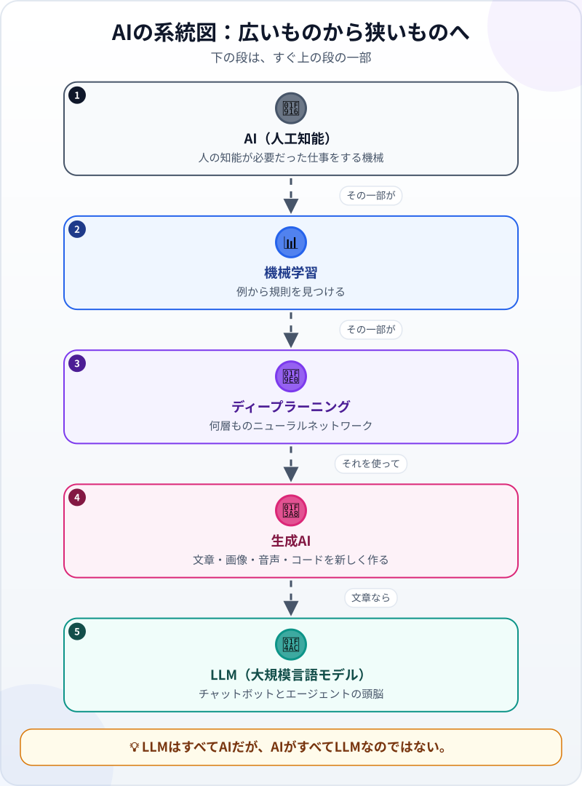
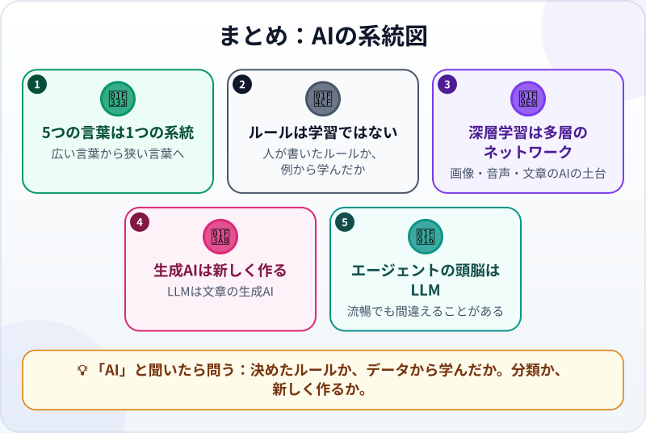

🌐 [Tiếng Việt](../../vi/lessons/ai-ml-dl.md) · [English](../../en/lessons/ai-ml-dl.md) · **日本語**

# 1枚でわかるAIの系統図：機械学習からLLMまで

<!-- section: objective -->
## この授業のゴール

この授業を終えると、次のことができるようになります。

- **AI・機械学習・ディープラーニング・生成AI・LLM** の5つを、広いものから狭いものへ、1つの系統図に正しく並べられる。
- 人が決めたルールどおりに動くソフトと、データから学ぶソフトを区別できる。
- この講座のエージェントがどの枝に属し、それが得意・不得意について何を意味するかがわかる。

<!-- section: hook -->
## なぜ大事なの？

定例会議で、ハナさんは3つの言葉を続けて聞きました。上司は「新しい勤怠ソフトにはAIが入っている」。同僚は「うちのチャットボットは生成AIだよ」。社内報には「迷惑メールフィルターは機械学習を使っている」。

ハナさんはうなずきましたが、この3つがどう違うのか、それとも1つのものを3通りに呼んでいるだけなのか、よくわかりません。これからの10分で、ハナさんとあなたのもやもやを解きます。

<!-- section: concept -->
## 本題

### 5つのばらばらな言葉ではなく、1つの系統図

図を上から、広い言葉から狭い言葉へと読みます。

1. **AI（人工知能）**：人の知能が必要だった仕事、たとえば言葉の理解、データの分析、提案などを機械ができるようにする技術の総称です。「AI」と呼ばれるソフトの中には、人が書いたルール（*もし…なら…*）どおりに動くだけで、何も学ばないものもあります。
2. **機械学習（machine learning）**：AIの一分野です。ルールを書く代わりに、たくさんの例を見せて、機械に規則を見つけさせます。くわしくは[機械はどうやって「学ぶ」？](how-machines-learn.md)で扱います。
3. **ディープラーニング（深層学習）**：機械学習の一分野で、何層にも重なったニューラルネットワークを使います。画像・音声・言語を扱う現代のAIの多くが、これを土台にしています。
4. **生成AI**：分類や採点だけでなく、文章・画像・音声・コードなどを新しく作るAIです。この名前は「何をするか」を表していて、「何で作るか」を表してはいません。今の生成AIはほとんどがディープラーニングで作られていますが、それはよくある道筋で、決まりではありません。
5. **LLM（大規模言語モデル）**：文章のための生成AIです。膨大な文章で学習し、いちばんもっともらしい続きを書きます。

### 基盤モデル（foundation model）

この言葉もよく目にします。**基盤モデル**とは、とても多様なデータで学習した非常に大きなモデルで、いろいろな仕事に使えるものです。LLMは文章のための基盤モデルです。だから同じモデルが、要約も翻訳もコードも書けるのです。

### あなたのエージェントはどの枝？

この講座のエージェントの「頭脳」はLLM、つまり系統図のいちばん下の段です。そのため、この枝の長所と短所をそのまま持っています。文章が流暢で多くのことができる一方、自信満々に間違えることがあります（[ハルシネーション](hallucination.md)）。ファイルを読む、コマンドを実行するといった「手足」は、LLMではなく周りのプログラムが提供します。[頭脳・道具・ループ](agent-parts-and-loop.md)で見たとおりです。

<!-- section: analogy -->
## 身近なたとえ

**乗り物**で考えてみましょう。乗り物 → 自動車 → 電気自動車 → 特定の電気自動車のモデル。電気自動車はすべて自動車ですが、自動車がすべて電気で走るわけではありません。同じように、LLMはすべてAIですが、AIがすべてLLMなのではありません。迷惑メールフィルターや商品のおすすめ機能もAIです。

たとえが合わないところ：乗り物の種類の境目ははっきりしていますが、AIの枝の境目はもっとあいまいです。また広告では「AI」という言葉がとても広く使われ、あらかじめ書いた *もし…なら…* のルールが数行あるだけ、ということもあります。

<!-- section: example -->
## 具体例

会議のあと、ハナさんは社内の4つのものを系統図に当てはめてみました。

| ハナさんが見つけたもの | していること | 枝 |
|---|---|---|
| 「AI搭載」の勤怠ソフト | 10分以上の遅刻を、組み込みのルールで印をつける | ルールで動くAI（データから学ばない） |
| 迷惑メールフィルター | 「迷惑」「迷惑でない」と印のついた大量のメールから学んだ | 機械学習 |
| 撮影した領収書の文字を読むアプリ | 多層のニューラルネットワークが画像の中の文字を認識する | ディープラーニング |
| メールの下書きを書くチャットボット | 数行の依頼から新しい文章を作る | 生成AI（LLM） |

それからハナさんは「AIが入っている」と聞くたびに、2つ質問するようになりました。**「ルールどおりに動くのか、データから学んだのか」**と、**「分類するのか、新しく作るのか」**。この2つで、どこまで信じてよいか、何を確かめるべきかがわかります。

<!-- section: misconceptions -->
## よくある誤解

- **「AIとはChatGPTのこと」**：チャットボットは系統図のいちばん下にある小さな枝です。迷惑メールフィルターも、映画のおすすめも、顔認識もAIです。
- **「AIと書いてあれば、勝手に学習する」**：書かれたルールどおりに動くだけの「AI」ソフトもあり、どれだけ使っても賢くはなりません。
- **「機械学習とは、機械が人のように考えること」**：例から規則を見つけるものです。人と同じように理解していなくても、1つの仕事がとても上手になることがあります。

<!-- section: recap -->
## 1枚でわかるこのレッスン

<!-- section: takeaways -->
## まとめ

- AI → 機械学習 → ディープラーニング → 生成AI → LLM。広い言葉から狭い言葉へ。今の生成AIはほとんどがディープラーニングで作られている。
- 書かれたルールどおりに動くことと、データから学ぶことは別。どちらも「AI」と呼ばれることがある。
- ディープラーニングは多層のニューラルネットワーク、生成AIは新しく作るAI、LLMはそれを文章で行う。
- この講座のエージェントの頭脳はLLM。流暢だが、あなたの確認が欠かせない。
- 「AI」と聞いたら問う：ルールか、データから学んだか。分類か、新しく作るか。

<!-- section: quiz -->
## 確認クイズ

**問1.** 正しいのはどれ？

- A) AIのソフトはすべてLLMである
- B) ディープラーニングは機械学習の一分野である
- C) 機械学習は生成AIの一分野である

**問2.** 勤怠ソフトが、組み込みのルールで10分以上の遅刻に印をつけます。これはどの種類？

- A) データから学ばない、ルールで動くAI
- B) 生成AI
- C) ディープラーニング

**問3.** エージェントの答えを確かめる必要があるのはなぜ？

- A) エージェントは書かれたルールどおりに動くので、融通がきかないから
- B) エージェントはファイルを読めないから
- C) 頭脳がLLMで、流暢でも自信満々に間違えることがあるから

答えを見る

1. **B**：ディープラーニングは機械学習の中に、機械学習はAIの中にあります。AIがすべてLLMなのではありません。
2. **A**：どんな例からも学んでいません。人が書いたルールを実行しているだけです。
3. **C**：LLMはいちばんもっともらしい文章を書きます。もっともらしいことと正しいことは同じではありません。

<!-- section: sources -->
## 参考資料

- Google Cloud — [What is Artificial Intelligence (AI)?](https://cloud.google.com/learn/what-is-artificial-intelligence)（英語）：AIは、人の知能が必要だった仕事をコンピュータができるようにする技術の集まり。
- Google Cloud — [What is Machine Learning?](https://cloud.google.com/learn/what-is-machine-learning)（英語）：機械学習はAIの一分野で、1つずつプログラムされる代わりにデータから学ぶ。ディープラーニングは機械学習の一分野。
- Google Cloud — [What are foundation models?](https://cloud.google.com/discover/what-are-foundation-models)（英語）：基盤モデルは膨大なデータで学習し、幅広い仕事に使える。
- Anthropic — [Glossary](https://platform.claude.com/docs/en/about-claude/glossary)（英語）の *LLM* の項：LLMは膨大な文章で学習し、文章の生成・質問への回答・要約ができる。
