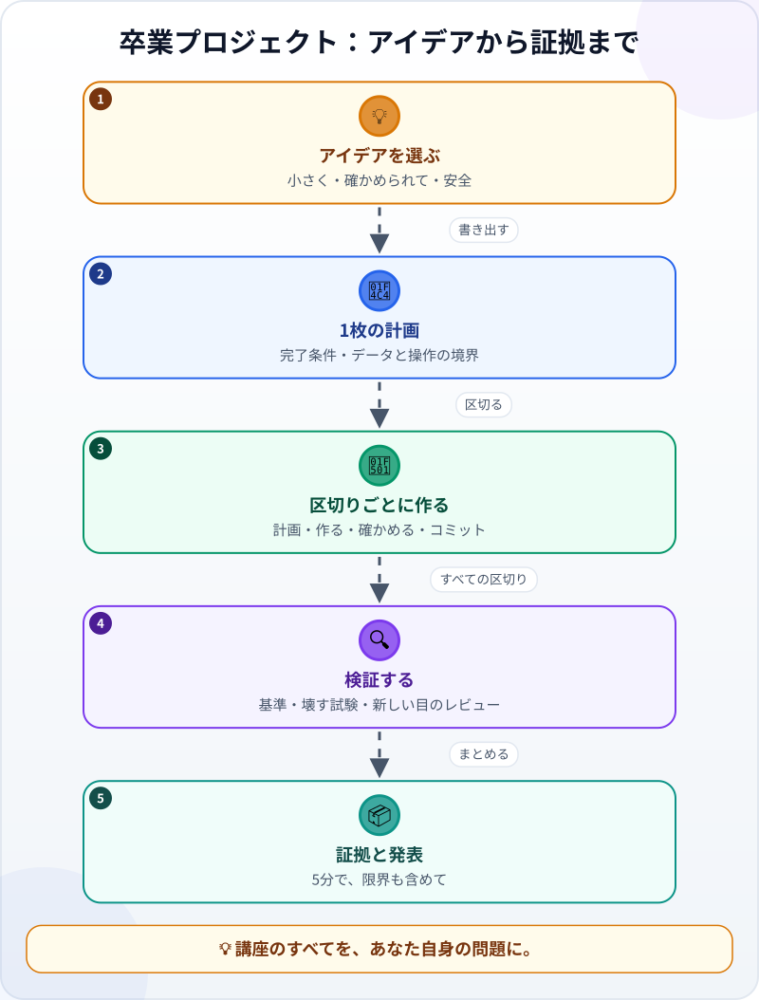
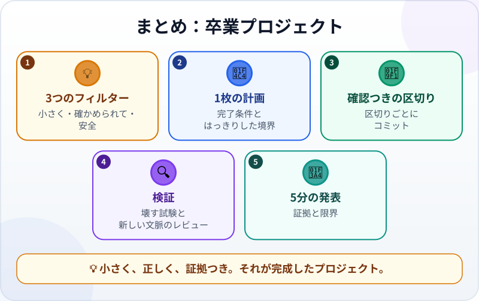

🌐 [Tiếng Việt](../../vi/lessons/capstone-your-idea.md) · [English](../../en/lessons/capstone-your-idea.md) · **日本語**

# 卒業プロジェクト：あなた自身のアイデア

<!-- section: objective -->
## この授業のゴール

このプロジェクトを終えると、次のことができるようになります。

- **ちょうどよい大きさ**の問題を選べる：約2時間で終わり、確かめられて、安全。
- エージェントと、プロジェクトを最初から最後まで自分で進められる：1枚の計画、確認つきの区切り、検証、証拠のまとめ。
- 結果を、限界も含めて、5分でほかの人に発表できる。

<!-- section: hook -->
## なぜ大事なの？

ここまでに、エージェントの仕事ぶりを見て、依頼を書き、差分を読み、確認を書き、Gitを使い、ガードレールを置き、お題のある2つのプロジェクトをやりました。今回は、お題はありません。

トゥアンさんには、自分だけの小さな問題があります。仕事の専門用語の日本語を勉強中で、新しい単語がノート、写真、メッセージのあちこちに散らばっているのです。個人のノートPCで使う、シンプルな単語の復習ページがほしい。小さく聞こえます。でもそれを**正しく**、**安全に**、**長く使える**ものにするには、講座のほぼすべてが必要になります。

<!-- section: concept -->
## 本題

### アイデアを選ぶ：3つのフィルター

アイデアを3つ書き出し、それぞれを3つのフィルターに通します。

- **小さい：** 最初のバージョンが約2時間で終わる。大きすぎたら、芯の部分まで削る。
- **確かめられる：** *何をもって正しいか*を、具体的な数字やふるまいで先に言える。
- **安全：** 架空のデータか、ツールに入れても気にならない自分自身のデータだけ。会社のデータ、他人のデータ、パスワードやAPIキーは使わない。

よい卒業プロジェクトは、たいてい自分がくり返している作業です。個人の表計算、小さなページ、ファイルの形式を変えるツール。3つのフィルターをすべて通ったアイデアだけが、作る価値があります。

### 1枚の計画

エージェントを開く前に、**1枚**書きます。[良い指示書](writing-good-specs.md)と[3種類の操作](data-safety-and-permissions.md)で学んだことを合わせたものです。

- **問題と使う人：** だれが、いつ使うか。今はどうしているか。
- **完了条件：** 確かめられる条件を3〜5つ。
- **データの境界：** どのデータを使うか。何を ⛔ 絶対に入れないか。
- **操作の境界：** エージェントが自分でしてよいこと（✅）、確認すべきこと（✋）、絶対にしないこと（⛔）。
- **やらないこと：** わざと次回に残すこと。

### 計画から証拠まで



プロジェクトを**2〜4つの区切り**に分け、それぞれに確認をつけます。区切りごとに、おなじみの[調べる→計画する→作る→検証する](explore-plan-build-verify.md)を回し、必要なら型を足し（[必要なときに型を足す](workflow-frameworks.md)のとおり）、合格したらコミットします。最後に[証拠をまとめ](project-retrospective.md)、発表します。

<!-- section: example -->
## 具体例

トゥアンさんの1枚の計画（短くしたもの）：

```text
問題：仕事の専門用語の日本語があちこちに散らばっている。毎晩10分、復習したい。
使う人：自分だけ。個人のノートPCで（会社のPCではない）。
完了条件：
1. review.html が words.csv（列：word, reading, meaning）から単語の一覧を読む。
2. 1回に1語を表示する。「意味を見る」を押したときだけ、読みと意味を表示する。
3. 「覚えた」「まだ」のボタン。「まだ」の単語は、ほかの2語のあとにまた出る（残りが2語未満なら最後に出る）。
4. 5つのサンプル単語での確認：
   a) 5語すべてで「覚えた」を押す：どの単語もちょうど1回ずつ出て、「今日の復習は終わり」と表示される。
   b) 1語めで「まだ」を押す：次に出るのは2語め、3語め、そして1語め。
データ：自分で入力した単語だけ。仕事の図面・資料・プロジェクト名は入れない。⛔
操作：エージェントは ai-practice/review の中のファイルを自分で編集してよい（✅）。ライブラリのインストール、ファイルの削除は確認（✋）。データをどこかへ送る（⛔）。
今回やらないこと：スマホとの同期、発音の音声。
```

トゥアンさんは3つの区切りに分けました。(1) CSVを読んで単語を表示する、(2)「意味を見る」と「覚えた／まだ」のボタン、(3) 5語での確認。区切り3で、確認 (b) が失敗しました。「まだ」の単語が**すぐに**戻ってきてしまい、同じ単語がいつまでもくり返されるのです。区切り2で手で押して試したときには気づかなかったバグでした。エージェントが直し、確認は合格、コミット。完了とする前に、新しいセッションを開いて計画と差分だけを渡し、別にレビューしてもらいました。レビューからの質問：意味の中にカンマが入っていたら？ そういう単語をサンプルデータに足して直し、まだ試していないことを限界に書きました。

友人への5分の発表：問題（30秒）、デモ（2分）、確認の証拠（1分）、限界と次のこと（1分）、質問。

<!-- section: try-it -->
## やってみよう

約120分。`ai-practice` の中に新しいフォルダを作り、エージェントが先に確認するモードで行います。始める前にコミットします（`ai-practice` がまだGitのリポジトリでなければ、先に `git init` します）。（見るだけのルートなら、手順1〜3を紙の上で。それだけで、プロジェクトの難しいほうの半分です。）

**1. アイデアを選ぶ（15分）。** アイデアを3つ書き出し、それぞれを3つのフィルター（小さい・確かめられる・安全）に通します。1つ残します。どれも通らない？ 一番よいアイデアを、通るまで削ります。

**2. 1枚の計画を書く（15分）。** 上の5つの部分で書きます。完了条件は、具体的な数字やふるまいで確かめられるように。エージェントに読ませ、あいまいなところを質問してもらいます。**まだ何も作らせません**。

**3. 区切りに分ける（10分）。** 2〜4つの区切りに、それぞれ「*〜できたら完了*」の1文と確かめ方をつけます。

**4. 区切りごとに作る（45分）。** 区切りごとに：計画（3つの問いで読む）、作る、差分を読む、確認を実行、コミット。エージェントが行き詰まったり、道をそれたりしたら？ 早めに止めて、新しい方向をはっきり伝えます。

**5. 検証する（15分）。** 完了条件を1つずつ自分で確かめます。わざと壊して、確認が失敗するのを見ます。新しいセッションを開いて別にレビューしてもらいます。計画と差分だけを渡し、足りないところを探してもらいます。

**6. 証拠のまとめと発表（20分）。** `EVIDENCE.md`（依頼内容・前と後・確認・限界・改善を1つ）を書き、知らない人テストをします。だれか（友人、家族、同僚）に5分で発表するか、自分用に録音します。

**証拠：**

- *見せられるもの…* 動くプロジェクト、1枚の計画、区切りごとのGitの履歴、`EVIDENCE.md`。
- *確かめたこと…* 完了条件をすべて確かめた。わざと壊すと確認が失敗した。新しい文脈でのレビューを受けた。
- *使わないほうがいい場面…* 会社のデータや他人のデータが必要なとき、自分以外のだれも確かめていないのに、だれかがそれに頼るとき。

<!-- section: misconceptions -->
## よくある誤解

- **「卒業プロジェクトは立派でなければ」** ―― 正しく、証拠つきでやり終えた小さな作業のほうが、やりかけの大きな作業より多くを教えてくれます。大きなものは、このプロジェクトを土台に次回へ。
- **「会社の本物のデータでなければ意味がない」** ―― この講座では、学ぶためであっても会社のデータは ⛔ です。やり方を示すには、架空のデータや自分のデータで十分です。
- **「動いたから完成」** ―― 完成とは、完了条件を確かめ、証拠があり、ほかの人がその限界を理解できることです。

<!-- section: recap -->
## 1枚でわかるこのレッスン



<!-- section: takeaways -->
## まとめ

- 3つのフィルター（小さい・確かめられる・安全）でアイデアを選ぶ。
- 先に1枚の計画を書く：問題、完了条件、データと操作の境界、やらないこと。
- 区切りに分け、それぞれに確認とコミットをつける。
- 完了条件、わざと壊す試験、新しい文脈でのレビューで検証する。
- 証拠をまとめ、限界も含めて5分で発表する。
