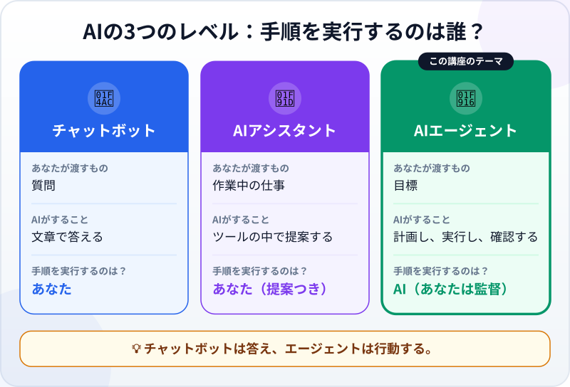
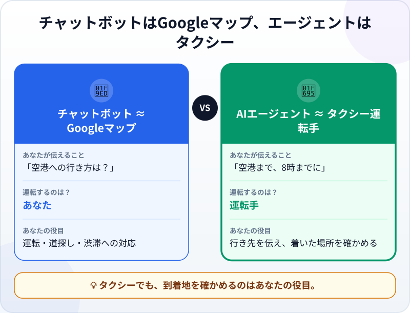
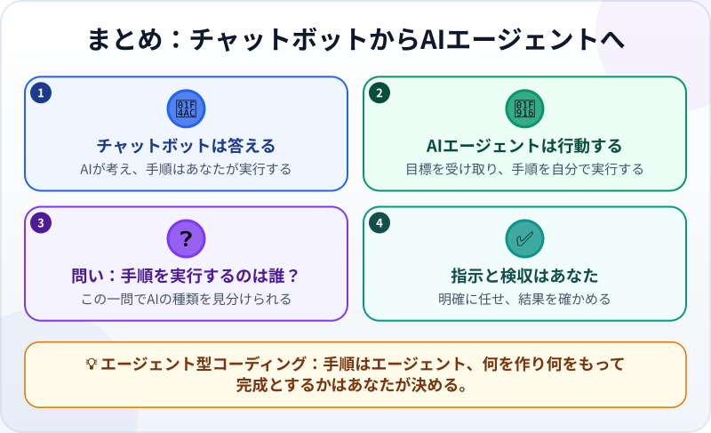

🌐 [Tiếng Việt](../../vi/lessons/chatbot-to-agent.md) · [English](../../en/lessons/chatbot-to-agent.md) · **日本語**

# チャットボットからAIエージェントへ：答えるだけでなく、仕事をするAI

<!-- section: objective -->
## この授業のゴール

この授業を終えると、次のことができるようになります。

- **チャットボット**・**AIアシスタント**・**AIエージェント**の違いを、ひとつのシンプルな質問「*手順を実行するのは誰？*」で見分けられる。
- **エージェント型コーディング**（AIエージェントとソフトウェアを作ること）によって、あなたが「作業する人」から「指示して検収する人」に変わる理由を説明できる。

<!-- section: hook -->
## なぜ大事なの？

最後にChatGPTやGemini、Claudeに具体的な相談をしたときのことを思い出してください。たとえば「*3つのExcelファイルから今月の支出を合計するには？*」。

AIの回答はとても丁寧でした。5つの手順と数式つきです。でも結局、ファイルを一つずつ開き、数式をコピーし、エラーが出たら直し、また質問しに戻ったのは**あなた自身**でした。

では、別のタイプのAIを想像してみてください。目標を伝えるだけで、**ファイルを開き、数式を書き、試しに実行し**、最後に「*完了しました。9月の支出合計は12万4千円です。行った作業はこちらです*」と報告してくれるAIです。

このタイプのAIには名前があります。**AIエージェント**です。そして今、ソフトウェアの作り方そのものを変えつつあります。

<!-- section: concept -->
## 本題

### あなたが出会う3つのレベルのAI

いちばん役に立つ質問は「**手順を実行するのは誰？**」です。

- **チャットボット：** AIが考え、あなたが手を動かします。答えはくれますが、手順はすべてあなたのものです。
- **AIアシスタント（コパイロット）：** 使っているツールの中でAIが提案してくれますが、一つひとつの手順を進めるのはあなたです。
- **AIエージェント：** AIが考え、**そして**手も動かします。目標を渡すと、エージェントが手順を選んで実行し、結果を報告します。

### エージェント型コーディングとは？

エージェントを使ってソフトウェアを作ること（コードを書く、動かす、バグを直す）を**エージェント型コーディング**（Agentic Coding）と呼びます。一行ずつコードを打つ必要はありません。あなたの役割は、**仕事を任せ、基準を決め、結果を確認すること**です。この講座では、まさにそのスキルと、それを上手に行うのに必要なだけのソフトウェアの知識を学びます。

<!-- section: analogy -->
## 身近なたとえ

家から空港まで行くとします。

- **チャットボットはGoogleマップのようなもの：** 道順を詳しく教えてくれますが、運転するのも、渋滞に対処するのも、駐車場を探すのも**あなた**です。
- **AIエージェントはタクシーの運転手のようなもの：** 「*空港まで、8時までに*」と伝えるだけ。運転手がルートを選び、渋滞を避けて、目的地まで連れて行ってくれます。

ただし、タクシーでも**正しい行き先を伝え、正しいターミナルに着いたかを確かめるのはあなた**です。このたとえにも弱点があります。タクシーの運転手が別の街に行ってしまうことはまずありませんが、エージェントはときどき、自信満々に依頼を取り違えます。だからエージェントの場合、確認はいっそう大切です。

<!-- section: example -->
## 具体例

課題：*5歳になるあおいちゃんの誕生日会の招待状Webページを作る。テーマは恐竜、「出欠を返信する」ボタンつき。*

**チャットボットの場合：**

1. 質問すると、チャットボットがHTMLのコードを返します。
2. あなたがファイルを作り、コードを貼り付け、ブラウザで開きます。
3. ボタンが動かないので、エラーメッセージをコピーしてチャットに貼り付けます。
4. 動くまで2〜3を繰り返します。すべての手順を実行したのはあなたです。

**ソフトウェアを作るAIエージェントの場合**（例：Claude CodeやCodex。ツール名は2026年9月時点のもの）：

1. 上の依頼文をそのまま入力します。
2. エージェントがフォルダとファイルを作り、HTMLとCSSを書き、ページを開いて試します。
3. ツールがページの実行を許していれば、エージェントはボタンの不具合に気づき、エラーを読み、直して、もう一度動かすことがあります。どのエージェントにもできるわけではなく、直し方がいつも正しいとも限りません。
4. 「*完了しました。ファイルを3つ作りました。ページの開き方はこちらです*」と報告します。あなたは確認して「*緑色にして、パーティーの日時も入れて*」と修正を頼みます。

目標は同じでも、エージェントを使うと、**あなたは「作業する人」から「指示して検収する人」に変わります**。

<!-- section: try-it -->
## やってみよう

インストールは不要です。5分ほどでできます。

1. 次の2つの作業のうち、チャットボットの**回答**で十分なのはどちら？ エージェントに**手順を代わりに実行**してほしいのはどちら？
   - *「ExcelのVLOOKUP関数を説明して」*
   - *「12か月分の月次報告ファイルを1つの表にまとめ、重複した行を消して、新しいファイルとして保存して」*
2. エージェントに任せたい**自分の**作業をひとつ選び、目標を**一文**で書きます。
3. エージェントが正しくできたかを確かめる**基準をひとつ**書き足します。例：*「新しいファイルに12か月分がそろい、売上の合計が12ファイルの合計と一致する」*

問1の答え

VLOOKUPの説明は回答だけで足りるので、チャットボットで十分です。12個のファイルをまとめるには、開く・まとめる・絞り込む・保存する、という実際の作業がいくつも必要なので、エージェント向きです。

書いた目標と基準は取っておきましょう。エージェントへの依頼の書き方を学ぶときに、もう一度使います。

<!-- section: misconceptions -->
## よくある誤解

- **「エージェントは人型ロボットのこと」** — 違います。エージェントはソフトウェアで、その「手」はコンピュータの中のツールです。
- **「プログラマーでないとエージェントは使えない」** — 始めるのに経験は要りません。この講座で、明確に指示を出し、問題に早く気づけるだけのソフトウェアの知識を身につけます。
- **「エージェントが人間の仕事を完全に奪う」** — エージェントが代わりに行うのは多くの「*手順*」です。*何を*、*誰のために*作り、*何をもって完成とするか*を決めるのは、これからも人間です。

<!-- section: recap -->
## 1枚でわかるこのレッスン

<!-- section: takeaways -->
## まとめ

- チャットボットは**答え**、AIエージェントは目標に向かって**行動**する。
- 見分ける質問は「**手順を実行するのは誰？**」。
- エージェント型コーディング＝AIエージェントとソフトウェアを作ること。手順はエージェントが、**仕事を任せて結果を確かめるのはあなた**が担う。

<!-- section: quiz -->
## 確認クイズ

**問1.** チャットボットとAIエージェントのいちばん大きな違いは？

- A) エージェントのほうが大きなAIモデルを使っている
- B) エージェントは目標に向けて手順を実行し、チャットボットは答えるだけ
- C) エージェントは絶対に間違えない

**問2.** チャットボットではなくAIエージェントが必要なのはどれ？

- A) プログラミングの「変数」とは何かを説明する
- B) Webページのファイルを作り、動かし、動くまでエラーを直す
- C) 一文をベトナム語に翻訳する

**問3.** エージェントが「完了しました」と言いました。次にすべきことは？

- A) 完全に信用して、すぐに使う
- B) 自分が決めた基準に照らして結果を確認する
- C) 念のため、最初から全部やり直してもらう

答えを見る

1. **B** — 手順を実行するのがエージェントです。モデルの大きさが違いではなく、エージェントも間違えることがあります。
2. **B** — 回答だけでなく、実際の操作（ファイル作成・実行・修正）が何度も必要です。
3. **B** — 仕事を任せることと検収することは、いつでもあなたの責任です。

<!-- section: sources -->
## 参考資料

- Anthropic — [Building Effective AI Agents](https://www.anthropic.com/engineering/building-effective-agents)（英語、2024年12月）
- Anthropic — [Claude Code overview](https://code.claude.com/docs/en/overview)（英語）
- Google Cloud — [What is agentic coding?](https://cloud.google.com/discover/what-is-agentic-coding)（英語）
- IBM — [What is Agentic AI?](https://www.ibm.com/think/topics/agentic-ai)（英語）
