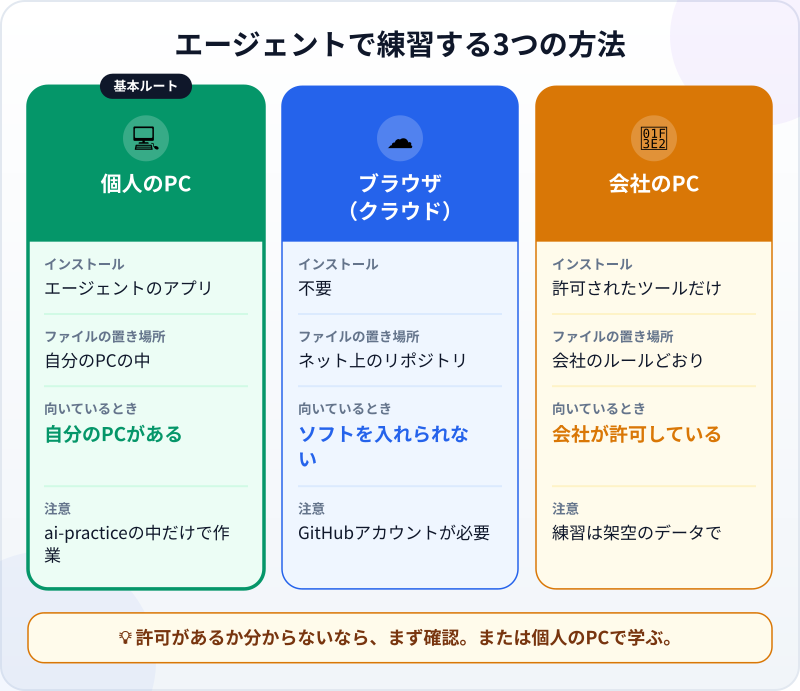
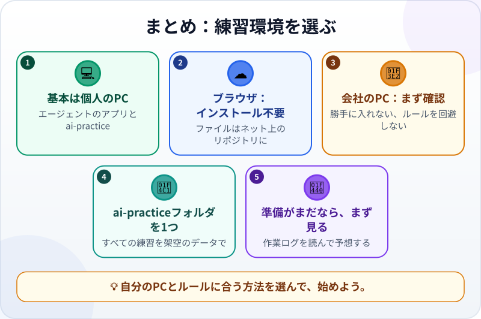

🌐 [Tiếng Việt](../../vi/lessons/choose-your-learning-setup.md) · [English](../../en/lessons/choose-your-learning-setup.md) · **日本語**

# 練習環境を選ぶ：ブラウザ、個人のPC、会社のPC

<!-- section: objective -->
## この授業のゴール

この授業を終えると、次のことができるようになります。

- エージェントで練習する3つの方法、**個人のPC**・**ブラウザ（クラウド）**・**会社のPC**を比べられる。
- 自分のPC、アカウント、職場のルールに合う方法を選べる。
- 練習用フォルダ `ai-practice` を準備できる。または、まず誰に確認すべきかがわかる。

<!-- section: hook -->
## なぜ大事なの？

トゥアンさんは日本で働く機械エンジニアです。エージェントの作業を見て、すぐに試したくなりました。でも会社のPCはソフトのインストールが禁止されていて、そもそもAIを使ってよいのかもわかりません。

練習場所を間違えると、準備だけで半日かかったり、もっと悪い場合は会社のルールに違反したりします。最初の10分で正しく選べば、この先の授業がスムーズに進みます。

<!-- section: concept -->
## 本題

### 3つの方法、何が違う？

- **💻 個人のPC――この講座の基本ルート。** エージェントのアプリを入れ、`ai-practice` フォルダを選んで仕事を任せます。ファイルは自分のPCにあるので、自分で開いて確かめるのも簡単です。例（2026年9月時点）：Claude のデスクトップアプリには *Code* タブがあり、macOS と Windows で動きます。自分のPCで動かす（*Local*）を選び、作業フォルダを選ぶだけで、コマンドの入力は不要です。
- **☁️ ブラウザ（クラウド）。** エージェントは提供元のサーバーで動き、あなたに必要なのはブラウザだけです。そのかわり、ファイルはネット上のリポジトリ（多くは GitHub）に置かれるので、GitHub アカウントが必要で、自分のPCで開くにはダウンロードが必要です。ソフトを入れられないときに向いています。ただし、使ってよいPCで。
- **🏢 会社のPC。** 会社が許可したツールだけを、許可された方法で使います。勝手にインストールしない、ルールを回避しない、会社のデータを個人のアカウントに入れない。迷ったら、先に情報システム部門や上司に確認しましょう。

### 選ぶ前に知っておきたい3つのこと

- **アカウント：** 多くのエージェントツールは有料アカウントが必要です。たとえば2026年9月時点で、Claude Code には Pro、Max、Team、Enterprise のいずれかのプラン、または Console アカウントが必要で、無料プランには含まれません。選んだツールのページで確認しましょう。
- **PC：** AIモデルはあなたのPCではなく、提供元のサーバーで動きます。PCに必要なのは、ある程度新しいこととインターネット接続だけです。Claude Code なら macOS 13 以降または Windows 10 以降、メモリ 4GB 以上です。
- **まだ準備できない？** **見るだけルート**でも学べます。授業の作業ログを読み、次の一手を予想し、クイズに答えましょう。準備はあとからで大丈夫です。

### すべての練習を1つのフォルダで

どの方法を選んでも、この講座の練習はすべて **`ai-practice` という専用フォルダ**の中で、架空のデータだけを使って行います。専用フォルダがあると、エージェントがどこで何をしたかを**あなたが**追いやすくなります。ただし、それはエージェントを囲う柵ではありません。エージェントに何ができるかは、あなたが与える権限しだいです。これは、作業を[「安全・要確認・禁止」に分ける](data-safety-and-permissions.md)ところで学びます。

<!-- section: try-it -->
## やってみよう

約10分。

1. **3つの質問に答える：**
   - ソフトをインストールしてよい自分のPC（macOS 13 以降または Windows 10 以降）がある？
   - エージェントツールのアカウントを持っている、または登録するつもりがある？
   - 会社のPCを使う場合：会社はそのツールを許可している？
2. **答えからルートを選ぶ：**
   - 自分のPCとアカウントがある → 💻 **個人のPC**
   - ソフトは入れられないが、GitHub アカウントがある（または作る） → ☁️ **ブラウザ**
   - 会社がツールを許可している → 🏢 **会社のPC**（ルールどおりに）
   - どれもまだ → 👀 **見るだけ**。準備はあとで
3. **作業場所を準備する：**
   - 💻 「書類（Documents）」フォルダの中に `ai-practice` フォルダを作ります。その中に `README.txt` を作り、*「AIエージェントの練習用フォルダ。架空のデータのみ。」*と書きます。
   - ☁️ ツールの「はじめに」ガイドに沿って GitHub をつなぎ、`ai-practice` という空のリポジトリを作ります。
   - 🏢 ルールがはっきりしないなら、情報システム部門か上司に次のように送ります：*「AIエージェント［ツール名］の使い方を、架空のデータと専用フォルダで学びたいと考えています。会社のPCで使ってもよいでしょうか。」*
   - 👀 どのPCを使うか、いつ準備するかをメモします。
4. **証拠を書く**（3行）：
   - *見せられるもの…*　例：`README.txt` が入った `ai-practice` フォルダ。
   - *確かめたこと…*　例：PCが条件を満たす、アカウントがある、会社が許可している。
   - *使わないほうがいい場面…*　例：会社の実データを扱う必要があるとき。

<!-- section: misconceptions -->
## よくある誤解

- **「会社のPCも自宅のPCと同じ。入れればすぐ使える」** — 違います。会社のPCにはソフトやデータについてのルールがあり、勝手に入れたりルールを回避したりすると、本当に困ったことになりかねません。まず確認を。
- **「エージェントを動かすには高性能なPCが必要」** — AIモデルは提供元のサーバーで動きます。PCはある程度新しく、インターネットにつながれば十分です。
- **「専用フォルダがあれば、エージェントはほかに手を出せない」** — 専用フォルダはあなたのための境界線で、エージェントを囲う柵ではありません。エージェントに何ができるかは権限で決まります。

<!-- section: recap -->
## 1枚でわかるこのレッスン

<!-- section: takeaways -->
## まとめ

- 練習の方法は3つ：**個人のPC**（基本ルート）、**ブラウザ**（インストール不要、ファイルはネット上）、**会社のPC**（許可がある場合だけ）。
- 会社のPCでは：許可されたツールだけ。勝手に入れない、ルールを回避しない、会社のデータを個人のアカウントに入れない。
- 練習はすべて `ai-practice` フォルダで、架空のデータだけを使う。
- まだ準備できないなら、見るだけルートから始める。

<!-- section: quiz -->
## 確認クイズ

**問1.** 会社のPCはソフトのインストールが禁止されています。**してはいけない**ことは？

- A) 会社が許可しているAIツールがあるか情報システム部門に聞く
- B) 架空のデータを使って個人のPCで学ぶ
- C) 制限を回避する方法を探してツールを入れる

**問2.** ブラウザ（クラウド）でエージェントを使うとき、作ったファイルはどこにある？

- A) いつも自分のPCのハードディスク
- B) ネット上のリポジトリ。必要なときにダウンロードする
- C) どこにもない

**問3.** すべての練習を `ai-practice` フォルダで行うのはなぜ？

- A) エージェントを速くするため
- B) エージェントがどこで何をしたかを追いやすくし、架空のデータだけを使うため
- C) エージェントはほかのフォルダを開けないから

答えを見る

1. **C** — 会社のルールを回避するのは、学ぶためであっても禁止です。
2. **B** — クラウドのエージェントは、あなたのハードディスクではなくネット上のリポジトリで作業します。
3. **B** — フォルダはあなたが追いやすくするためのもの。エージェントに何ができるかは権限で決まるので、C は誤りです。

<!-- section: sources -->
## 参考資料

- Anthropic — [Advanced setup](https://code.claude.com/docs/en/setup)（英語）：Claude Code の動作環境と、必要なアカウントの種類（2026年9月時点）。
- Anthropic — [Desktop application](https://code.claude.com/docs/en/desktop)（英語）：Claude アプリの *Code* タブ。自分のPC（*Local*）かクラウド（*Cloud*）かを選び、作業フォルダを選ぶ方法。
- Anthropic — [Use Claude Code in the cloud](https://code.claude.com/docs/en/claude-code-on-the-web)（英語）：クラウドのセッションは提供元のインフラで動き、GitHub のリポジトリへのアクセスが必要です。
