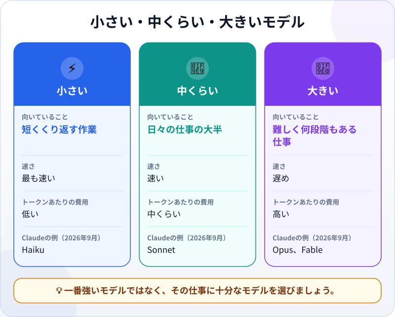
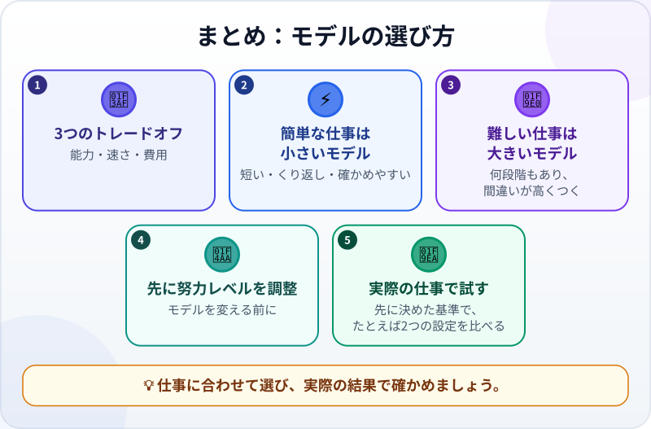

🌐 [Tiếng Việt](../../vi/lessons/choosing-models.md) · [English](../../en/lessons/choosing-models.md) · **日本語**

# モデルの選び方：大きさ・速さ・コスト

<!-- section: objective -->
## この授業のゴール

この授業を終えると、次のことができるようになります。

- **モデル（AIモデル）**を選ぶときの3つのトレードオフ（能力・速さ・費用）を説明できる。
- 仕事に合った出発点を選べる。短くくり返す簡単な仕事には小さいモデル、何段階もある難しい仕事には大きいモデル。
- 同じ実際の仕事で2つの設定（2つのモデル、または2つの努力レベル）を比べ、確かめた結果をもとに決められる。

<!-- section: hook -->
## なぜ大事なの？

ハナさんは東京の会社で事務の仕事をしています。社内のAIツールでモデルを選べると知ってから、いつも一番強いモデルを選んでいます。メールの誤字を1つ直すときでもです。答えはいつも良いのですが、待つことが多く、週の半ばで利用枠を使い切ってしまう週もあります。

隣の席の先輩が笑いました。「サンドイッチを買いに、トラックを借りてるみたいだね」。ハナさんは考えます。では、どの仕事にどのモデルを使えばいいのか。小さいモデルで「十分」かどうかは、どうすれば分かるのでしょうか。

<!-- section: concept -->
## 本題

### 1つの会社に、いくつもの大きさ

AIの会社は、大きさの違うモデルを1つのシリーズとして用意していることがよくあります。たとえば2026年9月時点で、AnthropicにはClaude Haiku（速くて経済的）、Claude Sonnet（コーディングを含む日々の仕事の大半向け）、Claude Opus（複雑な仕事や長時間動くエージェント向け）、Claude Fable（最も高性能で、最も難しく長い仕事向け）があります。ほかの会社にも似た大きさの違いがあります。名前やバージョンはすぐに変わるので、名前ではなく**選び方**を覚えましょう。



### 3つのトレードオフ

Anthropicのドキュメントは、モデル選びを次の3つのバランスとして説明しています。

- **能力：** 大きいモデルは難しい仕事が得意です。何段階もある仕事、深い理解が必要な仕事、複雑なコードなど。
- **速さ：** 小さいモデルのほうが速く答えます。
- **費用：** 大きいモデルは[トークン](tokens.md)あたりの費用が高くなります。定額プランでも従量課金でも、重いモデルほど利用枠を早く使い切りがちです。

3つすべてで勝つモデルはありません。「一番いい」モデルとは、**その仕事に十分な**モデルのうち、速さと費用に納得できるものです。

### 2つの始め方

- **小さいほうから：** 小さいモデルで始めてしっかり試し、具体的に足りない点が見えたときだけ上げます。何度もくり返す簡単な仕事、速さが大事な仕事に向いています。
- **強いほうから：** 強いモデルで始めて結果を正しくしてから、少しずつ下げてみます。何段階もある難しい仕事や、待つより間違うほうが高くつく仕事に向いています。

### モデルを変える前に、努力レベルを調整する

[「考える」モデル](reasoning-models.md)の授業で、**努力レベル（effort）**を紹介しました。Anthropicのドキュメント（2026年9月時点）には、モデルを変えるよりこれを調整するほうが良い方法であることが多い、と書かれています。同じモデルでも、低くすれば速く経済的に、高くすればより丁寧に考えます。

### 実際の仕事で確かめる

比較表や宣伝文句は、*あなたの*仕事を知りません。しかも小さいモデルは、手に負えないときにそうとはめったに言わず、間違った答えも自信ありげに聞こえます。同じドキュメントでは、自分の仕事から作ったテストをいくつか用意し、あらかじめ決めた基準で確かめることが最も重要なステップだとされています。エージェントの仕事を検収するときと同じです。違いを一番見やすいのは、同じ依頼を**2つの設定**（2つのモデル、または1つのモデルの2つの努力レベル）で実行することです。

<!-- section: example -->
## 具体例

ハナさんは1週間の仕事から3つを選び、架空のデータを使って、それぞれを小さいモデルと強いモデルで実行しました。お客様へのおわびメールの書き直し、お客様の声30件を4つのグループに分ける作業（事前に自分で分類した10件と比べる）、「ファイルを削除しない」という制約つきの共有フォルダー整理計画です。最初の2つは両方のモデルが合格し、小さいモデルのほうがはっきり速く答えました。3つ目では、小さいモデルの計画に「同じ名前のファイルを削除する」手順が入っていて、制約に違反していました。ハナさんは自分用のルールを書き留めました。

```text
短い・くり返し・確かめやすい       → 小さいモデル
何段階もある・間違いが高くつく     → 強いモデル（または高い努力レベル）
迷ったら                         → 両方で試し、基準で確かめる
```

これはハナさんの仕事に合ったルールです。あなたの仕事では結果が違うかもしれません。

<!-- section: try-it -->
## やってみよう

約8分。`ai-practice` の中で、架空のデータだけを使います。モデルか努力レベルのどちらかを選べるツールが必要です（どちらか一方で十分です）。たとえば2026年9月時点では、Claude Codeで `/model haiku`、`/model sonnet`、`/model opus` と入力するとモデルを切り替えられます。チャットアプリには、たいてい入力欄の近くにモデルの選択肢があります。努力レベルしか選べないツールなら、低い努力レベルと高い努力レベルを比べてください。以下の**2つの設定**とは、小さいモデルと大きいモデル、または低い努力レベルと高い努力レベルのことです。

**1. 3つの仕事を2つの設定で実行する（6分）。** まったく同じ依頼を、小さい設定（小さいモデルまたは低い努力レベル）と大きい設定（大きいモデルまたは高い努力レベル）に貼り付けます。仕事ごと、設定ごとに、毎回新しい会話を使います（Claude Codeでは `/clear` と入力）。後の設定が前の設定の答えを見られないようにするためです。

*仕事A ―― あなた自身の仕事：* よく行う短い仕事を1つ選び、架空のデータを使い、**実行する前に合格の基準を書きます**。思いつかなければ下の見本を使い、基準は次のとおりにします：丁寧である（命令口調でなく、お礼かおわびがある）、内容が残っている（ファイルが2日遅れていること、明日の会議に必要なこと）、3文以内。

```text
次のメッセージを丁寧に、3文以内で書き直してください：
「ファイルの提出が2日遅れています。すぐ送ってください。明日会議なんです。」
```

*仕事B ―― グループごとの合計：*

```text
グループ（飲食、交通、文具）ごとの合計と総額を出してください：
昼食 1,200円、タクシー 2,300円、コピー用紙 800円、昼食 950円、
タクシー 1,800円、ボールペン 450円、来客のコーヒー 1,500円、バス 230円。
```

*仕事C ―― 条件がいくつもある予定づくり：*

```text
月曜日の4つの時間枠（9:00、10:00、11:00、14:00）に4つの仕事を入れてください（どれも1時間）。
仕事：報告書を書く、報告書を送る、チーム会議、お客様に電話。
- 「報告書を書く」と「チーム会議」は、どちらも「報告書を送る」より前に終わらせる。
- 「報告書を送る」は昼休みより前。
- お客様が電話に出られるのは11:00以降。
- チームリーダーは10:00に来るので、9:00に会議はできない。
予定を示し、条件を一つずつ確認し直してください。
```

**2. 結果を記録する（1分）。** ファイル `ai-practice/model-comparison.md` に小さな表を作り、仕事と設定ごとに*速い・遅い*と*合格・不合格*を書きます。仕事BとCには下に正解があります。全部実行してから比べてください。

**3. 自分のルールを書く（1分）。** ハナさんのルールを参考に同じファイルに書き、証拠を残しましょう。

- *見せられるもの…* ファイル `model-comparison.md`：3つの仕事を2つの設定で比べた表と、自分のルール。
- *確かめたこと…* 仕事Bの合計と仕事Cの予定が正解と一致する。仕事Aの結果が、先に書いた基準をすべて満たす。
- *使わないほうがいい場面…* たとえば、大きく重要な種類の仕事について、それぞれ1回試しただけで結論を出すとき。

<details>
<summary>仕事BとCの正解</summary>

**仕事B：** 飲食 3,650円（1,200＋950＋1,500）・交通 4,330円（2,300＋1,800＋230）・文具 1,250円（800＋450）・**総額 9,230円**。

**仕事C**の正しい予定は1つだけです：9:00 報告書を書く・10:00 チーム会議・11:00 報告書を送る・14:00 お客様に電話。「報告書を送る」はほかの2つの仕事の後、かつ昼より前なので11:00しかありません。チーム会議は9:00にできないので10:00、お客様への電話は残りの14:00です。

</details>

<!-- section: misconceptions -->
## よくある誤解

- **「一番強いモデルが、いつも正しい選択」** ―― 簡単な仕事では、待ち時間が長くなり利用枠を多く使うだけで、結果は変わらないことがほとんどです。
- **「小さいモデルは性能の悪いモデル」** ―― 速く、たくさん、簡単な仕事をするために作られていて、その仕事は得意です。確かめもせずに手に余る仕事を任せないことが大切です。
- **「1回試せば分かる」** ―― AIの答えは実行するたびに変わることがあります。重要な仕事では、何回か、いくつかの例で試してから選びましょう。

<!-- section: recap -->
## 1枚でわかるこのレッスン



<!-- section: takeaways -->
## まとめ

- モデル選びは能力・速さ・費用のトレードオフ。3つすべてで勝つモデルはありません。
- 短い・くり返し・確かめやすい仕事は、小さいモデルから始めます。
- 何段階もあり間違いが高くつく仕事は、強いモデルから始めます。
- モデルを変える前に、努力レベルの調整を試しましょう。
- 実際の仕事で、あらかじめ決めた基準で確かめましょう。たとえば、同じ仕事を2つの設定で比べます。

<!-- section: quiz -->
## 確認クイズ

**問1.** 毎日、数百件の短いお客様の声を4つのグループに分ける必要があります。どう始めますか？

- A) 念のため一番強いモデルを使う。試す必要はない
- B) 事前に自分で分類したサンプルで小さいモデルを試し、確かめてから使う
- C) 名前が一番新しいモデルを選ぶ

**問2.** 簡単な質問なのに、使っている大きいモデルの答えが必要以上にかなり遅いです。まず何をしますか？

- A) さらに大きいモデルに切り替える
- B) モデルがよく理解できるよう、プロンプトを長くする
- C) 努力レベルを下げるか、この種類の仕事には小さいモデルを使う

**問3.** 小さいモデルがあなたの仕事に「十分」かどうかは、どうすれば分かりますか？

- A) いくつかの実際の仕事で試し、あらかじめ決めた基準で確かめる
- B) 小さいモデル本人に、できるかどうか聞く
- C) ネットのランキングで一番上のモデルを見る

<details>
<summary>答えを見る</summary>

1. **B** ―― 短く、くり返しで、確かめやすい仕事は「小さいほうから」が向いています。自分で分類済みのサンプルがあれば、十分かどうかが分かります。
2. **C** ―― 努力レベルは、モデルを変えるより良い調整方法であることが多いです。大きいモデルや長いプロンプトは、さらに遅くするだけです。
3. **A** ―― ランキングやモデルの自己評価は、あなたの仕事を知りません。確かめた結果は知っています。

</details>

<!-- section: sources -->
## 参考資料

- Anthropic ―― [Choosing the right model](https://platform.claude.com/docs/en/about-claude/models/choosing-a-model)（英語、2026年9月時点）：モデル選びは能力・速さ・費用のバランス。2つの始め方（Claude Haikuで効率から、Claude Opusで能力から）。モデルを変えるより努力レベルの調整が良い方法であることが多い。自分の用途に合ったテストを用意することが最も重要なステップ。
- Anthropic ―― [Model configuration](https://code.claude.com/docs/en/model-config)（英語、2026年9月時点）：Claude Codeでは `/model` コマンドでモデルを切り替える。`haiku` は簡単な仕事、`sonnet` は日々のコーディング、`opus` は複雑な推論、`fable` は最も難しく長い仕事向け。
