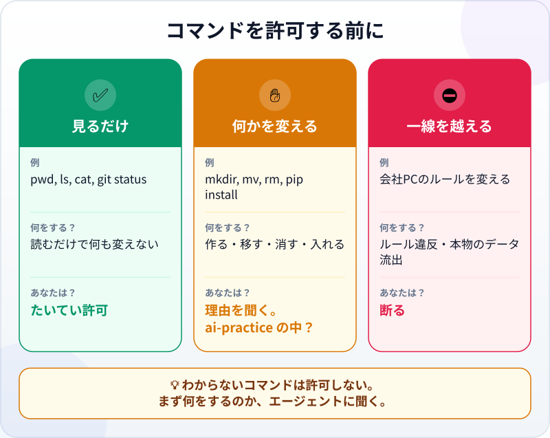
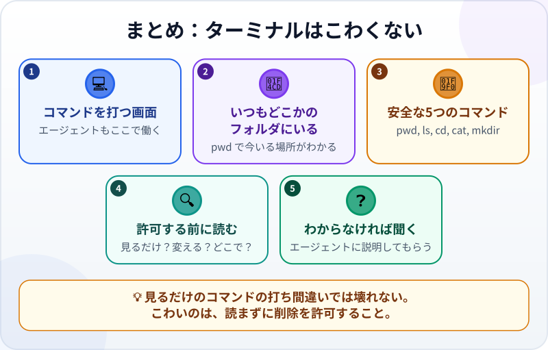

🌐 [Tiếng Việt](../../vi/lessons/command-line-basics.md) · [English](../../en/lessons/command-line-basics.md) · **日本語**

# ターミナルはこわくない：最初の安全な5つのコマンド

<!-- section: objective -->
## この授業のゴール

この授業を終えると、次のことができるようになります。

- `ai-practice` フォルダでターミナルを開き、安全な5つのコマンド `pwd`・`ls`・`cd`・`cat`・`mkdir` を使える。
- エージェントが実行を求めるコマンドを読み、見るだけなのか、何かを変えるのか、どこでなのかがわかる。
- 3種類の行動 ✅ ✋ ⛔ に沿って、許可する・聞き返す・断るを決められる。

<!-- section: hook -->
## なぜ大事なの？

トゥアンさんは自分のPCで、変更のたびに確認してくるモードでエージェントに仕事を任せていました。途中でエージェントが聞いてきます。「`rm -rf build`（MacのターミナルまたはGit Bash）か `Remove-Item build -Recurse -Force`（PowerShell）を実行してもいいですか？」 トゥアンさんには、何をするコマンドかわかりません。「いいえ」ならエージェントが止まりそうだし、「はい」ならファイルが消えるかもしれない。早く進めたくて「はい」を押しました。

今回は運がよかったのです。`build` はエージェントが作ったばかりのフォルダでした。でも、運まかせは仕事の任せ方ではありません。ターミナルに15分ふれるだけで、こうした質問が読めるようになります。

<!-- section: concept -->
## 本題

### ターミナルとは

**ターミナル（コマンドライン）**は、マウスでクリックする代わりに文字でコマンドを打つ画面です。Windowsでは最初から入っている **PowerShell**、Macでは **ターミナル** アプリがそれにあたります。エージェントはコンピュータ上の作業の多くを、こうしたコマンドで行います。ファイルの一覧、プログラムの実行、チェックの実行、ライブラリのインストールなどです。

コマンドは **コマンド名** と、たいていその **対象** でできています。`cd ai-practice` なら、`cd` がコマンド（「フォルダに入る」）、`ai-practice` が対象です。ターミナルはいつもどこか1つのフォルダに「立って」います。これを今いるフォルダと呼びます。エクスプローラーでフォルダを開いているのと同じです。Windowsでは、`PS C:\Users\Tuan>` という表示で、PowerShellの中の `C:\Users\Tuan` にいることがわかります。

### 安全な5つのコマンド

| コマンド | すること | 何か変わる？ |
|---|---|---|
| `pwd` | 今どのフォルダにいるかを表示する | 変わらない |
| `ls` | フォルダの中身を一覧にする | 変わらない |
| `cd <フォルダ>` | フォルダに入る。`cd ..` で1つ上へ | 変わらない（いる場所だけ変わる） |
| `cat <ファイル>` | ファイルの中身を表示して読む | 変わらない |
| `mkdir <名前>` | 新しいフォルダを作る | 変わる（増えるだけで、消えない） |

5つともPowerShellでもMacのターミナルでも使えます。結果の見た目が少し違うだけです。最初の4つは見るだけ。`mkdir` は最初の「変更」ですが、`ai-practice` の中に作るなら安全です。

### エージェントが求めるコマンドを読む



たとえば2026年9月時点で、Claude Code は標準のモードでは、`ls`・`cat`・`git status` のような読むだけのコマンドの一部は確認なしで実行し、PCを変える可能性のあるコマンドは先に確認します。つまり、**確認を求めて出てきたコマンドは、たいてい何かを変えうるもの**です。だからこそ、よく読む価値があります。

許可を押す前に、3つの問いに答えましょう。

1. **何のコマンド？** 見るだけか。それとも作る・移す・消す・入れる・送るのか。
2. **どこで？** コマンドの中のパスは `ai-practice` の中か。`..`・`~`・`C:\`・`/` で外に出ていないか。
3. **元に戻せる？** `rm -rf <folder>`（MacのターミナルまたはGit Bash）と `Remove-Item <folder> -Recurse -Force`（PowerShell）は、フォルダを中身ごと完全に消します。**ごみ箱には入りません**。ここでは読むだけで、実行しません。

答えられないうちは許可しないこと。エージェントに「このコマンドは何をして、どのファイルを変えるの？」と聞きましょう。コマンドの見た目はPCによって少し違います。WindowsではClaude CodeはPowerShellを使い、Git for Windows が入っていればMac風のコマンドを使います。それでも、3つの問いは同じです。

<!-- section: try-it -->
## やってみよう

約12分。自分のPCで、`ai-practice` の中で行います。会社のPCでは、会社がPowerShellの使用を認めている場合だけ。認められていなければ、読むだけにしてコマンド入力は飛ばします。抜け道は探しません。

**1. `ai-practice` でターミナルを開く（2分）**

- **Windows：** エクスプローラーで `ai-practice` フォルダを開き、アドレスバーをクリックして `powershell` と入力し、Enter。そのフォルダでPowerShellが開きます。まず、このエクスプローラーから開く方法を使ってください。別の場所でPowerShellを開く場合、表示名は翻訳されていることがあり、DocumentsフォルダがOneDriveに移動されていることもあります。`cd Documents` と決めつけず、実際のパスを使ってください。
- **Mac：** `Cmd + Space` で `ターミナル`（Terminal）と入力して Enter。`cd `（後ろに半角スペース1つ）と打ち、Finderから `ai-practice` フォルダをターミナルの画面にドラッグして、Enter。

**2. 5つのコマンド（5分）**：1行ずつ入力して、そのたびに Enter。押す前に結果を予想しましょう。

```text
pwd
ls
cat README.txt
mkdir test-folder
ls
cd test-folder
pwd
cd ..
```

Windowsで日本語が記号のように化けたら、`cat README.txt -Encoding utf8` と打ちます。ファイルは正しく、PowerShellの読み方の問題です。

**3. エージェントのコマンドを読む（5分）**：エージェントのアプリで、先に確認してくるモードにして、次を送ります。

```text
このフォルダに reports というフォルダを作って、ファイルを一覧にしてください。
そのあと、2つの削除コマンドを実行せずに説明してください。rm -rf test-folder（MacのターミナルまたはGit Bash）と Remove-Item test-folder -Recurse -Force（PowerShell）です。
```

エージェントがコマンドの実行を求めてきたら、許可する前に3つの問いに答えます。そして `rm -rf <folder>`（MacのターミナルまたはGit Bash）と `Remove-Item <folder> -Recurse -Force`（PowerShell）の説明を読み、上の表と比べましょう。読むだけで、実行しません。

`test-folder` を消したいときは、いつもどおりエクスプローラーかFinderで削除します。ごみ箱に入るので、元に戻せます。

証拠を書きましょう。

- *見せられるもの…* `pwd` の結果が `ai-practice` で終わっているターミナルの画面と、作った `test-folder`。
- *確かめたこと…* `test-folder` と `reports` がエクスプローラーかFinderにも表示された。
- *使わないほうがいい場面…* たとえば、会社のPCでPowerShellが許可されていないとき。そのときは情報システム部門に相談する。

<!-- section: misconceptions -->
## よくある誤解

- **「ターミナルはITの人のもの」**：コンピュータに指示を出す、もう1つの方法にすぎません。暗記は不要です。必要なのは、エージェントが実行を求めるコマンドを読めることです。
- **「打ち間違えるとPCが壊れる」**：この5つは見るか、増やすだけです。名前を打ち間違えても、エラーが表示されるだけ。気をつけるべきは、削除やインストールのコマンド、そしてネットからコピーした、意味のわからないコマンドです。
- **「エージェントが求めるなら、許可すればいい。わかっているはず」**：エージェントもフォルダを間違えることがあり、削除のコマンドはごみ箱を通りません。まず読む。わからなければ聞く。

<!-- section: recap -->
## 1枚でわかるこのレッスン



<!-- section: takeaways -->
## まとめ

- ターミナルは文字でコマンドを打つ画面で、エージェントが働く場所でもある。
- ターミナルはいつも1つのフォルダにいる。どこかは `pwd` でわかる。
- 安全な5つのコマンド：`pwd`・`ls`・`cd`・`cat` は見るだけ、`mkdir` は増やすだけ。
- 許可する前に：見るだけか、変えるのか。どこでか。元に戻せるか。
- わからないコマンドは許可しない。まずエージェントに説明してもらう。

<!-- section: quiz -->
## 確認クイズ

**問1.** ターミナルが今どのフォルダにいるかを表示するコマンドは？

- A) `ls`
- B) `mkdir`
- C) `pwd`

**問2.** エージェントが `rm -rf build`（MacのターミナルまたはGit Bash）と `Remove-Item build -Recurse -Force`（PowerShell）を表示しました。実行せずに読んでいます。どちらのコマンドも何をする？

- A) `build` フォルダの中のファイルを一覧にする
- B) `build` フォルダを中身ごと完全に消す。ごみ箱には入らない
- C) `build` という新しいフォルダを作る

**問3.** エージェントが、意味のわからないコマンドの実行を求めてきました。どうする？

- A) 何をするのか、どのファイルを変えるのかをエージェントに聞いてから決める
- B) エージェントのほうが詳しいので許可する
- C) 念のためアプリを閉じる

<details>
<summary>答えを見る</summary>

1. **C**：`pwd` は今いるフォルダを表示します。`ls` はその中身の一覧です。
2. **B**：シェルごとのどちらの形も、フォルダを中身ごと確認なしで消します。✋ 先に確認すべき行動です。
3. **A**：わからないものは許可しない。聞くのが、いちばん早くわかる方法です。

</details>

<!-- section: sources -->
## 参考資料

- Anthropic — [Terminal guide for new users](https://code.claude.com/docs/en/terminal-guide)（英語）：Macでのターミナルの開き方（`Cmd + Space` で Terminal と入力）と、Windowsでの開き方（`Win + X` で Windows PowerShell かターミナルを選ぶ）。`PS C:\Users\...>` という表示はPowerShellにいるしるし。
- Anthropic — [Security](https://code.claude.com/docs/en/security)（英語）：標準のモードの Claude Code は、`ls`・`cat`・`git status` のような読むだけのコマンドの一部を確認なしで実行し、PCを変える可能性のあるコマンドは先に確認する（2026年9月時点）。
- Anthropic — [Advanced setup](https://code.claude.com/docs/en/setup)（英語）：Windowsでは、Claude Code はPowerShellでコマンドを実行する。Git for Windows が入っていれば Git Bash を使う。
