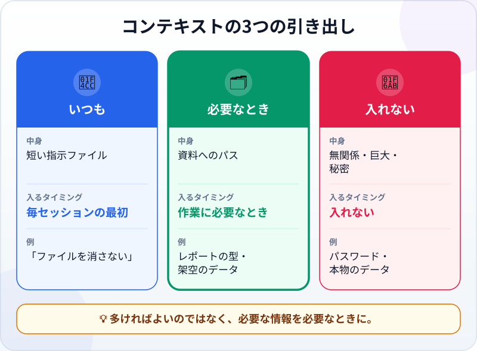
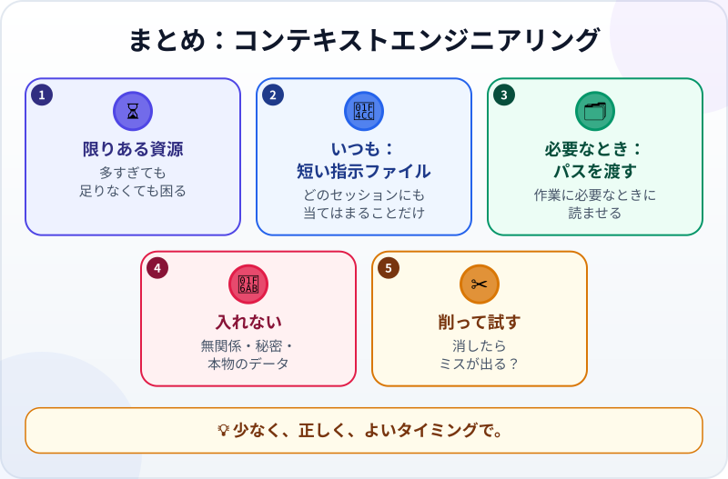

🌐 [Tiếng Việt](../../vi/lessons/context-engineering.md) · [English](../../en/lessons/context-engineering.md) · **日本語**

# コンテキストエンジニアリング：必要な情報を必要なときに

<!-- section: objective -->
## この授業のゴール

この授業を終えると、次のことができるようになります。

- エージェントに渡す情報を、**いつも**・**必要なとき**・**入れない**の3つの引き出しに分けられる。
- プロジェクト用の短い指示ファイルを書き、どの行を削るべきかがわかる。
- 念押ししなくても、エージェントが指示ファイルに本当に従っているかを確かめられる。

<!-- section: hook -->
## なぜ大事なの？

ハナさんは、チームの書式どおりに週報をエージェントに書いてほしいと思っています。「念のため」に、毎セッションの最初にこう貼りつけました。50ページの社員ハンドブック、過去の週報3本、用語集、そして一番最後に1行。「*週報に顧客名を書かないこと。*」

結果：顧客名の入った週報ができあがりました。

エージェントがわざと逆らったのではありません。一番大事な1行が、関係のない何万字もの中に埋もれてしまったのです。情報が多ければエージェントがうまく働くわけではありません。うまく働かせるのは、**正しい**情報です。

<!-- section: concept -->
## 本題

### コンテキストエンジニアリングとは？

[コンテキストウィンドウ](context-window.md)が、エージェントの限られた作業記憶であることは、もう学びました。**コンテキストエンジニアリング**とは、そこに何を、いつ入れるかを決めることです。作業に必要なものを、足りなくも多すぎもせず渡すためです。

Anthropic（2025年9月）は、多すぎることがなぜ害になるかを説明しています。コンテキストが長くなるほど、モデルがその中の情報を正確に思い出す力は下がります。コンテキストは限りある資源であり、目指すのは、作業を成功させる*最小限の情報の組み合わせ*だというのです。

### 3つの引き出し



**1. いつも ―― 短い指示ファイル。** そのプロジェクトの**どの**セッションにも当てはまること。このフォルダは何か、何を変えてはいけないか、どう確かめるか、エージェントが推測できない約束ごと。多くのツールは、こうしたファイルを毎セッションの最初に読みます。2026年9月時点のClaude Codeなら `CLAUDE.md` です。Claude Codeのガイドは、短く保ち、1行ごとに「*この行を消したら、エージェントはミスをする？*」と問うようすすめています。しないなら削ります。長すぎるファイルでは、本当に必要な指示ほど無視されてしまいます。

**2. 必要なとき ―― 書庫ごと貼らず、場所を教える。** 長い資料、データ、過去のレポートは、最初にすべて貼りつけないでください。「*週報の型は `templates/weekly_report.md` にある*」のように**パス**を書いておき、作業に必要になったらエージェント自身に開かせます。Anthropicはこれを、コンテキストを*必要なときに（just in time）*入れるやり方と呼んでいます。エージェントは軽い「住所」だけを持ち、必要なときにツールで中身を読むのです。

**3. 入れない。** この作業に関係のないもの。数行で足りるのに巨大なファイル。そして[⛔ 禁止事項](data-safety-and-permissions.md)に当たるもの：パスワード、APIキー、会社や顧客の本物のデータ。

### コンテキストにも片づけが必要

- **1つの作業に1つのセッション。** 関係のない新しい作業は、新しいセッションで。前の作業のものでコンテキストをいっぱいにしないためです。
- **長く覚えておくべきことはファイルに書く。** 会話で言うだけでは、次のセッションは覚えていません。
- **指示ファイルも手入れが必要。** 書いてあるのにエージェントが同じことをまちがえ続ける？ ファイルが長くなりすぎて、その行が埋もれているのかもしれません。

<!-- section: try-it -->
## やってみよう

約8分。`ai-practice` で、架空のデータを使います。[はじめてのエージェント体験](first-agent-session.md)で作ったタスクカード `my-week.html`、またはこのフォルダで作った好きなファイルを使ってください。（見るだけのルートなら、手順1と3を紙の上でやってみましょう。）

**1. 指示ファイルを書く（3分）。** 使っているツールがセッションの最初に読む指示ファイルを作ります（2026年9月時点のClaude Codeなら、`ai-practice` フォルダの `CLAUDE.md`。ほかのツールは名前が違うので、そのドキュメントを確認してください）。最大5行、どのセッションにも当てはまることだけを書きます。たとえば：

```text
- 練習用フォルダ。架空のデータだけ。
- ファイルは消さない。消す必要があれば先にわたしに確認する。
- 日付は 2026/09/30 の形で書く。
- タスクカードは my-week.html。1ファイルだけで、外部ライブラリは使わない。
- 終わったらページを開き、確かめたことと確かめていないことを書き出す。
```

**2. 念押しせずに試す（3分）。** **新しいセッション**を開きます。約束ごとを**一切**くり返さずに、小さな作業を頼みます。

```text
my-week.html に今日の日付を表示する行を足して。
```

結果を読みます。日付は 2026/09/30 の形で書かれていますか？ セッションの最後に、エージェントは確かめたことと確かめていないことを書き出しましたか？ ファイルのどれかの行と違うことをしていませんか？

**3. 削る（2分）。** 1行ずつ「*この行を消したら、エージェントはミスをする？*」と問いながら読み直します。1つの作業にしか当てはまらない行（たとえば「今週はメモ欄も足す」）があれば、ファイルから外し、次からはその作業の依頼の中で伝えます。エージェントが約束ごとをまちがえたら、文をもっとはっきりさせ、新しいセッションでもう一度試します。

**証拠：**

- *見せられるもの…* 5行の指示ファイルと、念押ししなかった約束ごとに従った新しいセッションの結果。
- *確かめたこと…* ファイルの約束ごとを1つずつ、実際の結果と照らし合わせた（日付、確かめたことの報告、消されたファイルがないこと）。
- *使わないほうがいい場面…* 1つの作業にしか必要ない情報（依頼の中で伝える）、秘密や本物のデータ（どこにも入れない）。

<!-- section: misconceptions -->
## よくある誤解

- **「コンテキストは多いほどよい」** ―― コンテキストが長いと、モデルの記憶は不正確になります。関係のないものが場所をとり、大事なものを隠してしまいます。
- **「念のため、指示ファイルに全部書いておく」** ―― そのファイルは**毎回**のセッションで読まれます。1つの作業にしか必要ないことは、その作業の依頼か、必要なときに開く別のファイルに書きます。
- **「会話で一度言えば、エージェントはずっと覚えている」** ―― 新しいセッションは新しいコンテキストで始まります。長く覚えておくべきことは、ファイルに書きます。

<!-- section: recap -->
## 1枚でわかるこのレッスン



<!-- section: takeaways -->
## まとめ

- コンテキストエンジニアリング：どの情報を、いつコンテキストに入れるかを決めること。
- コンテキストは限りある資源。多すぎても、足りなくても困る。
- いつも：短い指示ファイル。どのセッションにも当てはまることだけ。
- 必要なとき：パスを渡し、作業に必要なときにエージェントに読ませる。
- 入れない：無関係なもの、巨大なファイル、秘密、本物のデータ。

<!-- section: quiz -->
## 確認クイズ

**問1.** ハナさんはセッションの最初に50ページの資料を貼りつけ、エージェントは一番大事な指示を無視しました。一番ありそうな理由は？

- A) エージェントがわざと逆らった
- B) 大事な1行が、関係のない大量の情報に埋もれた
- C) 資料が日本語で書かれていた

**問2.** 毎セッション読まれる指示ファイルに**入れるべき**行はどれ？

- A) 「今週は週報にメモ欄も足す」
- B) 社員ハンドブックの全文
- C) 「data/ フォルダのファイルは変えない」

**問3.** 週報の型は20ページあり、週報を書くときにしか使いません。一番よいやり方は？

- A) 型のファイルへのパスを書いておき、週報を書くときにエージェントに開かせる
- B) 20ページすべてを指示ファイルに貼る
- C) 型があることをエージェントに教えない

<details>
<summary>答えを見る</summary>

1. **B** ―― コンテキストが長いほど、モデルは見落としやすくなります。大切なのは量より、正しい情報です。
2. **C** ―― どのセッションにも当てはまります。Aは1つの作業だけ、Bは長すぎてほとんど無関係です。
3. **A** ―― 必要なときに入れるやり方です。エージェントは場所を知っていて、作業に必要なときだけ読みます。

</details>

<!-- section: sources -->
## 参考資料

- Anthropic — [Effective context engineering for AI agents](https://www.anthropic.com/engineering/effective-context-engineering-for-ai-agents)（英語、2025年9月）：コンテキストが長いほど、正確に思い出す力は下がる。コンテキストを限りある資源として扱い、効果のある最小限の情報を探す。パスとツールを使って、必要なときにコンテキストを入れる。
- Anthropic — [Best practices for Claude Code](https://code.claude.com/docs/en/best-practices)（英語、2026年9月時点）：`CLAUDE.md` は毎セッションの最初に読まれるので、広く当てはまることだけを短く書く。1行ごとに、消したらClaudeがミスをするかを問う。長すぎるファイルでは指示が無視される。
