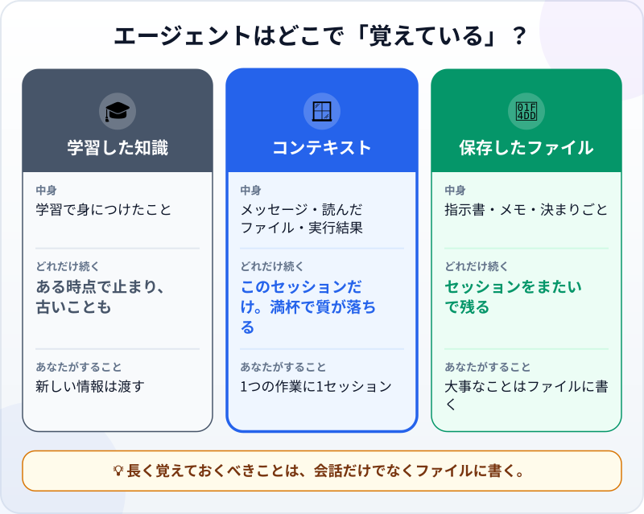
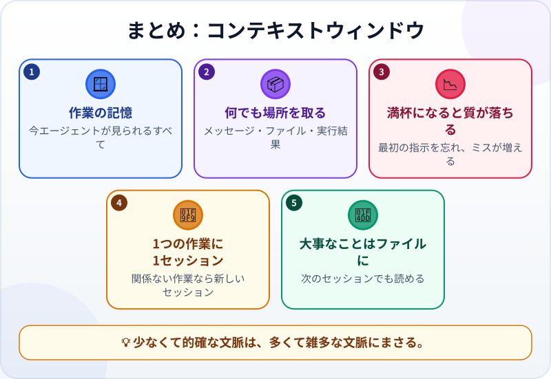

🌐 [Tiếng Việt](../../vi/lessons/context-window.md) · [English](../../en/lessons/context-window.md) · **日本語**

# コンテキストウィンドウ：AIの短期記憶

<!-- section: objective -->
## この授業のゴール

この授業を終えると、次のことができるようになります。

- **コンテキストウィンドウ**を説明できる：学習した知識とは違う、AIの作業の記憶。
- 何が場所を取り、いっぱいになりすぎるとなぜ結果が悪くなるのかがわかる。
- 文脈をすっきり保てる：1つの作業に1セッション、大事なことはファイルに。

<!-- section: hook -->
## なぜ大事なの？

トゥアンさんは午後いっぱい、エージェントと作業しました。週のカードを直し、別の場所のエラーについても聞き、またカードに戻る。最初に伝えたのは*「保存の仕組みは変えないで」*。ところが最後に、エージェントはまさにそこを変えてしまいました。

エージェントは逆らったのではなく、「忘れた」のです。Claude Code のガイドははっきり書いています。エージェントとの良い習慣の多くは、1つの制約から生まれている。コンテキストウィンドウはすぐにいっぱいになり、いっぱいになるほどエージェントの仕事の質は落ちる、と。

<!-- section: concept -->
## 本題

### コンテキストウィンドウとは？

コンテキストウィンドウとは、**モデルが答えるときに見られるすべての文章**のことです。作業の記憶のようなもので、学習に使われた膨大なデータとは別物です。エージェントとのセッションでは、**何でも場所を取ります**。あなたのメッセージ、エージェントの返事、読んだファイル、実行したコマンドの結果。デバッグ1回で、数万トークンを使うこともあります。

### エージェントはどこで「覚えている」？

- **学習した知識：** 幅広いけれど、ある時点で止まっていて、あなたの仕事のことは何も知らない。
- **コンテキストウィンドウ：** あなたの仕事を知っている。ただし、このセッションの中だけで、限りがある。
- **保存したファイル：** 指示書、メモ、決まりごと。残り続け、次のセッションでもエージェントが読める。

### 多ければよい、ではない

Anthropic のドキュメントによれば、文脈は多ければ自動的によくなるわけではありません。トークンが増えるほど、正確さや思い出す力は落ちていきます。ウィンドウがいっぱいに近づくと、エージェントは最初の指示を「忘れ」たり、ミスが増えたりします。

### 文脈をすっきり保つ

- **1つの作業に1セッション。** 作業が終わり、関係のない次の作業に移るなら、新しいセッションを始めるか、文脈を消します（たとえば Claude Code の `/clear` コマンド）。
- **大事なことはファイルに書く。** 「保存の仕組みは変えない」のような制約は指示書のファイルに書き、セッションの最初にそのファイルを読んでもらいます。
- **必要なものだけを渡す。** フォルダ全体ではなく、関係するファイルを示します。

<!-- section: analogy -->
## 身近なたとえ

コンテキストウィンドウは**机の上**のようなものです。学習した知識は、学校で習ったこと。書類棚は、保存したファイルです。

机の広さには限りがあります。いろいろな仕事の書類を積むほど、必要な1枚が見つけにくくなる。仕事のできる人は、作業の合間に机を片付け、大事な書類は棚にしまって、必要なときに取り出します。

このたとえの弱点：散らかった机はひと目でわかりますが、エージェントは「机が散らかっています」とは言ってくれません。指示を忘れる、前のミスを繰り返す、といったサインに気づく必要があります。

<!-- section: example -->
## 具体例

その午後のあと、トゥアンさんはやり方を変えました：

1. `week-card-spec.txt` を作り、目標と制約を書く。その中に*「保存の仕組みは変えない」*も入れる。
2. 新しい作業のたびに新しいセッションを始め、最初に*「始める前に week-card-spec.txt を読んでください」*と送る。
3. 別の場所のエラーについての質問は、別のセッションでする。

結果：エージェントは制約を「忘れ」なくなり、1つひとつのセッションは短く、追いやすくなりました。

<!-- section: misconceptions -->
## よくある誤解

- **「エージェントは、今まで伝えたことを全部覚えている」** ―― 覚えているのは、このセッションのコンテキストウィンドウに残っていることだけ。新しいセッションはゼロから始まります。ファイルに書いたものを除いて。
- **「ウィンドウは大きいほどいい。全部入れよう」** ―― 文脈は多ければよいわけではありません。的確であることが大事です。
- **「AIは最近の出来事も知っている」** ―― 学習した知識はある時点で止まっています。あなたの仕事や最新のニュースは、文脈に入れるか、調べるツールがある場合にしか知りません。

<!-- section: recap -->
## 1枚でわかるこのレッスン

<!-- section: takeaways -->
## まとめ

- コンテキストウィンドウ ＝ 作業の記憶。今エージェントが見られるすべて。
- メッセージ、読んだファイル、実行結果。何でも場所を取り、いっぱいになると忘れやすく、ミスが増える。
- 1つの作業に1セッション。関係のない新しい作業は、新しく始める。
- 大事なことはファイルに書き、次のセッションでも読めるようにする。

<!-- section: quiz -->
## 確認クイズ

**問1.** エージェントとのセッションで、コンテキストウィンドウの場所を取るのは？

- A) あなたが打ったメッセージだけ
- B) インターネット全体
- C) セッションのすべて：メッセージ、エージェントが読んだファイル、コマンドの結果

**問2.** 作業Aが終わり、関係のない作業Bを始めます。どうする？

- A) 新しいセッションを始める
- B) 便利なので同じセッションで続ける
- C) 念のため、作業Aの内容をすべてもう一度貼る

**問3.** 「保存の仕組みは変えない」のような大事な制約は、どこに置くべき？

- A) とても長いセッションの最初に一度だけ言う
- B) 指示書のファイルに書き、毎回のセッションの最初に読んでもらう
- C) どこにも。エージェントが察してくれる

答えを見る

1. **C** ―― あなたのメッセージだけでなく、セッションのすべてが場所を取ります。
2. **A** ―― 作業Aの文脈は、作業Bを混乱させるだけです。
3. **B** ―― ファイルはセッションをまたいで残ります。長い会話の途中の一文は「忘れられる」ことがあります。

<!-- section: sources -->
## 参考資料

- Anthropic — [Context windows](https://platform.claude.com/docs/en/build-with-claude/context-windows)（英語）：コンテキストウィンドウは、モデルが答えるときに参照できるすべての文章で、学習データとは違う「作業の記憶」。トークンが増えるほど正確さと思い出す力が落ちるため、文脈は多ければよいわけではない。
- Anthropic — [Best practices for Claude Code](https://code.claude.com/docs/en/best-practices)（英語）：コンテキストウィンドウはすぐにいっぱいになり、いっぱいになるほど性能が落ちる。関係のない作業のあいだでは文脈を消す。
- Anthropic — [Effective context engineering for AI agents](https://www.anthropic.com/engineering/effective-context-engineering-for-ai-agents)（英語、2025年9月）：文脈は重要だが限りのある資源。価値の高い情報を、できるだけ少なく。
