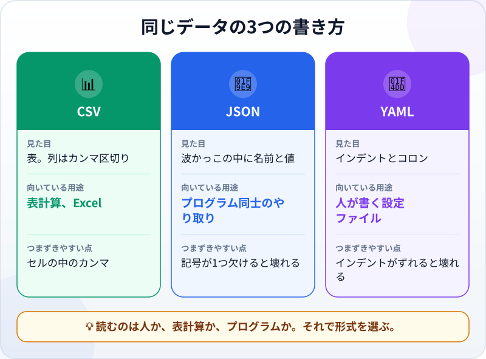
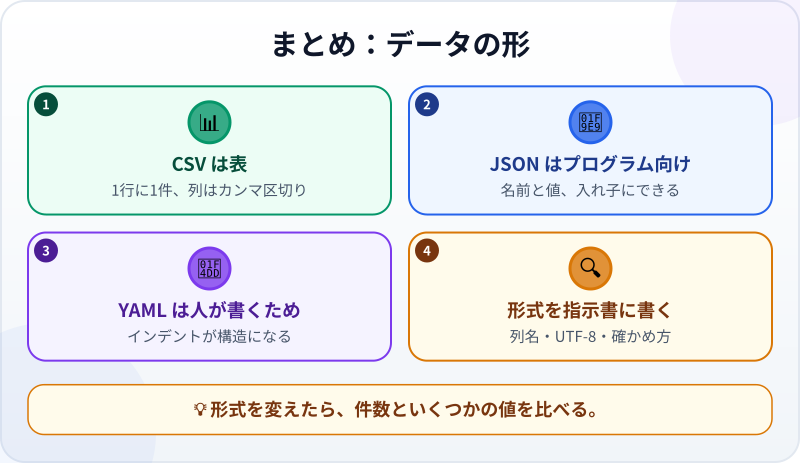

🌐 [Tiếng Việt](../../vi/lessons/data-formats.md) · [English](../../en/lessons/data-formats.md) · **日本語**

# データの形：JSON・CSV・YAML

<!-- section: objective -->
## この授業のゴール

この授業を終えると、次のことができるようになります。

- よく使われる3つのデータ形式、**CSV**・**JSON**・**YAML** を見分けられる。
- それぞれ何に向いていて、どこでつまずきやすいかがわかる。
- 指示書で形式をはっきり伝え、エージェントが変換したデータを確かめられる。

<!-- section: hook -->
## なぜ大事なの？

エージェントに頼む仕事の多くは、データを扱う仕事です。表を読む、集計する、レポートを出す。エージェントは形式を聞いてくるか、自分で選びます：*「CSV と JSON、どちらで出力しますか？」*

書き方を覚える必要はありません。ひと目で見分けられ、自分の仕事にどれが合うかがわかり、変換のあとに何を確かめればいいかを知っていれば十分です。（ちなみに、この講座そのもののデータ――目次、用語集、インフォグラフィック――も YAML で保存されています。）

<!-- section: concept -->
## 本題

### 同じデータを3つの書き方で

マイさんの経費2件を **CSV** で。表の形で、1行に1件、列はカンマで区切ります：

```text
date,category,amount
2026-09-01,Travel,50000
2026-09-02,Meals,120000
```

**JSON** で。波かっこの中に名前と値。プログラム同士でデータを送り合うのに向いています：

```json
[
  {"date": "2026-09-01", "category": "Travel", "amount": 50000},
  {"date": "2026-09-02", "category": "Meals", "amount": 120000}
]
```

**YAML** で。インデント（字下げ）とコロン。読みやすく、手でも書きやすい形です：

```yaml
- date: 2026-09-01
  category: Travel
  amount: 50000
- date: 2026-09-02
  category: Meals
  amount: 120000
```

### それぞれ何に向いている？



- **CSV：** 表計算を使う人に渡すとき。つまずきやすいのは、セルの中にカンマがあるとき（そのセルはダブルクォートで囲む必要があります）、Excel が `0901…` を数字に変えて先頭の0を消してしまうとき、そして日本語が文字化けするときです。
- **JSON：** プログラムが読み書きするとき。厳密で、カンマやかっこが1つ欠けるだけで、ファイル全体が読めなくなります。
- **YAML：** 人が手で書く設定ファイル。インデントがそのまま構造なので、スペースが1つずれるだけで意味が変わります。

### 指示書に形式を書く

データの仕事を頼むときは、指示書に形式、列名、文字コード（日本語やベトナム語なら、たいてい **UTF-8**）、確かめ方を書きます。変換のたびに、古いファイルと新しいファイルで**件数といくつかの値を比べ**ましょう。

<!-- section: try-it -->
## やってみよう

約10分。[良い指示書の書き方](writing-good-specs.md)で作った `expenses.csv`（架空のデータ20行）を使います。

**1. 変換する（3分）：**

```text
expenses.csv から、同じデータの expenses.json と expenses.yaml を作ってください。expenses.csv は変えないでください。
そのあとチェックを書いてください：3つのファイルの件数が等しく、amount の合計も等しいこと。
実行して結果を見せてください。
```

**2. 自分の目で見る（3分）：** 3つのファイルをメモ帳（Windows）かテキストエディット（Mac）で開きます。同じ経費を3つの中で探しましょう。それぞれの形式でどう見えますか？

**3. つまずきやすい点を試す（4分）：**

```text
expenses.csv に新しい行を追加してください：日付 2026-09-30、category "Meals, with a client"、amount 300000。
そのあと expenses.json を作り直し、チェックをもう一度実行してください。
```

`expenses.csv` を開きましょう。エージェントはカンマを含むセルをダブルクォートで囲みましたか？ `expenses.json` では、category は "Meals, with a client" のまま残っていますか？

証拠を書きましょう：

- *見せられるもの…* 同じデータの3つのファイルと、件数と合計が一致すると報告するチェック。
- *確かめたこと…* 3つのファイルでの同じ経費1件と、変換後のカンマを含むセル。
- *使わないほうがいい場面…* たとえば、0で始まるコードを Excel で開くつもりのデータ。そのときは、文字として残すようエージェントに伝えます。

<!-- section: misconceptions -->
## よくある誤解

- **「CSV は Excel のファイル」** ―― CSV はただの文字です。Excel はそれを開けるアプリの一つにすぎません。色、数式、複数のシートは CSV には保存されません。
- **「JSON や YAML はプログラマー専用」** ―― 読める文字です。エージェントが何を作ったかを確かめるために、あなたも読みます。
- **「形式を変えてもデータは同じ」** ―― 変換で先頭の0が消えたり、日付が変わったり、カンマでセルが分かれたり、文字化けしたりします。件数といくつかの値を比べましょう。

<!-- section: recap -->
## 1枚でわかるこのレッスン



<!-- section: takeaways -->
## まとめ

- CSV は表、JSON はプログラム向け、YAML は人が手で書くファイル向け。
- つまずきやすい点：CSV のセル内のカンマ、JSON の記号の欠け、YAML のインデントのずれ。
- 形式、列名、文字コード（UTF-8）を指示書に書く。
- 変換したら、件数といくつかの値を比べる。

<!-- section: quiz -->
## 確認クイズ

**問1.** Excel で開く同僚に表を送りたい。いちばん合う形式は？

- A) CSV
- B) JSON
- C) YAML

**問2.** エージェントが `expenses.csv` を JSON に変換しました。すばやく確実な確かめ方は？

- A) JSON ファイルを開いて、きれいかどうか見る
- B) 2つのファイルで件数といくつかの値を比べる
- C) エージェントに「合ってる？」と聞く

**問3.** セル "Meals, with a client" が CSV ファイルを壊しうるのはなぜ？

- A) CSV には文字が入らないから
- B) 文字が長すぎるから
- C) カンマは列の区切りなので、そのセルはダブルクォートで囲む必要があるから

<details>
<summary>答えを見る</summary>

1. **A** ―― CSV は表で、Excel ですぐ開けます。
2. **B** ―― 件数と値は確かめられます。きれいかどうかは印象です。
3. **C** ―― ダブルクォートがないと、そのセルは2つの列に分かれてしまいます。

</details>
