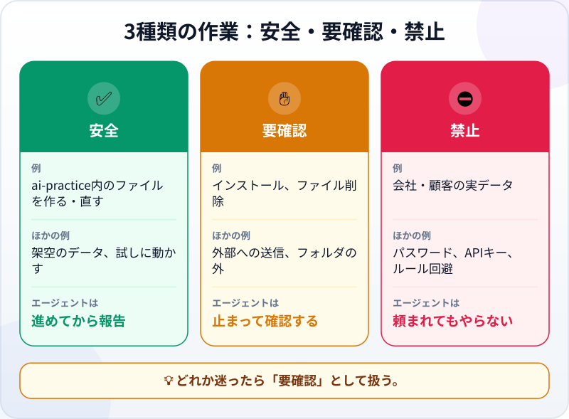
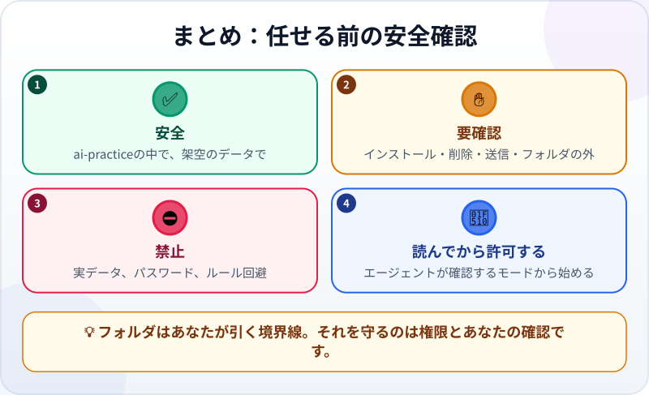

🌐 [Tiếng Việt](../../vi/lessons/data-safety-and-permissions.md) · [English](../../en/lessons/data-safety-and-permissions.md) · **日本語**

# エージェントに任せる前に：安全・要確認・禁止を分ける

<!-- section: objective -->
## この授業のゴール

この授業を終えると、次のことができるようになります。

- 作業を ✅**安全**・✋**要確認**・⛔**禁止** の3種類のどれかに分けられる。
- 専用フォルダは**あなたが引く境界線**で、それを守るのはエージェントの**権限**だとわかる。
- エージェントの許可リクエストを、「許可」を押す前に読める。

<!-- section: hook -->
## なぜ大事なの？

エージェントがチャットボットと違うのは、**実際に作業する**ことです。ファイルを作り、消し、コマンドを実行します。実際の作業には実際の結果がともないます。うっかり消したファイル、間違った相手に送った給与表、外に漏れたパスワード。

でも安心してください。セキュリティの専門家になる必要はありません。必要なのは一つの習慣だけです。**エージェントが動く前に、その作業がどの種類かを考えること。**

<!-- section: concept -->
## 本題

### 3種類の作業

- ✅ **安全――進めてから報告：** `ai-practice` の中でファイルを作る・直す、架空のデータを使う、作ったページや表計算を試しに動かす。
- ✋ **要確認――エージェントは止まり、あなたが決める：** ソフトやライブラリのインストール、ファイルの削除、外部への送信（メール、ネットへの投稿）、フォルダの外での作業、あなたが理解できないコマンドの実行。
- ⛔ **禁止――頼まれてもやらない：** 会社や顧客の実データ、パスワードや APIキー（ソフトがサービスを使うための鍵）、会社のPCのルールを回避すること。

どれか迷ったら、✋**要確認**として扱いましょう。

### 境界線はフォルダ、それを守るのは権限

`ai-practice` フォルダは、あなたが引いた境界線です。その線を守るのは**権限（パーミッション）**、つまりエージェントのソフトが、あなたに聞かずにしてよいと認めている範囲です。

たとえば2026年9月時点で、Claude Code は標準のモードでは自分で**読む**ことしかしません。ファイルを直したりコマンドを実行したりするには、先にあなたに確認します。このモードでは、開いたフォルダの中にしか書き込めず、外を読むときも先に確認します。より自動的なモードでは確認が減り、そのぶん境界線もゆるくなります。

だから学んでいる間は、**エージェントが先に確認するモードを選び**、リクエストを一つずつ読みましょう。

### 許可リクエストの読み方

エージェントに聞かれたら、押す前に3つの問いに答えます。

1. **何をする？** インストール、削除、送信、それともコマンドの実行？
2. **どこで？** `ai-practice` の中？ 外？
3. **やり直せる？** 消したファイルや送ったメールは取り戻しにくい。

わからなければ、エージェントに聞き返しましょう：*「このコマンドは何をしますか？ もっと安全な方法はありますか？」*

<!-- section: analogy -->
## 身近なたとえ

職場に来たばかりの新人を思い浮かべてください。

- ✅ **自分でやってよい：** 資料のコピー、下書きづくり、自分の机の整理。
- ✋ **先に聞く：** お客さまへの手紙の送付、古い書類の廃棄、ほかの部署の機械を使うこと。
- ⛔ **絶対にしない：** 顧客ファイルの持ち帰り、社外の人にオフィスのパスワードを教えること。

このたとえの弱点：新人は状況を理解してためらうことができますが、エージェントは何がデリケートかを自分では知りません。あなたが伝えるか、権限が止めない限りは。

<!-- section: example -->
## 具体例

マイさんはホーチミン市で働く経理担当で、毎日 Excel を使っています。月次の売上レポートづくりをエージェントに手伝ってほしいと考えました。

1. ⛔ マイさんは本物のファイル `顧客別売上_8月.xlsx` を `ai-practice` に入れようとして、手を止めました。これは顧客の実データです。かわりにエージェントに、同じ列（日付・顧客・金額）で30行の架空の数字が入った**ダミーファイルを作って**もらいます。
2. ✋ エージェント：*「Excel ファイルを読むために openpyxl ライブラリをインストールする必要があります。よろしいですか？」* マイさんは何のライブラリかを聞き、説明（Excel ファイルの読み書きによく使われるライブラリ）を聞いてから、**今回だけ**許可します。
3. ✋ エージェントはフォルダを整理するため `古いレポート.xlsx` の削除を提案します。マイさんは断ります。消したら戻しにくいからです。かわりにサブフォルダ `old` に移してもらいます。
4. ✅ エージェントは架空のデータからレポートを作り、開いて合計を確かめてから報告します。
5. ✋ 最後にエージェントが提案：*「レポートを上司の方にメールで送れます。」* マイさんは断ります。外に送るのは、自分で確かめたあとで自分がする仕事です。

<!-- section: misconceptions -->
## よくある誤解

- **「確認が多すぎる。自動モードにすれば速い」** — 自動モードは、何をしているかを理解してから使うものです。学んでいる間は、その確認こそが学びです。
- **「架空のデータでは本当の練習にならない」** — 身につくスキルはまったく同じです。同じ列、同じ形式の架空データで十分に練習でき、誰にもリスクがありません。
- **「『ほかのファイルには触らないで』と伝えれば十分」** — 指示は役に立ちますが、保証ではありません。本当の守りは権限と、あなたが内容を読むことです。ファイルやWebページの中に、エージェントへの命令のふりをした文章が紛れていることもあります。頼んでもいないことをエージェントが提案してきたら、止まりましょう。

<!-- section: recap -->
## 1枚でわかるこのレッスン

<!-- section: takeaways -->
## まとめ

- ✅ 安全：`ai-practice` の中で、架空のデータを使う。エージェントは進めてから報告する。
- ✋ 要確認：インストール、削除、送信、フォルダの外、理解できないコマンド。迷ったらここ。
- ⛔ 禁止：会社や顧客の実データ、パスワードと APIキー、ルールの回避。
- フォルダは境界線。それを守るのは権限と、許可する前に読むあなたの習慣。

<!-- section: quiz -->
## 確認クイズ

**問1.** エージェントが Excel を読むためのライブラリのインストールを求めています。どの種類の作業？

- A) ✅ 安全
- B) ✋ 要確認
- C) ⛔ 禁止

**問2.** エージェントとレポートづくりを練習したいとき、使うべきデータは？

- A) 現実に近づけるため、会社の本物の売上ファイル
- B) 同じ列で数字を作った架空のファイル
- C) 本物のレポートのスクリーンショット

**問3.** 専用フォルダだけでは安全と言えないのはなぜ？

- A) 専用フォルダだとエージェントが遅くなるから
- B) エージェントに何ができるかは権限で決まり、モードによっては外を読んだり作業したりできるから
- C) エージェントは専用フォルダを使えないから

答えを見る

1. **B** — インストールはあなたのPCを変えるので、エージェントは確認し、あなたが決めます。
2. **B** — 同じ構造の架空データで十分です。実データはスクリーンショットも含め、練習に使いません。
3. **B** — フォルダはあなたが引いた線。それを守るのは権限です。

<!-- section: sources -->
## 参考資料

- Anthropic — [Security](https://code.claude.com/docs/en/security)（英語）：Claude Code は標準のモードでは読み取り専用の権限で始まり、ファイルの編集やコマンドの実行の前に確認します。書き込めるのは開いたフォルダの中だけです。ツールが持つのはあなたが与えた権限だけで、許可する前に内容を確かめる責任はあなたにあります。
- Anthropic — [Choose a permission mode](https://code.claude.com/docs/en/permission-modes)（英語）：権限モードの一覧と、それぞれのモードで確認なしに何ができるか。
