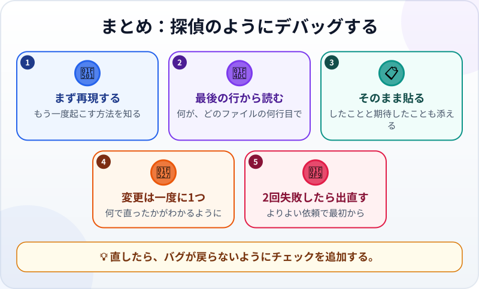

🌐 [Tiếng Việt](../../vi/lessons/errors-and-debugging.md) · [English](../../en/lessons/errors-and-debugging.md) · **日本語**

# エラーメッセージを読み、探偵のようにデバッグする

<!-- section: objective -->
## この授業のゴール

この授業を終えると、次のことができるようになります。

- エラーメッセージから、**何が**起きたか、**どこで**起きたかを読める。
- エージェントとループでデバッグできる：再現 → 読む → 原因を推理 → 1か所だけ直す → 検証。
- 直し続けるのをやめて、よりよい依頼で出直すタイミングがわかる。

<!-- section: hook -->
## なぜ大事なの？

[「たぶん合っている」をチェックに変える](testing-basics.md)の授業で、マイさんの経費集計プログラムは、空の金額に出会ったところで、見慣れない文章を出して止まりました。エラーメッセージを見たらすぐ閉じる人や、エージェントに「壊れた」とだけ伝える人は多いものです。

でも、エラーメッセージは**手がかり**です。壊れた場所をまっすぐ指していることもよくあります。全部を理解する必要はありません。2か所を読み、その手がかりをエージェントに渡せばいいのです。

<!-- section: concept -->
## 本題

### エラーメッセージの読み方

```text
Traceback (most recent call last):
  File "summary.py", line 12, in <module>
    total += int(row["amount"])
ValueError: invalid literal for int() with base 10: ''
```

- **最後の行――何が起きたか：** `ValueError`（値のエラー）。プログラムが `''`（空の欄）を数字に変えられなかった。
- **その上――どこで：** ファイル `summary.py` の12行目。まさに金額を足している行です。

このような Python 形式のメッセージは、**下から上へ**読みましょう。Webページにもエラーの表示場所があります。Chrome や Edge で **F12**（Mac は **Cmd+Option+J**）を押し、**Console**（コンソール）タブを見ると、エラーが赤い文字で、ファイル名と行番号つきで表示されます。

### 探偵のデバッグ・ループ


1. **再現する：** 何をするとバグが起きるかを正確に知る。再現できなければ、まだ直せません。
2. **メッセージを読む：** 何が、どこで。
3. **原因を推理する：** 仮説は1つ。直す**前に**、エージェントに原因を説明してもらう。
4. **1か所だけ直す：** 変更は一度に1つ。どの変更が効いたかがわかるように。
5. **検証する：** バグが起きた手順をそのまま繰り返す。直ったら、戻らないようにチェックを追加。直らなければ、もう一周。

### エージェントへのバグの伝え方

エラーメッセージは、自分の言葉で言い換えず、**そのまま**貼りましょう。そして2つを添えます。何をしたか、何を期待したか。Claude Code のガイドが勧めるように、まずバグを再現するチェックを書いてもらい、それから直してもらうと、さらに確実です。

### エージェントが直し続けても直らないとき

2回直しを頼んでもまだ間違っているなら、会話は失敗した試みでいっぱいです。Claude Code のガイドは、いったん止めて新しいセッションを始め、わかったことを盛り込んだよりよい依頼を書くよう勧めています。

<!-- section: example -->
## 具体例

マイさんが集計プログラムを実行すると、上のメッセージが出ました。エージェントへの依頼：

> *「expenses.csv（7行目は amount が空）で summary.py を実行したら、次のエラーが出ました：［エラーメッセージをそのまま貼る］。期待：空の金額は0として数え、レポートに一覧で出す。直す前に原因を説明し、このエラーを再現するチェックを書いてください。」*

エージェントの説明：12行目で金額を整数に変えているが、`''` は数字ではない。エージェントがチェックを書くと、バグと同じく失敗しました。そこで**1か所だけ**直します（空の金額は0として数え、記録する）。もう一度実行すると、チェックは合格。集計には「金額が空の行：1件（7行目）」が加わりました。

<!-- section: try-it -->
## やってみよう

約12分。`my-week.html` で探偵ゲームをします。

**1. エージェントにバグを隠してもらう（2分）：**

```text
my-week.html のコピー my-week-bug.html を作り、チェックボックスが動かなくなる小さなバグを
わざと1つだけ入れてください。どこに入れたかは教えないでください。my-week.html は変えないでください。
```

**2. 再現して読む（4分）：** `my-week-bug.html` をブラウザーで開き、ボックスを押してみます。F12（Mac は Cmd+Option+J）で Console タブを開き、赤い行を読みましょう。何が起きた？ どのファイルの何行目？

**3. 探偵らしく伝える（4分）** ――新しいセッションで送ります：

```text
my-week-bug.html を開き、1つ目のやることのボックスを押しました。何も起きません。
Console の表示：［エラーの行をそのまま貼る］。期待：文字に取り消し線がつく。
直す前に原因を説明してください。そのあと、1か所だけ直してください。
```

**4. 検証する（2分）：** ステップ2を繰り返します。バグは消えた？ Console に赤い文字は残っていない？

証拠を書きましょう：

- *見せられるもの…* 直す前のエラーメッセージと、直したあとに正しく動くページ。
- *確かめたこと…* バグが起きたときと同じ手順で。Console にエラーはない。
- *使わないほうがいい場面…* たとえば、バグがたまにしか起きないとき。まず確実に再現する方法を見つける必要があります。

<!-- section: misconceptions -->
## よくある誤解

- **「エラーメッセージは宇宙語。読み飛ばしていい」** ―― 読むのは2つだけ。何が起きたか（多くは最後の行）と、どこで起きたか（ファイル名と行番号）。
- **「直るまでエージェントに『直して』と言い続ければいい」** ―― 2回失敗したら、止まって、よりよい依頼で出直しましょう。
- **「時間の節約のため、何か所も一度に直す」** ―― それでは、どの変更が効いて、どの変更が別の問題を起こしたのかがわかりません。

<!-- section: recap -->
## 1枚でわかるこのレッスン



<!-- section: takeaways -->
## まとめ

- エラーメッセージは手がかり：何が（最後の行）、どこで（ファイル名と行番号）。
- 探偵のループ：再現 → 読む → 原因を推理 → 1か所だけ直す → 検証。
- バグはそのまま貼って伝え、したことと期待したことを添える。直す前に原因を説明してもらう。
- 2回失敗したら、よりよい依頼で出直す。直ったら、チェックを追加する。

<!-- section: quiz -->
## 確認クイズ

**問1.** 上のような Python 形式のエラーメッセージで、最初に読むべき行は？

- A) 最初の行：`Traceback (most recent call last)`
- B) 真ん中のどれかの行
- C) いちばん最後の行：エラーの種類とメッセージ

**問2.** エージェントにいちばん役立つバグの伝え方は？

- A) エラーメッセージをそのまま貼り、したことと期待したことを添える
- B) 「壊れた。直して。」
- C) 短くするため、エラーを自分の言葉で言い換える

**問3.** エージェントが2回直そうとしても、まだバグがあります。次は？

- A) 3回目、4回目と「もう一度」と言い続ける
- B) 止まって、わかったことを盛り込んだよりよい依頼で、新しいセッションを始める
- C) あきらめる

<details>
<summary>答えを見る</summary>

1. **C** ―― 最後の行が「何が」、その上の行が「どこで」を教えてくれます。
2. **A** ―― そのまま貼れば手がかりが失われません。言い換えると細部が落ちがちです。
3. **B** ―― 2回失敗すると、会話は行き止まりの試みでいっぱい。きれいに出直すほうがうまくいきます。

</details>

<!-- section: sources -->
## 参考資料

- Anthropic — [Best practices for Claude Code](https://code.claude.com/docs/en/best-practices)（英語）：バグを伝えるときは、症状、原因のありそうな場所、「直った」状態を書く。たとえば、直す前にバグを再現する失敗するチェックを書いてもらう。2回直しても間違っているなら、わかったことを盛り込んだよりよい依頼で出直す。
