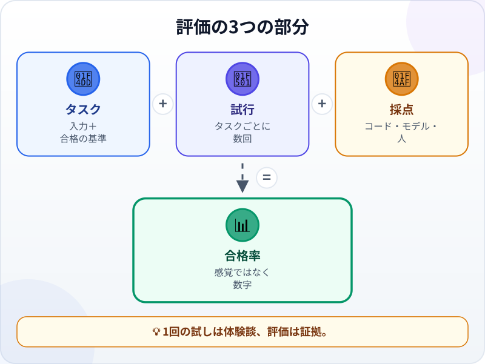
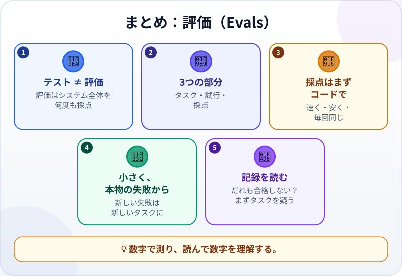

🌐 [Tiếng Việt](../../vi/lessons/evals.md) · [English](../../en/lessons/evals.md) · **日本語**

# Evals：エージェントの品質を採点する

<!-- section: objective -->
## この授業のゴール

この授業を終えると、次のことができるようになります。

- **テスト**（コードを確かめる）と**評価（eval）**（AIシステムを、たくさんのタスクと実行で採点する）を見分けられる。
- 評価の3つの部分（**タスク**・**試行**・**採点**）と、3種類の採点方法を挙げられる。
- 小さな評価を作り、2つの依頼の書き方を数字で比べられる。

<!-- section: hook -->
## なぜ大事なの？

マイさんは、架空の請求書で、請求書を読むエージェントの練習をしています。依頼に日付の形式について1文を足し、請求書を1枚試すと正解。「*新しいほうがいい*」と結論を出しました。翌週、新しいほうは「*3万5千円*」と書かれた請求書を読みまちがえました。古いほうでは正しく読めていたものです。

1回の正解では、どちらがよいかはわかりません。AIは同じ質問にちがう答えを返すことがあり、1枚の請求書はすべての請求書ではないからです。マイさんに必要なのは、**くり返せる**測り方です。たくさんのタスクを、何度も、同じやり方で採点する。

<!-- section: concept -->
## 本題

### テストと評価

[テスト](tests-and-ci-for-agents.md)は**コード**を確かめます。同じ入力なら同じ結果で、合格か不合格か。**評価（eval）**は、モデル・指示・ツールを含む**AIシステム全体**を、たくさんのタスクで確かめます。AIの答えは変わりうるので、評価は1つのタスクを**何度も**実行し、合格率を数えます。Anthropic（2026年1月）の定義は簡潔です。AIに入力を渡し、その出力に採点のルールを当てはめて、成功を測る。

### 評価の3つの部分



- **タスク：** 入力と合格の基準がはっきりした1つの試験。例：請求書を1枚読み、日付と金額を返す。
- **試行：** タスクを1回試すこと。1つのタスクを何回か実行します。
- **採点：** その試行が合格かどうかを決める方法。
  - **コードによる採点** ―― 完全一致の比較、テストの実行、結果の確認。速く、安く、毎回同じように採点します。できるならこれを選びます。
  - **モデルによる採点** ―― 書いておいた基準に沿ってAIが採点します。完全一致で比べにくいもの（口調、要約）に。
  - **人による採点** ―― 仕事のわかる人が採点するか、いくつかを抜き取って確かめます。一番遅いものの、最後のものさしです。

### 本物の失敗から、小さく始める

Anthropicは、何百ものタスクを待たず、**本物の失敗から集めた**20〜50の簡単なタスクで始めるようすすめています。学ぶ人なら、`ai-practice` の5つのタスクでも立派なスタートです。AIがまちがえるたびに、それを新しいタスクにしましょう。

### 評価を正直に保つ3つの習慣

- **失敗した実行の記録を読む** ―― 1回の試行で起きたことのすべてです。読まなければ、悪いのがAIなのか、タスクなのか、採点なのかわかりません。
- **手順ではなく、結果を採点する。** 1つの道筋を求める採点は、同じくらい正しい別のやり方を不合格にします。
- **だれも合格しないなら、まずタスクを疑う。** Anthropicは、100回試しても一度も合格しないタスクは、たいていエージェントの力不足ではなく、タスクの書き方がこわれているサインだと指摘しています。

<!-- section: try-it -->
## やってみよう

約11分。`ai-practice` で、架空のデータとエージェントを使います（使ってよいチャットボットなら、目で採点します）。（見るだけのルートなら、手順1を行い、手順3の結果を予想しましょう。）

**1. タスクと正解（2分）。** `invoices.txt` を作り、1行に1枚、架空の請求書を書きます。

```text
請求書No.101 2026年9月3日 合計 125,000円
No.102／240,000円／2026/9/5 支払い
2026年9月12日付、請求書103、金額：98,000円
請求書104（2026年9月20日）：3万5千円
No.105、2026年9月30日、前払い 5万円、残金 15万円、合計 20万円
```

そして、実行する前に正解を書いた `answers.jsonl`：

```text
{"no": 101, "date": "2026-09-03", "amount": 125000}
{"no": 102, "date": "2026-09-05", "amount": 240000}
{"no": 103, "date": "2026-09-12", "amount": 98000}
{"no": 104, "date": "2026-09-20", "amount": 35000}
{"no": 105, "date": "2026-09-30", "amount": 200000}
```

**2. コードによる採点（2分）。** エージェントに頼みます。「*grade.py を書いて。`python grade.py 結果のファイル answers.jsonl` で動かす。answers.jsonl の請求書を番号ごとに結果のファイルと比べ、何枚が正しいか、どれがまちがいかを表示して。読めない行や、抜けている請求書はまちがいとして数えて。*」AIに実行させる前に試します。`answers.jsonl` を `test_result.jsonl` にコピーして採点すると、全部正解のはずです。次に `test_result.jsonl` の数字を1つ変えて採点し直すと、ちょうどその請求書をまちがいと報告するはずです。

**3. 2つの頼み方を比べる（5分）。** 1回ずつ**新しいセッション**で実行し、結果は別々のファイルに書かせます。

- **頼み方A：** 「*invoices.txt を読んで、請求書番号・日付・金額を取り出し、result_A1.jsonl に書いて。*」
- **頼み方B：** 「*invoices.txt を読んで。1行ごとに result_B1.jsonl へJSONを1行書く：no（整数）、date（YYYY-MM-DD）、amount（円の整数で、請求書の合計）。例（ファイルにない請求書）：{"no": 999, "date": "2026-01-15", "amount": 50000}。*」

それぞれ**2回**ずつ（A1・A2・B1・B2）実行し、4つとも `grade.py` で採点します。表に書きます。Aは10点中何点、Bは10点中何点。

**4. 失敗を読む（2分）。** まちがえた請求書のセッションを開き直して読みます。AIはどこで誤解した？（「3万5千円」？ 合計ではなく前払い？）悪かったのは頼み方？ それともあなたの正解？ すべての実行が正解だったら、代わりに一番むずかしい請求書（104か105）の実行を1つ読みます。AIはどう判断した？ そして次のために、もっとむずかしい請求書を `invoices.txt` に足し、実行する前にその正解を `answers.jsonl` に書きます。

**証拠：**

- *見せられるもの…* 5つのタスク、正解、採点のコード、2つの頼み方の点数表。
- *確かめたこと…* 正解をわざと壊すと採点がまちがいを報告したこと。失敗した実行の記録を少なくとも1つ読んだこと（すべて正解なら、一番むずかしい請求書の実行を1つ）。
- *使わないほうがいい場面…* 比べる実行が1、2回しかない（結論を出すには少なすぎる）、またはタスクに会社の本物のデータが必要なとき。

<!-- section: misconceptions -->
## よくある誤解

- **「1回試して正しければ十分」** ―― AIは毎回ちがう答えを返しえます。1回の正解では合格率はわかりません。評価は、たくさんのタスクを何度も実行します。
- **「何百ものタスクがなければ評価とは言えない」** ―― 本物の失敗から小さく始め、少しずつ足していきます。正しく採点された5つのタスクは、何もないよりずっとましです。
- **「点数が低いのはAIがだめだから」** ―― タスクがあいまい、正解がまちがい、採点が硬すぎる、ということもあります。結論の前に記録を読みましょう。

<!-- section: recap -->
## 1枚でわかるこのレッスン



<!-- section: takeaways -->
## まとめ

- テストはコードを、評価はAIシステム全体を、たくさんのタスクと実行で確かめる。
- 評価はタスク・試行・採点でできている。採点はできるだけコードで。
- 本物の失敗から小さく始める。新しい失敗は新しいタスクになる。
- 失敗した実行の記録を読み、手順ではなく結果を採点する。
- だれも合格しないなら、まずタスクと正解を疑う。

<!-- section: quiz -->
## 確認クイズ

**問1.** 評価が1つのタスクを何度も実行するのはなぜ？

- A) AIは同じ入力にもちがう答えを返しうるから
- B) モデルが前の実行から学んで上達するように
- C) 最初の実行はいつもまちがうから

**問2.** タスクは「日付を YYYY-MM-DD で返す」。一番合う採点は？

- A) 人に読んでもらい、印象を聞く
- B) 正解と完全に一致するかを調べるコードによる採点
- C) 採点はいらない。見ればわかる

**問3.** あるタスクを20回実行して、一度も合格しませんでした。まず何をすべき？

- A) モデルにはこの仕事ができないと結論を出す
- B) 一度合格するまで、あと100回実行する
- C) 記録を読み、タスク・正解・採点をもう一度確かめる

<details>
<summary>答えを見る</summary>

1. **A** ―― 1回の実行では合格率はわかりません。何度も実行してわかります。
2. **B** ―― 正確な正解があるなら、コードで速く、安く、毎回同じように採点できます（正解が正しければ）。
3. **C** ―― だれも合格しないタスクは、たいていタスクか採点に問題があるサインです。

</details>

<!-- section: sources -->
## 参考資料

- Anthropic — [Demystifying evals for AI agents](https://www.anthropic.com/engineering/demystifying-evals-for-ai-agents)（英語、2026年1月）：評価はAIに入力を渡し、出力に採点のルールを当てはめること。タスク・試行・採点（コード・モデル・人）・記録と結果。本物の失敗から集めた20〜50の簡単なタスクで始める。記録を読まなければならない。手順ではなく結果を採点する。一度も合格しないタスクは、たいていタスクの書き方がこわれている。
