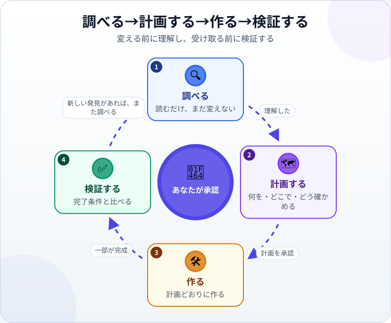
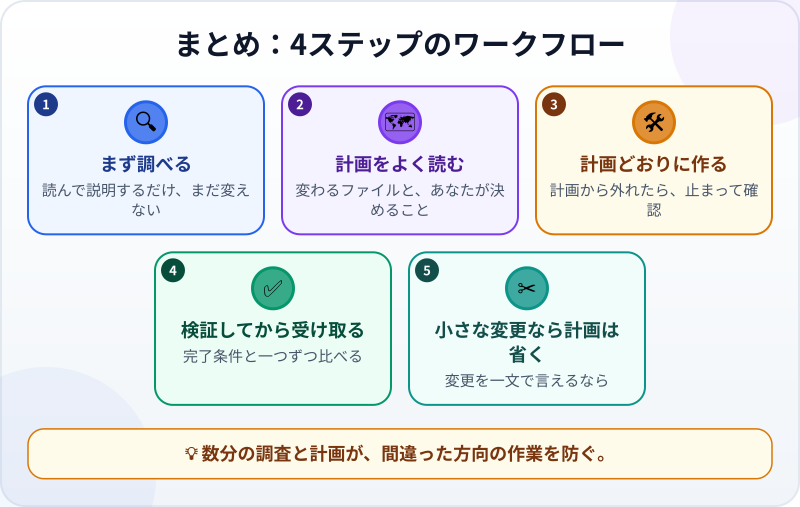

🌐 [Tiếng Việt](../../vi/lessons/explore-plan-build-verify.md) · [English](../../en/lessons/explore-plan-build-verify.md) · **日本語**

# 4ステップのワークフロー：調べる→計画する→作る→検証する

<!-- section: objective -->
## この授業のゴール

この授業を終えると、次のことができるようになります。

- 4つのステップ、**調べる・計画する・作る・検証する**と、あなたが承認する場所を説明できる。
- 計画モード（plan mode）を使い、エージェントに編集の前に提案させられる。
- 3つの問いで計画を読み、計画を省いてよいときを判断できる。

<!-- section: hook -->
## なぜ大事なの？

エージェントの仕事は速い。間違ったことをしているときも速いのです。Claude Code のガイドは、エージェントにいきなりコードを書かせると、間違った問題を解くコードができかねないと注意しています。

プロジェクトを進めたことがある人なら知っているでしょう。作業の前に、依頼を理解し、計画をすり合わせる。エージェントとの仕事も同じです。ただ、ずっと速いだけです。

<!-- section: concept -->
## 本題

### 4つのステップと、あなたが承認する場所



1. **調べる：** エージェントはファイルを読み、質問し、説明する。**まだ何も変えない。**
2. **計画する：** 何を、どのファイルで変え、どう確かめるかを提案する。**あなたが読んで承認する。**
3. **作る：** 承認された計画どおりに作る。計画から外れる必要が出たら、止まって確認する。
4. **検証する：** 完了条件と比べる。新しい発見があれば、また調べる。

### 計画モード

多くのツールには、最初の2ステップ専用のモードがあります。たとえば2026年9月時点で、Claude Code には *plan mode* があり、エージェントはファイルを読んで計画を書きますが、あなたが計画を承認するまでファイルを編集しません。Claude アプリでは、権限モードの選択で選べます。

### 計画の読み方：3つの問い

- **どのファイルが変わる？** 思いがけないファイルは入っていない？
- **何が追加される？** ライブラリ、ツール、データ。✋要確認にあたるもの。
- **どれがあなたの決めること？** 計画には選択が隠れていることがよくあります。たとえば、データをどこに保存するか。見つけ出して、自分で決めましょう。

### 計画を省いてよいとき

Claude Code のガイドによれば、計画がいちばん役に立つのは、やり方に自信がないとき、変更が複数のファイルに及ぶとき、よく知らないコードを変えるときです。**変更を一文で言えるなら**（誤字を直す、見出しの色を変えるなど）、そのまま頼みましょう。

<!-- section: try-it -->
## やってみよう

約12分。[はじめてのエージェント体験](first-agent-session.md)で作った `my-week.html` を使います。課題：ページを再読み込みしても、チェックしたやることが残るようにする。（見るだけルートの人は、各ステップを読み、ステップ2の3つの問いに自分で答えましょう。）

**1. 調べる（3分）** ――計画モードに切り替えてから送ります：

```text
my-week.html で、ページを再読み込みしてもチェックしたやることが残るようにしたいです。
まずは my-week.html を読んで、今どう動いているかを短く説明してください。まだ何も変えないでください。
```

**2. 計画する（3分）：**

```text
では計画を提案してください。何を、どのファイルで変えるか、データをどこに保存するか、
私がどう確かめられるか。まだ何も変えないでください。
```

3つの問いで計画を読みましょう。チェックの状態は**このPCのブラウザーの中**に保存されるため、別のPCや別のブラウザーでは見えない、と書かれているかもしれません。それで問題ないですか？ 決めるのはあなたです。

**3. 作る（3分）：** 計画を承認し、変更を一つずつ読んでから承認します。

**4. 検証する（3分）：** 2つにチェック → 再読み込み → 残っている？ 1つのチェックを外す → 再読み込み → 正しい？ 証拠を書きましょう：

- *見せられるもの…* 再読み込みしてもチェックが残るカード。
- *確かめたこと…* チェックとチェックの解除の両方を、毎回再読み込みして。
- *使わないほうがいい場面…* 同じリストを複数のPCで見たいとき。

<!-- section: misconceptions -->
## よくある誤解

- **「計画は時間のむだ」** — 計画を数分読むほうが、間違った方向の作業を直すよりずっと安く済みます。ただし、一文で言える変更はそのまま頼みましょう。
- **「エージェントが書いた計画なら、そのまま承認すればいい」** — 計画は、思いがけないファイルの変更、思いがけないライブラリの追加、本来あなたが決めるべきことを見つける、いちばん安いタイミングです。
- **「検証は最後に一度だけ」** — いくつかの部分に分かれる仕事なら、部分ごとに検証します。新しい発見があれば、また調べましょう。

<!-- section: recap -->
## 1枚でわかるこのレッスン



<!-- section: takeaways -->
## まとめ

- 4つのステップ：調べる（読むだけ）→ 計画する（あなたが承認）→ 作る → 検証する。
- 3つの問いで計画を読む：どのファイルが変わるか、何が追加されるか、どれがあなたの決めることか。
- 変更を一文で言えるなら、計画は省いてそのまま頼む。
- 検証で新しい発見があれば、また調べる。

<!-- section: quiz -->
## 確認クイズ

**問1.** 計画なしでそのまま頼んでよい仕事は？

- A) 見出しの誤字を直す
- B) データを保存する機能を追加し、複数のファイルを変える
- C) どう進めればいいかわからない仕事

**問2.** 「調べる」ステップで、エージェントがすべきことは？

- A) 時間を節約するため、すぐに直し始める
- B) 必要になりそうなライブラリを先に入れる
- C) ファイルを読んで説明する。何も変えない

**問3.** 計画に*「データはこのPCのブラウザーに保存されます」*とあります。どうする？

- A) 技術的な細かい話なので無視する
- B) それで問題ないかを自分で判断してから承認する
- C) エージェントに決めてもらう

<details>
<summary>答えを見る</summary>

1. **A** — 一文で言える変更に計画はいりません。B と C こそ、計画がいちばん役に立つ場面です。
2. **C** — 調べるのは読むだけ。編集やインストールは、計画を承認したあとです。
3. **B** — 計画には決めるべきことが隠れています。それを見つけて決めるのが、あなたの仕事です。

</details>

<!-- section: sources -->
## 参考資料

- Anthropic — [Best practices for Claude Code](https://code.claude.com/docs/en/best-practices)（英語）の *Explore first, then plan, then code*：間違った問題を解かないよう、調査と計画を実装から分ける。計画が役に立つのは、やり方に自信がないとき、変更が複数のファイルに及ぶとき、よく知らないコードを変えるとき。変更を一文で言えるなら計画は省く。
- Anthropic — [Choose a permission mode](https://code.claude.com/docs/en/permission-modes)（英語）の plan mode：エージェントはファイルを読んで計画を書くが、あなたが計画を承認するまで何も編集しない。
