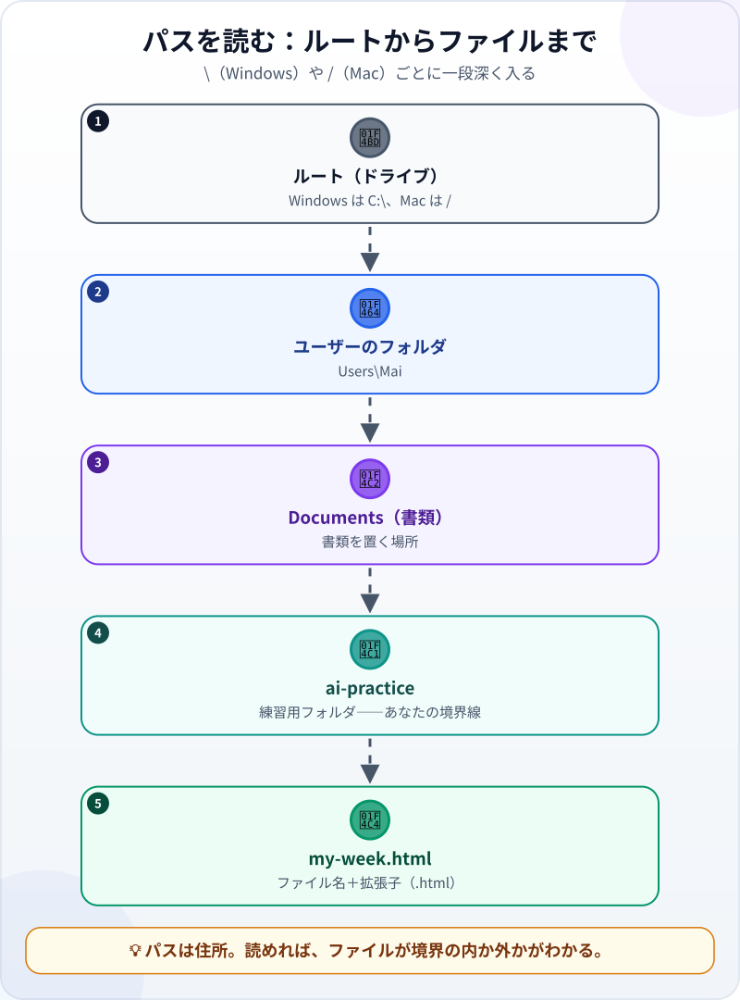
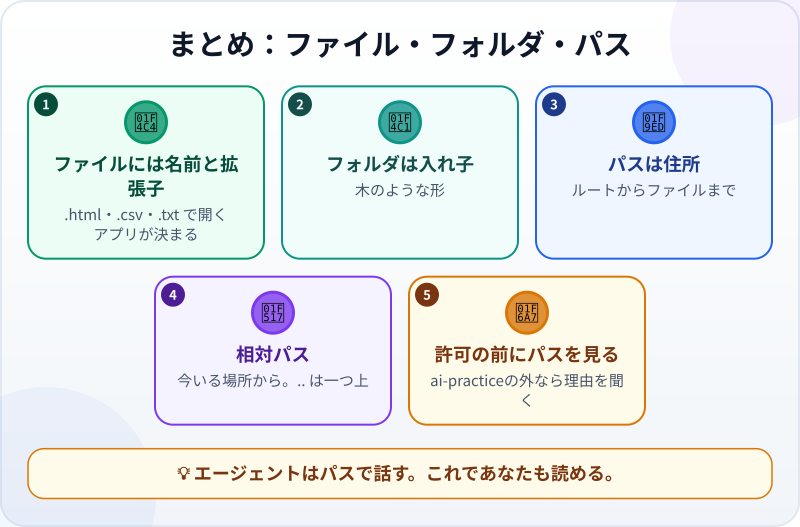

🌐 [Tiếng Việt](../../vi/lessons/files-folders-paths.md) · [English](../../en/lessons/files-folders-paths.md) · **日本語**

# ファイル・フォルダ・パス：パソコンの中の地図

<!-- section: objective -->
## この授業のゴール

この授業を終えると、次のことができるようになります。

- **ファイル**・**フォルダ**・**パス**を区別し、Windows と Mac のパスを読める。
- **相対パス**と `..`（一つ上）の意味がわかる。
- パスを使って、エージェントが作ったファイルを見つけたり、許可リクエストが `ai-practice` の中に収まっているかを判断したりできる。

<!-- section: hook -->
## なぜ大事なの？

ハナさんが仕事を頼むと、エージェントが報告しました：*「`tips/tips.html` を作成しました。」* `ai-practice` を開いても、`tips.html` が見当たりません。実は、エージェントは `tips` というサブフォルダを作り、その中にファイルを置いていたのです。

エージェントはパスで話します。報告でも、計画でも、許可リクエストでも。パスが読めれば、ファイルを見つけられます。そして、エージェントが境界の外に手を出そうとしたとき、すぐに気づけます。

<!-- section: concept -->
## 本題

### ファイルとフォルダ

- **ファイル**には中身が入っています。Webページ、表計算、写真など。名前の最後には `.html`、`.csv`、`.txt` のような**拡張子**がつき、どのアプリで開くかをパソコンに伝えます。
- **フォルダ**には、ファイルやほかのフォルダが入ります。木のような入れ子の形です。

### パス：ルートからファイルまでの住所



- Windows：`C:\Users\Mai\Documents\ai-practice\my-week.html`
- Mac：`/Users/mai/Documents/ai-practice/my-week.html`

Windows は `\`（日本語の画面では `¥` に見えることもあります）、Mac は `/` を使います。意味は同じで、記号ごとに一段深く入ります。

### 相対パス

フルパスはルートから始まります。**相対パス**は、今いるフォルダから数えます。エージェントが `ai-practice` で作業しているなら：

- `my-week.html` ―― `ai-practice` のすぐ中のファイル。
- `tips/tips.html` ―― サブフォルダ `tips` の中のファイル。
- `../../Desktop/kyuyo.xlsx` ―― `..` は**一つ上**。`ai-practice` から `Documents` へ、さらに `Mai` へ上がり、`Desktop` に入ります。このパスは**境界の外に出ています**。

### パスと安全の境界線

エージェントがファイルの編集・削除・読み取りを求めてきたら、パスを見ましょう。

- `ai-practice` の中 → たいてい ✅。
- 外へ出る `..` がある、または `ai-practice` の中ではないフルパス → ✋ 理由を聞く。

ツールも助けてくれます。たとえば Claude Code は標準のモードでは、開いたフォルダとそのサブフォルダにしか書き込めません。

<!-- section: try-it -->
## やってみよう

約10分。`ai-practice` の中で行います。

**1. 拡張子を表示する（2分）。** 多くのパソコンでは、最初は拡張子が隠れています。

- Windows 11：エクスプローラー → **表示** → **表示** → **ファイル名拡張子** をオン。
- Mac：Finder → **設定** → **詳細** → **すべてのファイル名拡張子を表示** をオン。

（項目名は、OSのバージョンによって少し違うことがあります。）

**2. `my-week.html` のフルパスを取る（2分）。**

- Windows 11：ファイルを右クリック → **パスのコピー**。
- Mac：右クリックして **Option** キーを押したまま → **"my-week.html"のパス名をコピー**。

メモに貼り付けて、ルートからファイルまで何段あるか数えましょう。

**3. エージェントにフォルダの木を描いてもらう（3分）：**

```text
このフォルダのファイルとフォルダを木の形で一覧にして、
それぞれのファイルの相対パスも書いてください。何も変えないでください。
```

エクスプローラーや Finder で見えるものと比べましょう。

**4. 3つのパスを分ける（3分）。** `ai-practice` で作業しているエージェントが、3か所への書き込みを求めています。それぞれ ✅・✋・⛔ のどれ？

1. `notes/week-2.html`
2. `../../Desktop/kyuyo-9gatsu.xlsx`
3. `C:\Windows\System32\drivers\etc\hosts`

<details>
<summary>答えの例</summary>

1. ✅ ―― `ai-practice` のサブフォルダ `notes` の中。
2. ✋ ―― `ai-practice` の外。理由を聞く。本物の給与データなら ⛔。
3. ⛔ ―― Windows のシステムファイル。練習で触ることは絶対にありません。

</details>

証拠を書きましょう：

- *見せられるもの…* `my-week.html` のフルパスと、自分のパソコンと一致するエージェントのフォルダの木。
- *確かめたこと…* 4 の各パスが `ai-practice` の中か外か。
- *使わないほうがいい場面…* たとえば、見覚えのないフォルダ名がパスに入っているとき。そのときは先に確認します。

<!-- section: misconceptions -->
## よくある誤解

- **「デスクトップは画面のことで、フォルダではない」** ―― デスクトップもパスを持つフォルダです。たとえば `C:\Users\Mai\Desktop`。
- **「同じ名前のファイルは同じファイル」** ―― 別々のフォルダにある `report.csv` は別のファイルです。区別できるのはパスだけです。
- **「拡張子は飾り」** ―― 拡張子は、何で開くかをパソコンに伝えます。`report.csv.txt` はテキストファイルで、CSV ではありません。拡張子が隠れていると起きやすいミスです。

<!-- section: recap -->
## 1枚でわかるこのレッスン



<!-- section: takeaways -->
## まとめ

- ファイルには名前と拡張子がある。フォルダはファイルやフォルダを入れ子で持つ、木のような形。
- パスはルートからファイルまでの住所。Windows は `\`、Mac は `/`。
- 相対パスは今いる場所から数える。`..` は一つ上。
- 許可する前にパスを見る。`ai-practice` の外なら理由を聞く。

<!-- section: quiz -->
## 確認クイズ

**問1.** `C:\Users\Mai\Documents\ai-practice\my-week.html` で、ファイルを直接入れているフォルダは？

- A) `Users`
- B) `Documents`
- C) `ai-practice`

**問2.** エージェントは `ai-practice` で作業中です。`..` が指すのは？

- A) 親フォルダ。ここでは `Documents`
- B) 最初のサブフォルダ
- C) `C:` ドライブ

**問3.** エージェントが `../../Desktop/kyuyo.xlsx` への書き込みを求めています。どうする？

- A) ファイル1つだけなので承認する
- B) 理由を聞く。このパスは `ai-practice` の外に出ている
- C) パスは読まなくてよい

<details>
<summary>答えを見る</summary>

1. **C** ―― ファイル名のすぐ前が、そのファイルを入れているフォルダです。
2. **A** ―― `..` は一つ上という意味です。
3. **B** ―― 2つの `..` で `ai-practice` の外に出るので、✋要確認の作業です。

</details>

<!-- section: sources -->
## 参考資料

- Anthropic — [Security](https://code.claude.com/docs/en/security)（英語）の *Working directory boundary*：Claude Code は標準のモードでは、起動したフォルダとそのサブフォルダにしか書き込めず、あなたの許可なしに親フォルダのファイルを変更できません。
