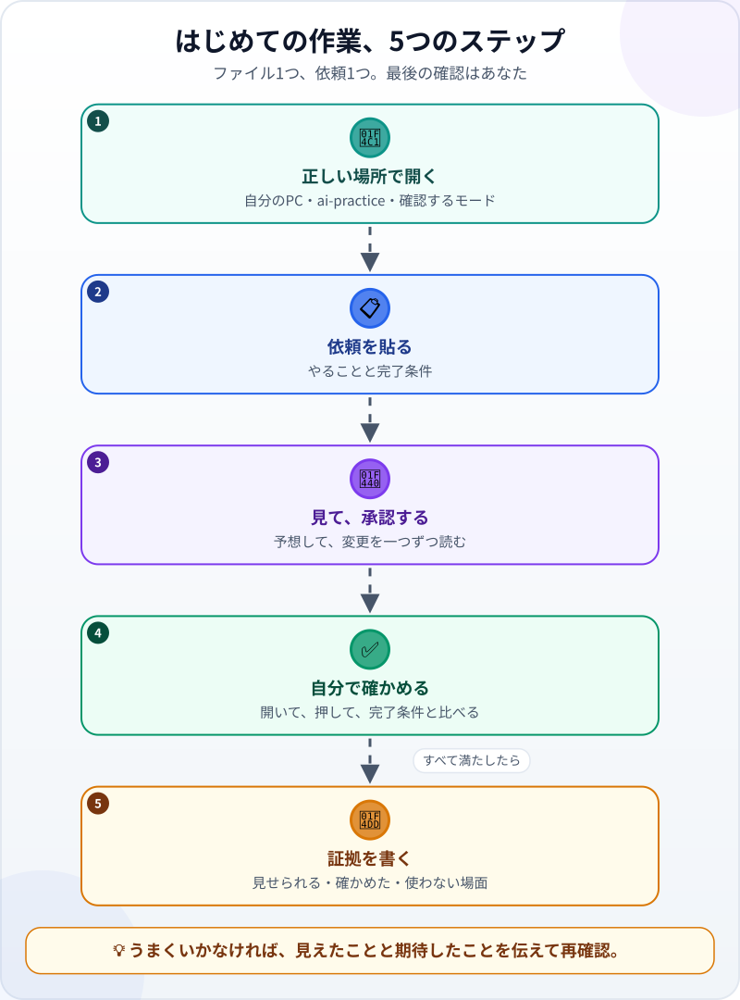
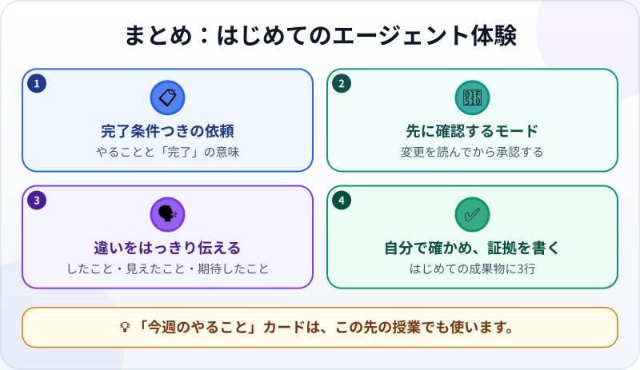

🌐 [Tiếng Việt](../../vi/lessons/first-agent-session.md) · [English](../../en/lessons/first-agent-session.md) · **日本語**

# はじめてのエージェント体験：1ファイルのタスクカードを作る

<!-- section: objective -->
## この授業のゴール

この授業を終えると、次のことができるようになります。

- エージェントとの作業を最後までやり通せる：正しい場所で開き、完了条件つきで依頼し、変更を承認し、自分で確かめる。
- 何が違うのかを、はっきり伝えられる：何をして、何が見えて、何を期待したか。
- はじめての成果物について、3行の証拠を書ける。

<!-- section: hook -->
## なぜ大事なの？

あなたはもう、[エージェントの仕事ぶりを見て](watch-an-agent-build.md)、[練習環境を選び](choose-your-learning-setup.md)、[安全な作業と確認が必要な作業](data-safety-and-permissions.md)を学びました。今度はあなたがハンドルを握る番です。

今日作るものは小さなものです。HTMLファイル1つ、チェックボックスつきの「今週のやること」カード。それでも、エージェントとの本物の作業のステップをすべて通ります。このカードは、この先の授業でも使います。

<!-- section: concept -->
## 本題

### はじめての作業、5つのステップ



1. **正しい場所で開く：** 自分のPCでエージェントを動かし、`ai-practice` フォルダを選び、変更のたびに**先に確認する**モードを選ぶ。
2. **依頼を貼る：** やることと「何をもって完了か」。そのまま使える依頼文を「やってみよう」に用意しました。
3. **見て、承認する：** 次の一手を予想する。エージェントが提案する変更を一つずつ読んでから承認する。
4. **自分で確かめる：** ブラウザーでファイルを開き、押してみて、完了条件と一つずつ比べる。
5. **証拠を書く：** 3行。見せられるもの、確かめたこと、使わないほうがいい場面。

### うまくいかないとき：見えたことと期待したことを伝える

「動きません」は、エージェントにとっていちばん扱いにくい言葉です。**何をして、何が見えて、何を期待したか**を伝えましょう。たとえば：

> *「2番目のやることのボックスを押しましたが、文字に取り消し線がつきません。期待：押すと取り消し線がつき、もう一度押すと消える。」*

こう伝えれば、エージェントは報告の前に自分で試せる、はっきりしたチェックを手に入れます。

<!-- section: try-it -->
## やってみよう

約25分。架空のデータだけを使います。

**1. 準備（3分）** ――選んだルートで：

- 💻 **個人のPC：** `ai-practice` フォルダでエージェントのアプリを開きます。たとえば Claude アプリなら（2026年9月時点）：**Code** タブ → **Local** を選ぶ → **Select folder** → `ai-practice` を選ぶ → 権限モードの選択で **Manual** を選ぶ。エージェントは変更を一つずつ提案し、あなたの承認を待ちます。
- ☁️ **ブラウザ：** `ai-practice` リポジトリでクラウドのセッションを始めます。
- 👀 **見るだけ：** この項目の最後にある*作業ログの例*を読み、ステップ3〜5を紙の上でやってみましょう。

**2. 依頼を貼る（2分）：**

```text
このフォルダに my-week.html というファイルを1つだけ作ってください。「今週のやること」カードです。

要件：
- タイトル「今週のやること」と、架空のやることを5つ。それぞれにチェックボックスをつける。
- ボックスを押すと、そのやることの文字に取り消し線がつく。もう一度押すと消える。
- ブラウザーで開ける。インターネット不要。外部のライブラリは使わない。

完了条件：
1. ブラウザーで my-week.html を開くと、タイトルと5つのやることが表示される。
2. それぞれのやることで、チェックとチェックの解除が正しく動く。
3. ウィンドウをスマホの幅まで狭めても、文字が読める。

始める前に、目標と完了条件をあなたの言葉で言い直してください。
終わったら、何を確かめて、何を確かめていないかを報告してください。
```

**3. 見て、承認する（10分）：**

- エージェントの言い直しは、あなたの意図と合っていますか？ 違っていたら今すぐ直しましょう。いちばん安上がりなタイミングです。
- 各ステップの前に、エージェントが何をするか予想しましょう。
- 提案された変更は、ファイル名を確かめてから承認します。`ai-practice` の中の `my-week.html` ですか？ エージェントが ✋ の作業（インストール、削除、フォルダの外）を求めてきたら、理由を聞きましょう。この課題にはどれも必要ありません。

**4. 自分で確かめる（5分）：** `ai-practice` フォルダを開き、`my-week.html` をダブルクリックします。完了条件と一つずつ比べましょう。タイトルと5つのやることはある？ **それぞれ**のチェックと解除は動く？ 狭いウィンドウでも読める？ 満たしていなければ、見えたことと期待したことを伝えて、もう一度確かめます。

**5. 証拠を書く（3分）：**

- *見せられるもの…* ブラウザーで開いた `my-week.html`。5つのやることにチェックをつけられる。
- *確かめたこと…* 3つの完了条件すべて。やることを一つずつ、狭いウィンドウでも。
- *使わないほうがいい場面…* たとえば、ページを再読み込みしてもチェックを残したいとき。このカードはまだそれができません。

もっとやってみたい人は、再読み込みしてもチェックが残るように、もう一度依頼してみましょう。完了条件は自分で考えてください。

<details>
<summary>作業ログの例（見るだけルート用）</summary>

1. エージェントが言い直す：`my-week.html` を1つ作る、チェックボックスつきのやることが5つ、完了条件は3つ。
2. フォルダを見る：あるのは `README.txt` だけ。
3. `my-week.html` の作成を提案。あなたはファイル名を読んで承認する。
4. ページを開いて試す：ボックスを押すと取り消し線がつき、もう一度押すと消える。狭いウィンドウでも文字が読める。
5. 報告：*「`my-week.html` を作成しました。確かめたこと：3つの完了条件。確かめていないこと：実際のスマホでの表示。ページを再読み込みするとチェックは消えます。」*

**あなたへの質問：** この報告を信じる前に、自分で何を確かめますか？

</details>

<!-- section: misconceptions -->
## よくある誤解

- **「依頼は短いほどいい。エージェントが察してくれる」** — 完了条件のない短い依頼では、エージェントは推測するしかありません。推測が外れれば、直す時間がかかります。
- **「コードを全部理解しないと、確かめられない」** — まだその必要はありません。今日は動きで確かめます。開いて、押して、完了条件と比べる。コードの変更を一つずつ読むのは、この先で学ぶスキルです。
- **「最初に間違えたのは、自分の依頼が悪かったから」** — 1〜2回やり直すのはふつうのことです。大事なのは、毎回、見えたことと期待したことをはっきり伝えることです。

<!-- section: recap -->
## 1枚でわかるこのレッスン



<!-- section: takeaways -->
## まとめ

- 作業の流れ：正しい場所で開く → 完了条件つきの依頼を貼る → 見て承認する → 自分で確かめる → 証拠を書く。
- 学んでいる間は、エージェントが先に確認するモードを選び、変更を読んでから承認する。
- うまくいかないときは、したこと・見えたこと・期待したことを伝える。
- 成功とは、エージェントが「完了」と言うことではなく、**あなた**が結果を確かめられること。

<!-- section: quiz -->
## 確認クイズ

**問1.** はじめての作業に、いちばん合う権限モードは？

- A) 速さ優先の、完全に自動のモード
- B) エージェントが変更を一つずつ提案し、あなたの承認を待つモード
- C) どのモードでも同じ

**問2.** エージェントがいちばん早くバグを直せる伝え方は？

- A) 「動きません」
- B) 「最初からやり直して」
- C) 「2番目のボックスを押しても取り消し線がつきません。取り消し線がつくのを期待していました」

**問3.** エージェントが「完了しました」と言いました。次にすることは？

- A) ファイルを開いて完了条件を一つずつ試し、証拠を書く
- B) 報告を信じて次の作業に移る
- C) フォルダを整理するためにファイルを消す

<details>
<summary>答えを見る</summary>

1. **B** — 学んでいる間は、変更を読んでから承認することが、そのまま学びになります。
2. **C** — したこと・見えたこと・期待したことを伝えると、エージェントは具体的なチェックを手にします。
3. **A** — エージェントの報告は確認の出発点。最後の確認はあなたの仕事です。

</details>

<!-- section: sources -->
## 参考資料

- Anthropic — [Get started with the desktop app](https://code.claude.com/docs/en/desktop-quickstart)（英語）：アプリのインストール、*Code* タブ、*Local* とフォルダの選び方。*Manual* モードでは、エージェントが変更を一つずつ提案し、あなたの承認か却下を待ちます。
- Anthropic — [Best practices for Claude Code](https://code.claude.com/docs/en/best-practices)（英語）：依頼には具体的な背景を書き、エージェントが自分の仕事を確かめる手段を用意する。
