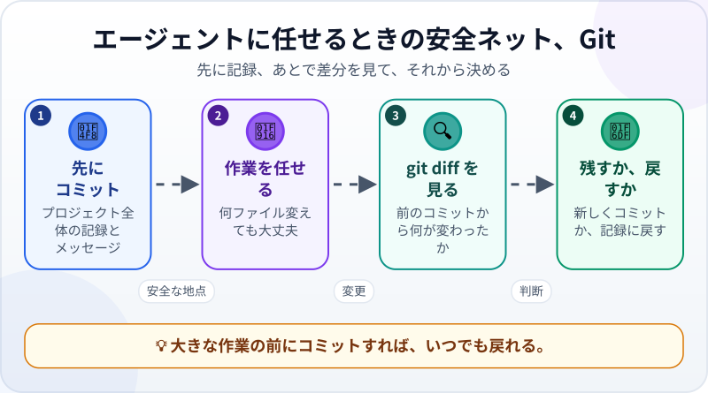
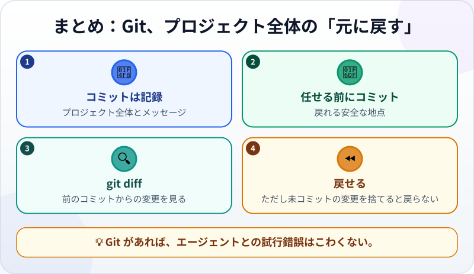

🌐 [Tiếng Việt](../../vi/lessons/git-version-control.md) · [English](../../en/lessons/git-version-control.md) · **日本語**

# Git：プロジェクト全体の「元に戻す」ボタン

<!-- section: objective -->
## この授業のゴール

この授業を終えると、次のことができるようになります。

- **Git** と**コミット**を説明できる：プロジェクト全体の記録と、そのメッセージ。
- エージェントに任せる前にコミットし、**git diff** を見て、変更を残すか戻すかを決められる。
- 注意が必要な Git の操作がわかる：コミットしていない変更を捨てると、元に戻らない。

<!-- section: hook -->
## なぜ大事なの？

エージェントは速く、たくさん変えます。1つの依頼で、いくつものファイルが同時に変わることもあります。エディターの「元に戻す」はファイルごとで、アプリを閉じると消えてしまいます。

Git は違います。ある時点の**プロジェクト全体**を記録し、いつでもそこに戻れます。[自分のWebページ](project-personal-page.md)で、あなたは残す価値のあるものを作りました。この授業からは、`ai-practice` のすべてに「戻り道」ができます。

<!-- section: concept -->
## 本題

### コミット：プロジェクト全体の記録

**コミット**は、ある時点のフォルダ内のすべてのファイルの状態を、説明の一文とともに保存します。たとえば*「週のカードに『机を片付ける』を追加」*。コミットの連なりがプロジェクトの歴史です。見返せて、比べられて、戻れます。Git はあなたのPCの上で動き、インターネットは不要です。

### 仕事を任せるときの安全ネット



1. **先にコミット：** 大きな作業の前に記録を残す。それが安全な地点。
2. **エージェントが作業：** 何ファイル変えても大丈夫。
3. **`git diff` を見る：** 前のコミットから何が変わったか。これまで読んできた差分と同じです。
4. **残すか、戻すか：** 満足ならコミット。そうでなければ記録に戻す。

### コマンドは覚えなくていい

Git のコマンドはエージェントが打ってくれます。`git init`（フォルダを Git のリポジトリにする）、`git commit`（記録する）、`git log`（履歴を見る）、`git diff`（差分を見る）、`git restore`（ファイルをコミットした状態に戻す）。あなたの仕事は、それぞれが**いつ**必要かを知り、許可の前によく読むことです。

### 注意が必要なこと

- **コミットしていない変更を捨てると、元に戻らない。** `git restore` はファイルをコミットした状態に戻します。そのあと変更してコミットしていない部分は、完全に消えます。残したいものは先にコミット。✋要確認の作業です。
- **Git のインストールは ✋要確認。** Windows では、Claude Code のガイド（2026年9月時点）が Git for Windows のインストールを勧めています。入っていない場合、Claude Code はかわりに PowerShell を使います。

<!-- section: example -->
## 具体例

トゥアンさんは、週のカードを*「チェックを覚える週のカード」*というメッセージでコミットしていました。そのあと、エージェントに*「カードをもっとおしゃれにして」*と頼みます。あいまいな依頼です。エージェントは色もレイアウトも変え、そして……チェックを覚える機能が動かなくなりました。

トゥアンさんは `git diff` を見ます。変更は80行以上、保存の仕組みまで書き換えられていました。戻すことに決めると、エージェントはコミットしていない変更が消えることを伝えて確認し、トゥアンさんが了承すると、カードは数秒でコミットしたとおりの状態に戻りました。今度は、はっきりした指示書を書きます：*「背景色とフォントだけを変える。保存の仕組みには触らない。」*

<!-- section: try-it -->
## やってみよう

約15分。`ai-practice` の中で、エージェントが先に確認するモードで行います。

**1. Git があるか確かめる（2分）：**

```text
Git が入っているか確かめてください（git --version）。入っていなければ、インストール方法を教えてください。自分ではインストールしないでください。
```

**2. 最初のコミット（3分）：**

```text
このフォルダを Git のリポジトリにして、今あるすべてのファイルで最初のコミットを作ってください。
メッセージは「最初の版：週のカードと自分のページ」。git log を見せてください。
```

**3. エージェントに何かを変えてもらう（3分）：** *「my-week.html の背景を薄い青にして。」* まだコミットしません。

**4. 差分を見る（2分）：** *「git diff を見せて。」* 読んでみましょう。変わったのは1か所だけ？

**5. 戻す（3分）：** 新しい色が気に入らなかったとします：*「my-week.html の今の変更を捨てて、コミットした状態に戻して。」* エージェントは、変更が消えることを伝えて確認するはずです。ファイルを開いて、元どおりか確かめましょう。

**6. 変更を残す（2分）：** 残したいやることをカードに追加してもらい、わかりやすいメッセージでコミットします。`git log` にはコミットが2つあるはずです。

証拠を書きましょう：

- *見せられるもの…* コミットが2つある `git log` と、ステップ5で元どおりに戻ったファイル。
- *確かめたこと…* 残すか捨てるかを決める前に `git diff` を見た。
- *使わないほうがいい場面…* たとえば、残したいものをまだコミットしていないとき。そのときは先にコミットしてから戻します。

**チャレンジ（任意）：** 自分のページをネットに公開したいなら、Git のリポジトリを GitHub などのサービスに送り、そのWebページ公開機能を使う方法があります。エージェントに手順ごとの計画を作ってもらい、じっくり読みましょう。これは ✋ 外部への送信で、ページは誰でも見られるようになります。

<!-- section: misconceptions -->
## よくある誤解

- **「Git と GitHub は同じもの」** ―― Git はあなたのPCで動きます。GitHub は Git のリポジトリをネット上に置くWebサイトです。GitHub がなくても Git は使えます。
- **「エディターの『元に戻す』で十分」** ―― 「元に戻す」はファイルごとで、アプリを閉じると消えます。コミットはプロジェクト全体を記録し、残り続けます。
- **「コミットは少ないほどすっきり」** ―― 小さく、こまめに、わかりやすいメッセージでコミットすれば、必要なところにぴったり戻れます。

<!-- section: recap -->
## 1枚でわかるこのレッスン



<!-- section: takeaways -->
## まとめ

- コミット ＝ プロジェクト全体の記録と、一文のメッセージ。
- 大きな作業の前にコミット。`git diff` を見て、満足ならコミット、そうでなければ戻す。
- コミットしていない変更を捨てると元に戻らない。注意が必要な ✋ の作業。
- Git のコマンドはエージェントが打つ。いつ使うかを決め、許可の前によく読むのはあなた。

<!-- section: quiz -->
## 確認クイズ

**問1.** コミットとは？

- A) ネット上への自動バックアップ
- B) ある時点のプロジェクト全体の記録と、そのメッセージ
- C) 古いファイルを消すコマンド

**問2.** コミットすべきなのはいつ？

- A) プロジェクトが完全に終わったときだけ
- B) 月に1回
- C) エージェントに大きな作業を任せる前と、残したい変更をしたあと

**問3.** `git restore my-week.html` は、そのファイルのコミットしていない変更をどうする？

- A) 捨てて、ファイルをコミットした状態に戻す。その変更は完全に消える
- B) 新しいコミットとして保存する
- C) GitHub に送る

<details>
<summary>答えを見る</summary>

1. **B** ―― コミットはプロジェクト全体の記録で、あなたのPCに残ります。勝手にネットには上がりません。
2. **C** ―― 前にコミットして安全な地点を作り、あとにコミットして気に入ったものを残します。
3. **A** ―― だからこそ ✋要確認の作業。残したいものは先にコミットしましょう。

</details>

<!-- section: sources -->
## 参考資料

- Anthropic — [Best practices for Claude Code](https://code.claude.com/docs/en/best-practices)（英語）：おすすめのワークフローは、わかりやすいメッセージでエージェントにコミットしてもらうところで終わります。
- Anthropic — [Advanced setup](https://code.claude.com/docs/en/setup)（英語）：Windows では、Claude Code が Bash ツールを使えるよう Git for Windows のインストールが勧められています。ない場合は PowerShell が使われます。
