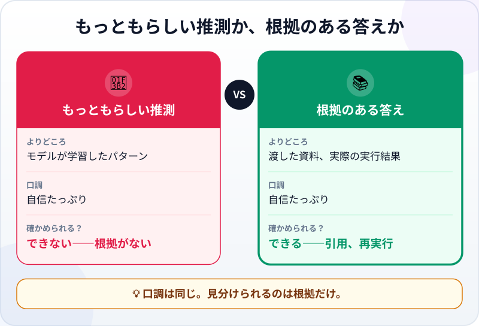
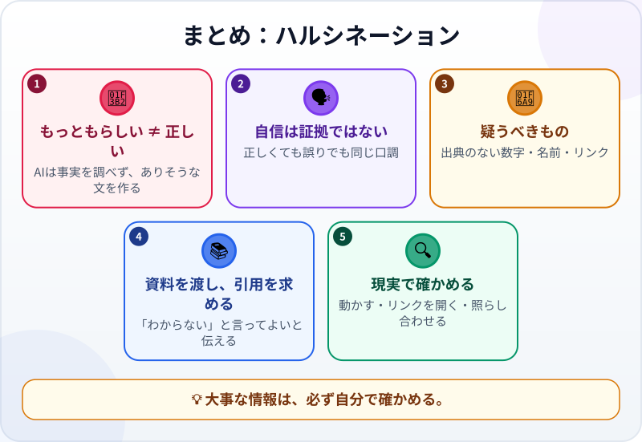

🌐 [Tiếng Việt](../../vi/lessons/hallucination.md) · [English](../../en/lessons/hallucination.md) · **日本語**

# ハルシネーション：AIが自信満々に間違える理由

<!-- section: objective -->
## この授業のゴール

この授業を終えると、次のことができるようになります。

- **ハルシネーション**とは何か、なぜ起きるのかを説明できる。
- 疑うべきサインに気づける：出典のない数字・名前・リンク。
- 減らし、見抜く方法を使える：資料を渡す、引用を求める、「わからない」を許す、現実で確かめる。

<!-- section: hook -->
## なぜ大事なの？

[自分のWebページのプロジェクト](project-personal-page.md)では、「自分についての内容は自分で書く」というルールを決めました。エージェントは、もっともらしいことを自信たっぷりに作ってしまうことがあるからです。この授業では、その理由を説明します。

いちばん進んだ言語モデルでさえ、ときには事実と違う情報や、渡した資料と合わない情報を作ってしまいます。Claude を作っている Anthropic 自身が、ガイドでそう書いています。いつ疑うべきかを知ることは、監督のためのいちばん大切なスキルです。

<!-- section: concept -->
## 本題

### なぜAIは自信満々に間違える？

言語モデルは、学習したパターンをもとに、**いちばんもっともらしい**答えを書きます。ツールや資料がない限り、事実を調べてはいません。もっともらしいことは、正しいこととは違います。しかも、答えが正しくても間違っていても、文章は同じようにすらすらと、自信に満ちています。

### 疑うべきサイン

- 出典のない、**とても具体的な数字**（「社員の74％が…」）。
- 見たことのない**固有名詞、関数名、ライブラリ名**。
- 本物らしく聞こえる**リンクや引用**。開いてみるまで、存在するかはわかりません。
- あなたが渡していない、**あなたや会社についての情報**。

### ハルシネーションを減らし、見抜く

Anthropic のガイドは、次のような方法を勧めています：

- **「わからない」と言ってよいと伝える：** 依頼に*「確信がなければ『わからない』と答えてください」*と書く。
- **資料を渡し、それだけを使わせる：** *「このファイルだけをもとにして、一般的な知識は使わないでください。」*
- **そのままの引用を求める：** 各ポイントに資料からの引用をつけさせ、引用が見つからないポイントは削除させる。
- **何度か聞いて比べる：** 同じ質問を何回かして、答えが食い違えば要注意。

エージェントなら、さらに強力な方法があります。**現実で確かめる**ことです。作り話の関数は動かせばすぐに壊れ、作り話のリンクは開けません。だからこそ、動かす、エラーを読む、チェックを書く、を学んできたのです。ただし、どの方法も減らすだけで、なくすことはできません。大事な情報は、必ず自分で確かめましょう。

<!-- section: analogy -->
## 身近なたとえ

「わかりません」と決して言わない、頭の回転の速い新しい同僚を想像してください。何を聞いてもすぐ、すらすらと答えてくれます。たいていは正しいけれど、ときどきその場で作った話が混ざる。そのうち、あなたは聞き返すようになります。*「その情報、どこで知ったの？」*

このたとえの弱点：その同僚は自分が推測していると知っています。言語モデルは、推測と知っていることを区別できません。

<!-- section: example -->
## 具体例

ハナさんは、ヒントのページに一文を足すようエージェントに頼みました：*「日本の会社員は1日に何回メールをチェックする？」* エージェントの答え：*「平均で1日74回（2023年の調査による）。」*

本物らしく聞こえます。でも出典がありません。ハナさんは聞き返します：*「どの調査？ リンクをください。」* エージェントは、確かめられる出典を1つも出せませんでした。ハナさんはその数字を消し、数字のいらないヒントに書き換えます：*「メールの返信は1日2回、決まった時間に。」* これからのルール：**確かめられる出典のない数字は、ページに載せない。**

<!-- section: misconceptions -->
## よくある誤解

- **「AIが言い切るなら正しい」** ―― 正しいときも間違っているときも、口調は同じように自信たっぷりです。自信は証拠ではありません。
- **「リンクがあれば出典がある」** ―― リンクも作り話の場合があります。開いて、本当にそう書いてあるかを読みましょう。
- **「新しいモデルならハルシネーションはなくなる」** ―― Anthropic 自身によれば、これらの方法で大きく減らせても、なくすことはできません。大事な情報は確かめる必要があります。

<!-- section: recap -->
## 1枚でわかるこのレッスン

<!-- section: takeaways -->
## まとめ

- ハルシネーション：AIが、もっともらしい文を作るせいで、間違いや作り話を本当のことのように言うこと。
- 自信は証拠ではない。正誤を見分けられるのは根拠だけ。
- 出典のない数字・名前・リンクを疑う。資料を渡し、引用を求め、「わからない」を許す。
- 現実で確かめる（動かす・リンクを開く・照らし合わせる）。大事な情報ならなおさら。

<!-- section: quiz -->
## 確認クイズ

**問1.** AIが間違っているのに、とても自信があるように聞こえるのはなぜ？

- A) あなたをだまそうとしているから
- B) インターネットが遅いから
- C) いちばんもっともらしい文を作るから。もっともらしいことは、正しいとは限らない

**問2.** いちばん疑わしいサインは？

- A) 出典のない、とても具体的な数字
- B) 短い答え
- C) 箇条書きの答え

**問3.** 会社の（架空の）資料についてAIに質問します。ハルシネーションをいちばん減らせるのは？

- A) たくさんの質問を次々にする
- B) 資料を渡し、それだけを使い、そのまま引用するよう頼む
- C) 「間違えないでね」と伝える

答えを見る

1. **C** ―― AIはわざとうそをつくわけではありません。もっともらしい文を作り、口調はいつも自信たっぷりです。
2. **A** ―― 出典のない具体的な数字は、ハルシネーションがいちばん出やすい場所です。
3. **B** ―― 資料とそのままの引用があれば、一つひとつのポイントを確かめられます。

<!-- section: sources -->
## 参考資料

- Anthropic — [Reduce hallucinations](https://platform.claude.com/docs/en/test-and-evaluate/strengthen-guardrails/reduce-hallucinations)（英語）：いちばん進んだモデルでも、ときには事実と違う情報を作る。「わからない」を許す、そのままの引用を使う、引用で検証する、渡した資料だけを使わせる。これらは減らすことはできても、なくすことはできない。
- Anthropic — [Building Effective AI Agents](https://www.anthropic.com/engineering/building-effective-agents)（英語、2024年12月）：エージェントは各ステップで、ツールの結果やコードの実行結果など、環境から「実際の結果」を得る必要がある。
