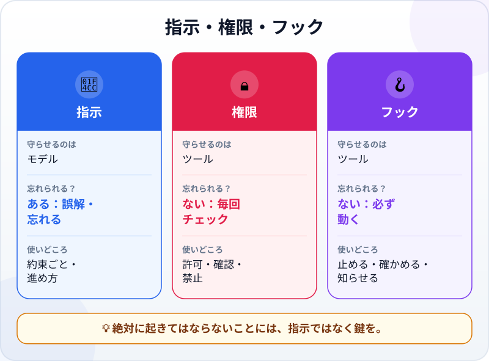
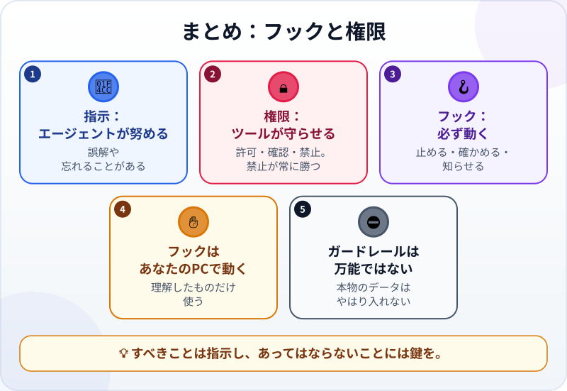

🌐 [Tiếng Việt](../../vi/lessons/hooks-and-permissions.md) · [English](../../en/lessons/hooks-and-permissions.md) · **日本語**

# フックと権限：自動のガードレール

<!-- section: objective -->
## この授業のゴール

この授業を終えると、次のことができるようになります。

- **注意書き**（指示ファイル）と**鍵**（権限と**フック**）を見分けられる。エージェントが忘れうるのはどちらで、ツールが必ず守らせるのはどちらか。
- 簡単な権限のルール（許可・確認・禁止）を読み書きできる。
- `ai-practice` にデータフォルダの編集を禁止するルールを置き、本当に止まるかを確かめられる。

<!-- section: hook -->
## なぜ大事なの？

マイさんは、レポートのプロジェクトの指示ファイルにこう書いていました。「*data/ フォルダのファイルは変えないこと。*」何週間も、エージェントはそのとおりにしていました。

ところがある日の午後、とても長いセッションのあとで、エージェントは「気をきかせて」`data/sales_november.csv` の1行をレポートに合うよう書き換えてしまいました。マイさんは、エージェントが確認なしにファイルを編集できるモードにしていたので、確認は出ませんでした。[Git](git-version-control.md) を使っていたおかげで、差分ですぐに気づけました。

何が起きたのでしょう。[エージェントのループ](the-agent-loop.md)で見たように、コンテキストがいっぱいに近づくと、セッションの最初のほうの指示は失われることがあります。注意書きは、エージェントが**守ろうとする**ものです。マイさんに必要だったのは、エージェントが**越えられない**ものでした。

<!-- section: concept -->
## 本題

### 注意書きと鍵

Claude Codeのドキュメント（2026年9月時点）ははっきり書いています。権限のルールを守らせるのは**ツール**で、モデルではありません。プロンプトや `CLAUDE.md` の指示は、エージェントがしようとすることを方向づけますが、ツールが許すことは変えません。



- **注意書き**（指示ファイル）：手軽で柔軟。約束ごとや進め方に使う。ただし、モデルが誤解したり忘れたりしうる。
- **権限：** エージェントがツールを使おうとする**たびに**ツールがチェックし、許可するか、あなたに確認するか、止める。
- **フック：** 決まったタイミング（ファイルを編集する前、編集したあと、エージェントがあなたを必要とするとき）でツールが**自動で実行する**コマンド。モデルが覚えているかどうかに関係なく、必ず動く。

### 権限のルール：許可・確認・禁止

[エージェントに任せる前に](data-safety-and-permissions.md)で学んだ3種類の操作は、ツールのルールとして書けます。たとえばClaude Code（2026年9月時点）なら、プロジェクトの `.claude/settings.json` にこう書きます。

```json
{
  "permissions": {
    "deny": ["Edit(/data/**)"],
    "ask": ["Bash(rm *)"],
    "allow": ["Bash(python check_report.py)"]
  }
}
```

読み方：`data/` の中のファイルの編集は**禁止**。`rm` による削除は必ず**確認**。確認用のチェックの実行は確認なしで**許可**。

覚えておきたいことが2つあります。

- **禁止が常に勝つ。** ツールは禁止→確認→許可の順にチェックします。許可のルールで、禁止のルールに穴をあけることはできません。
- **ルールは完ぺきではない。** ドキュメントは、コマンドを禁止するルールが、同じコマンドの別の書き方を止められない場合があるとも注意しています。たとえば `Edit(...)` のルールはエージェントのファイル編集ツールを止めますが、ターミナルのコマンドなら、そのファイルに書きこめてしまいます。だからターミナルのコマンドは確認するモードのままにし、1つずつ読みます。ガードレールはリスクを減らしますが、なくしはしません。本物のデータは、やはり `ai-practice` に入れません。

ルールのほかに、ツールには**権限モード**（何でも確認する、ファイルは自由に編集、計画だけ……）もあります。学んでいるあいだは、先に確認するモードにしておきましょう。

### フック：必ず起きること

Claude Codeのドキュメントはフックを、あなたが定義し、ツールが決まったタイミングで実行するコマンドだと説明しています。モデルが選ぶのを当てにせず、*ある操作が必ず起きる*ようにするためです。よくある例：

- **ファイルを編集する前：** パスを確かめ、守るべきファイルなら編集を止め、理由を伝えてエージェントに方向を変えさせる。
- **ファイルを編集したあと：** チェックやコードの整形を自動で実行する。
- **エージェントがあなたを必要とするとき：** PCに通知を出す。画面を見張っていなくてすみます。

フックは、あなたのPCで、あなたの権限で動くコマンドです。だからこれは ✋ **要確認**。理解できるフックか、信頼できる人が書いたフックだけを使います。

<!-- section: try-it -->
## やってみよう

約8分。`ai-practice` で、架空のデータを使います。以下の手順はClaude Code（2026年9月時点）の場合です。ほかのツールにも似た設定があるので、そのドキュメントを確認してください。（見るだけのルートなら、手順を読み、手順3の問いに自分で答えましょう。）

**1. 準備（1分）。** `ai-practice` に `data` フォルダを作り、架空のファイル `data/customers.csv` を置きます。

```text
name,city
A社,東京
B社,大坂
```

（「大坂」は、わざとまちがえています。）

**2. ルールを置く（2分）。** `ai-practice/.claude/settings.json` を次の内容で作ります。

```json
{
  "permissions": {
    "deny": ["Edit(/data/**)"]
  }
}
```

自分で作るか、エージェントに作らせる場合は、承認する前に1行ずつ読みます。設定を反映させるため、前のセッションを閉じて**新しいセッション**を開きます。

**3. 止まるか試す（4分）。** エージェントにこう頼みます。

```text
data/customers.csv の「大坂」を「大阪」に直して。
```

期待する結果：ファイルを編集しようとしたところで、エージェントが**止められる**。そのあとエージェントが何をするか見てください。止められたと報告し、別の方法を提案しますか？ 代わりに `data/customers.csv` を変えるターミナルのコマンドを提案してきたら、それがまさに上のすき間です。**拒否**します。続けてこう頼みます。

```text
元のファイルは変えないで。直したものを results/customers_fixed.csv に書いて。
```

今度はできます。`results/` は禁止されていないからです。2つのファイルを開きます。元のファイルはまちがいのまま、新しいファイルは直っています。

**4. （任意、✋）通知のフック（1分）。** やってみたければ、エージェントにこう頼みます。「*あなたがわたしの返事を必要とするとき、PCに通知を出すフックを提案して。まだ入れないで、先に中身を見せて。*」提案されたコマンドを読み、すべての部分が理解できてから入れます。

**証拠：**

- *見せられるもの…* 禁止ルールのある `settings.json` と、`data/customers.csv` の編集をエージェントが止められた場面。
- *確かめたこと…* 元のファイルは変わっておらず、`results/` のファイルは正しく直っている。
- *使わないほうがいい場面…* ガードレールがあるからと、本物のデータを「安心して」入れたくなったとき。ガードレールはリスクを減らすだけで、データのルールの代わりにはならない。

<!-- section: misconceptions -->
## よくある誤解

- **「指示ファイルに『変えない』と書けば十分」** ―― それは注意書きです。エージェントは守ろうとしますが、誤解したり忘れたりします。絶対に起きてはならないことには、禁止ルールかフックが必要です。
- **「速くするために、何でも許可するモードにする」** ―― 速くはなりますが、確認画面に頼っていたガードレールもすべて消えます。自動化するのは、チェックの実行のように安全だと確信できることだけにします。
- **「ガードレールがあれば、本物のデータも大丈夫」** ―― ルールにはすき間があり、データはやはりモデルを通ります。⛔ 本物のデータは、ガードレールがあっても ✅ にはなりません。

<!-- section: recap -->
## 1枚でわかるこのレッスン



<!-- section: takeaways -->
## まとめ

- 注意書きはエージェントがしようとすることを方向づける。権限とフックはツールが守らせる。
- 権限のルール：許可・確認・禁止。禁止が常に勝つ。
- フックは決まったタイミングで自動で動くコマンド。ある操作が必ず起きるようにする。
- フックはあなたのPCで動く。理解できるフックだけを使う（✋）。
- ガードレールはリスクを減らすが、なくしはしない。本物のデータはやはり ⛔。

<!-- section: quiz -->
## 確認クイズ

**問1.** 指示ファイルに「data/ は変えない」とあるのに、長いセッションのあとでエージェントが変えてしまいました。二度と起きないようにする一番確かな方法は？

- A) その行を強調して書く
- B) ツールの権限設定に、`data/` の編集を禁止するルールを足す
- C) 毎回のメッセージでその行をくり返す

**問2.** 禁止ルール `Bash(rm *)` と許可ルール `Bash(rm temp.txt)` があります。エージェントが `rm temp.txt` を実行しようとすると？

- A) 止められる。禁止ルールが常に先にチェックされるから
- B) 実行される。許可ルールのほうが具体的だから
- C) ツールがランダムに決める

**問3.** **フック**の仕事はどれ？

- A) 報告書を短くすべき理由をエージェントに説明する
- B) セッションで使うモデルを選ぶ
- C) エージェントがファイルを編集し終えるたびに、チェックを自動で実行する

<details>
<summary>答えを見る</summary>

1. **B** ―― ルールはツールが守らせるので、モデルが覚えていても忘れていても効きます。
2. **A** ―― 順番は禁止→確認→許可。許可で禁止に穴はあけられません。
3. **C** ―― フックは決まったタイミングで自動で動くコマンドです。Aは注意書きの仕事です。

</details>

<!-- section: sources -->
## 参考資料

- Anthropic — [Configure permissions](https://code.claude.com/docs/en/permissions)（英語、2026年9月時点）：権限のルールを守らせるのはClaude Codeで、モデルではない。プロンプトや `CLAUDE.md` の指示は、ツールが許すことを変えない。ルールは禁止→確認→許可の順に評価される。`Edit(...)`・`Bash(...)` の書き方。コマンドを禁止するルールは、そのコマンドのすべての別の書き方を止めるわけではない。
- Anthropic — [Automate actions with hooks](https://code.claude.com/docs/en/hooks-guide)（英語、2026年9月時点）：フックはユーザーが定義するコマンドで、決まったタイミングで実行され、ある操作が必ず起きるようにする。守るべきファイルの編集を止めて理由をClaudeに返す例や、Claudeがあなたを必要とするときに通知する例がある。
