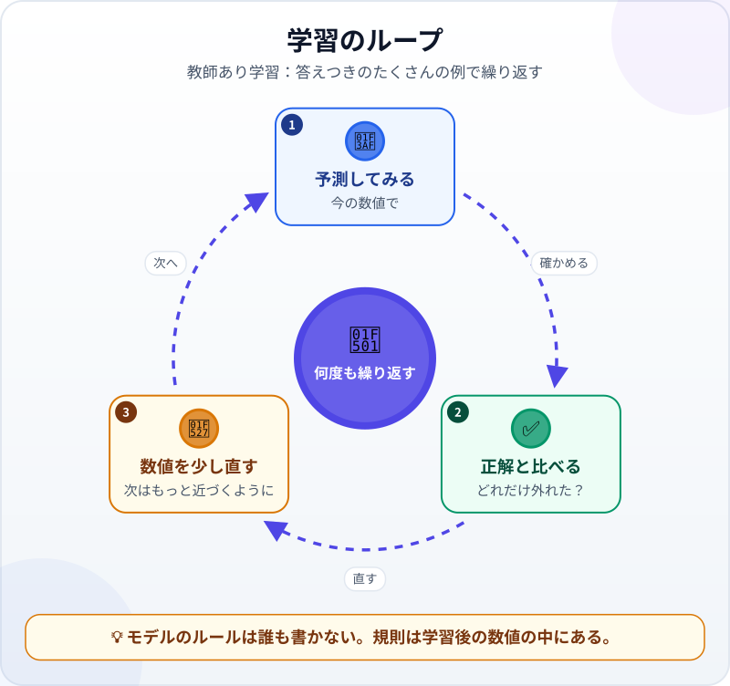
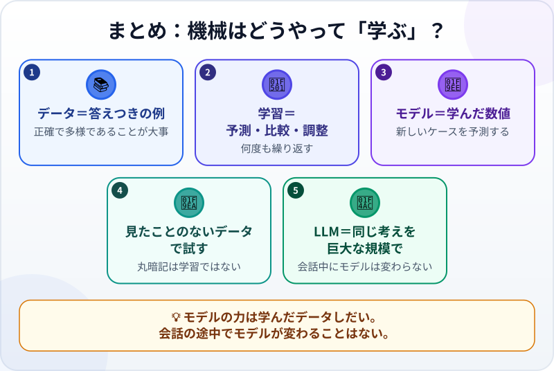

🌐 [Tiếng Việt](../../vi/lessons/how-machines-learn.md) · [English](../../en/lessons/how-machines-learn.md) · **日本語**

# 機械はどうやって「学ぶ」？データ・学習・モデル

<!-- section: objective -->
## この授業のゴール

この授業を終えると、次のことができるようになります。

- **データ・学習・モデル**の3つを、自分の例で説明できる。
- 学習のループ（予測してみる、正解と比べる、直す、の繰り返し）を説明できる。
- 質の悪いデータから質の悪いモデルができる理由と、会話中にモデルが新しく学ばない理由がわかる。

<!-- section: hook -->
## なぜ大事なの？

マイさんは毎月、何百件もの経費を「交通費・飲食費・文房具・その他」の4つに仕分けています。機械に任せようとルールを書いてみました。*「タクシー」とあれば交通費*。数十個書いたところで行き詰まります。「Grab」は配車なのか、フードデリバリーなのか。「お客さまとのコーヒー」は飲食費か、その他か。

同僚が言います。「去年マイさんが仕分けた経費から、機械に自分で学ばせたら？」 機械が自分で学ぶ。魔法のように聞こえますが、実はとても単純なループです。

<!-- section: concept -->
## 本題

### 3つのもの：データ・学習・モデル

- **学習データ**：答えつきの例です。マイさんの場合、例の1つ1つは、経費の説明1行と、マイさんが選んだ分類です。機械にりんごを見分けさせたいなら、「りんご」と書かれた写真をたくさん見せます。
- **モデル**：入力（経費の説明）を出力（分類）に変える、とてもたくさんの数値の集まりです。最初の数値はほぼでたらめなので、予測もでたらめです。
- **学習（トレーニング）**：モデルがほとんどの例を正しく予測できるまで、その数値を直していく作業です。

### 学習のループ

1. **予測してみる**：今の数値で、1つの例の分類を予測する。
2. **正解と比べる**：合っていたか、どれだけ外れたか。
3. **数値を少し直す**：次の予測がもっと近づくように、少しだけ調整する。

これを大量の例で、何周も繰り返します。*「Grabは交通費」*というルールは誰も書いていません。規則は、学習を終えたあとの数値の中にあるのです。

### 見たことのないデータで試す

モデルは古い例を「丸暗記」して、新しい例は外すことがあります。だからデータの一部を学習に使わずに取っておき、テストだけに使います。問題が事前に漏れていない試験のようなものです。

### LLMはどう学ぶ？

同じ考え方を、巨大な規模で行います。Anthropicによると、最初の段階（*事前学習*）では、言語モデルは膨大な文章で、前の文章から次の語を予測するように学習します。そのあと、*ファインチューニング*や、人の評価から学ぶ*RLHF*でさらに学習し、指示に従い、アシスタントとして会話できるようになります。LLMがAIの家族のどこにいるかは[1枚でわかるAIの系統図](ai-ml-dl.md)で見られます。

### 会話している間、モデルは学ばない

学習が終わると、数値は固定されます。あなたが会話している間、モデルは数値を1つも直しません。1回のセッションの中で「覚えている」ことは[コンテキストウィンドウ](context-window.md)にあり、新しいセッションを始めると消えます。製品に「メモリー」機能があっても、それは保存したメモをコンテキストに戻しているのであって、モデルが新しく学んだわけではありません。

<!-- section: analogy -->
## 身近なたとえ

新人が伝票の仕分けを覚えるとき、先輩がすでに仕分けた伝票を見て、自分で予想し、経理の先輩に直してもらいます。数週間もすれば、ほとんど正しく仕分けられるようになります。

たとえが合わないところ：新人は**なぜ**そうなるのか（「Grab Foodは食事の配達」）を理解し、変だと思えば質問します。モデルは数値を直すだけで、理由を説明できず、見たことのないものには自信満々に外すことがあります。

<!-- section: example -->
## 具体例

マイさんの会社が、架空のデータでこの方法を試したとします。

1. 去年の仕分け済みの経費300件を用意し、250件で学習させ、50件をテスト用に取っておく。
2. 学習後、モデルはテスト用50件のうち、交通費と飲食費はほとんど正しく予測した。
3. しかし「その他」はよく外した。マイさんがデータを見直すと、理由がわかった。去年の「その他」は例がとても少なく、人によって使い方がばらばらだったのです。

マイさんは2つのことを学びました。モデルを良くするには、モデルに「言い聞かせる」のではなく、**データを直す**こと。「その他」のはっきりした例を増やし、仕分け方をそろえる。そして去年の仕分けが間違っていれば、モデルはその間違いもそのまま学ぶ、ということ。ごみを入れれば、ごみが出てくるのです。

<!-- section: misconceptions -->
## よくある誤解

- **「モデルはデータを丸ごと保存して、調べ直している」**：保存しているのは数値の形の規則で、例を1つずつ検索する倉庫ではありません。
- **「データは多ければ多いほどよい。中身は何でもよい」**：多さが役に立つのは、データが正しく多様なときだけです。間違ったデータは、間違いを教えます。
- **「会話の中で間違いを直せば、次から覚えている」**：会話の間に数値は変わりません。覚えておくべきことはファイルに書き、コンテキストに戻しましょう。

<!-- section: recap -->
## 1枚でわかるこのレッスン

<!-- section: takeaways -->
## まとめ

- 学習データは答えつきの例、モデルは数値の集まり、学習はその数値を直すこと。
- 学習のループ：予測する、正解と比べる、少し直す。これを何度も何度も繰り返す。
- モデルは見たことのないデータで試す。丸暗記は学習ではない。
- LLMも同じ考え方を巨大な規模で学び、そのあとアシスタントとして仕上げられる。
- 会話中にモデルは学ばない。覚えておくべきことはファイルに書く。

<!-- section: quiz -->
## 確認クイズ

**問1.** 「モデル」とは、実際には何？

- A) 学習によって調整された、とてもたくさんの数値の集まり
- B) プログラマーが書いたルールの一覧
- C) 見た例をすべて保存して調べるための倉庫

**問2.** データの一部を学習に使わずに取っておくのはなぜ？

- A) メモリーを節約するため
- B) モデルに見せる例を増やすため
- C) 見たことのないケースでモデルを試すため

**問3.** 昨日、チャットボットの間違いを直しました。今日の新しい会話で、それを自分で覚えている？

- A) はい。直されたことから学んだから
- B) 期待しないほうがいい。会話中にモデルの数値は変わらないので、ファイルに書いてコンテキストに戻す
- C) はい。十分な回数直していれば

答えを見る

1. **A**：規則は数値の中にあります。誰もルールを書いておらず、例を調べる倉庫でもありません。
2. **C**：古い例で正しくても、それだけでは何も言えません。見たことのないもので試す必要があります。
3. **B**：学習は終わっています。会話で変わるのはコンテキストで、モデルではありません。

<!-- section: sources -->
## 参考資料

- Google Cloud — [What is Machine Learning?](https://cloud.google.com/learn/what-is-machine-learning)（英語）：教師あり学習はラベルつきのデータ（たとえば「りんご」と書かれた写真）を使う。学習とは、学習データをもとに正しく予測できるようモデルを最適化すること。データが多いほど役立つのは、質が高い場合。
- Anthropic — [Glossary](https://platform.claude.com/docs/en/about-claude/glossary)（英語）の *Pretraining*・*Fine-tuning*・*RLHF* の項：言語モデルはまず次の語を予測するよう学習し、そのあとファインチューニングと人のフィードバックによる学習で、指示に従うようになる。
