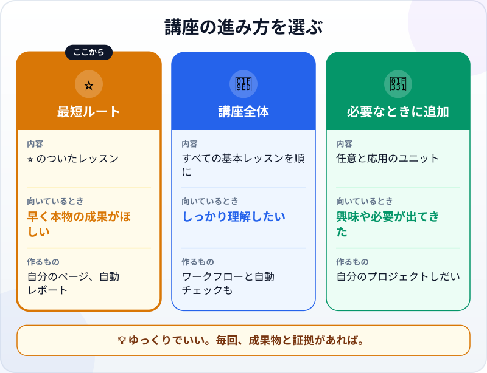
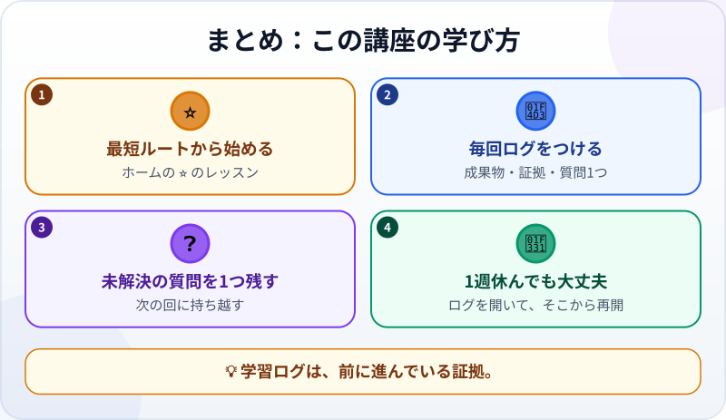

🌐 [Tiếng Việt](../../vi/lessons/how-to-learn-this-course.md) · [English](../../en/lessons/how-to-learn-this-course.md) · **日本語**

# 学ぶルートを選び、学習ログをつける

<!-- section: objective -->
## この授業のゴール

この授業を終えると、次のことができるようになります。

- 自分に合う講座の進み方を選べる：**最短ルート**、**講座全体**、**必要なときに追加**。
- **学習ログ**を始められる：毎回、成果物・証拠・未解決の質問を1つ書く。
- しばらく休んだあとでも、学びに戻れる。

<!-- section: hook -->
## なぜ大事なの？

あなたは最初の成果物、「今週のやること」カードを作りました。この先にはたくさんのレッスンがあり、毎日は忙しい。勉強できない週もあるでしょう。

長い講座をやり遂げる人は、鉄の意志ではなく、小さな習慣に頼っています。毎回、足あとを残すこと。何を作り、どう確かめ、何がまだ疑問か。次に開けば、自分がどこにいるかがすぐわかります。

<!-- section: concept -->
## 本題

### 講座の3つの進み方



- **⭐ 最短ルート：** [講座のホーム](../README.md)で ⭐ のついたレッスンを、順番どおりに。エージェントに本物の仕事を任せ、結果を確かめられるようになります。プロジェクトは2つ。
- **🧭 講座全体：** すべての基本レッスンを順番に。理解がより確かになり、ワークフローや自動チェックも身につきます。
- **🌱 必要なときに追加：** *任意*（AIのしくみ）や*応用*（より大きな規模でエージェントと働く）のユニット。興味が出たとき、プロジェクトで必要になったときに。

迷ったら、最短ルートから始めましょう。追加はいつでもできます。

### 学習ログ：毎回書く3つのこと

1. **成果物：** 何を作った？（ファイル名、スクリーンショット）
2. **証拠：** おなじみの3行。*見せられるもの… / 確かめたこと… / 使わないほうがいい場面…*
3. **未解決の質問を1つ：** まだわからないこと、次に試したいこと。

未解決の質問は、次の回のいちばんよい出発点です。

### 1週休んだ？ 大丈夫

この講座は、連続記録を数えません。1週間、あるいは1か月休んでも、ログを開き、最後の未解決の質問を読んで、そこから再開しましょう。

<!-- section: try-it -->
## やってみよう

約8分。

**1. 学び方を選ぶ（2分）。** [講座のホーム](../README.md)を開いて ⭐ のレッスンを見て、決めましょう。最短ルート、講座全体、それとも最短ルートのあとで考える。

**2. ログを作る（3分）。** `ai-practice` にファイルを作ってもらいます：

```text
learning-log.md というファイルを作ってください。タイトルは「エージェント型コーディング学習ログ」。
各回の記入欄として、日付、レッスン名、成果物、証拠（3行）、未解決の質問を用意してください。
```

**3. 最初の回を書く（3分）。** [はじめてのエージェント体験](first-agent-session.md)の最初の記録を、自分の言葉で書きます：

```text
## 2026-09-27 — はじめてのエージェント体験
- 成果物：my-week.html
- 証拠：
  - 見せられるもの…
  - 確かめたこと…
  - 使わないほうがいい場面…
- 未解決の質問：…
```

すでにいくつものレッスンを終えているなら、作った成果物ごとに1行ずつ加えましょう。

<!-- section: misconceptions -->
## よくある誤解

- **「毎日勉強しないと上達しない」** ―― 続けることは役に立ちますが、数日休んでも学んだことは消えません。ログがあれば、すぐに戻れます。
- **「学習ログは余計な手間」** ―― 3行の証拠は、エージェントと働く毎日で使うスキルです。ログはその練習の場です。
- **「講座を全部終えないと役に立たない」** ―― 最短ルートを終えれば、もう本物の仕事を任せ、結果を確かめられます。

<!-- section: recap -->
## 1枚でわかるこのレッスン



<!-- section: takeaways -->
## まとめ

- 何を学ぶか迷ったら、最短ルート（⭐ のレッスン）から。
- 毎回：成果物、3行の証拠、未解決の質問を1つ。
- 未解決の質問が、次の回の出発点。
- 1週休んでも大丈夫。ログを開いて続ける。

<!-- section: quiz -->
## 確認クイズ

**問1.** どのレッスンを受けるか迷っています。どこから始める？

- A) 早く上達するため、応用のレッスンから
- B) 最短ルート（⭐ のレッスン）から
- C) 適当に選ぶ

**問2.** 毎回、学習ログに書くことは？

- A) 成果物、3行の証拠、未解決の質問1つ
- B) 勉強した時間
- C) エージェントとの会話すべて

**問3.** 3週間勉強できませんでした。どうする？

- A) 講座を最初からやり直す
- B) 連続記録が途切れたのでやめる
- C) ログを開き、最後の未解決の質問を読んで、そこから再開する

<details>
<summary>答えを見る</summary>

1. **B** ―― 最短ルートで本物の仕事には十分。追加はあとからで大丈夫です。
2. **A** ―― この3つで、何ができたか、次にどこから始めるかがわかります。
3. **C** ―― ログは、まさにこのためにあります。

</details>
