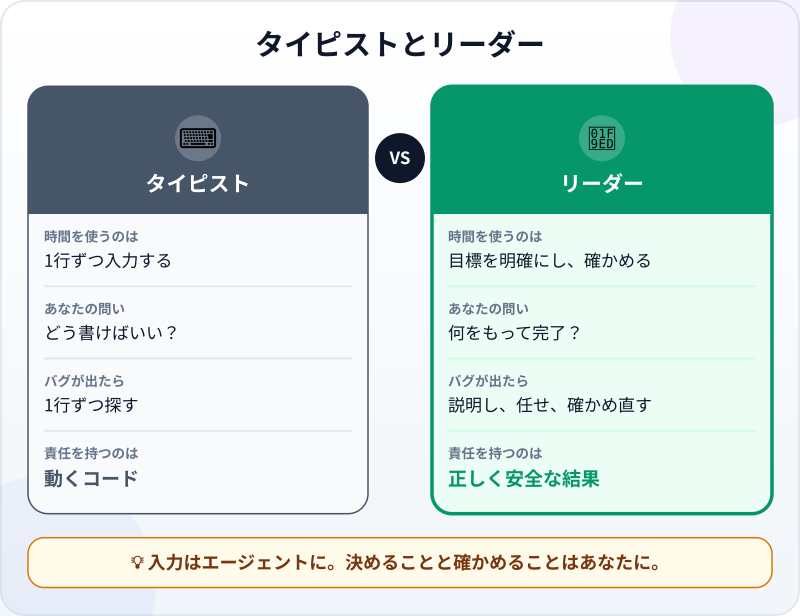
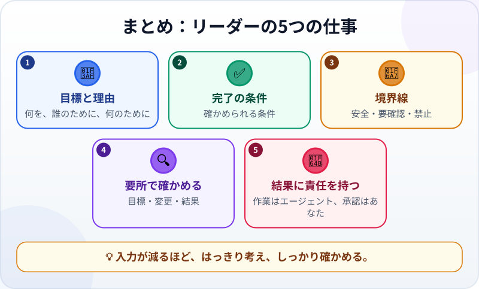

🌐 [Tiếng Việt](../../vi/lessons/lead-not-typist.md) · [English](../../en/lessons/lead-not-typist.md) · **日本語**

# 新しい考え方：あなたはタイピストではなくリーダー

<!-- section: objective -->
## この授業のゴール

この授業を終えると、次のことができるようになります。

- エージェントと働くときの新しい役割を説明できる：**タイピスト**から**リーダー**へ。
- リーダーの5つの仕事を挙げられる：目標と理由、完了の条件、境界線、要所での確認、結果への責任。
- 「タイピスト型」の依頼を「リーダー型」の依頼に書き直せる。

<!-- section: hook -->
## なぜ大事なの？

[はじめてのエージェント体験](first-agent-session.md)で、あなたはコードを1行も打ちませんでした。それでも、たくさんのことをしました。何がほしいかを伝え、完了条件を決め、変更を一つずつ読み、自分で確かめた。これがリーダーの仕事です。

「AIがコードを書いてくれるなら楽になる」と思う人は多いでしょう。実際には、仕事は場所を移すだけです。入力は減りますが、はっきり考え、しっかり確かめる必要が増えます。

<!-- section: concept -->
## 本題

### 何が変わる？

タイピストは*どうやるか*に時間を使います。1行ずつ書き、バグを1行ずつ探す。リーダーは*何をするか*と*完了をどう確かめるか*に時間を使います。入力はエージェントに任せ、決めることはあなたが担います。

### リーダーの5つの仕事

1. **目標と理由：** 何を、誰のために、何のために。理由がわかれば、エージェントはより合ったやり方を選べます。
2. **完了の条件：** はじめての体験と同じく、確かめられる条件。
3. **境界線：** 安全・要確認・禁止。
4. **要所での確認：** 目標を正しく理解しているか、変更は正しい場所か、結果は条件を満たしているか。
5. **結果への責任：** 作業するのはエージェントでも、承認のサインをするのはあなたです。

<!-- section: analogy -->
## 身近なたとえ

家のリフォームを工務店に頼むところを想像してください。あなたは自分でレンガを積みませんが、ほしいものをはっきり伝え（*「高さ2メートル、本を50kg載せられる本棚」*）、図面を確認し、いくつかの節目で現場を見て、支払いの前に一つずつ確かめます。

このたとえの弱点：経験のある職人は、依頼があいまいなら聞き返してくれることが多いでしょう。エージェントは、すき間を自信たっぷりの推測で埋めてしまうことがあります。だからこそ、依頼ははっきり書く必要があります。

<!-- section: example -->
## 具体例

フイさんは大学2年生で、Python を少し知っています。20人分・4科目（各10点満点）の架空の成績が入った `seiseki.csv` があり、集計表が必要です。

**タイピスト型：** *「CSVファイルを読む Python のコードを書いて」* エージェントはファイルを読むコードを返します。フイさんは次の手順を自分で考え、組み合わせ、試さなければなりません。

**リーダー型：**

> *「`seiseki.csv` から `shukei.csv` を作ってください。合計と評価の列を追加します（32点以上：優、24点以上：良、それ以外：可）。元のファイルは変更しないでください。完了条件：`shukei.csv` に20行すべてがある。最初の3人の合計が、私が自分で足した合計と一致する。評価が基準どおり。」*

2つ目の依頼は、**結果**（コードだけでなく）、**境界線**（元のファイルは触らない）、**確かめ方**をはっきり伝えています。承認の前に、フイさんは最初の3人の点数を自分で足して比べます。

<!-- section: misconceptions -->
## よくある誤解

- **「コードを打たないなら、ソフトウェアのことは知らなくていい」** — 判断できるだけの知識は必要です。エラーメッセージを読む、ファイルの場所がわかる、結果を確かめる。この講座で必要な分だけ学びます。
- **「リーダーは指示を出して待つだけ」** — リーダーは最後だけでなく、いくつかの要所で確かめます。
- **「エージェントが優秀なら、ミスはエージェントのせい」** — エージェントは結果の責任を負いません。結果を使うのも、承認したのも、あなたです。

<!-- section: recap -->
## 1枚でわかるこのレッスン

<!-- section: takeaways -->
## まとめ

- エージェントと働くと、あなたはタイピストからリーダーになる。
- 5つの仕事：目標と理由、完了の条件、境界線、要所での確認、結果への責任。
- 良い依頼は、コードではなく結果と確かめ方について語る。
- 入力が減るほど、はっきり考え、しっかり確かめる。

<!-- section: quiz -->
## 確認クイズ

**問1.** リーダーの考え方が表れている依頼は？

- A) 「Python の関数を書いて」
- B) 「動くようにコードを直して」
- C) 「`seiseki.csv` から集計ファイルを作って。元のファイルは変えない。最初の3人の合計が手計算と一致したら完了」

**問2.** リーダーの5つの仕事に**入らない**ものは？

- A) コードを1行ずつ打つ
- B) 完了の条件を決める
- C) 要所で確かめる

**問3.** エージェントがミスをし、あなたは確かめずに承認しました。結果の責任は誰に？

- A) エージェント
- B) あなた
- C) 誰にもない

答えを見る

1. **C** — 結果、境界線、確かめ方が書かれています。
2. **A** — 入力はエージェントの担当。それ以外の仕事と結果への責任は、あなたのものです。
3. **B** — エージェントは責任を負いません。承認したのはあなたです。

<!-- section: sources -->
## 参考資料

- Google Cloud — [What is agentic coding?](https://cloud.google.com/discover/what-is-agentic-coding)（英語）：「AIとおしゃべりする」から「AIに仕事を割り当てる」への変化で、開発者は設計とロジックに集中できる。エージェントは受け身の相談相手というより腕のいい請負業者のようなもので、エージェントが書いたコードはメインのプロジェクトに入れる前に人が確認すべきだ、と説明しています。
- Anthropic — [Best practices for Claude Code](https://code.claude.com/docs/en/best-practices)（英語）：依頼には具体的な背景を書き、エージェントが自分の仕事を確かめる手段を用意する。
