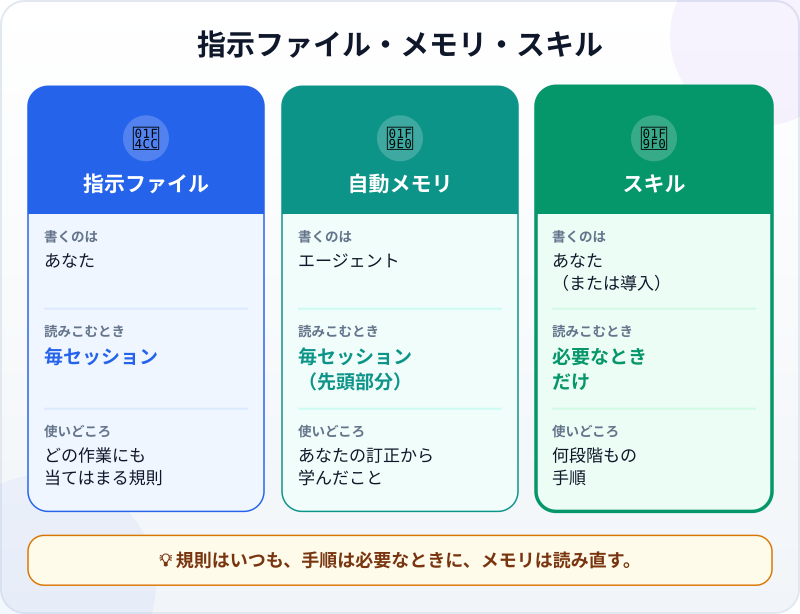
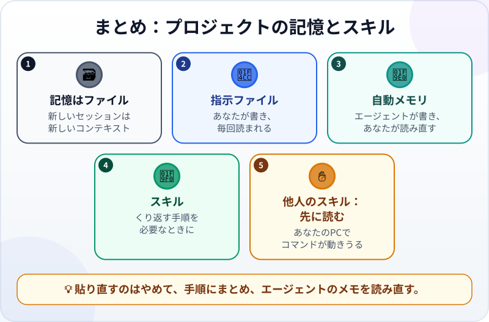

🌐 [Tiếng Việt](../../vi/lessons/memory-and-skills.md) · [English](../../en/lessons/memory-and-skills.md) · **日本語**

# プロジェクトの記憶と再利用できるスキル

<!-- section: objective -->
## この授業のゴール

この授業を終えると、次のことができるようになります。

- 次のセッションに持ちこまれる3つ（**指示ファイル**、**自動メモリ**、**スキル**）を見分けられる。
- よくくり返す手順をスキルにし、新しいセッションで呼び出せる。
- エージェントが自分で書いたメモリを読み直して片づけ、まちがったことや残すべきでないことを残さない。

<!-- section: hook -->
## なぜ大事なの？

毎月末、マイさんは新しいセッションを開き、エージェントに同じリストを貼ります。

```text
1. その月の売上ファイル（例：sales_october.csv）があるか確かめる。
2. その月のファイルで make_report.py を実行する。
3. check_report.py を実行する。不合格なら止まってわたしに知らせる。
4. 1つの支店の売上を手で合計し、レポートと比べる。
5. log.md に1行書く：月、売上合計、チェックの結果。
6. 「X月のレポート」というメッセージでコミットする。
```

12月、急いでいたマイさんは「*12月のレポートを作って*」とだけ入力しました。エージェントはレポートを作りましたが、手順3を飛ばしました。まちがった数字が、そのまま上司に届きました。

エージェントが「忘れた」のではありません。どのセッションも、新しいコンテキストで始まるのです。マイさんに必要なのは、その手順が、貼り直さなくても**必要なときにいつもそこにある**場所でした。

<!-- section: concept -->
## 本題

### エージェントはファイルで覚える

[エージェントがどこで「覚えている」か](context-window.md)は、もう学びました。学習で身につけたことと、今のセッションの中身を別にすると、次のセッションに持ちこまれるのは**ファイル**だけです。エージェントのツールには、たいていこうしたファイルが3種類あります。



- **指示ファイル** ―― あなたが書き、**毎回**のセッションの最初に読まれるもの。どの作業にも当てはまる短い規則のため（[コンテキストエンジニアリング](context-engineering.md)で1つ書きました）。
- **自動メモリ** ―― **エージェント**が、あなたと作業する中で学んだこと（好みや、あなたに訂正されたこと）を書きとめるもの。2026年9月時点のClaude Codeには*自動メモリ（auto memory）*があり、`MEMORY.md` の最初の200行（または最初の25KB）が毎セッションの最初に読みこまれます。
- **スキル** ―― あなたが書く（または導入する）もので、何段階もの**手順**を1つのファイルにまとめたもの。指示ファイルと違い、スキルの中身は**使うときだけ読みこまれる**ので、長い手順でも必要になるまでほとんど場所をとりません。

### スキルを書くのはいつ？

Claude Codeのドキュメント（2026年9月時点）はこうすすめています。同じ指示、チェックリスト、何段階もの手順を**何度も貼り直している**とき、または指示ファイルの一部が、規則ではなく手順にまでふくらんだときに、スキルを作る。

Claude Codeのスキルは、専用のフォルダに置く `SKILL.md` というファイルで、2つの部分があります。

- **説明**（ファイルの最初）：このスキルを*いつ*使うか。エージェントはこれを読んで、作業に合うときに自分でスキルを読みこむかを決めます。
- **手順：** スキルが動くときにエージェントが従うステップ。

`/monthly-report` のように、名前で直接呼び出すこともできます。Claude Codeのスキルは、ほかの多くのAIツールも使うオープンな標準（Agent Skills）に沿っています。

### メモリを読み直す

自動メモリは便利ですが、それは**エージェントのメモ**であって、あなたのものではありません。まちがったこと（あなたの訂正の誤解）、古くなったこと、そもそもファイルに残すべきでないこと（本名、社内の数字）が書かれることもあります。どれも、読んで直して消せるただのテキストファイルです。ときどき開いて読みましょう。

### 他人のスキルは ✋

スキルには、あなたのPCで動くコマンドを入れられます。他人が書いたスキルを入れるのは、プログラムを入れるのと同じです。✋ **要確認**。中身をすべて読み、信頼できる出どころのものだけを使います。

<!-- section: try-it -->
## やってみよう

約11分。`ai-practice` で、[自動化プロジェクト](project-office-automation.md)の架空のデータを使います（同じ手順でくり返す作業なら何でもかまいません）。手順はClaude Code（2026年9月時点）の場合です。ほかのツールにも似たしくみがあるので、そのドキュメントを確認してください。（見るだけのルートなら、手順1を行い、手順2を紙に書いてみましょう。）

**1. 手順を書き出す（2分）。** 毎回くり返す4〜6のステップを順番に書き、問題があったら止まるべきステップも決めます。上のマイさんのリストが例です。

**2. スキルにまとめる（4分）。** `ai-practice/.claude/skills/monthly-report/SKILL.md` を作ります。

```text
---
description: その月の売上ファイル（例：sales_october.csv）から月次の売上レポートを作る。月次レポートを頼まれたときに使う。
---
X月のレポートを作るとき：
1. X月の売上ファイル（例：sales_october.csv）があるか確かめる。なければ止まって知らせる。
2. そのファイルで make_report.py を実行する。
3. check_report.py を実行する。不合格なら止まり、結果を知らせ、ほかは何も変えない。
4. 比べるために、1つの支店の売上を手で合計するよう、わたしに声をかける。代わりに合計しない。
5. log.md に1行書く：月、売上合計、チェックの結果。
6. 「X月のレポート」というメッセージでコミットする。
```

**3. 新しいセッションで試す（3分）。** **新しいセッション**を開き、これだけ入力します。

```text
10月のレポートを作って。
```

エージェントは自分でスキルを読みこみましたか？ 言われなくても `check_report.py` を実行しましたか？ 手順4で、代わりに足し算をせず、手で足すよう声をかけてきましたか？ スキルが読みこまれなかったら、説明の「いつ使うか」をもっとはっきり書き直して、もう一度試します。`/monthly-report` で直接呼び出すこともできます。

**4. メモリを読む（2分）。** Claude Codeで `/memory` と入力します（またはエージェントに「*このプロジェクトについて、自分で何をメモした？*」と聞きます）。1行ずつ読みます。まちがい、古いこと、あるべきでないことはありませんか？ あれば消します。

**証拠：**

- *見せられるもの…* `SKILL.md` と、ひとこと入力しただけで全部の手順をこなした新しいセッション。
- *確かめたこと…* エージェントがチェックを実行し、正しい場所で止まったこと。メモリにまちがいや機密がないこと。
- *使わないほうがいい場面…* 1回きりの手順（依頼の中で伝える）や、中身を全部読んでいない出どころのスキル。

<!-- section: misconceptions -->
## よくある誤解

- **「しばらくいっしょに作業すれば、エージェントは全部覚えている」** ―― どのセッションも新しいコンテキストで始まります。持ちこまれるのは、ファイル（指示・メモリ・スキル）に書かれたことだけです。
- **「手順は丸ごと指示ファイルに入れればいい」** ―― 指示ファイルは、レポートと関係のないセッションでも毎回読まれます。長い手順はスキルにすれば、必要なときだけ読みこまれます。
- **「自動メモリは、エージェントが書いたのだから正しい」** ―― エージェントのメモなので、誤解や古い情報もありえます。自分のファイルと同じように、読み直して片づけます。

<!-- section: recap -->
## 1枚でわかるこのレッスン



<!-- section: takeaways -->
## まとめ

- エージェントは「記憶」ではなく、ファイルでセッションをまたぐ。
- 指示ファイル：あなたが書く短い規則。毎セッション読まれる。
- 自動メモリ：エージェントが書く。あなたが読み直し、直し、消す。
- スキル：何段階もの手順。使うときだけ読みこまれる。同じものを貼り直しているなら作る。
- 他人のスキルはあなたのPCでコマンドを動かしうる。✋ 入れる前に読む。

<!-- section: quiz -->
## 確認クイズ

**問1.** マイさんは毎月、同じ6段階の手順を貼っています。どこに置くべき？

- A) 月次レポートを作るときに読みこまれるスキル
- B) 毎セッション読まれる指示ファイル
- C) どこにも置かない。エージェントが覚えるから

**問2.** スキルと指示ファイルの一番の違いは？

- A) スキルは英語でしか書けない
- B) スキルの中身は使うときだけ読みこまれ、指示ファイルは毎セッション読まれる
- C) 指示ファイルはエージェントが書く

**問3.** 自動メモリを開いたら、プロジェクトの約束ごとをエージェントがまちがって書いた行がありました。どうすべき？

- A) エージェントが書いたのだから正しいはず。そのままにする
- B) PCを再起動する
- C) その行を直すか消す。メモリは読んで直せるただのファイル

<details>
<summary>答えを見る</summary>

1. **A** ―― 必要なときに使う手順はスキル向きです。指示ファイルに入れると、毎回のセッションで場所をとります。
2. **B** ―― スキルは必要なときに読みこまれ、指示ファイルはいつもそこにあります。
3. **C** ―― メモリはエージェントのメモです。正しく保つのはあなたの役目です。

</details>

<!-- section: sources -->
## 参考資料

- Anthropic — [Extend Claude with skills](https://code.claude.com/docs/en/skills)（英語、2026年9月時点）：同じ指示や手順を貼り直しているならスキルを作る。`SKILL.md` は説明（いつ使うか）と手順でできている。スキルの中身は使うときだけ読みこまれる。`/スキル名` で直接呼び出せる。オープン標準のAgent Skillsに沿っている。
- Anthropic — [How Claude remembers your project](https://code.claude.com/docs/en/memory)（英語、2026年9月時点）：`CLAUDE.md` はあなたが書き、自動メモリはClaudeが書く。`MEMORY.md` の最初の200行または25KBが毎セッション読みこまれる。どれも読んで直して消せるマークダウンで、`/memory` で見られる。
