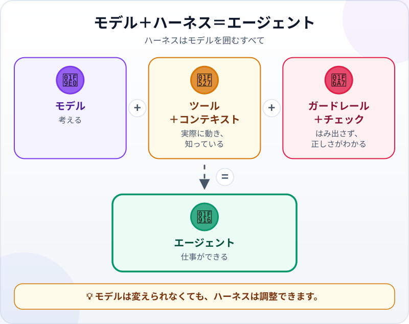
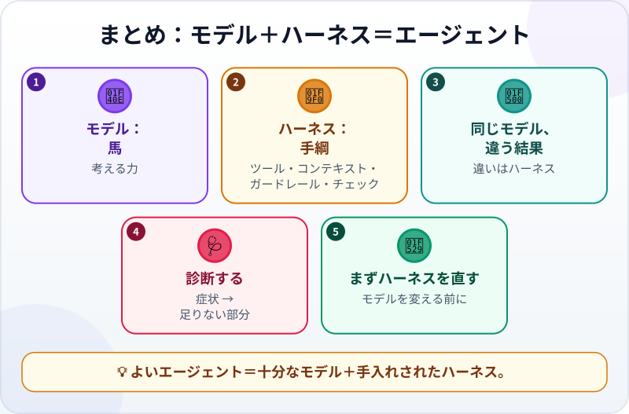

🌐 [Tiếng Việt](../../vi/lessons/model-plus-harness.md) · [English](../../en/lessons/model-plus-harness.md) · **日本語**

# モデル＋ハーネス＝エージェント：馬と手綱

<!-- section: objective -->
## この授業のゴール

この授業を終えると、次のことができるようになります。

- **エージェント＝モデル＋ハーネス**を説明し、ハーネスのうち自分で調整できる4つの部分（ツール、コンテキスト、ガードレール、チェック）を挙げられる。
- エージェントの出来が悪いとき、ハーネスのどの部分が足りないかを診断できる。
- ハーネスのどこを自分で直せるか、それぞれを講座のどの授業で学ぶかがわかる。

<!-- section: hook -->
## なぜ大事なの？

トゥアンさんとマイさんは、**同じAIモデル**を使っています。トゥアンさんは言います。「*数字の表を貼って合計を頼んだら、自信たっぷりにまちがえた。使えないよ。*」マイさんは言います。「*わたしのエージェントは月次レポートを作って、自分で確かめて、まちがえたら自分で直す。信頼できるよ。*」

同じ「頭脳」なのに、なぜこんなに違うのでしょう。二人が使っているのは、頭脳だけではないからです。

<!-- section: concept -->
## 本題

### エージェントの2つの半分

エージェントが[頭脳・道具・ループ](agent-parts-and-loop.md)でできていることは、もう学びました。使う人の目から見ると、もっと簡単に2つに分けられます。

- **モデル：** 考える部分。依頼を理解し、次の一手を選び、コードを書きます。モデルは選べますが、中身は変えられません。
- **ハーネス：** 実際の仕事ができるよう、モデルを**囲んでいる**すべて。Claude Codeのドキュメント（2026年9月時点）は、モデルのまわりでツールを提供し、モデルに見せるものを管理するソフトウェアを、*エージェントハーネス（agentic harness）*と呼んでいます。

### ハーネスの、自分で調整できる4つの部分

ループ（モデルを呼び、ツールを使い、結果を見て、くり返す）もハーネスの一部ですが、これは最初から動いています。自分で調整できるのは、次の4つです。

- **🔧 ツール：** エージェントが実際にできること。ファイルを読む、コマンドを実行する、検索する。ツールがなければ、モデルは話せても動けません。
- **📋 コンテキストと指示：** エージェントが知っていること。あなたの依頼、関係するファイル、指示ファイルに書いておいたプロジェクトの約束ごと。コンテキストがなければ、エージェントは推測します。
- **🚧 ガードレール：** エージェントが**してはいけない**こと、先に確認すべきこと。権限や、危険な操作を自動で止めるルール。ガードレールがなければ、1つのまちがった手順が本当の損害になりえます。
- **✅ チェック：** 仕事が正しいとどうやってわかるか。テストや、一致すべき数字。チェックがなければ、「終わったように見える」ことが唯一の手がかりです。

### 同じモデルでも、ハーネスが違えば結果が違う

トゥアンさんは、チャット画面からモデルを使っています。コードを実行するツールもファイルもチェックもありません。モデルは長い表を「暗算」するしかなく、[ハルシネーション](hallucination.md)を起こしやすくなります。自信満々にまちがえるのです。マイさんは同じモデルを、Pythonを実行するツール、プロジェクトのフォルダ、指示ファイル、チェックのそろったエージェントで使っています。モデルが賢いのではありません。**装備**がよいのです。

### エージェントの出来が悪いときは、まずハーネスを直す

もっと強いモデルに変えるのは一番思いつきやすい方法ですが、正しい方法でないことがよくあります。症状から診断しましょう。

- **話すだけで、作業ができない** → ツールが足りない。
- **約束ごとを知らない、セッションごとに忘れる** → コンテキストが足りない。
- **許していないことをする** → ガードレールが足りない。
- **終わったと言うのに、まちがっている** → チェックが足りない。

この4つは、自分で調整できます。*最小限のハーネス*の後の授業で、1つずつ学びます。最初は[コンテキストエンジニアリング](context-engineering.md)。続いて、エージェントへの指示、自動のガードレール、自動で走るテストです。

<!-- section: analogy -->
## 身近なたとえ

力の強い馬と、その馬具。力を持っているのは馬です。でも手綱がなければ思う方向に進まず、鞍がなければ人を乗せられず、柵がなければ隣の畑に入ってしまいます。上手な乗り手は、馬がまちがった方向に行くたびに馬を替えたりはしません。手綱を調整し、必要な場所に柵を立てます。

モデルは馬、ハーネスは鞍と手綱と柵、そしてあなたは乗り手です。

このたとえが当てはまらないところ：馬には自分の意思があり、乗り手を感じとれます。モデルは、そういう意味であなたを「わかって」はいません。見えているのはコンテキストの中にあるものだけです。ハーネスに入れなかったものは、モデルにとって存在しないのと同じです。

<!-- section: example -->
## 具体例

マイさんは、[自動化プロジェクト](project-office-automation.md)の月次レポートをエージェントで作っています。1か月のあいだに3つの問題にぶつかり、どれもハーネスで直しました。モデルは一度も変えていません。

**問題1 ―― セッションごとに忘れる。** マイさんは毎週こう念を押さなければなりませんでした。「*データのファイルは変えないで。金額はベトナム式で、千の位の区切りはピリオド。*」新しいセッションになると、エージェントはまた忘れます。**診断：コンテキストが足りない。** マイさんは2つの約束ごとを、プロジェクトの指示ファイル（Claude Codeなら `CLAUDE.md`、2026年9月時点）に書きました。エージェントが毎回セッションの最初に読むファイルです。それからは、念を押す必要がなくなりました。

**問題2 ―― 危うく消されそうになった。** あるとき、エージェントが「すっきりさせるため」に古いレポートのフォルダを削除しようと提案しました。マイさんは、エージェントが先に確認するモードにしていたので、断ることができました。**診断：ガードレールがちゃんと働いた。** マイさんは削除には必ず確認するモードを使い続け、データのあるフォルダで何でも許可するモードは決して使いません。

**問題3 ―― 終わったと言ったのに、数字が1つまちがっていた。** 11月、エージェントは完了を報告し、`check_report.py` も PASS のままでしたが、Thu Ducの合計がマイさんの手計算と合いません。`check_report.py` はレポートを正解の表と比べるだけで、その表は9月と10月の分しかなかったのです。新しい月については、何も確かめていませんでした。**診断：チェックが足りない。** マイさんは、正解を前もって知らなくても使えるチェックを足してもらいました。データの行から支店ごとの合計を、別の簡単な方法で計算し直し、レポートと比べるものです。レポートのコピーの数字をわざと壊して FAIL になるのを確かめてから、使い始めました。

月末には、マイさんのレポートはずっと信頼できるものになりました。モデルは、前と同じモデルのままです。

<!-- section: misconceptions -->
## よくある誤解

- **「エージェントの出来が悪いなら、もっと強いモデルが必要」** ―― 足りないのは、たいていツール、コンテキスト、ガードレール、チェックのどれかです。ハーネスを直すほうが安く、長持ちします。
- **「ハーネスはエンジニアの仕事で、使う人は触らない」** ―― 指示ファイル、権限のモード、チェック。どれも、マイさんのように自分で設定できます。
- **「一番強いモデルなら、ガードレールはいらない」** ―― 強いモデルがまちがえると、速く、自信満々にまちがえます。エージェントが自分で動くほど、ガードレールは大切になります。

<!-- section: recap -->
## 1枚でわかるこのレッスン

<!-- section: takeaways -->
## まとめ

- エージェント＝モデル＋ハーネス。モデルが考え、ハーネスが装備を与える。
- ハーネスはモデルのためにループを回し、自分で調整できる4つの部分を持つ：ツール、コンテキストと指示、ガードレール、チェック。
- 同じモデルでも、ハーネスが違えば結果は大きく変わる。
- 出来が悪いときは、症状から診断し、モデルを変える前にハーネスを直す。
- その4つは、自分で調整できる。

<!-- section: quiz -->
## 確認クイズ

**問1.** トゥアンさんとマイさんは同じモデルを使っているのに、結果が大きく違います。一番ありそうな理由は？

- A) マイさんのモデルだけ、特別に更新されている
- B) マイさんは、ツール・コンテキスト・ガードレール・チェックのそろったハーネスでモデルを使っている
- C) トゥアンさんは依頼を日本語で書いている

**問2.** エージェントが、セッションのたびに「データのファイルは変えない」という約束を忘れます。ハーネスのどこを直すべき？

- A) コンテキスト ―― エージェントが毎回読む指示ファイルに約束ごとを書く
- B) ツール ―― エージェントにファイルを削除する権限を与える
- C) 別のモデルに変える

**問3.** エージェントは完了を報告しましたが、ある支店の合計がまちがっていて、だれも気づきませんでした。この症状が示すのは？

- A) ツールが足りない
- B) ガードレールが足りない
- C) チェックが足りない

答えを見る

1. **B** ―― 頭脳は同じです。違うのは、それを囲むものです。
2. **A** ―― エージェントはセッションをまたいで覚えていません。毎回最初に読むものなら、いつもそこにあります。
3. **C** ―― 「終わったのにまちがっている」は、チェックがそのミスを見つけられなかったサインです。

<!-- section: sources -->
## 参考資料

- Anthropic — [How Claude Code works](https://code.claude.com/docs/en/how-claude-code-works)（英語、2026年9月時点）：エージェントのループは、考えるモデルと動くツールの2つで成り立つ。Claude Codeはモデルを囲む層で、ツールを提供しコンテキストを管理する。この層を*エージェントハーネス*と呼ぶ。`CLAUDE.md` の指示は毎セッション読み込まれる。権限モードで、確認なしにできることが決まる。
- Google Cloud — [What is agentic coding?](https://cloud.google.com/discover/what-is-agentic-coding)（英語、2026年9月更新）：エージェントの推論ループを制御するソフトウェアを*エージェントハーネス*と呼ぶ。エージェントがアクセスできる範囲を制限し、危険なコマンドの実行を止めるべき。
