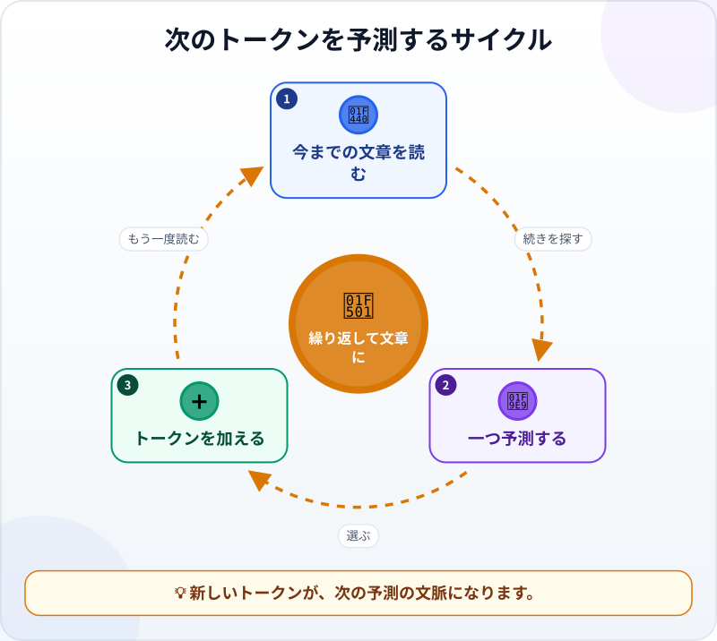
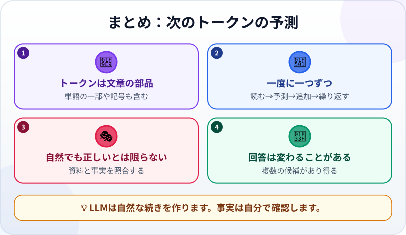

🌐 [Tiếng Việt](../../vi/lessons/next-token-prediction.md) · [English](../../en/lessons/next-token-prediction.md) · **日本語**

# 次のトークンの予測：LLMのシンプルな秘密

<!-- section: objective -->
## この授業のゴール

この授業を終えると、次のことができるようになります。

- LLMがトークンを一つずつ作って回答する流れを説明する。
- 自然な文章でも、正しいとは限らない理由を説明する。
- 同じ質問から違う回答が作られる理由を理解する。

<!-- section: hook -->
## なぜ大事なの？

マイは「売上報告の親しみやすい書き出しを作って」と入力します。すぐに自然な段落が返ります。最初から段落全体を考えていたように見えます。

実際の**大規模言語モデル（LLM）**の動きは、もっと単純です。今までの文章を見て、続きそうな小さな部品を選び、この処理を繰り返します。このしくみを知れば、自信のある文章と確認済みの事実を区別できます。

<!-- section: concept -->
## 本題

### トークンは文章の小さな部品

LLMは**トークン**を読み書きします。トークンは一つの単語とは限りません。単語の一部、句読点、記号の場合もあります。人には一つの文でも、モデルはトークンの列として扱います。

### 小さなサイクルを繰り返す



マイが「今月の報告によると…」と書き始めると、モデルは次のように動きます。

1. [コンテキストウィンドウ](context-window.md)にある依頼、会話、書きかけの回答を読みます。
2. 次に来そうなトークンを考えます。
3. 例えば「売上」という一つのトークンを選び、末尾に追加します。
4. 新しい列を読み、次の単語や句読点について同じ処理をします。

完成した文を引き出しから取り出すのではありません。新しいトークンも次の予測の入力になります。小さな選択がつながって長い段落になります。

### 「続きそう」と「正しい」は別

このサイクルの直接の目的は、それまでの文章に合う続きを作ることです。そのため、LLMは自然な文章を作れます。しかし、この処理だけではマイの表計算ファイルを開いたり、顧客に確認したり、カレンダーの日付を調べたりしません。

事実が足りなくても、もっともらしい文章を作ることがあります。これが[AIのハルシネーション](hallucination.md)につながる理由の一つです。大事な事実には資料を与え、結果を確認します。

### 同じ質問でも回答が変わる理由

一つの位置に、複数のトークンが合う場合があります。売上についての曖昧な文なら、「増えた」「減った」「変わらない」のどれも続く可能性があります。システムは常に一つの固定した候補だけを選ぶとは限りません。最初の違いが後の予測にも影響し、段落全体の進み方が変わります。

この変化は、別の表現やアイデアを出すときに便利です。しかし事実については、何度も質問して好きな答えを選んではいけません。ファイル、資料、ツールの結果と照らし合わせます。

<!-- section: analogy -->
## 身近なたとえ

みんなで文をつなぐゲームを想像してください。一人が「今朝、私は…」と言い、次の人が「市場へ」、別の人が「買い物に」と続けます。一人ひとりは合いそうな続きを加えるだけですが、少しずつ話ができます。

LLMもトークンを使って高速に続きを作ります。ただし、人には経験や目的があり、事実を質問できます。モデルは学んだパターンと与えられた文脈から出力を作るだけです。人と同じ考えや経験があると思わないでください。

<!-- section: example -->
## 具体例

練習用フォルダ `ai-practice` に、架空の `sales-note.txt` があります。

```text
月：6月
問い合わせが多い商品：青い水筒
次にすること：在庫を再確認
```

マイは「`sales-note.txt` だけを根拠に、チーム向けの報告を2文で書いて。在庫数がなければ不明と書いて」と頼みます。

モデルは依頼とファイル内容から、トークンを一つずつ作ります。「問い合わせが多い」は、青い水筒への関心を書く根拠になります。在庫数がなければ不明とする指示は、もっともらしい数字を補わないための手がかりになります。

マイは一つずつファイルと照合します。別の実行では表現が変わっても、事実は変わりません。「在庫は十分です」と書かれていたら不採用です。それは自然な続きでも、ファイルが示す事実ではありません。

<!-- section: recap -->
## 1枚でわかるこのレッスン



<!-- section: takeaways -->
## まとめ

- LLMは単語、単語の一部、記号などのトークンを読み書きします。
- 今までの文章を読む→一つ選ぶ→追加する→繰り返す、という流れです。
- 自然な文章は予測の結果であり、正しさの証明ではありません。
- 複数の候補があるため、同じ質問でも回答が変わります。
- 大事な事実には資料を与え、自分でも確認します。

<!-- section: quiz -->
## 確認クイズ

**問1.** LLMはどのように段落を作りますか？

- A) 依頼を読む前に段落全体を一度に書く
- B) 一つのトークンを予測して追加し、繰り返す
- C) 回答集から同じ段落を探す

**問2.** 自然な回答でも間違うのはなぜですか？

- A) 自然な続きを作ることは、現実の事実確認ではないから
- B) すべてのトークンが一つの文だから
- C) LLMは句読点を書けないから

**問3.** `sales-note.txt` をAIで要約するとき、よい方法はどれですか？

- A) 何度も実行して最大の数字を選ぶ
- B) 最も自信のある書き方を信じる
- C) ファイルだけを使うよう頼み、事実をファイルと照合する

<details>
<summary>答えを見る</summary>

1. **B** — 新しいトークンが追加され、次の予測の文脈になります。
2. **A** — 自然な文章と確認された事実は別です。
3. **C** — 根拠を限定して照合すると、追加された情報を見つけられます。

</details>
