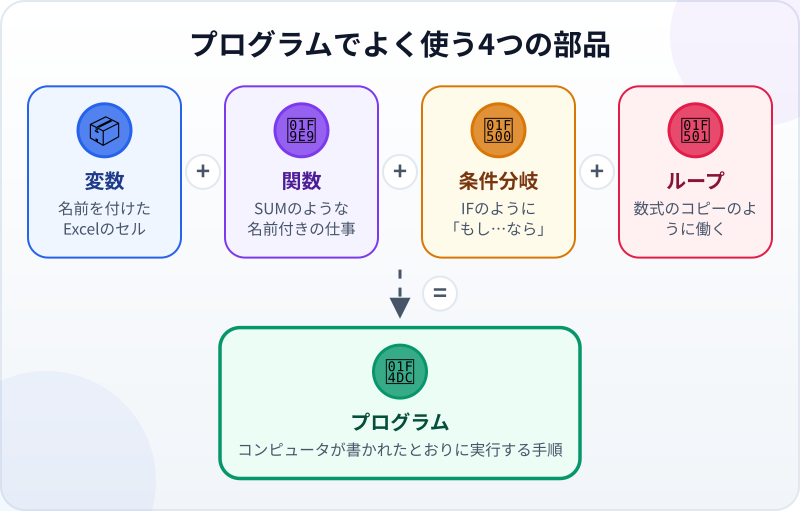
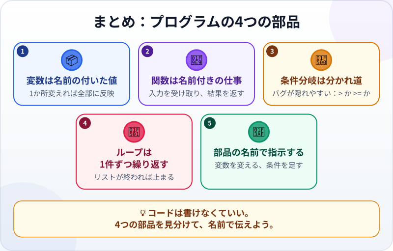

🌐 [Tiếng Việt](../../vi/lessons/programming-building-blocks.md) · [English](../../en/lessons/programming-building-blocks.md) · **日本語**

# 変数・関数・条件分岐・ループ：プログラムの4つの部品

<!-- section: objective -->
## この授業のゴール

この授業を終えると、次のことができるようになります。

- どんなプログラムにもある4つの部品、**変数・関数・条件分岐・ループ**を名前で言え、Excelにもすでにあることがわかる。
- エージェントが書いた短いコードを読み、何をしているかをふつうの言葉で説明できる。
- この4つの言葉を使って、指示や変更の確認をより正確にできる。

<!-- section: hook -->
## なぜ大事なの？

マイさんは、エージェントに小さなプログラムを頼みました。`expenses.csv`（[良い指示書の書き方](writing-good-specs.md)と同じ架空のデータ）を読み、合計を出し、大きな支出を一覧にするものです。エージェントが実行し、結果は正しいものでした。ところが `summary.py` を開くと、`def`、`for`、`if` など、見慣れない文字が十数行並んでいます。

「私は経理で、プログラマーじゃないのに。こんなの読めるわけがない」

でも大丈夫。マイさんには読めます。どんなプログラムも同じ4つの部品でできていて、マイさんは毎日その4つを使っているのです。Excelの中で。

<!-- section: concept -->
## 本題

### 4つの部品



1. **変数（variable）**：名前の付いた箱で、値を1つ入れておくもの。Excelなら、名前を付けたセル。たとえば 25,000 が入った `exchange_rate` というセルです。コードでは `THRESHOLD = 500000`。1か所で値を変えれば、その名前を使っているところが全部変わります。
2. **関数（function）**：名前の付いた仕事。入力を受け取り、結果を返し、何度でも使えます。Excelなら `SUM` や `VLOOKUP`。コードでは、エージェントが自分で関数に名前を付けます。たとえば `is_large(amount)` は、金額を渡すと「大きい／大きくない」を返します。
3. **条件分岐（condition）**：「もし…なら…、そうでなければ…」。Excelなら `IF`。コードでは `if amount >= THRESHOLD:`。プログラムが道を分ける場所で、バグがいちばん隠れやすい場所でもあります。`>` なのか `>=` なのか。ちょうど基準額の支出は「大きい」に入るのか。
4. **ループ（loop）**：同じ手順を1件ずつ繰り返すこと。1行ずつ、1ファイルずつ、1人の顧客ずつ。Excelなら、数式を全行にコピーすること（フィル）。コードでは `for row in ...:`。

プログラミング言語によって書き方は少し違いますが、どの言語にもこの4つがあります。

### 仕事を任せる人に、なぜ必要なのか

コードを自分で書く必要はありません。でも、4つの名前を知っていると次のことができます。

- **読む**：数式を読むように、エージェントのコードの中で変数・関数・条件分岐・ループを探し、ふつうの言葉で言い直せます。
- **正確に指示する**：「基準額を 500,000 から 1,000,000 に変えて」は変数を1つ変えること。「分類が Other の行は飛ばして」は条件を1つ足すことです。
- **変更を確かめる**：変数を1つ変えてと頼んだのに、変更（差分）がループまで書き換えていたら？ エージェントに理由を聞くタイミングです。[エージェントの変更（差分）を読んでレビューする](reviewing-agent-changes.md)で学んだとおりです。

<!-- section: analogy -->
## 身近なたとえ

お正月の買い出しを、買い物リストを持って行うとします。

- **変数**：予算2万円。リストのいちばん上に一度書き、必要なときに見返します。
- **関数**：「1品買う」＝値段を見る、ほかと比べる、支払う、かごに入れる。名前の付いた一連の手順で、どの品にも使えます。
- **条件分岐**：2,000円を超える品なら考え直す。そうでなければそのまま買う。
- **ループ**：リストの品ごとに「1品買う」を繰り返し、リストが終わったら帰る。

たとえが合わないところ：人は自分で臨機応変に動きます。売り切れなら別の品にし、知り合いに会えば立ち話をします。プログラムはそうはいきません。書かれたとおりにしか動かないのです。条件としてコードに書かれていない状況には対応できません。だから指示書で、特別なケースを先に伝えておく必要があります。

<!-- section: example -->
## 具体例

これが、エージェントがマイさんのために書いた `summary.py` です。`#` から後ろは読む人のためのメモで、コンピュータは無視します。

```python
import csv

THRESHOLD = 500000                    # 変数：この金額以上を「大きな支出」とする（ドン）


def is_large(amount):                 # 関数：この支出は大きい？
    return amount >= THRESHOLD


total = 0                             # 変数：合計。0から始める
with open("expenses.csv", encoding="utf-8") as f:
    for row in csv.DictReader(f):     # ループ：1行ずつ
        amount = int(row["amount"])
        total = total + amount
        if is_large(amount):          # 条件分岐：大きな支出だけ表示する
            print("Large:", row["date"], row["category"], amount)

print("Total:", total)
```

マイさんは、上から順にふつうの言葉で読みます。

1. 変数 `THRESHOLD` を 500,000ドンにする。この金額以上が「大きな支出」。
2. 関数 `is_large` を作る。金額を渡すと、大きいかどうかを答える。
3. `total` を 0 にして `expenses.csv` を開き、**1行ずつ**、金額を取り出して合計に足す。**もし**大きな支出なら表示する。
4. ファイルの最後まで来たら、合計を表示する。

それからは、マイさんの指示がぐっと正確になりました。

- 「THRESHOLD を 1,000,000 に変えて」：変数をちょうど1つ。変更は1行だけのはずです。
- 「分類が Other の行は飛ばして」：ループの中に条件を1つ足すこと。
- 「ちょうど 500,000 の支出は大きいに入る？」：`>=` という条件についての質問で、指示書の完了条件に書いておく価値があります。

コツ：わかりにくいコードは、エージェントに頼みましょう。「1行ずつふつうの言葉で説明して。どれが変数・関数・条件分岐・ループかも示して」。

<!-- section: misconceptions -->
## よくある誤解

- **「文法を覚えないとエージェントと仕事ができない」**：必要なのは、4つの部品を見分けて、何をしているか言えること。コロン1つまで正しく書くのは、エージェントとチェックの仕事です。
- **「Excelの数式はプログラミングではない」**：`=IF(C2>=500000,"大","")` を列全体にコピーすれば、もう4つの部品がそろっています。セル（変数）、`IF` 関数、条件、そしてコピー（ループ）です。
- **「ループは永遠に回る」**：リストをたどるループは、リストが終われば止まります。止まらないループはバグです。エージェントが書いたプログラムがいつまでも終わらないなら、まずそこを疑いましょう。

<!-- section: recap -->
## 1枚でわかるこのレッスン



<!-- section: takeaways -->
## まとめ

- どんなプログラムも、変数・関数・条件分岐・ループの4つの部品でできている。
- 変数は名前の付いた値、関数は名前の付いた使い回せる仕事、条件分岐は道を分け、ループは1件ずつ繰り返す。
- Excelでもう4つとも使っている：名前付きのセル、`SUM`、`IF`、数式のコピー。
- エージェントのコードは、4つの部品を探してふつうの言葉で言い直して読む。
- 部品の名前で指示する（変数を変える、条件を足す）。そして変更がその場所だけかを確かめる。

<!-- section: quiz -->
## 確認クイズ

**問1.** マイさんのコードで、`THRESHOLD = 500000` はどの部品？

- A) ループ
- B) 関数
- C) 変数

**問2.** 分類が Other の行を飛ばしたいとき、マイさんはエージェントに何を足してもらえばいい？

- A) ループの中の条件分岐
- B) ファイルの先頭の新しい変数
- C) 新しいデータファイル

**問3.** マイさんは基準額を 1,000,000 に変えてと頼んだだけなのに、エージェントの変更はループと関数まで書き換えていました。どうする？

- A) エージェントのほうが詳しいので、そのまま受け入れる
- B) 受け入れる前に、なぜそこまで変える必要があったのかをエージェントに聞く
- C) 自分でコードを手直しする

<details>
<summary>答えを見る</summary>

1. **C**：値を入れておく名前は変数です。
2. **A**：「…なら飛ばす」は条件分岐。すべての行に効くよう、ループの中に置きます。
3. **B**：頼んだのは変数1つの変更です。それより広い変更は、受け入れる前に説明してもらいましょう。

</details>
