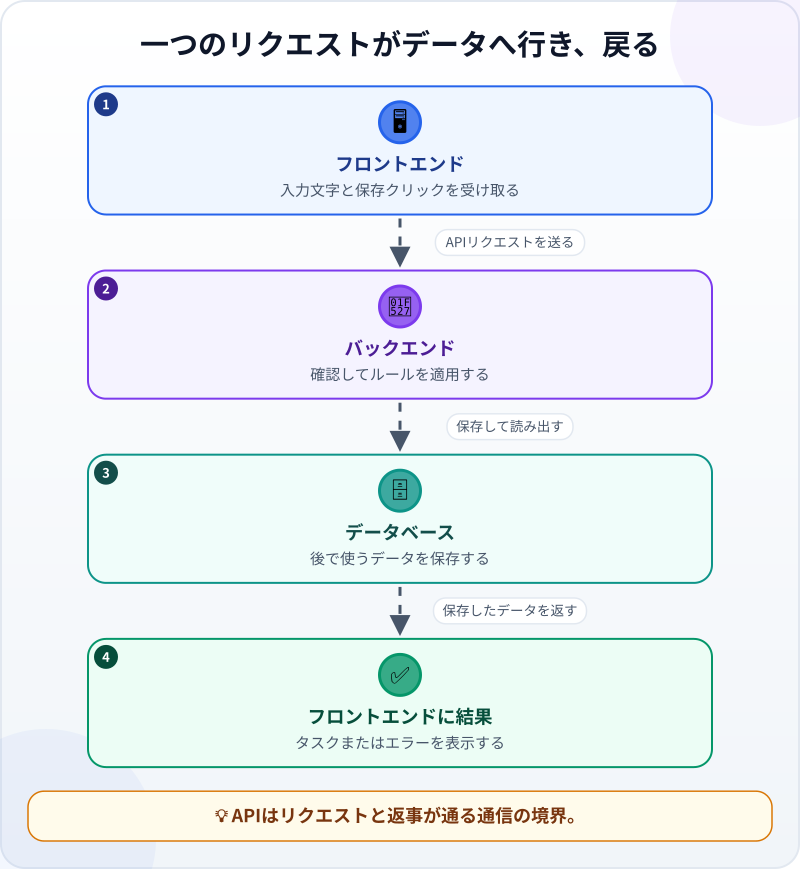
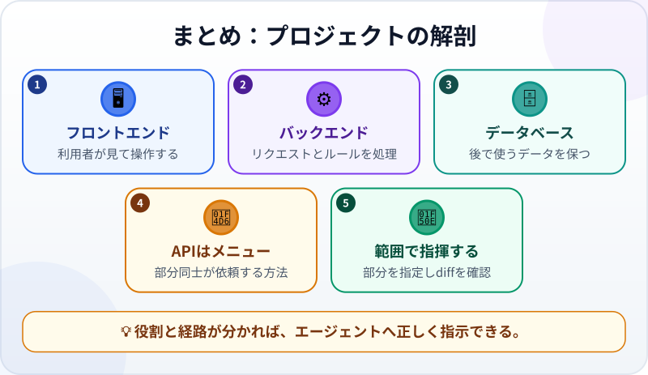

🌐 [Tiếng Việt](../../vi/lessons/project-anatomy.md) · [English](../../en/lessons/project-anatomy.md) · **日本語**

# プロジェクトの解剖：フロントエンド・バックエンド・データベース・API

<!-- section: objective -->
## この授業のゴール

このレッスンを終えると、次のことができるようになります。

- アプリにおけるフロントエンド、バックエンド、データベース、APIの基本的な役割を説明できる。
- リクエストが画面からデータへ進み、戻る流れを追える。
- エージェントに直す部分を示し、diffのフォルダ名から範囲を確認できる。

<!-- section: hook -->
## なぜ大事なの？

マイが週間タスクアプリで**保存**を押すと、新しいタスクが画面に現れます。見えるのは一つのボタンですが、裏では複数の部分が協力しています。クリックを受ける部分、ルールを確認する部分、データを保つ場所、部分同士が話すための決まった方法です。

「アプリを直して」だけでは範囲が広すぎます。処理の問題なのに画面を変えたり、ボタンの色だけなのに保存場所を変えたりするかもしれません。リーダーは全部を自作する必要はありませんが、部分の名前を正しく伝え、エージェントが境界内にいるか確認する必要があります。

<!-- section: concept -->
## 本題

### アプリを構成する四つの役割

- **フロントエンド**は画面、入力欄、ボタン、メッセージなど、利用者が見て操作する部分です。フォルダ名には `frontend/`、`web/`、`app/` などがあります。
- **バックエンド**はリクエストを受け、ルールを適用し、返事を作ります。空のタスク名を拒否する処理などです。`backend/`、`server/`、`api/` などに置かれます。
- **データベース**はアプリを閉じた後もタスク、日付、完了状態などを保ちます。関連ファイルは `database/`、`db/`、`migrations/`、`models/` などにあります。
- **API**は、プログラムが別のプログラムにデータや処理を頼むための決まった方法です。送れるリクエスト、必要な情報、返事の形を定めます。

フォルダ名は手がかりであり、共通の決まりではありません。小さなプロジェクトは複数の役割を一緒にし、大きなものはさらに分けます。そのプロジェクトの構造とルールを読んで判断しましょう。

### リクエストの往復



マイがタスクを追加するとき、次のように進みます。

1. **フロントエンド**が入力文字と保存クリックを受け取る。
2. APIを通して「この名前のタスクを作る」というリクエストを送る。
3. **バックエンド**が、名前が空でなくリクエストが正しいか確認する。
4. バックエンドが**データベース**へ保存し、保存結果を読む。
5. 返事がAPIを通って戻り、フロントエンドが新しいタスクかエラーを表示する。

APIは必ずしも五つ目のアプリではありません。部分同士の**通信の境界**です。APIを定義するコードはバックエンド側、呼び出すコードはフロントエンド側にあることがよくあります。

### リーダーはこの地図をどう使う？

「保存ボタンを直す」だけでなく、症状、予想する部分、境界を伝えます。

> `ai-practice` でタスク名が空なら、バックエンドで拒否し、フロントエンドに「名前を入力してください」と表示する。データベース構造は変えない。編集前に変更予定のファイルを示す。

作業後は、前後の変更を表す **diff** を読みます。ボタンの色の依頼なのに `database/` のファイルがあれば、止めて理由を聞きます。検証ルールなのに `frontend/` しか変わっていなければ、別経路から不正なデータがバックエンドへ届かないか聞きます。フォルダは部分の手がかり、diffの内容は実際の変更です。

<!-- section: analogy -->
## 身近なたとえ

レストランを想像しましょう。

- 客が見て注文する客席は**フロントエンド**です。
- レシピに従って調理する厨房は**バックエンド**です。
- 材料を保管する倉庫は**データベース**です。
- **APIはレストランのメニュー**のようなものです。厨房内部を見せずに、何をどう頼めるかを客へ示します。

客がメニューから選び、注文が厨房へ届き、厨房が倉庫の材料を使い、料理が席へ戻ります。同様に、画面がAPIリクエストを送り、バックエンドがデータを処理し、結果を返します。

ただし、データは材料のように使うとなくなるとは限りません。APIは頼める処理だけでなく返事の形も定めます。また一台の機械に複数の役割を置くこともできます。

<!-- section: example -->
## 具体例

架空の `ai-practice/task-app` で、マイは次の構造を見つけました。

```text
task-app/
├── frontend/
│   └── TaskForm.js
├── backend/
│   └── tasks.js
├── database/
│   └── schema.sql
└── README.md
```

似て聞こえる三つの依頼でも、対象は異なります。

- 「ボタンを**追加**から**タスクを保存**へ変える」— `frontend/` から始めます。
- 「空白だけの名前を保存させない」— `backend/` でルールを守り、使いやすさのためフロントエンドでも早く知らせます。
- 「各タスクに期限を追加して保存する」— データベース、バックエンド/API、フロントエンドにまたがるため、先に計画を求めます。

最初の依頼のdiffが `frontend/TaskForm.js` だけなら、範囲は自然です。`database/schema.sql` まで変わっていたら、一行ずつ理解できなくても異変に気づけます。「ボタンの文字を変えるだけなのに、なぜデータベースの変更が必要ですか」と聞きます。これが境界を使った指揮です。

<!-- section: misconceptions -->
## よくある誤解

- **「フロントエンドは見た目、重要なのは全部バックエンド」** — フロントエンドにも重要な動作があります。バックエンドはルールを守り、データを調整します。
- **「データベースは表計算ファイル」** — 継続してデータを保存・取得する役割であり、実現する技術はさまざまです。
- **「APIはデータベース」** — APIは頼む方法、データベースは保存場所です。バックエンドは、データベースを使わずにAPIへ応えることも、複数のデータ源を使うこともできます。
- **「正しいフォルダ名なら十分」** — 名前は方向を示すだけです。diffと実際の構成を読みましょう。

<!-- section: recap -->
## 1枚でわかるこのレッスン



<!-- section: takeaways -->
## まとめ

- フロントエンドは操作を受け、バックエンドはルールを処理し、データベースはデータを保ちます。
- APIは決められた通信方法です。厨房や倉庫ではなく、メニューに似ています。
- リクエストは画面からデータへ進み、結果が画面へ戻ります。
- エージェントへ部分を指定し、diffのフォルダと内容を確認します。

<!-- section: quiz -->
## 確認クイズ

**問1.** 後で使うデータを主に保存するのはどの部分ですか？

- A) フロントエンド
- B) API
- C) データベース

**問2.** レストランのたとえで、APIに最も近いものは何ですか？

- A) 注文できるものを定めたメニュー
- B) 材料の倉庫
- C) 料理を作る厨房

**問3.** ボタンの色を変える依頼なのに、diffにデータベースのファイルがあります。どうしますか？

- A) エージェントのほうが詳しいので受け入れる
- B) 止めて、画面変更でデータベースに触る理由を聞く
- C) すぐプロジェクト全体を削除する

<details>
<summary>答えを見る</summary>

1. **C** — データベースはデータを継続して保存し、取り出す役割です。
2. **A** — APIは送れるリクエストを定め、メニューは注文できるものを示します。
3. **B** — 予想範囲外のファイルは、受け入れる前に説明が必要です。

</details>
