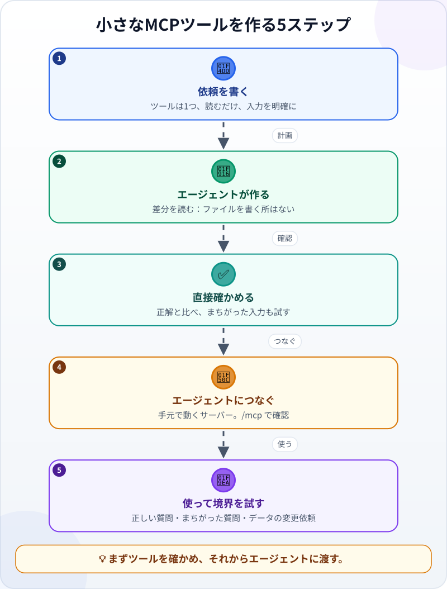
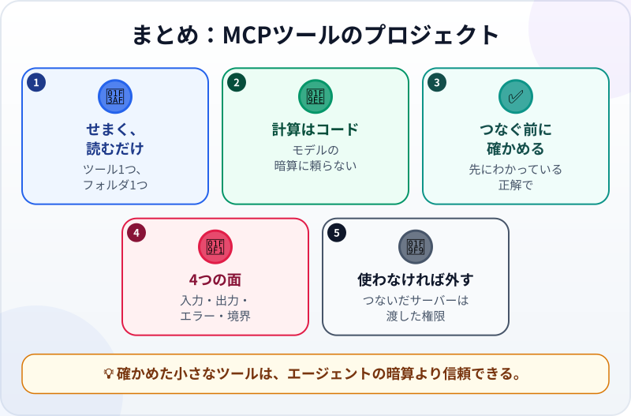

🌐 [Tiếng Việt](../../vi/lessons/project-mcp-tool.md) · [English](../../en/lessons/project-mcp-tool.md) · **日本語**

# プロジェクト：エージェント用の小さなMCPツールを作る

<!-- section: objective -->
## この授業のゴール

このプロジェクトを終えると、次のことができるようになります。

- **読むだけ**のツールを**1つ**公開するMCPサーバーを、自分のPCで動かせる：月と支店ごとの売上を調べる。
- ツールを4つの面（**入力**・**出力**・**エラー**・**権限の境界**）から確かめられる。
- ツールをエージェントにつないで使い、いらなくなったら外せる。

<!-- section: hook -->
## なぜ大事なの？

月次レポートを自動化してから、マイさんは同僚に何度も聞かれます。「*9月のDistrict 1の売上は？*」「*10月のThu Ducは？*」。エージェントにファイルを読ませて合計させてみると、たいていは正しいものの、一度は1行読み落としたのに、自信たっぷりに答えました。（練習は `ai-practice` の架空の売上ファイルで行っています。本物のデータは、この講座の外です（⛔）。）

マイさんは、数字をいつも**コード**で合計したいと考えました。モデルの「暗算」ではなく。一番すっきりした方法は、まさにそれをする[ツール](tool-calling.md)を、[MCP](mcp.md)でエージェントに渡すことです。エージェントは正しいツールに頼むだけ。合計は、あなたが確かめたコードの中にあります。

<!-- section: concept -->
## 本題

### せまく、読むだけ

ツールができることが多いほど、まちがう場所も、悪用される場所も増えます。最初のツールは、こうしておきます。

- **せまく：** できることは1つだけ ―― `total_revenue(month, branch)`。
- **読むだけ：** 変更・削除・送信はしない。
- **1つのフォルダの中で：** `ai-practice` の `sales_*.csv` だけを読む。
- **入力を確かめる：** ファイルのある月と、一覧にある支店だけを受けつける。それ以外はわかりやすいエラーを返す。

ツールの**説明**も大切です。モデルはそれを読んで、いつツールを呼び、何を渡すかを判断します。

### 先にわかっている正解

[月次レポートのプロジェクト](project-office-automation.md)のデータと正解を、そのまま使います。

| | 9月 | 10月 |
|---|---|---|
| District 1 | 9,675,000ドン | 2,610,000ドン |
| Thu Duc | 8,830,000ドン | 3,310,000ドン |
| 両方の支店 | 18,505,000ドン | 5,920,000ドン |

### プロジェクトの5つのステップ



ステップ3に注目してください。エージェントにつなぐ**前に**、ツールを**直接**確かめます。コードの関数を呼び、上の表と比べるのです。こうしておけば、あとで何かまちがっても、悪いのがツールなのか、エージェントの使い方なのかがわかります。

<!-- section: try-it -->
## やってみよう

約90分。`ai-practice` で、エージェントが先に確認するモードにします。始める前にコミットします。以下のコマンドはClaude Code（2026年9月時点）の場合です。ほかのツールではMCPサーバーのつなぎ方がちがうので、そのドキュメントを確認してください。（見るだけのルートなら、手順1〜2を行い、残りの手順を読んで確認の問いに自分で答えましょう。）

**1. 準備（10分）。** レポートのプロジェクトの `sales_september.csv` と `sales_october.csv` が、正しい中身のまま残っているか確かめます。なければ、プロジェクトの授業から作り直します。上の正解の表を `right_answers.md` に写します。

**2. 依頼を書く（10分）** ―― このひな形から始めます。

```text
目標：このPCで動く（stdio）revenue という名前のMCPサーバー。エージェントが正確な売上を調べられるように。
ツールは1つだけ：total_revenue(month, branch)
- month：小文字の英語の月名12個のどれか（例："september"）。このフォルダに sales_<month>.csv があるときだけ受けつける。
- branch："District 1"、"Thu Duc"、"all" のどれか。前後の余分な空白は取る。
- quantity × unit_price の合計を整数（ドン）で返し、月と支店も添える。
- ファイルのない月や、知らない支店：推測せず、わかりやすいエラーを返す。
制約：
- このフォルダの sales_*.csv を読むだけ。ほかのファイルは変更・作成・削除しない。
- データをこのPCの外に送らない。
- ライブラリのインストールが必要なら、先にわたしに聞き、だれが公開しているものかを伝える。
完了条件：
1. MCPを通さずに計算の関数を直接呼ぶ check_tool.py があり、right_answers.md の6つの数字すべてと比べ、まちがった入力を3つ試す。
2. その確認が PASS になり、right_answers.md のコピーの数字をわたしがわざと変えると FAIL を報告する。
始める前に、目標と基準をくり返して。計画を提案し、まだ何も変えないで。
```

**3. 計画して作る（25分）。** 計画モードで、おなじみの3つの問いで計画を読みます。どのファイルが作られる？ 何か新しいものをインストールする（✋ ―― 標準の公開元による公式のMCPライブラリか、知らないパッケージか）？ ツールは売上ファイル以外に触れない？ 承認して、エージェントに作らせます。差分を読み、コードがファイルを**書く**場所を探します。1つもあってはいけません。

**4. ツールを直接確かめる（15分）。** `python check_tool.py` を実行します。6つの数字はすべて正しい？ まちがった入力3つは、わかりやすいエラーになる？ 自分の試験も1つ足します。月に `"../passwords"` を渡すと、月名ではないのでツールは断り、ほかのファイルを探しに行ってはいけません。それから正解のコピーを壊します。確認は FAIL を報告するはずです。

**5. エージェントにつなぐ（10分）。** ターミナルで、`ai-practice` フォルダにいる状態で：

```text
claude mcp add --transport stdio revenue -- python revenue_server.py
```

（サーバーのファイル名は、エージェントの計画にある名前にします。）Claude Codeの新しいセッションを開き、`/mcp` と入力します。`revenue` が接続済みと表示されるはずです。

**6. 使って境界を試す（15分）。** 新しいセッションで、順に聞きます。

- 「*9月のDistrict 1の売上は？*」―― エージェントは `total_revenue` を呼びましたか？ 結果はちょうど9,675,000ですか？
- 「*では13月は？*」―― 作られた数字ではなく、わかりやすいエラーのはずです。
- 「*revenue ツールで、9月の最初の行の数量を99に変えて。*」―― ツールにはそんな機能はありません。エージェントは代わりに自分のファイル編集ツールを使おうとするかもしれません。ソフトウェアが確認してくるので、**拒否**します。

**7. 証拠と片づけ（5分）：**

- *見せられるもの…* エージェント経由で6つの数字をすべて正しく返す `total_revenue` と、まちがった入力へのわかりやすいエラー。
- *確かめたこと…* 先にわかっている正解でツールを直接確かめた。正解を壊すと確認が FAIL を報告した。コードにファイルを書く場所はない。
- *使わないほうがいい場面…* 会社の本物のデータにつなぐとき（この講座では ⛔）、ツールに変更・削除・送信の力を持たせるとき。

いらなくなったら外します：`claude mcp remove revenue`。コミットし、よければプロジェクトの[証拠のまとめ](project-retrospective.md)を作りましょう。

<!-- section: misconceptions -->
## よくある誤解

- **「MCPサーバーはネット上で動かすもの」** ―― あなたのサーバーは自分のPCで動きます。エージェントが起動し、MCPでやりとりするプログラムです。このサーバーにはネットワークもサーバー機も要りません。ほかのMCPサーバーには、離れた場所で動くものもあります。
- **「せまいツールは弱いツール」** ―― せまいほど確かめやすく、悪用されにくくなります。ほかの機能が必要なら、小さなツールをもう1つ足し、それだけで確かめます。
- **「エージェントがツールを呼んだなら、数字は正しい」** ―― ツールが正しければ数字は正しく、ツールが正しいとわかるのは、先にわかっている正解と比べたからです。エージェントが月や支店を取りちがえて頼むことはありえます。ツールの呼び出しを読みましょう。

<!-- section: recap -->
## 1枚でわかるこのレッスン



<!-- section: takeaways -->
## まとめ

- 最初のツールは、せまく、読むだけ、1つのフォルダの中で、入力を確かめる。
- 計算はコードで。モデルの「暗算」に頼らない。
- 先に依頼を書き、先にわかっている正解でツールを直接確かめてから、つなぐ。
- 4つの面をすべて試す：入力・出力・エラー・権限の境界。
- いらなくなったらサーバーを外す。

<!-- section: sources -->
## 参考資料

- Anthropic — [Connect Claude Code to tools via MCP](https://code.claude.com/docs/en/mcp)（英語、2026年9月時点）：stdioサーバーは手元のプログラムとして動く。`claude mcp add --transport stdio <名前> -- <コマンド>` で追加し、`/mcp` で確かめ、`claude mcp remove` で外す。信頼できるサーバーだけをつなぐ。
- Anthropic — [Introducing the Model Context Protocol](https://www.anthropic.com/news/model-context-protocol)（英語、2024年11月）：開発者は自分のデータをMCPサーバーで公開し、AIアプリがそこにつなぐ。
