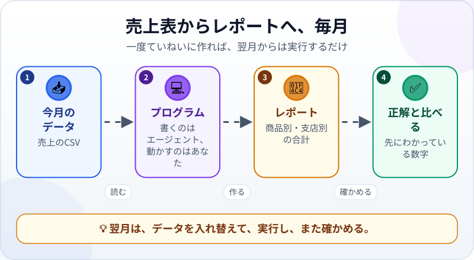
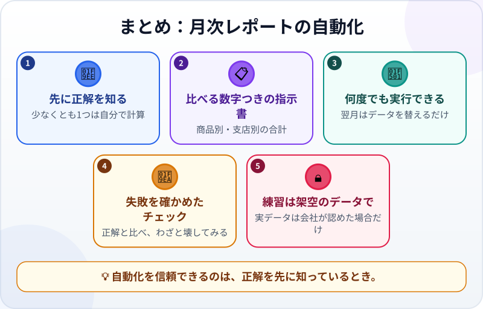

🌐 [Tiếng Việt](../../vi/lessons/project-office-automation.md) · [English](../../en/lessons/project-office-automation.md) · **日本語**

# プロジェクト：事務作業を自動化する（表計算 → レポート）

<!-- section: objective -->
## この授業のゴール

このプロジェクトを終えると、次のようになります。

- 売上ファイルから月次の売上レポートを作り、翌月も**もう一度実行できる**プログラムがある。
- **先にわかっている正解**と、失敗を確かめたチェックで、レポートを検証できる。
- 職場の実データにこの方法を使ってよいとき、まだ使うべきでないときがわかる。

<!-- section: hook -->
## なぜ大事なの？

マイさんは経理担当です。毎月末、売上ファイルから商品別・支店別の売上を合計するのに半日かかります。くり返しで、間違えやすく、退屈。まさに自動化すべき仕事です。

でも、間違ったレポートを上司に送ってしまうのは、手作業よりずっと悪い結果です。このプロジェクトでは、自動化でいちばん大切なルールを学びます。**プログラムを信じるのは、正しいとわかる方法を持ってから。**

<!-- section: concept -->
## 本題

### 売上表からレポートへ



エージェントは小さな Python のプログラムを書きます。売上の CSV を読み、売上額（数量 × 単価）を計算し、商品別・支店別に合計してレポートに書き出す。あなたはプログラムを実行して確かめます。翌月は、データのファイルを入れ替えるだけです。

**Python を入れられない？** 表計算だけのルートもあります。CSV を Excel か Google スプレッドシートで開き、売上額の列を足して、ピボットテーブルか `SUMIF` を使います。手順はエージェントかチャットボットに一つずつ教えてもらいましょう。正解と比べるステップは、まったく同じです。

### 先にわかっている正解

仕事を任せる前に、少なくとも1つの正しい数字を知っておきます。下のサンプルデータの正解は次のとおりです：

| | 9月 | 10月 |
|---|---|---|
| **売上合計** | 18,505,000ドン | 5,920,000ドン |
| Coffee beans | 6,480,000ドン | 3,600,000ドン |
| Green tea | 6,175,000ドン | 1,330,000ドン |
| Cookies | 5,850,000ドン | 990,000ドン |
| District 1 | 9,675,000ドン | 2,610,000ドン |
| Thu Duc | 8,830,000ドン | 3,310,000ドン |

職場では、こんな表は用意されていません。でも、1つか2つの数字（商品を1つ、支店を1つ）なら、いつでも自分で計算して比べられます。

### 会社の実データは？

練習は架空のデータで。実データを使うのは、**会社が認めている場合だけ**。許可されたツールで、ルールどおりに。そして、そのときも自分で計算した数字とレポートを比べましょう。

<!-- section: try-it -->
## やってみよう

約90分。`ai-practice` の中で、エージェントが先に確認するモードで行います。始める前にコミットしましょう。

**1. データを作る（10分）。** 次の内容と**まったく同じ**2つのファイルを、エージェントに作ってもらいます。

`sales_september.csv`：

```text
date,branch,product,quantity,unit_price
2026-09-02,District 1,Coffee beans,12,180000
2026-09-03,Thu Duc,Green tea,20,95000
2026-09-05,District 1,Cookies,30,45000
2026-09-08,Thu Duc,Coffee beans,8,180000
2026-09-10,District 1,Green tea,15,95000
2026-09-12,Thu Duc,Cookies,25,45000
2026-09-15,District 1,Coffee beans,10,180000
2026-09-18,Thu Duc,Green tea,18,95000
2026-09-20,District 1,Cookies,40,45000
2026-09-23,Thu Duc,Coffee beans,6,180000
2026-09-26,District 1,Green tea,12,95000
2026-09-29,Thu Duc,Cookies,35,45000
```

`sales_october.csv`：

```text
date,branch,product,quantity,unit_price
2026-10-03,District 1,Coffee beans,9,180000
2026-10-09,Thu Duc,Green tea,14,95000
2026-10-16,District 1,Cookies,22,45000
2026-10-24,Thu Duc,Coffee beans,11,180000
```

**2. 1つの数字を自分で計算する（10分）。** 電卓で：9月の Coffee beans の売上 ＝ (12 + 8 + 10 + 6) × 180,000 ＝ ？ 正解の表と比べましょう。

**3. 指示書を書く（10分）** ――この見本から始めます：

```text
目標：毎月、売上ファイルから売上レポートを作り、上司に送る。
背景：9月のデータは sales_september.csv（列は date, branch, product, quantity, unit_price。
売上額 ＝ quantity × unit_price）。架空のデータです。
制約：
- Python のプログラム make_report.py を書く。Python に最初から入っているライブラリだけを使う。
  インストールが必要なら先に確認する。
- データのファイルは変えない。レポートは新しいファイル report_september.html に書く。
- 入力ファイルの名前を変えれば、別の月でも実行できる。
完了条件：
1. レポートに売上合計、商品別の売上、支店別の売上がある。
2. 数字が、下に貼る正解の表と一致する。
3. sales_october.csv で実行すると、10月の正解と一致する10月のレポートができる。
4. 正解と比べる自動チェックがあり、数字を1つ変えると FAIL になる。
始める前に、目標と完了条件を言い直してください。不明な点があれば、先に質問してください。
```

その下に、正解の表を貼りましょう。

**4. 調べて計画する（10分）。** 計画モードで、3つの問いで計画を読みます。Python がまだない？ インストールする（✋ 先に確認し、公式の手順に従う）か、表計算のルートにするかを決めます。

**5. 作って差分を読む（20分）。** 変更を一つずつ読みます。どのファイルが作られる？ プログラムはデータのファイルに触れていない？

**6. 確かめる（20分）：**

- プログラムを実行し、`report_september.html` を開いて正解と比べる。数字を一つ残らず。
- エージェントにチェックを実行してもらい、レポートのコピーをわざと壊す。チェックは FAIL になるはず。
- 10月でも実行して比べる。おかしい？ 探偵のようにデバッグしましょう。

**7. 証拠を書いて、誰かに見せる（10分）：**

- *見せられるもの…* 同じプログラムで作った9月と10月のレポート。
- *確かめたこと…* すべての数字を正解と比べた。壊したコピーではチェックが FAIL になった。
- *使わないほうがいい場面…* たとえば、使う許可のない会社の実データ。または、プログラムを書いたときと列が違うファイル。

わかりやすいメッセージで、結果をコミットしましょう。

<!-- section: misconceptions -->
## よくある誤解

- **「エラーなしで動けば、レポートは正しい」** ―― プログラムは問題なく動いたまま、計算を間違えることがあります。わかるのは正解と比べたときだけです。
- **「自動化したら、もう確かめなくていい」** ―― データは月ごとに変わります。列が増える、商品が増える、空の欄がある。チェックを残し、毎回1つは自分で計算しましょう。
- **「本当に学べるのは実データだけ」** ―― 架空のデータでも、身につくスキルはまったく同じ。実データは会社が認めている場合だけです。

<!-- section: recap -->
## 1枚でわかるこのレッスン



<!-- section: takeaways -->
## まとめ

- 自動のレポートを信じる前に、正解を先に知る。少なくとも1つは自分で計算した数字を。
- 比べる数字つきの指示書と、翌月も実行できるプログラム。
- 正解と比べるチェックがあり、それが失敗するところも確かめた。
- 練習は架空のデータで。実データは会社が認めている場合だけ。
- 最短ルートを走り終えました。AIエージェントに仕事を任せ、確かめ、結果に責任を持てるようになりました。

<!-- section: sources -->
## 参考資料

- Anthropic — [Best practices for Claude Code](https://code.claude.com/docs/en/best-practices)（英語）：もっともらしく見える結果でも、境界のケースを見落としていることがある。検証の手段を必ず用意し、検証できないものは出さない。
