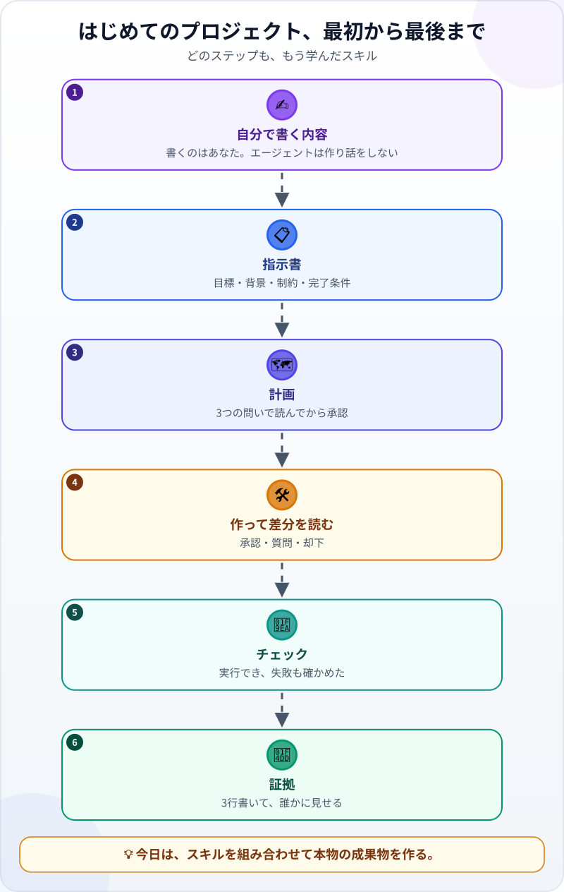
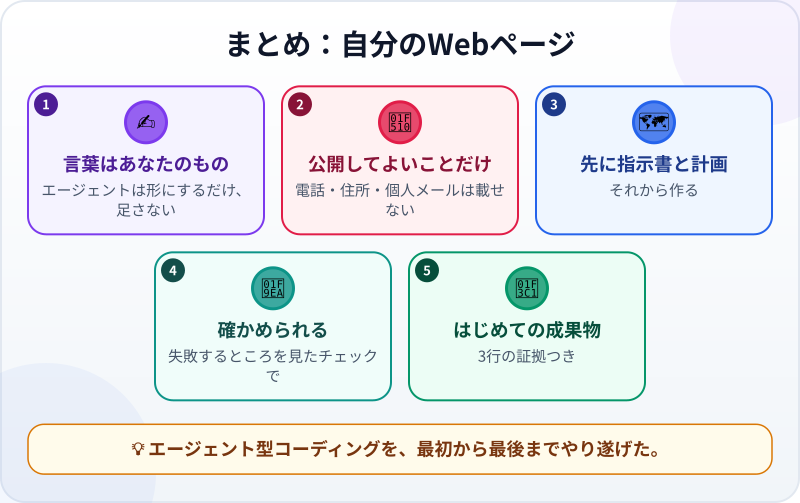

🌐 [Tiếng Việt](../../vi/lessons/project-personal-page.md) · [English](../../en/lessons/project-personal-page.md) · **日本語**

# プロジェクト：自分のWebページ

<!-- section: objective -->
## この授業のゴール

このプロジェクトを終えると、次のようになります。

- `ai-practice/personal-page/` に、きちんと動く自己紹介のWebページがある。
- エージェントとの作業を一周、自分でやり通している：内容 → 指示書 → 計画 → 作って差分を読む → チェック → 証拠。
- 成果物を3行の証拠とともに、ほかの人に見せられる。

<!-- section: hook -->
## なぜ大事なの？

ここまでは、1つの授業で1つのスキルを学んできました。このプロジェクトでは、それを組み合わせます。成果物はまだ小さく、あなたが誰で、何に関心があり、何を作ったかを紹介するページです。でも今回は、**最初から最後まであなたがリーダー**です。

そして、自分についてのページだからこそ、大事なことがすぐにわかります。エージェントは見せ方がとても上手。でも、**内容はあなたのものでなければなりません**。

<!-- section: concept -->
## 本題

### プロジェクトの最初から最後まで



どのステップも、もう学んだスキルです：

- **指示書：** [良い指示書の書き方](writing-good-specs.md)
- **計画：** [調べる→計画する→作る→検証する](explore-plan-build-verify.md)
- **差分を読む：** [エージェントの変更をレビューする](reviewing-agent-changes.md)
- **チェック：** [「たぶん合っている」をチェックに変える](testing-basics.md)
- **うまくいかないとき：** [探偵のようにデバッグする](errors-and-debugging.md)

### このプロジェクトの2つのルール

- **内容はあなたのもの。** 自己紹介は自分で書きます。エージェントは形にするだけで、あなたについての情報を足しません。エージェントは、もっともらしいことを自信たっぷりに作ってしまうことがあるからです。
- **公開してよいことだけ。** 電話番号、自宅の住所、個人のメールアドレスは載せません。会社の全員が読むつもりで書きましょう。

<!-- section: try-it -->
## やってみよう

約60分。`ai-practice` の中で、エージェントが変更のたびに確認するモードで行います。

**1. 内容を書く（10分）。** `jikoshokai.txt` というファイルを作り、**自分で書きます**：

- 使いたい名前かニックネーム。
- 2〜3文の自己紹介：何をしている人か、なぜエージェント型コーディングを学んでいるか。
- 興味のあることかスキルを3つ。
- プロジェクト1つ：「今週のやること」カード。何をするものかを一文で。

**2. 指示書を書く（10分）** ――この見本から始めて、自分に合わせて直しましょう：

```text
目標：友だちや同僚に見せる、自己紹介のWebページ。
背景：内容は jikoshokai.txt にある（自分で書いた）。my-week.html のカードもこのフォルダにある。
制約：
- 新しいファイルはすべて新しいフォルダ personal-page/ に入れる。
- jikoshokai.txt の文章だけを使い、私についての情報を足さない。
- 電話番号、自宅の住所、個人のメールアドレスは載せない。
- インターネットなしで開ける。外部から読み込むライブラリやフォントは使わない。
完了条件：
1. personal-page/index.html を開くと、名前・自己紹介・興味やスキル3つ・プロジェクトがすべてある。
2. jikoshokai.txt のすべての文がページにあり、エージェントが足した文はない。
3. my-week.html へのリンクでカードが開く。
4. ウィンドウをスマホの幅まで狭めても読め、横にスクロールしなくてよい。
始める前に、目標と完了条件を言い直してください。不明な点があれば、先に質問してください。
```

**3. 調べて計画する（10分）。** 計画モードで指示書を送り、計画を提案してもらいます。3つの問いで読みましょう。どのファイルが変わる、または作られる？ 何が追加される？ どれがあなたの決めること（色、レイアウト）？ それから承認します。

**4. 作って差分を読む（15分）。** 変更は一つずつ読んでから承認します。注意点：`personal-page/` の外のファイルはない？ `jikoshokai.txt` にない文はない？ カードへのリンクは `../my-week.html` のようになっています。一つ上がる相対パスです。

**5. チェック（10分）：**

```text
自動チェックを書いてください：jikoshokai.txt のすべての文が personal-page/index.html にあり、
my-week.html へのリンクが実在するファイルを指していること。実行して結果を見せてください。
次に、1文を消した index.html のコピーに対して実行してください。FAIL になるはずです。
```

完了条件4は自分で確かめます。ウィンドウを狭めて読んでみましょう。

**6. 証拠を書いて、誰かに見せる（5分）：**

- *見せられるもの…* ブラウザーで開いた `personal-page/index.html`。狭いウィンドウでも。
- *確かめたこと…* 4つの完了条件。チェックは本物のページで PASS、壊したコピーで FAIL。
- *使わないほうがいい場面…* たとえば、個人的な情報が必要なページや、毎日更新するページ。

そして友だちにページを開いてもらい、あなたがどんな人かを言ってもらいましょう。伝わっていましたか？

**チャレンジ（任意）：** 誰でも開けるようにページをネットに公開する。これは Git を学んでからにしましょう。

<!-- section: misconceptions -->
## よくある誤解

- **「自己紹介もエージェントに書かせたほうが速い」** ―― エージェントはあなたを知りません。聞こえはよくても、間違った文を書くかもしれません。あなたについての内容は、あなたが書きます。
- **「自己紹介のページにチェックはいらない」** ―― 「すべての文が `jikoshokai.txt` から来ている」というチェックこそ、エージェントが勝手に足した文を見つけてくれます。
- **「完璧になるまで人に見せてはいけない」** ―― 3行の証拠とともに早めに見せるのが、次に直すべきことを知るいちばんの方法です。

<!-- section: recap -->
## 1枚でわかるこのレッスン



<!-- section: takeaways -->
## まとめ

- あなたについての内容はあなたが書く。エージェントは形にするだけで、何も作り足さない。
- ページには、公開してよいことだけを載せる。
- 指示書 → 計画 → 作って差分を読む → チェック → 証拠：これがエージェントとの作業の一周。
- 基準をつけて仕事を任せ、計画と変更を承認し、チェックで検証する。この規律ある進め方を*エージェンティック・エンジニアリング*（agentic engineering）と呼ぶ人もいます。この講座では、引き続きエージェント型コーディングと呼びます。

<!-- section: sources -->
## 参考資料

- Anthropic — [Best practices for Claude Code](https://code.claude.com/docs/en/best-practices)（英語）：テスト、スクリプト、スクリーンショットなど、検証の手段を必ず用意する。検証できないものは出さない。
