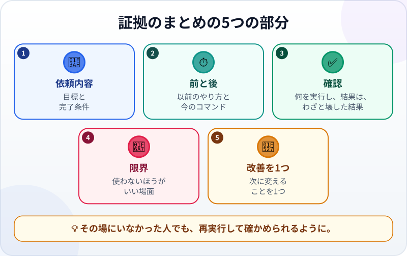
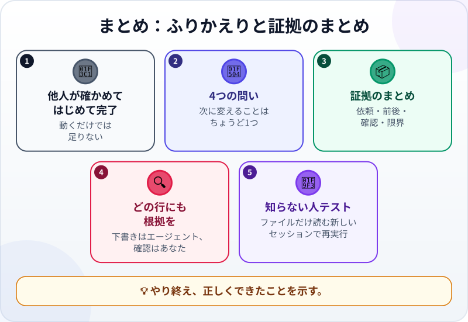

🌐 [Tiếng Việt](../../vi/lessons/project-retrospective.md) · [English](../../en/lessons/project-retrospective.md) · **日本語**

# プロジェクトのふりかえりと証拠のまとめ

<!-- section: objective -->
## この授業のゴール

この授業を終えると、次のことができるようになります。

- だれも責めずに、4つの問いでプロジェクトをふりかえれる。
- プロジェクトの証拠を短い1つのファイルにまとめられる：依頼内容、前と後、確認、限界、改善を1つ。
- 「知らない人」で証拠のまとめを試せる：そのファイルしか読めない新しいエージェントのセッション。

<!-- section: hook -->
## なぜ大事なの？

マイさんは[月次レポートのプロジェクト](project-office-automation.md)をやり終えました。架空の売上ファイルを読んでレポートを作るプログラムと、それを正解と比べるチェックです。上司に報告すると、3つ質問されました。

「*それは正しい？ あなたが休んだら、だれが動かせる？ まちがえそうなところはある？*」

マイさんは答えを知っています。ただしそれは、自分の頭の中、閉じてしまったいくつかのチャット、`ai-practice` のファイルに散らばっています。5分で渡せるものは何もありませんでした。

プロジェクトが本当に終わるのは、**ほかの人**が確かめられるようになったときです。

<!-- section: concept -->
## 本題

### ふりかえり：4つの問い

やり終えた直後、まだよく覚えているうちに、4つの問いに短く答えます。

1. **最初の目標は何で、どこまで達成した？** 依頼に書いた基準と比べます。
2. **うまくいったことは？** どの手順、どの依頼の書き方、どの確認が役立ったか。
3. **うまくいかなかったことと、その直し方は？** バグ、エージェントが道をそれたとき、あなたが止めたとき。
4. **次に変えることは？** 具体的なことを**1つだけ**。実際にやる1つは、心がけの5つにまさります。

ふりかえりは、だれのせいかを探すためのものではありません。エージェントを責めるためでもありません。次をよくするためのものです。

### 証拠のまとめ：5つの部分



証拠のまとめは、プロジェクトの横に置く**短い1つのファイル**（たとえば `EVIDENCE.md`）で、プロジェクトを一度も見たことのない人に向けて書きます。

- **依頼内容：** 目標と完了条件。[良い指示書の書き方](writing-good-specs.md)のとおりです。
- **前と後：** 以前はどうしていて、どれだけかかったか。今はどのコマンド1つで動くか。見積もりの数字は、見積もりだとはっきり書きます。
- **確認：** 何を実行し、結果はどうだったか。そして確認が本当にミスを見つけられる証拠（わざと壊した試験）。
- **限界：** 使う**べきでない**とき。形のちがうデータ、会社の本物のデータ（この講座では ⛔）、試していないケース。
- **改善を1つ：** 上の4つめの問いへの答え。

これは、おなじみの3行の証拠（*見せられるもの… / 確かめたこと… / 使わないほうがいい場面…*）を、ほかの人がやり直せるくらいまで書き広げたものです。

### 下書きはエージェント、確認はあなた

エージェントは、[Git](git-version-control.md)の履歴、ファイル、確認の結果を読んで、証拠のまとめの下書きをすばやく作れます。でも、まとめは[ハルシネーション](hallucination.md)がまぎれこみやすい場所でもあります。だれも測っていない数字、一度も実行していない確認。1行ごとに「*どこから来た情報か指させる？*」と問います。指させなければ、直すか消します。

### 知らない人テスト

証拠のまとめがよいのは、その場に**いなかった**人でも、プロジェクトを再実行して確かめられるときです。一番安い試し方は、**新しいエージェントのセッション**を開き、証拠のファイルだけを読ませて、そのとおりにやってもらうことです。推測しなければならなかったところが、ファイルに足りないところです。注意点が1つ。多くのツールは、指示ファイル（`CLAUDE.md` など）を新しいセッションに自動で読みこみます。そうしたファイルから何を使ったかをセッションに聞き、プロジェクトに必要なものは証拠のファイルにも書きます。

<!-- section: try-it -->
## やってみよう

約11分。`ai-practice` の月次レポートのプロジェクト（または[自分のWebページ](project-personal-page.md)）を使います。（見るだけのルートなら、最近やり終えたことについて、手順1を行い、手順2を紙に書いてみましょう。）

**1. ふりかえる（3分）。** 4つの問いへの短い答えを `RETRO.md` に書きます。

**2. 証拠のまとめの下書き（3分）。** エージェントに頼みます。

```text
このプロジェクトの EVIDENCE.md を下書きして。5つの部分：依頼内容、前と後、
確認、限界、改善を1つ（RETRO.md から）。
ファイル、Gitの履歴、実際の実行結果にあることだけを書く。確かでないところは「要確認」と書く。
プログラムと確認をもう一度実行するための、正確なコマンドを書いておく。
```

**3. 1行ずつ確かめる（3分）。** 各行について、証拠を指させますか？ ファイルに書かれたコマンドを自分で実行します。「要確認」をすべて片づけます。だれも測っていない数字は消します。

**4. 知らない人テスト（2分）。** **新しいセッション**を開き、こう頼みます。

```text
EVIDENCE.md だけを読んで。そのとおりにプログラムと確認をもう一度実行して。
ファイルがはっきりしないせいで推測しなければならなかったところを、すべて挙げて。
```

続けて「*最初に自動で読みこまれたファイル（指示ファイルなど）から、何か使った？*」とも聞きます。推測したところや、そうしたファイルに頼ったところを証拠のファイルで直します。コミットします。

**証拠：**

- *見せられるもの…* `RETRO.md` と `EVIDENCE.md`、そしてそのファイルだけでプロジェクトを再実行できた新しいセッション。
- *確かめたこと…* ファイルの1行1行を、実際のファイル、Gitの履歴、再実行の結果と照らし合わせた。
- *使わないほうがいい場面…* 証拠のまとめに本物のデータや社内の情報を入れる必要があるとき。それらはこの講座では ⛔ なので、架空のデータだけでまとめる。

<!-- section: misconceptions -->
## よくある誤解

- **「ふりかえりは、だれがまちがえたかを探すもの」** ―― 次をよくするためのものです。正しい問いは「*何が起きたか*」で、「*だれがまちがえたか*」ではありません。
- **「証拠のまとめは、自慢のためのもの」** ―― 限界やまちがえたことも書きます。よいことばかりの文書は、かえって信頼されにくくなります。
- **「エージェントがまとめを書いたから、そのまま送る」** ―― まとめにも作られた数字がまじりえます。どの行も証拠を指させなければなりません。

<!-- section: recap -->
## 1枚でわかるこのレッスン



<!-- section: takeaways -->
## まとめ

- プロジェクトが終わるのは、ほかの人が確かめられるようになったとき。
- 4つの問いでふりかえり、次に変えることをちょうど1つ選ぶ。
- 証拠のまとめ：依頼内容、前と後、確認、限界、改善を1つ。
- 下書きはエージェント。どの行にも、あなたが証拠を指させること。
- 知らない人テスト：ファイルから始める新しいセッションでも再実行できる。ほかに何を読んだかも確かめる。

<!-- section: quiz -->
## 確認クイズ

**問1.** 証拠のまとめで**絶対に欠かせない**部分は？

- A) エージェントとのすべての会話の記録
- B) 限界：使うべきでないとき
- C) 使った指示を一字一句そのまま

**問2.** エージェントの下書きに「月5時間の節約」とありますが、あなたは測っていません。どうすべき？

- A) 消すか、自分の見積もりだとはっきり書き、その理由も書く
- B) 説得力があるのでそのままにする
- C) エージェントがたぶん測ったので、そのままにする

**問3.** 証拠のまとめが十分かを確かめる、一番安い方法は？

- A) もう一度自分で読み直す
- B) そのファイルだけを新しいエージェントのセッションに読ませ、プロジェクトを再実行させる
- C) 書いたエージェント自身に、足りないところがないか聞く

<details>
<summary>答えを見る</summary>

1. **B** ―― ほかの人は、いつ使うべきでないかを知る必要があります。これがないと、一番大事な部分が欠けています。
2. **A** ―― 証拠を指させることだけを書きます。測っていない数字は証拠ではありません。
3. **B** ―― 新しいセッションは、作っていたときの会話を覚えていません。そのファイル（とツールが読みこむ指示ファイル。そこから何を使ったかも確かめます）から始めます。推測したところが、ファイルに足りないところです。

</details>
