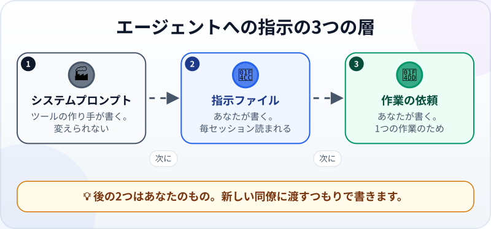
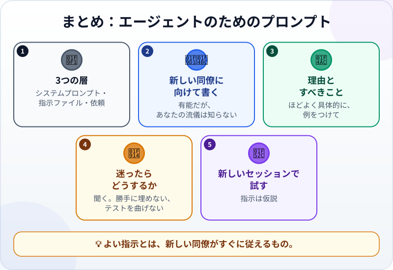

🌐 [Tiếng Việt](../../vi/lessons/prompt-engineering-for-agents.md) · [English](../../en/lessons/prompt-engineering-for-agents.md) · **日本語**

# エージェントのためのプロンプトエンジニアリング：システムプロンプトと指示

<!-- section: objective -->
## この授業のゴール

この授業を終えると、次のことができるようになります。

- 3つの層の指示（**システムプロンプト**、**プロジェクトの指示ファイル**、**作業ごとの依頼**）を見分け、どれがあなたのものかがわかる。
- 5つの方法で、弱い指示をエージェントが従える指示に書き直せる。
- 新しいセッションで指示を試し、効いているかどうかがわかる。

<!-- section: hook -->
## なぜ大事なの？

マイさんは、レポートのプロジェクトの指示ファイルにこう書きました。「*レポートはちゃんとした感じにすること。*」1週目、エージェントは表紙をつけました。2週目は、見出しを別の言語に変えました。3週目は「にぎやかにするため」に、各項目の頭に絵文字を入れました。

同じことを新しい同僚に言えば、「ちゃんとした感じって、どういうことですか？」と聞き返されるでしょう。エージェントは聞き返しません。推測し、毎回ちがう推測をします。

マイさんの指示はまちがってはいません。本当にほしいものを言っていないだけです。

<!-- section: concept -->
## 本題

### 3つの層の指示

エージェントが作業するとき、指示は3つの層から読まれます。



1. **システムプロンプト** ―― ツールの作り手が書き、すべての会話の下にあるもの。エージェントがだれで、どのツールを使え、どう働くか。たいてい全部は見えず、たいていは直接変えることもできません。
2. **プロジェクトの指示ファイル** ―― **あなた**が書き、毎セッションの最初に読まれるもの（[コンテキストエンジニアリング](context-engineering.md)で書く練習をしました）。
3. **作業ごとの依頼** ―― **あなた**が書く、1つの作業のためのもの（[良い指示書の書き方](writing-good-specs.md)のとおり）。

[プロンプトの基本](prompting-basics.md)では、チャットボットにはっきり聞く方法を学びました。エージェントの場合、指示は**長もち**しなければなりません。多くのセッションや作業でくり返し読まれ、エージェントはそれに従って行動するからです。答えるだけではありません。

### エージェントが従える指示を書く5つの方法

Anthropicのドキュメント（2026年9月時点）は、ひとつの考え方をすすめています。モデルを、**とても優秀だけれど、あなたの職場の流儀をまだ知らない新入社員**だと考えることです。その作業を何も知らない同僚に指示を渡してみてください。同僚がとまどうところで、エージェントもとまどいます。

**1. 理由を伝える。** 「*顧客名を書かない*」が止めるのは、ちょうどその1つだけです。「*社外に出す報告書なので、顧客名も担当者名も書かない*」なら、あなたが思いつかなかったケースもエージェントが自分で判断できます。

**2. 禁止だけでなく、すべきことを言う。** 「*変な数字の書き方をしない*」では、エージェントは推測するしかありません。「*金額は 1,250,000円 のように書く*」なら、目指す形がわかります。

**3. ほどよく具体的に。** Anthropicはこれを*ちょうどよい高さ*で書くことだと言います。「*ちゃんとした感じに*」のようにあいまいでもなく、あらゆる場面の「*もし〜なら〜*」を並べた硬いリストでもなく。見たいものを言います。「*300字以内の短い週報：タイトル、要点3つ、単位つきの数字の表1つ。絵文字なし。*」

**4. 短い例をつける。** 形式を説明しにくいとき、例は形式や口調を整える一番確かな方法の1つです。

**5. 迷ったときどうするかを言う。** 「*数字が足りなければ『データなし』と書いて知らせる。勝手に埋めない。*」「*テストがおかしく見えたら、止まって知らせる。テストに合わせるためだけにコードを変えない。*」

### 叫ばない

大文字、「！！！」、すべての行に「*絶対に*」。これで指示が強くなるわけではありません。Claude Codeのガイド（2026年9月時点）は、たくさんの行を強調すると、どれも目立たなくなると書いています。強調するのは、もっとはっきり書き直しても無視され続ける1行だけにします。

### 指示は試すもの

指示は仮説です。「*こう書けば、エージェントはこうするはず*」。確かめる方法は試すことだけです。前の会話を何も持ちこまないよう**新しいセッション**で試し、ふるまいが変わるかを見ます。

<!-- section: try-it -->
## やってみよう

約8分。`ai-practice` で、架空のデータを使います。（見るだけのルートなら、手順1を紙の上でやり、答えの例と比べましょう。）

**1. 弱い指示を3つ書き直す（4分）。** 5つの方法のうち少なくとも2つを使って、それぞれ書き直します。

```text
a) 略語は絶対に使うな！！！
b) 週報はちゃんとした感じで。
c) テストを壊さないで。
```

<details>
<summary>答えの例</summary>

- **a)** 「*略語を使わず、正式な言葉で書く（例：『数量』であって『Qty』ではない）。海外の取引先が翻訳ツールで読むため、略語はよく誤訳される。*」―― 理由と例があり、強調はいりません。
- **b)** 「*300字以内の短い週報：タイトル、要点3つ、単位つきの数字の表1つ。絵文字なし、表紙なし。*」―― ほどよく具体的で、すべきことを言っています。
- **c)** 「*完了と言う前に check_report.py を実行する。テストがおかしく見えたら、止まって知らせる。テストは変えず、テストに合わせるためだけのコードも書かない。*」―― 迷ったときにどうするかを言っています。

</details>

**2. 1つを試す（3分）。** 指示 **b** を選びます。これはこの週報だけのものなので、毎セッション読まれる指示ファイルには足しません。**新しいセッション**を開き、書き直した **b** を依頼の最初に貼り、続けてこう頼みます。

```text
次の架空のデータから weekly_report.md を作って：第39週、注文12件、売上1,860,000円、返品2件。
```

結果を、指示の1つ1つと比べます。300字以内？ タイトル？ 要点3つ？ 単位つきの表？ 絵文字なし？

**3. 1回だけ直す（1分）。** 守られていない点があっても、強調を足さないでください。「*新しい同僚なら、この文のどこをちがう意味に読むだろう？*」と考え、そこを直して、新しいセッションでもう一度試します。

**証拠：**

- *見せられるもの…* 書き直す前と後の3つの指示と、新しいセッションで作られた週報。
- *確かめたこと…* 指示の1つ1つを、実際の週報と照らし合わせた。
- *使わないほうがいい場面…* 止めたいことが本当に危険な操作（削除、送信、本物のデータに触れる）のとき。そのときは指示だけでなく、ツールのガードレールが必要。

<!-- section: misconceptions -->
## よくある誤解

- **「強調や『！！！』を使えば、エージェントはもっと従う」** ―― すべてを強調すると、何も目立ちません。理由のあるはっきりした文のほうが効きます。
- **「指示は長く、ケースを多く書くほどよい」** ―― 長い「もし〜なら〜」のリストは硬く、抜けも出やすくなります。ほしいものとその理由を伝えれば、残りはエージェントのほうがうまく扱えます。
- **「『消さないこと』と書けば、エージェントは消せない」** ―― 指示は注意書きであって、鍵ではありません。危険な操作は、ツールの権限とガードレールで止める必要があります。

<!-- section: recap -->
## 1枚でわかるこのレッスン



<!-- section: takeaways -->
## まとめ

- 3つの層の指示：システムプロンプト（ツールの作り手のもの）、指示ファイルと作業ごとの依頼（あなたのもの）。
- とても優秀だけれど、あなたの流儀をまだ知らない新入社員に向けて書く。
- 理由を伝え、すべきことを言い、ほどよく具体的に、例をつけ、迷ったときどうするかを言う。
- 叫ばない。すべてを強調すると、何も目立たない。
- 指示は仮説。新しいセッションで試し、ふるまいを見る。

<!-- section: quiz -->
## 確認クイズ

**問1.** ふつう、あなたが**変えられない**指示の層はどれ？

- A) プロジェクトの指示ファイル
- B) ツールのシステムプロンプト
- C) 作業ごとの依頼

**問2.** エージェントが一番正しく従いやすい指示はどれ？

- A) 「経理部に送るので、金額は 1,250,000円 のように書く」
- B) 「数字をまちがえるな！！！」
- C) 「いい感じにして」

**問3.** 指示ファイルに新しい指示を足しました。効いているかどうかは、どうすればわかる？

- A) 読み直して、筋が通っていれば十分
- B) 念のため強調する
- C) 新しいセッションで作業を頼み、エージェントのふるまいが変わるかを見る

<details>
<summary>答えを見る</summary>

1. **B** ―― システムプロンプトはツールの作り手が書きます。指示ファイルと依頼があなたの担当です。
2. **A** ―― すべきことが、例と理由つきで書かれています。Bは叫んでいるだけ、Cはあいまいです。
3. **C** ―― 指示は仮説です。新しいセッションでのふるまいが証拠になります。

</details>

<!-- section: sources -->
## 参考資料

- Anthropic — [Prompting best practices](https://platform.claude.com/docs/en/build-with-claude/prompt-engineering/claude-prompting-best-practices)（英語、2026年9月時点）：Claudeを、優秀だが背景を知らない新入社員と考える。背景をあまり知らない同僚にプロンプトを見せてみる。指示の理由を説明する。してはいけないことより、すべきことを言う。例は形式を整える確かな方法。システムプロンプトでClaudeの役割を決める。テストに合わせるためだけのコードを書かない。
- Anthropic — [Effective context engineering for AI agents](https://www.anthropic.com/engineering/effective-context-engineering-for-ai-agents)（英語、2025年9月）：システムプロンプトは「ちょうどよい高さ」で書く。硬い「もし〜なら〜」のロジックと、あいまいな一般論のあいだ。
- Anthropic — [Best practices for Claude Code](https://code.claude.com/docs/en/best-practices)（英語、2026年9月時点）：強調するのは、飛ばされ続ける1行だけ。たくさん強調すると、どれも目立たない。変更は、Claudeのふるまいが実際に変わるかを見て確かめる。
