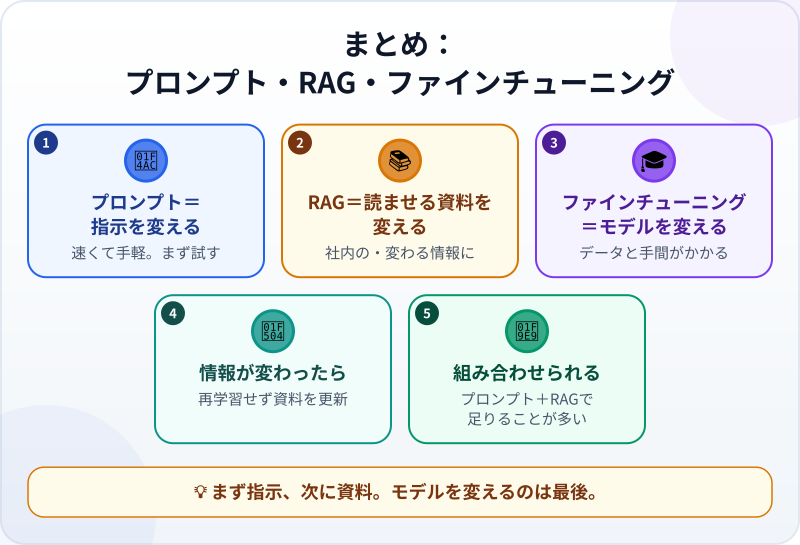

🌐 [Tiếng Việt](../../vi/lessons/prompt-rag-finetune-compare.md) · [English](../../en/lessons/prompt-rag-finetune-compare.md) · **日本語**

# プロンプト・RAG・ファインチューニング：どれを選ぶ？

<!-- section: objective -->
## この授業のゴール

このレッスンを終えると、次のことができるようになります。

- それぞれが何を変えるのかを言える：伝える指示（プロンプト）、読ませる資料（RAG）、モデルそのもの（ファインチューニング）。
- 目の前のニーズに合う方法を、試すべき順番に沿って選べる。
- よく変わる情報には、ファインチューニングよりRAGが向いている理由を説明できる。

<!-- section: hook -->
## なぜ大事なの？

マイさんのチームは、出張費精算のルールについて同僚の質問に答えるAIアシスタントを作りたいと考えています。会議では3つの意見が出ました。ある人は*「プロンプトを工夫すればいい」*。別の人は*「AIに規程集を読ませよう」*。3人目は*「会社専用のモデルをファインチューニングしないと」*。

どれももっともらしく聞こえます。でも、この3つは変えるものが違い、かかる手間もまったく違い、失敗の仕方も違います。選び方を間違えると、半日で済むことに何週間もかけてしまうかもしれません。

<!-- section: concept -->
## 本題

### 変えられる場所は3つ

AIの答えは、モデルそのもの、読んだもの、あなたが伝えたこと、の3つから生まれます。それぞれの方法は、そのうちの1つを変えます。

- **プロンプト：伝えることを変える。** 指示、お手本の例、ほしい形式などです（[プロンプトの基本](prompting-basics.md)）。すぐに効き、その会話やその1回の呼び出しの中だけで働き、いつでも直せます。
- **RAG：読ませるものを変える。** 質問のたびに、システムが資料から関連する箇所を探してコンテキストに入れます（[RAG：AIに資料を調べさせる](rag-intro.md)）。社内だけの知識、よく変わる情報、出典を示す必要がある答えに向いています。更新したいときは、資料を直します。
- **ファインチューニング：モデルそのものを変える。** 既存のモデルを新しいデータで追加学習させるので、中の数値が変わります（[機械はどうやって「学ぶ」？](how-machines-learn.md)）。モデルはそのデータのパターンをまねるようになるため、ある分野、ある種類の仕事、ある文体に合わせるのに向いています。あなたが使っているAIアシスタント自体も、アシスタントとして会話するようにファインチューニングされています。

### ファインチューニングのコスト

ファインチューニングには、質のよい例がたくさんと、学習の手間が必要です。独自のリスクもあります。モデルが例を「丸暗記」してしまったり、もともとできていたことの一部を忘れてしまったりすることがあります。データの中の誤りも一緒に学びます。情報が変わっても、モデルが学んだことは一緒には変わらないので、学習し直すしかありません。これは普通、技術チームの仕事で、自分でファインチューニングできるサービスばかりではありません。2026年9月時点で、AnthropicのGlossaryには、Claude APIは現在ファインチューニングを提供していないと書かれています。

### どの順番で試す？

1. **まずプロンプト。** いちばん速く、安く、すぐに直せます。指示をはっきりさせ、お手本を1つ添えるだけで足りる仕事はたくさんあります。
2. **次にRAG。** AIに社内の情報やよく変わる情報が足りないときに加えます。資料が数ページだけなら、プロンプトにそのまま貼るだけで足りることもあります。
3. **ファインチューニングを検討する。** 前の2つを試しても、何度も大量に繰り返す仕事で安定した文体や技能が必要で、質のよい例がたくさんあるときです。

十分によくなった段階で止めましょう。また、3つはどれか1つを選ぶものではありません。1つのシステムで、答え方はプロンプトで指示し、資料はRAGで渡し、土台にはすでにファインチューニングされたモデルを使う、ということもできます。

### コーディングエージェントでは？

この講座で使うのは、ほぼ最初の2つです。指示を書くこと（プロンプトと、プロジェクトの指示ファイル）と、必要なファイルをエージェントに[ツール呼び出し](tool-calling.md)で探して読ませること。後者はRAGと同じ考え方です。ファインチューニングは、学習者がすることはほとんどありません。

<!-- section: analogy -->
## 身近なたとえ

新入社員を思い浮かべてください。

- **プロンプト**は、1つの仕事についてはっきり指示することです。*「返信メールを、ていねいに、5文以内で書いて」*。
- **RAG**は、必要なときに調べられるよう、規程集を手渡すことです。
- **ファインチューニング**は、長い研修に送り出すことです。仕事のくせが長く変わりますが、時間がかかり、ルールが変わると学んだことが古くなるかもしれません。

たとえが合わないところもあります。研修から戻った人は理由を理解していて、新しいルールを読めば自分で考えを更新できます。ファインチューニングしたモデルにあるのは調整された数値だけです。新しいルールに従わせるには、学習し直すか、新しいルールを読ませるしかありません。

<!-- section: example -->
## 具体例

マイさんのチームは、練習用の架空の規程集を使って、順番に試してみました。

1. **プロンプトだけ：** *「あなたは総務のアシスタントです。短く、ていねいに、日本語で答えてください」*。答えの見た目はきれいですが、手当の額が間違っています。AIはマイさんの会社のルールを知らないので、よくありそうなことを書いたのです。
2. **プロンプト＋RAG：** システムが規程集から正しい項目を探し、プロンプトに入れます。答えは手当の額が正しく、項目番号も示しています。翌月ルールが変わっても、チームは規程集のファイルを差し替えるだけです。
3. **ファインチューニングの提案：** 同僚が、去年の質問と回答をすべて使ってモデルを学習させたいと言います。マイさんは2つ質問しました。*「ルールが変わったらどうなる？」* ——学習し直しになります。*「去年の回答に間違いはなかった？」* ——モデルは間違いも一緒に学んでしまいます。

チームはプロンプト＋RAGを選びました。ファインチューニングは、プロンプトでは届かない決まった文体で、同じ種類の仕事を大量に繰り返す日が来たときのために取っておきます。

<!-- section: misconceptions -->
## よくある誤解

- **「AIに社内資料を覚えさせるには、ファインチューニングが必要」** — 変わりやすく、出典も示したい情報なら、たいていRAGのほうが向いています。資料を更新すれば済みます。ファインチューニングはモデルを変えるので、新しい情報のたびに学習し直しになります。
- **「プロンプトは初心者の小技。本番はファインチューニング」** — プロンプトは最初の一歩で、安くて速く、よいプロンプトだけで足りる仕事はたくさんあります。ファインチューニングしたモデルにも、プロンプトは必要です。
- **「3つのうち1つを選ばなければならない」** — 組み合わせられます。答え方はプロンプトで、資料はRAGで、土台はアシスタントとしてファインチューニング済みのモデル、という具合です。

<!-- section: recap -->
## 1枚でわかるこのレッスン

<!-- section: takeaways -->
## まとめ

- プロンプトは伝えることを、RAGは読ませるものを、ファインチューニングはモデルそのものを変える。
- プロンプト → RAG → ファインチューニングの順に試し、十分ならそこで止める。
- 社内の、変わりやすい、出典が必要な情報 → RAG。学習し直す代わりに資料を更新する。
- ファインチューニングは安定した文体や技能向き。質のよい例がたくさんと、相応の手間が要る。
- コーディングエージェントでは、主にプロンプトと、エージェント自身にファイルを探して読ませることを使う。

<!-- section: quiz -->
## 確認クイズ

**問1.** チームは出張費のルールどおりにAIに答えさせたいのですが、ルールは数か月ごとに変わります。どれを選ぶべきですか？

- A) ルールが変わるたびに、モデルをファインチューニングし直す
- B) プロンプトを工夫するだけ
- C) 最新の規程集を使ったRAG

**問2.** モデルの中の数値そのものを変えるのはどれですか？

- A) ファインチューニング
- B) RAG
- C) プロンプト

**問3.** 決まった形式でメールを書かせたいとき、最初に試すべきなのはどれですか？

- A) 専用のモデルをファインチューニングする
- B) はっきりしたプロンプトに、お手本のメールを1つ添える
- C) RAGのシステムを作る

答えを見る

1. **C** — 変わる情報は資料に置いて、資料を更新します。プロンプトだけではルールを知りませんし、毎回ファインチューニングし直すのは高くつきます。
2. **A** — ファインチューニングは追加学習なので、モデルが変わります。RAGとプロンプトが変えるのは、1回の回答でモデルが読む内容だけです。
3. **B** — 形式は指示で決まることです。はっきりしたプロンプトとお手本があれば、たいてい足ります。

<!-- section: sources -->
## 参考資料

- Anthropic — [Glossary](https://platform.claude.com/docs/en/about-claude/glossary)（英語）の *Fine-tuning* と *RAG* の項：ファインチューニングは、事前学習済みのモデルを追加のデータでさらに学習させることで、モデルはそのデータのパターンをまねるようになる。分野・仕事・文体に合わせるのに役立つ。Claudeはすでにアシスタントとしてファインチューニングされている。Claude APIは現在ファインチューニングを提供していない（2026年9月時点）。RAGは質問が届いたときに取り出した資料をコンテキストに渡し、最新の情報、専門分野の知識、出典の明示に役立つ。
- Google Cloud — [Fine-tuning LLMs: overview and guide](https://cloud.google.com/use-cases/fine-tuning-ai-models)（英語）：ファインチューニングはモデルのパラメータを変え、RAGは外部の知識でプロンプトを補う。ファインチューニングには、より多くの計算資源とデータが必要で、過学習（オーバーフィッティング）や、それまでの知識を忘れる「破滅的忘却」のリスクがある。RAGはアクセスできるデータしか参照できない。
- Anthropic — [Introducing Contextual Retrieval](https://www.anthropic.com/news/contextual-retrieval)（英語、2024年9月）：資料が十分に小さければ、RAGを使わずに全部をプロンプトに入れてよい。それより大きければRAGを使う。
- Google Cloud — [Prompt engineering: overview and guide](https://cloud.google.com/discover/what-is-prompt-engineering)（英語）：プロンプトは、意図を理解できるよう、モデルに文脈・指示・例を与えるもの。
