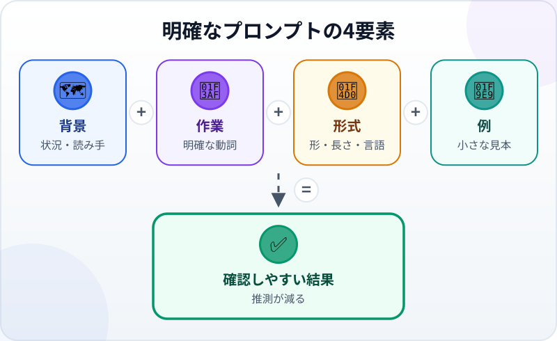
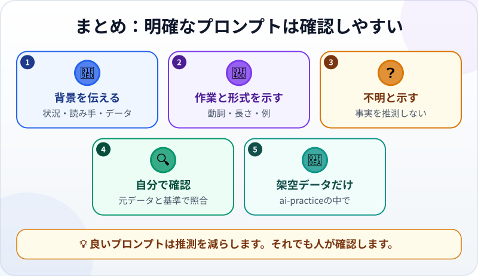

🌐 [Tiếng Việt](../../vi/lessons/prompting-basics.md) · [English](../../en/lessons/prompting-basics.md) · **日本語**

# プロンプトの基本：AIに伝わる話し方

<!-- section: objective -->
## 学習目標

このレッスンを終えると、次のことができるようになります。

- 背景、作業、出力形式、例を含むプロンプトを書く。
- 推測せず、分からない点を示すようAIへ頼む。
- 確認できる基準で2つの答えを比べる。

<!-- section: hook -->
## 導入：「いい感じに書いて」

マイは会議メモを3行チャットボットへ貼り、「いい感じに書いて」と入力します。AIは長く堅いメールを返し、会議の日付を作り、読み手を「お客様」と呼びました。どれもマイの目的に合いません。

AIは心を読めません。依頼に空白があると推測します。自然な文章でも、別の作業への答えかもしれません。

<!-- section: concept -->
## 基本の考え方

**プロンプト（prompt）**は、答えや作業を求めてAIへ渡す内容です。良いプロンプトは長文や魔法の言葉を必要としません。推測を減らす情報と、結果を確認できる明確さが必要です。



役立つ4要素は次のとおりです。

1. **背景：** 状況、読み手、使ってよいデータ。
2. **作業：** 要約する、分類する、書き直す、比較する、など明確な動詞。
3. **形式：** 箇条書きの数、表かメールか、長さ、言語。
4. **例：** 欲しい形を示す小さな見本。形式を言葉で説明しにくいときに便利です。

大切な安全柵も加えます。「以下の情報だけを使ってください。足りない場合は`不明`と書き、推測しないでください」。AIが常に正しくなる保証はありませんが、足りない情報が見え、確認しやすくなります。

「十分な背景」のために実データを渡してはいけません。ここで使う名前、日付、内容はすべて架空です。プロジェクトをエージェントへ渡す4要素は[良い仕様を書く：作業内容と完了条件](writing-good-specs.md)で学びます。ここではチャットボットとの1回の質問と回答を練習します。

<!-- section: try-it -->
## やってみよう

約12分です。次の架空データで`ai-practice/meeting-notes.txt`を作ります。

```text
プロジェクト：架空の読書コーナー
出席：マイ、佐藤
決定：土曜午前の開館を試す
不明：案内板を準備する担当者
```

実際の会社の議事録、実在する人の名前、パスワード、APIキーは使いません。

**1. 曖昧に頼む（2分）**

利用を許可されたチャットボットを開き、ファイル内容と次の依頼を貼ります。

```text
この会議について、いい感じのお知らせを書いてください。
```

答えを`ai-practice/vague-answer.txt`へ保存します。AIが追加した内容、使いにくい形式、本来なら確認すべき点に印を付けます。

**2. 明確に頼む（5分）**

最初の依頼が次へ影響しないよう、新しいチャットを始めます。同じメモと次のプロンプトを貼ります。

```text
背景：架空のボランティア団体のメモです。読み手は会議を欠席したメンバーです。
作業：決定事項と未決事項を要約してください。
形式：日本語、ちょうど3項目の箇条書き、各項目40文字以内。
1行の例：- 決定：[合意したこと]
与えたメモだけを使ってください。担当者がなければ「不明」と書き、推測しないでください。
```

結果を`ai-practice/clear-answer.txt`へ保存します。

**3. 比較し、1回直す（5分）**

箇条書きは3項目ですか。決定事項は正確ですか。担当者は「不明」ですか。基準を満たさないとき、すべてを書き直しません。「内容は変えず、各項目を40文字以内にしてください」のように、修正点を1つ具体的に伝えます。

最後に3行の証拠を残します。

- *見せられるもの…* `ai-practice`にある2つの回答ファイルと、4要素を含む明確なプロンプト。
- *確かめたこと…* 項目数、長さ、決定事項、「不明」を元のメモと照合したこと。
- *使わないほうがいい場面…* 会社の秘密、実際の個人情報、パスワード、APIキーを含むとき。

<!-- section: recap -->
## 図で振り返る



<!-- section: takeaways -->
## 要点

- プロンプトはAIへ渡す内容です。長さより明確さが重要です。
- 背景、作業、形式、必要なら例を伝えます。
- 情報が足りないときは推測せず「不明」と示すよう頼みます。
- 自然な文章でも信用せず、元データと基準に照らして確認します。
- `ai-practice`内の架空データだけで練習します。

<!-- section: quiz -->
## 理解度チェック

**問1.** 最も確認しやすい結果になるプロンプトはどれですか？

- A) 「もっと良く書いて」
- B) 「最高の専門家として完璧に仕上げて」
- C) 「3項目で要約し、このメモだけを使い、不足は不明と書いて」

**問2.** メモに案内板の担当者がありません。AIへ何を頼みますか？

- A) 最も適任に見える人を選ぶ
- B) 「不明」と書き、推測しない
- C) その項目を結果から消す

**問3.** 自然な回答を受け取った後、最も大切なことは何ですか？

- A) 元のメモと形式の基準に照らす
- B) 自然な文章なのでそのまま信じる
- C) 確認のために実データを送る

<details>
<summary>答えを見る</summary>

1. **C** — 作業、形式、使える情報、不足情報の扱いをすべて確認できます。
2. **B** — 不足を示せば、推測を事実に変えず問題を見えるようにできます。
3. **A** — 自然な文章でも、内容や形式が正しい証明にはなりません。

</details>
