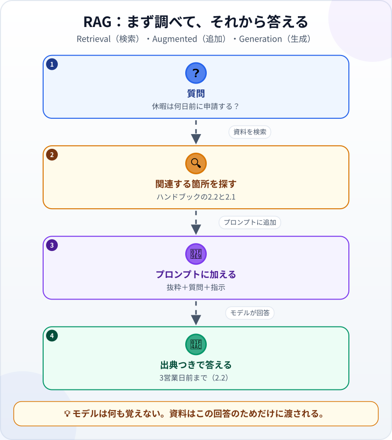
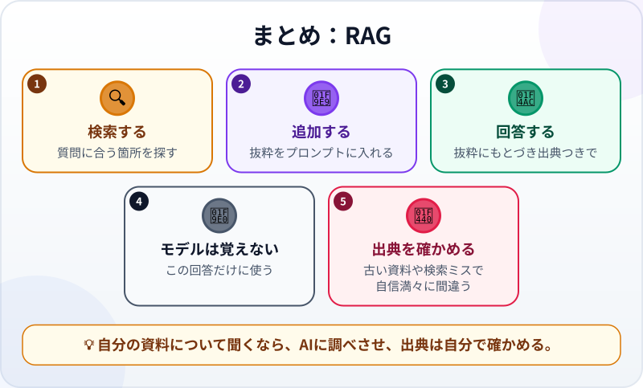

🌐 [Tiếng Việt](../../vi/lessons/rag-intro.md) · [English](../../en/lessons/rag-intro.md) · **日本語**

# RAG：AIに資料を調べさせる

<!-- section: objective -->
## この授業のゴール

このレッスンを終えると、次のことができるようになります。

- RAGを「関連する箇所を探す・プロンプトに入れる・それにもとづいて答える」の3ステップで説明できる。
- RAGを使った1回の質疑を追い、答えがどの箇所から来たかを指し示せる。
- RAGでも間違える2つの場面（古い資料と、見当違いの箇所）に気づき、出典を開いて確かめられる。

<!-- section: hook -->
## なぜ大事なの？

トゥアンがチャットボットに聞きました。*「うちの会社では、休暇は何日前に申請すればいい？」* すぐに自信満々の答えが返ってきます。*「一般的には、1〜2週間前に伝えるのがよいでしょう……」*

もっともらしく聞こえますが、このチャットボットはトゥアンの会社の社員ハンドブックを読んだことがありません。どこかで*よくある*話を書いただけです。自分の会社について正しい答えを得るには、AIに正しいページを渡す必要があります。推測する代わりに、ハンドブックを開いて調べるのと同じです。

<!-- section: concept -->
## 本題

### モデルはあなたの資料を知らない

モデルが持っているのは、学習のときに身につけたことだけです（[機械はどうやって「学ぶ」？](how-machines-learn.md)）。社内のハンドブック、先月変わったルール、昨日の議事録——どれも見たことがありません。情報が足りなくても、モデルはもっともらしい答えを書きます。[次のトークンを予測する](next-token-prediction.md)ように作られているからです。これがまさに[ハルシネーション](hallucination.md)の温床です。

### RAG：まず調べて、それから答える

**RAG**（Retrieval-Augmented Generation、検索拡張生成）は、名前の3つの単語どおり3つのステップでできています。



1. **検索（Retrieval）：** システムが資料の中から、質問にいちばん近い箇所を探す。
2. **追加（Augmented）：** 見つかった箇所を、質問と答え方の指示と一緒にプロンプトへ入れる。
3. **生成（Generation）：** モデルがその箇所にもとづいて答えを書く。システムが各箇所に出典を添え、出典を示すよう指示すれば、どの部分がどの箇所から来たかを示せる。指示がなければ、示すとは限らない。

これらの箇所は[コンテキストウィンドウ](context-window.md)に入り、その1回の回答のためだけに使われます。モデルの中の数値は変わりません。モデルがあなたの資料を「暗記」するわけではないのです。

### なぜ探すの？全部渡せばいいのでは？

資料が数ページだけなら、全部をプロンプトに入れるのがいちばん簡単な場合もあります。しかし大量の資料は、コンテキストウィンドウに入りきりません。そこでRAGのシステムは、あらかじめ資料を小さな箇所に分けておき、質問のたびに関連の強いものだけをいくつか取り出します。多くのシステムは、同じ単語かどうかだけでなく**意味**で探します。質問が「何日前に申請」で、資料が「休む日の3営業日前までに申請する」でも、ちゃんと見つかります。

### RAGに出会う場所

- 社内資料について答えるチャットボット。資料名と項目番号を添えて答える。
- AIつきの検索ツール。答えの下に出典を表示する。
- プロジェクトのファイルを探して読んでから、答えたりコードを直したりするエージェント。ここでは検索を[ツール呼び出し](tool-calling.md)で行います。考え方は同じで、まず正しい資料を読み、それから答えます。

<!-- section: analogy -->
## 身近なたとえ

RAGは**持ち込み可の試験**に似ています。学生は本を丸暗記しなくてかまいません。問題を見たら正しいページを開き、関連する段落を読んでから答えを書き、*「42ページより」*と添えます。採点者は42ページを開いて確かめられます。

たとえが合わないところもあります。学生は内容を理解していて、本の誤植にも気づけます。AIは渡された箇所しか使いません。違うページを開いたり、本が去年の版だったりすれば、答えは自信たっぷりで「出典つき」のまま、間違っています。しかもページをめくるのはたいていシステムの検索部分で、モデル自身ではありません。

<!-- section: example -->
## 具体例

完全に架空のデータで、RAGを使った1回の質疑を見てみましょう。資料はファイル `ai-practice/handbook.md` 一つだけです。

```text
# 社員ハンドブック（練習用の架空データ）

## 1. 勤務時間
1.1. 勤務時間は8:30〜17:30、昼休みは60分。

## 2. 有給休暇
2.1. 正社員の有給休暇は年12日。
2.2. 休暇は勤怠システムで、休む日の3営業日前までに申請する。

## 3. 出張
3.1. 出張の電車・バスの切符は総務部が手配する。
```

**ステップ1 — トゥアンが聞く：** *「休暇は何日前に申請すればいい？」*

**ステップ2 — システムが探す。** 質問にいちばん近い2つの箇所、**2.2**と**2.1**が返ってきます。1と3は休暇について何も書いていないので、選ばれません。

**ステップ3 — システムがプロンプトを組み立てる。** モデルが受け取るのはこれです。

```text
次の抜粋だけにもとづいて答え、使った項目番号を書いてください。
抜粋に答えがなければ「ハンドブックには書かれていません」と答えてください。

[2.2] 休暇は勤怠システムで、休む日の3営業日前までに申請する。
[2.1] 正社員の有給休暇は年12日。

質問：休暇は何日前に申請すればいい？
```

**ステップ4 — モデルが答える：** *「休む日の3営業日前までに、勤怠システムで申請します（2.2）。」*

**ステップ5 — トゥアンが確かめる。** ハンドブックの2.2を開くと、一致しています。出典のある答えはすぐに確かめられます。出典のない答えは、信じるか信じないかしかありません。

次に、少し難しい2つの場面です。

- **資料に書かれていない質問。** トゥアンが聞きます。*「在宅勤務はできる？」* これに触れた箇所はありません。正しい答えは*「ハンドブックには書かれていません」*です。それでもAIが「ルール」を答えたら、作り話をしているサインです。ステップ3の指示は、これを防ぐためのものです。
- **古い資料。** 去年のハンドブックが資料の中に残っていて、*「5営業日前までに申請する」*と書かれていたとします。システムが古い箇所を拾えば、答えはきちんと出典を示したまま、間違います。RAGの良し悪しは、資料の中身と、それを探す検索の質で決まります。

<!-- section: try-it -->
## やってみよう

いつも使っているチャットボットで、約10分。架空のデータだけを使います。⛔ 会社が認めていないAIツールに、本物の社内資料を入れてはいけません。

1. `ai-practice` フォルダに `handbook.md` を作り、上の架空のハンドブックを貼りつける。
2. 新しい会話を始め、ファイルを渡さずに*「休暇は何日前に申請すればいい？」*と聞く。答えをメモする。
3. もう一つ新しい会話を始める。ファイルの中身をステップ3の指示と一緒に貼りつけ、同じ質問をする。
4. 2つ目の会話で、さらに*「在宅勤務はできる？」*と聞く。

確かめ方：2回目の答えは「3営業日前」で、2.2を示しているはずです。最後の質問には「ハンドブックには書かれていない」と答えるはずです。ここでは「検索」のステップをあなた自身がやりました。渡すファイルを選んだのはあなたです。RAGのシステムは、大量の資料についてこのステップを自動で行います。

<!-- section: misconceptions -->
## よくある誤解

- **「RAGを使うと、AIが自分の資料を覚える」** — いいえ。資料の箇所はその1回の回答のコンテキストに入るだけで、モデルは何も変わりません。
- **「出典があれば必ず正しい」** — 出典は確かめるための手がかりで、答えを正しくするものではありません。違う箇所や古い版が選ばれることも、モデルが読み違えることもあります。大事なことは出典を開いて照らし合わせましょう。
- **「RAGがあれば、プロンプトはていねいに書かなくていい」** — 今も必要です。抜粋だけにもとづくこと、項目番号を書くこと、資料にないときはそう言うことを指示しましょう。

<!-- section: recap -->
## 1枚でわかるこのレッスン



<!-- section: takeaways -->
## まとめ

- RAG＝関連する箇所を探す → プロンプトに入れる → それにもとづいて答える。
- モデルは何も覚えない。資料は1回の回答のコンテキストに入るだけ。
- よい答えは出典を示し、「資料には書かれていない」と言える。
- 古い資料や見当違いの箇所からは、自信満々の間違った答えが出る。
- 大事なことは、引用された項目を開いて照らし合わせる。

<!-- section: quiz -->
## 確認クイズ

**問1.** RAGは、モデルが社内資料について答えられるように何をしますか？

- A) 毎晩、資料でモデルを学習し直す
- B) 関連する箇所を探し、質問と一緒にプロンプトへ入れる
- C) これまで読んだすべてのファイルを、モデルにずっと覚えさせる

**問2.** 答えには「2.2より」とはっきり書かれていますが、システムは誤って去年のハンドブックを拾っていました。何が起こりえますか？

- A) 出典があるので、答えはやはり正しい
- B) モデルが古い版だと自分で気づく
- C) 根拠があるように聞こえるのに、間違っている

**問3.** 資料がまったく触れていないことを聞かれました。よいRAGのシステムはどうすべきですか？

- A) 資料にはその情報がないと伝える
- B) もっともらしい答えを推測する
- C) 似ていそうな箇所を適当に選んで答える

<details>
<summary>答えを見る</summary>

1. **B** — RAGはモデルを変えず、正しい箇所を探してその回答のコンテキストに入れます。
2. **C** — 出典の価値は取り出した箇所しだいです。古い資料からは「出典つき」でも間違った答えが出ます。
3. **A** — 「書かれていない」と言うほうが、もっともらしい作り話よりずっとよい答えです。

</details>

<!-- section: sources -->
## 参考資料

- Anthropic — [Glossary](https://platform.claude.com/docs/en/about-claude/glossary)（英語）の *RAG* の項：資料は質問が届いたときに検索され、質問と一緒にコンテキストウィンドウへ渡される。ツールがあればモデル自身が検索することもできる。RAGの効果は、取り出した情報の質と関連性で決まる。
- Anthropic — [Introducing Contextual Retrieval](https://www.anthropic.com/news/contextual-retrieval)（英語、2024年9月）：RAGは資料の中から関連する情報を取り出し、プロンプトに付け加える。大量の資料は小さな断片に分け、質問のたびに意味の近いものだけを取り出す。資料が十分に小さければ、全部をプロンプトに入れてもよい。
- Google Cloud — [What is Retrieval-Augmented Generation (RAG)?](https://cloud.google.com/use-cases/retrieval-augmented-generation)（英語）：RAGは検索と大規模言語モデルを組み合わせ、答えをより新しく、根拠のあるものにする。取り出した情報が質問と関係なければ、根拠があっても的外れや誤りの答えになりうる。
