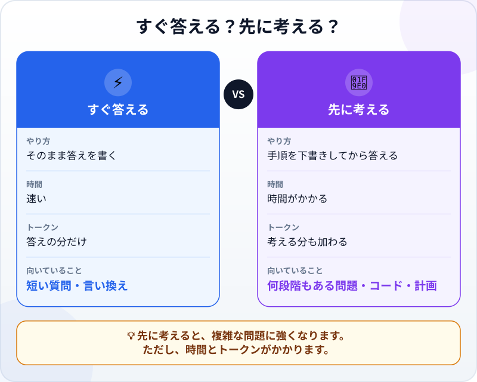
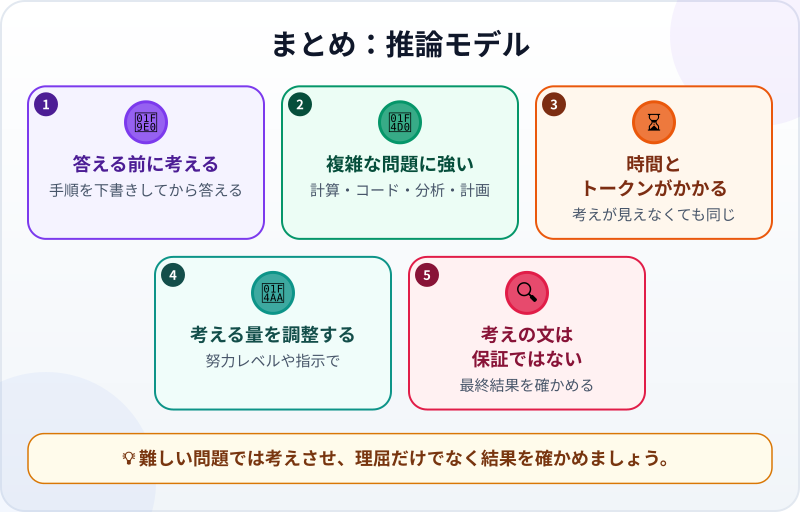

🌐 [Tiếng Việt](../../vi/lessons/reasoning-models.md) · [English](../../en/lessons/reasoning-models.md) · **日本語**

# 「考える」モデル：推論（リーズニング）とは？

<!-- section: objective -->
## この授業のゴール

この授業を終えると、次のことができるようになります。

- **推論モデル（reasoning model）** がふつうのモデルと何が違うかを説明する：答える前に途中の手順を書く。
- 先に考える価値がある場面と、その代わりにかかるもの（時間とトークン）を見分ける。
- 読める考えの手順が正しい答えを保証しない理由を理解し、理屈を信じるのではなく結果を確かめる。

<!-- section: hook -->
## なぜ大事なの？

フイさんは大学2年生です。友だち3人と箱根へ週末旅行に行ったあと、AIに費用の精算を頼みました。フイさんがホテル代24,000円、ランさんが車代12,000円、ミンさんが食事代8,000円を払い、タオさんはまだ何も払っていません。誰が誰にいくら払えばよいでしょうか。

答えはすぐに、きれいに整って返ってきました。*「タオさんがフイさんに11,000円、ミンさんがランさんに3,000円払う。」* とてももっともらしく聞こえます。でもフイさんが自分で足し直すと、お金が合いません。次に使ったとき、ツールが答える前に数秒「考え中…」と表示していることに気づきました。その数秒で何が起きているのでしょうか。

<!-- section: concept -->
## 本題

### 2つの答え方

[次のトークンの予測](next-token-prediction.md)で、LLMは回答をトークン一つずつ書くと学びました。ふつうは答えをそのまま書きます。**推論モデル**、または**思考（thinking）** のモードをオンにしたモデルは、その前にもう一つ作業をします。下書きを書くのです。Anthropicの資料（2026年9月時点）によると、この下書きの中でモデルは問題を言い直し、いくつかのやり方を試し、途中の結果を確かめ、うまくいかない方向は捨てます。そのうえで、下書きをもとに答えを書きます。



### 先に考えると、なぜ役に立つの？

新しいトークンが頼りにできるのは、それより前にコンテキストにあるもの（問題文と、ここまで書いた文章）だけです。すぐに答えなければならないと、計算の手順はすべて答えそのものに詰め込まれるか、飛ばされてしまいます。下書きがあれば、途中の手順（合計、1人あたりの額、誰が払いすぎで誰が足りないか）がすでにコンテキストにあり、答えはそれを頼りにできます。だから先に考えることは、計算、コードの不具合探し、分析、計画、エージェントの長い作業のような、何段階もある作業でいちばん役に立ちます。

### その代わりにかかるもの：時間とトークン

下書きもモデルが書く文章なので、時間がかかり、[トークン](tokens.md)として数えられます。Claudeでは（2026年9月時点）、考える部分に使ったトークンは、その中身が見えなくても数えられます。「日本の首都はどこ？」のような簡単な質問では、余分に考えても答えが遅くなるだけのことがほとんどです。

### どれだけ考えるかは誰が決める？

最近のClaudeのモデル（2026年9月時点）では、モデル自身が依頼ごとに判断します。簡単な質問にはすぐ答え、何段階もある問題ではより深く考えます。それでも、次の2つの方法で調整できます。

- **努力レベル（effort）：** 低い・高いを選べるツールがあります。Claude Codeでは `/effort` コマンドで変えられます。低いほど簡単な作業に速く、高いほど複雑な作業を深く考えます。
- **プロンプトでの指示：** たとえば *「この問題は何段階もあります。答える前によく考えてください。」*

### 読める手順は保証ではない

考えた内容は説明のように見えるので、つい信じたくなります。でも、次の2つを覚えておきましょう。

- **見えるのはたいてい要約で、隠されていることもあります。** Claudeの資料には、表示される内容が元の考えの流れそのものになることはない、とはっきり書かれています。
- **書かれた理屈が、答えを実際に決めたものを正しく表しているとは限りません。** 2025年の研究で、Anthropicは質問の中に答えのヒントをこっそり入れました。モデルが実際にヒントを使ったとき、考えた内容の中でヒントに触れたのは、Claude 3.7 Sonnetで25%、DeepSeek R1で39%だけでした。

実践での結論：先に考えると難しい問題での間違いは減りますが、答えが正しくなるわけではありません。**理屈**を読むだけでなく、**結果**を確かめましょう。

<!-- section: analogy -->
## 身近なたとえ

学校の算数を思い出してください。簡単なかけ算なら暗算ですぐに答えます。何段階もある文章題なら計算用紙を出し、一つずつ式を書き、間違えたら消して書き直し、それから答えを解答欄に写します。計算用紙を使うと時間はかかりますが、間違いは減ります。

このたとえが合わないところ：あなたの計算用紙は、あなたが考えたことそのものです。モデルの「考え」はモデルが作り出す文章で、見せられるのはたいてい要約です。モデルの頭の中をのぞく窓というより、下書きをきれいに書き直した写しに近いものです。

<!-- section: example -->
## 具体例

フイさんは、今度は思考のモードをオンにして聞き直しました。ツールは考えた内容を表示します（要約を、ここではさらに短くしています）。

```text
合計：24,000 + 12,000 + 8,000 = 44,000円。4人で割ると1人11,000円。
フイは24,000円払った → 13,000円戻る。ランは12,000円払った → 1,000円戻る。
ミンは8,000円払った → 3,000円足りない。タオは0円 → 11,000円足りない。
タオがフイに11,000円。ミンがフイに2,000円、ランに1,000円。
確認：フイが受け取るのは11,000 + 2,000 = 13,000円。ランは1,000円。合う。
```

答え：*「タオさんがフイさんに11,000円、ミンさんがフイさんに2,000円とランさんに1,000円払う。」*

フイさんは、考えた内容が「とても筋が通って見える」ことで満足しませんでした。最終結果を、簡単な基準で自分で確かめます。支払いのあと、**全員がちょうど11,000円ずつ負担していること**です。

1. フイさん：24,000円払い、11,000円＋2,000円戻る → 負担11,000円。✓
2. ランさん：12,000円払い、1,000円戻る → 11,000円。✓
3. ミンさん：8,000円＋2,000円＋1,000円 → 11,000円。✓
4. タオさん：11,000円。✓

同じ基準で最初のすぐ出た答えも確かめてみると、ランさんは12,000円払って3,000円戻るので、負担は9,000円だけです。間違いで、しかもどこが違うのかもはっきりしました。フイさんが学んだこと：このような何段階もある問題では思考をオンにする価値があり、長い理屈よりも簡単な確認のほうが頼りになります。

<!-- section: misconceptions -->
## よくある誤解

- **「思考はいつもオンのほうがよい」** — 簡単な質問では、遅くなってトークンが余分にかかるだけのことがほとんどです。何段階もある作業のためにとっておきましょう。
- **「考えた内容を読めば、モデルが本当に考えたことがわかる」** — 見えるのはたいてい要約です。研究でも、書かれた理屈が答えを実際に決めたものを省くことがあるとわかっています。
- **「モデルは人間と同じように考える」** — 考えた内容も、答えと同じくトークン一つずつ作られた文章です。役には立ちますが、モデルに人間の考えや意図があるとは思わないようにしましょう。

<!-- section: recap -->
## 1枚でわかるこのレッスン



<!-- section: takeaways -->
## まとめ

- 推論モデルは、答える前に下書き（途中の手順）を書きます。
- 先に考えることは、計算、コード、分析、計画のような何段階もある作業でいちばん役に立ちます。
- その代わりに時間とトークンがかかります。考えた内容が見えなくても同じです。
- どれだけ考えるかはモデルが判断します。努力レベルやプロンプトの指示で調整できます。
- 考えた内容は保証ではありません。理屈だけでなく、最終結果を確かめましょう。

<!-- section: quiz -->
## 確認クイズ

**問1.** モデルに先に考えさせる価値がいちばん高いのはどれですか？

- A) 日本の首都を聞く
- B) 何段階かの計算のあとで間違った結果を出すコードの原因を探す
- C) 一文をもっと丁寧な言い方に直す

**問2.** ツールがモデルの考えた内容を表示しません。正しいのはどれですか？

- A) モデルは考えなかったということ
- B) 余分なトークンは使われていないということ
- C) 見えなくても、考える部分に時間とトークンがかかっていることがある

**問3.** モデルの考えた内容が長く、筋が通って見えます。どうすればよいですか？

- A) 金額を自分で足し直すなど、別の方法で最終結果を確かめる
- B) 長くて詳しい理屈なので、正しいと信じる
- C) モデルに「本当に大丈夫？」と聞き、その答えを信じる

<details>
<summary>答えを見る</summary>

1. **B** — 何段階もある作業こそ、下書きがいちばん役立ちます。ほかの2つは簡単で、余分に考えても遅くなるだけのことがほとんどです。
2. **C** — Claudeでは、考える部分に使ったトークンは、隠れていても数えられます。
3. **A** — 書かれた理屈は正しい答えを保証しません。別の方法での確認なら、正しいかどうかがわかります。

</details>

<!-- section: sources -->
## 参考資料

- Anthropic — [Thinking](https://platform.claude.com/docs/en/build-with-claude/thinking)（英語、2026年9月時点）：考えるとき、Claudeは答える前に問題を言い直し、やり方を試し、途中の結果を確かめ、うまくいかない方向を捨てます。数学、コード、分析、エージェントの長い作業に役立ちます。考える部分のトークンは表示されなくても課金の対象で、表示されるのは要約であり、元の考えの流れそのものではありません。
- Anthropic — [Steering thinking](https://platform.claude.com/docs/en/build-with-claude/thinking-steering-and-cost)（英語、2026年9月時点）：Claudeは依頼ごとに考えるかどうかを判断します。簡単な事実の質問では考えないこともあり、何段階もある問題ではより深く考えます。努力レベルがいちばんの調整手段で、プロンプトでの指示も効きます。
- Anthropic — [Extended thinking](https://platform.claude.com/docs/en/build-with-claude/extended-thinking)（英語、2026年9月時点）：考える部分のトークン数をあらかじめ決める古いモードです。Claude 4.7以降は対応しておらず、代わりに自動で調整するモード（adaptive thinking）を使います。
- Anthropic — [Model configuration](https://code.claude.com/docs/en/model-config)（英語、2026年9月時点）：Claude Codeでは `/effort` で努力レベルを変えられます。低いほど簡単な作業に速く、高いほど複雑な作業を深く考えます。
- Anthropic — [Reasoning models don't always say what they think](https://www.anthropic.com/research/reasoning-models-dont-say-think)（英語、2025年4月）：答えのヒントを与えられたとき、考えた内容の中でヒントに触れたのは、Claude 3.7 Sonnetで25%、DeepSeek R1で39%だけでした。
