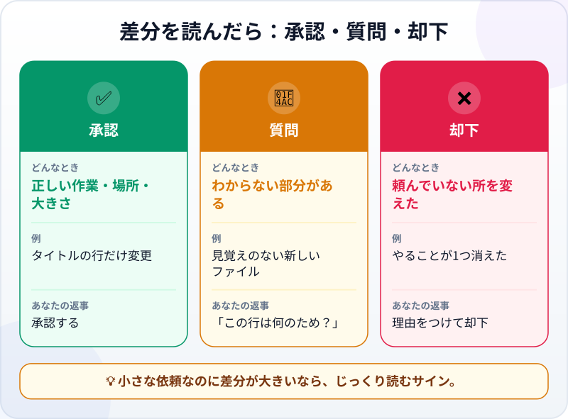
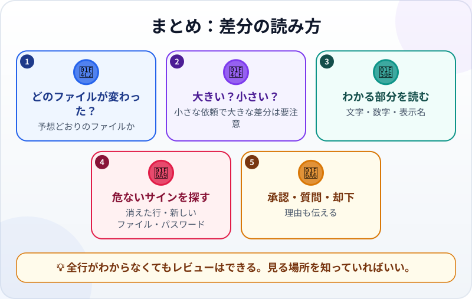

🌐 [Tiếng Việt](../../vi/lessons/reviewing-agent-changes.md) · [English](../../en/lessons/reviewing-agent-changes.md) · **日本語**

# エージェントの変更（差分）を読んでレビューする

<!-- section: objective -->
## この授業のゴール

この授業を終えると、次のことができるようになります。

- **差分**を読める：どのファイルで、どの行が追加され、どの行が削除されたか。
- コードをすべて理解していなくても、4つの問いでエージェントの変更をレビューできる。
- **承認・質問・却下**を決め、その理由を伝えられる。

<!-- section: hook -->
## なぜ大事なの？

ここまで、あなたは動きで結果を確かめてきました。開いて、押して、完了条件と比べる。でも、押してみても見えない変更があります。気づかない場所で消えた1行、見覚えのない新しいファイル、コードに直接書かれたパスワード。

差分は、エージェントが何を変えたかを**正確に**見せてくれます。しかも承認する前に。エージェントが先に確認するモードなら、変更が提案されるたびに、その差分が見られます。

<!-- section: concept -->
## 本題

### 差分はどう見える？

```diff
-      <button>次のヒント</button>
+      <button>別のヒントを見る</button>
```

- `-` で始まる行（ふつうは赤）は**削除**された行。
- `+` で始まる行（ふつうは緑）は**追加**された行。
- 変更された行は、古い行（`-`）と新しい行（`+`）のペアで表示されます。まわりの変わっていない行で、ファイルのどこかがわかります。

多くのツールは、`+12 -1`（12行追加、1行削除）のように大きさもまとめて表示します。

### レビューの4つの問い

1. **どのファイルが変わった？** 予想どおりのファイル？（パスが手がかりになります。）
2. **大きい？小さい？** 小さな依頼なのに差分が大きいのは不自然です。
3. **わかる部分を読む：** 表示される文字、数字、名前。頼んだとおり？
4. **危ないサインを探す：** 頼んでいない行の削除、見覚えのない新しいファイル、新しいライブラリ、コードの中のパスワードや秘密の鍵。

### 承認・質問・却下



却下は失敗ではありません。*「『水曜日のチーム会議』を消すのは依頼に入っていません。リストはそのままにしてください」*と理由を伝えれば、エージェントは次は正しく直せます。

<!-- section: example -->
## 具体例

ハナさんがエージェントに頼みました：*「ボタンの文字を『次のヒント』から『別のヒントを見る』に変えて。」* 提案された変更のまとめは `+2 -2`。1行の仕事なのに、なぜ2行？ ハナさんは差分を読みます：

```diff
-      <button>次のヒント</button>
+      <button>別のヒントを見る</button>
       ...
       const tips = [
         "いちばん大事な仕事をリストの一番上に書く。",
-        "25分集中したいときは通知を切る。",
+        "集中したいときは通知を切る。",
         "メールの返信は1日2回、決まった時間に。",
```

ボタンの文字は依頼どおり。でもエージェントは「ついでに」ヒントを1つ直し、「25分」を消していました。ハナさんの返事：*「ボタンの変更は承認。ヒントのリストは変えないで、元の文に戻してください。」*

<!-- section: try-it -->
## やってみよう

約15分。

**1. 差分の見本をレビューする（5分）。** 依頼は*「6つ目のやることを追加：両親に電話する」*。エージェントの提案：

```diff
   <ul>
     <li><input type="checkbox"> 月次レポートを提出</li>
-    <li><input type="checkbox"> 水曜日のチーム会議</li>
     <li><input type="checkbox"> 歯医者の予約</li>
     <li><input type="checkbox"> 30分歩く</li>
     <li><input type="checkbox"> 本を20ページ読む</li>
+    <li><input type="checkbox"> 両親に電話する</li>
   </ul>
```

4つの問いに答えてから決めましょう。承認・質問・却下のどれ？

<details>
<summary>答えの例</summary>

- 6つ目のやることは正しく追加されている（`+`）。
- でも「水曜日のチーム会議」が削除されている（`-`）。依頼には入っていません。6つ目を追加したはずなのに、リストは5つのままです。
- 判断：**却下**。理由を添えて：*「新しいやることを追加するだけで、何も削除しないでください。」*

</details>

**2. 本物の変更をレビューする（10分）。** `my-week.html` で、エージェントが変更のたびに確認するモードのまま、小さな仕事を頼みます：

```text
タイトルを「今週やること」に変え、新しいやること「机を片付ける」を1つ追加してください。
ほかは何も変えないでください。
```

承認の前に、4つの問いで差分を読みましょう。証拠を書きます：

- *見せられるもの…* 差分はタイトルの行と、新しいやることの1行だけ。
- *確かめたこと…* 変わったファイル、変更の大きさ、古いタイトル以外に削除された行がないこと。
- *使わないほうがいい場面…* たとえば、差分が長すぎて読めないとき。そのときは仕事を小さく分けてもらいます。

<!-- section: misconceptions -->
## よくある誤解

- **「コードが書けないとレビューできない」** — わかる部分を読み、危ないサインを探すことはできます。どのファイルが変わったか、どの行が消えたか、何が追加されたか。エージェントのミスの多くは、まさにそこに表れます。
- **「動けば正しい」** — 動いていても、必要なものを消していたり、パスワードを見せていたりすることがあります。
- **「差分が長いなら、時間の節約のために承認する」** — 読めないほど長い差分は、仕事を分けるべきサインです。レビューを飛ばす理由ではありません。

<!-- section: recap -->
## 1枚でわかるこのレッスン



<!-- section: takeaways -->
## まとめ

- 差分では `-` が削除された行、`+` が追加された行。変更された行は `-` と `+` のペア。
- 4つの問い：どのファイルが変わった？ 大きい？小さい？ わかる部分は正しい？ 危ないサインは？
- 承認・質問・却下を決め、理由を伝える。
- 差分が長すぎて読めないなら、仕事を分ける。

<!-- section: quiz -->
## 確認クイズ

**問1.** 差分で `-` から始まる行の意味は？

- A) 削除された行
- B) 追加された行
- C) エラーのある行

**問2.** 1語だけの変更を頼んだのに、提案は `+40 -35`。どうする？

- A) エージェントはたいてい正しいので承認する
- B) 今は承認して、あとで見る
- C) 小さな依頼がなぜ大きな変更になったのか、判断の前によく読む

**問3.** 差分は依頼どおりだが、よくわからないファイルが1つ追加されている。いちばん妥当なのは？

- A) すべて却下して、最初からやり直す
- B) そのファイルが何のためかをエージェントに聞く
- C) 大事な部分は正しいので承認する

<details>
<summary>答えを見る</summary>

1. **A** — `-` は削除、`+` は追加です。
2. **C** — 小さな依頼で大きな変更は、まずよく読むべき危ないサインです。
3. **B** — わからなければ質問。承認か却下かは、答えを聞いてから決めます。

</details>

<!-- section: sources -->
## 参考資料

- Anthropic — [Get started with the desktop app](https://code.claude.com/docs/en/desktop-quickstart)（英語）：*Manual* モードでは変更ごとの差分を見て承認か却下を選べます。より自動的なモードでは、エージェントが変更したあとに差分を確認します。
- Google Cloud — [What is agentic coding?](https://cloud.google.com/discover/what-is-agentic-coding)（英語）：AIエージェントが書いたコードをメインのプロジェクトに入れる前に、チームの誰かがレビューすべきだと説明しています。
