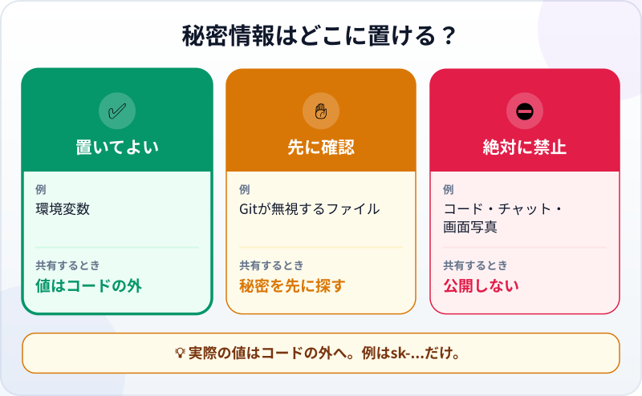
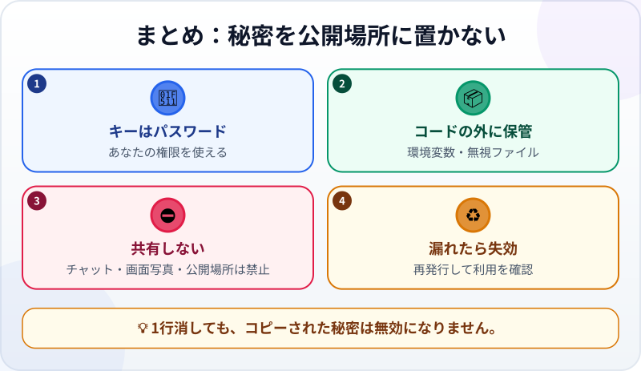

🌐 [Tiếng Việt](../../vi/lessons/security-basics.md) · [English](../../en/lessons/security-basics.md) · **日本語**

# 安全の基本：APIキー・パスワード・個人情報

<!-- section: objective -->
## 学習目標

このレッスンを終えると、次のことができるようになります。

- APIキーをパスワードと同じように守る理由を説明する。
- 秘密情報を置いてよい場所と、絶対に出してはいけない場所を区別する。
- 秘密情報が漏れたとき、すぐに対応する。

<!-- section: hook -->
## 導入：公開されかけた1行

フイは`ai-practice`で小さなプログラムを書きます。サービスに**APIキー**を求められたため、Pythonファイルへ直接貼りました。

```python
API_KEY = "sk-..."  # 実物ではなくプレースホルダーです
```

プログラムは動きました。友人に見せるため、公開Gitリポジトリへ出そうとします。クリックする直前、コードをダウンロードした全員にこの行が見えると気付きました。

多くのコードに囲まれていても、秘密は安全になりません。ファイルを共有すれば、秘密も共有されます。

<!-- section: concept -->
## 基本の考え方

### APIキーはプログラムのパスワード

**APIキー**は、サービスに対してプログラムを識別する秘密の文字列です。アクセスを許し、利用をあなたのアカウントに結び付けることがあります。入手した人は、あなたの名前でその権限を使えるかもしれません。パスワードと同様に、公開・送信・AIチャットへの貼り付けをしてはいけません。

同じルールはパスワードと他人の個人情報にも当てはまります。練習用の「山田例子」のような架空名は使えます。実際の顧客名簿、電話番号、給与表は使えません。

### 秘密情報はどこに置ける？



- ✅ **置いてよい：** OSが保持する環境変数、またはGitが無視するローカルの秘密ファイル。後者はプロジェクトの無視設定を理解してから使います。
- ✋ **先に確認：** フォルダや画面写真を共有する前に、ファイル、ターミナル出力、画像に秘密がないか探します。
- ⛔ **絶対に置かない：** コード、AIチャット、画面写真、公開リポジトリ。例では`sk-...`を使います。

環境変数を使うと、値をコードに書かずにプログラムが読めます。ただし魔法ではありません。キーをターミナルに表示して画面を撮れば、やはり漏れます。

### 秘密が漏れたら

行を消すだけでは足りません。Gitの履歴や他人のコピーに残ることがあります。次の順番で対応します。

1. 発行したサービスでキーを**失効**させるか、パスワードを変更する。
2. 必要なら**新しいキーを作り**、正しい場所に保管する。
3. 共有ファイルと履歴から秘密を取り除き、不審な利用を確認する。学校や会社のアカウントなら担当者へ報告する。

[データの安全と権限](data-safety-and-permissions.md)では、すべての操作を✅・✋・⛔に分けます。[Git：プロジェクト全体の「元に戻す」ボタン](git-version-control.md)では、現在の版から消しても履歴から消えるとは限らない理由を説明します。

<!-- section: analogy -->
## 身近なたとえ

APIキーは、あなたの名前が付いた入館証のようなものです。持っている人は許可された扉を開けられ、入館はあなたの名前で記録されます。コードが読める写真を掲示板に貼らず、紛失したらすぐ無効にします。

ただし違いもあります。物理的なカードがなくなれば気付けます。デジタルの秘密は知らないうちに複製され、元とコピーの両方が使えます。漏れた疑いがあれば、ファイルを移すだけでなく失効させます。

<!-- section: example -->
## 具体例

フイは共有前にプロジェクトを直します。

1. コードを環境変数の読み取りに変えます：`API_KEY = os.environ["API_KEY"]`。
2. 実際の値は自分のPCの環境変数に設定し、説明書やコードには書きません。
3. キーの先頭部分で`ai-practice`全体を検索し、コピーが残っていないか確かめます。
4. コミット前にGitの変更を確認します。画面写真には`sk-...`だけを表示します。

実際のキーを一度でもコミットしたなら、フイは最初に失効させます。古い行を削除する新しいコミットだけでは、古いキーは安全になりません。

<!-- section: recap -->
## 図で振り返る



<!-- section: takeaways -->
## 要点

- APIキーはプログラムのパスワードです。持つ人はあなたの名前で権限を使えることがあります。
- 秘密は環境変数かGitが無視するローカルファイルに置き、コードには置きません。
- パスワード、APIキー、実際の個人情報をAI、画面写真、公開リポジトリへ出しません。
- 漏れたら失効・再発行・確認をします。コードの行を消すだけでは足りません。

<!-- section: quiz -->
## 理解度チェック

**問1.** 自分のPCで使うAPIキーに最も適した場所はどこですか？

- A) Pythonファイルに直接書く
- B) 環境変数
- C) AIへの非公開メッセージ

**問2.** 実際のキーが公開リポジトリにあったと気付きました。最初に何をしますか？

- A) 発行したサービスでキーを失効させる
- B) キーがあるファイル名だけ変える
- C) 「使用禁止」というコメントを付ける

**問3.** `ai-practice`の例に適するデータはどれですか？

- A) 実際の顧客の電話番号一覧
- B) 氏名だけ消して社員番号を残した実際の給与表
- C) 人名も電話番号もすべて架空の一覧

<details>
<summary>答えを見る</summary>

1. **B** — 秘密の値をコードに保存せず、プログラムから読めます。
2. **A** — 漏れたコピーの権限を無効にします。ファイル編集では全コピーを消せません。
3. **C** — 架空データなら実在する人の情報を漏らしません。

</details>
