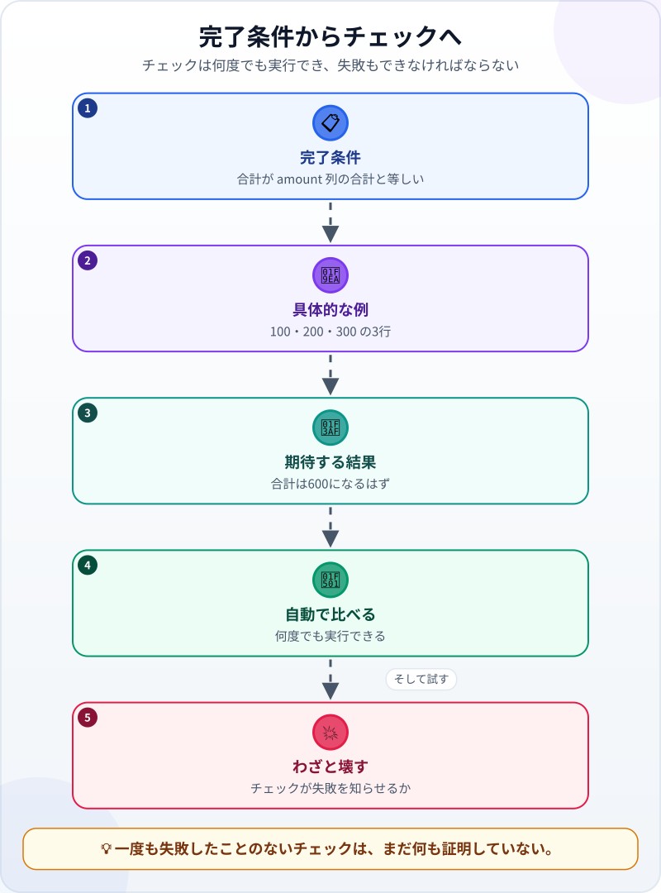
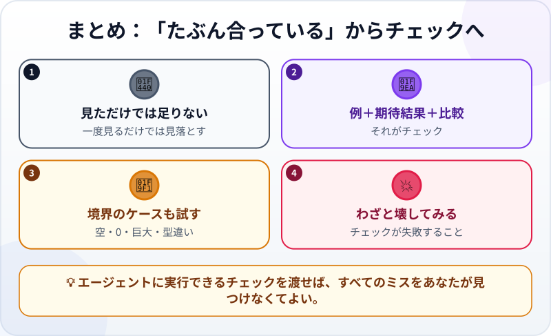

🌐 [Tiếng Việt](../../vi/lessons/testing-basics.md) · [English](../../en/lessons/testing-basics.md) · **日本語**

# 「たぶん合っている」をチェックに変える

<!-- section: objective -->
## この授業のゴール

この授業を終えると、次のことができるようになります。

- 完了条件を**チェック**（テスト）に変えられる：具体的な例、期待する結果、自動の比較。
- エージェントにチェックを書いて実行してもらい、結果を読める。
- チェックそのものを確かめられる：**わざと壊す**、**境界のケース**を試す。

<!-- section: hook -->
## なぜ大事なの？

ここまで、あなたは目で確かめてきました。開いて、押して、いくつか数字を足してみる。それも大切ですが、変更のたびに最初からやり直しになり、人の目は見落とします。

Claude Code のガイドははっきり言います。エージェントが自分で実行できるチェックを渡そう。それがないと、「完了したように見える」ことだけが手がかりになり、すべてのミスに気づく役目があなたに回ってくる、と。

<!-- section: concept -->
## 本題

### チェックは何でできている？



1. **具体的な例：** よくわかっている入力。たとえば 100・200・300 の経費3行。
2. **期待する結果：** 合計は600になるはず。
3. **自動の比較：** 小さなプログラムが実行され、結果を期待と比べて **PASS**（合格）か **FAIL**（不合格）を知らせる。

プログラムなので、何度でも実行できます。変更のたびに、エージェントは報告の前に自分で実行します。

### 境界のケースも試す

バグは、ふつうでない場所に隠れるのが好きです。ふつうの例に加えて、次も試しましょう：

- **空：** 1行もないファイル。
- **0 や巨大な数：** 0ドンの経費、10億ドンの経費。
- **型違い：** 金額が空、または数字のかわりに文字。

自分で書く必要はありません。エージェントに追加を頼めば十分です。

### わざと壊してみる

いつも PASS と言うチェックは役に立ちません。何もチェックしていないかもしれないからです。いちばん確かな方法は、**わざと1か所を間違える**こと。チェックを実行し、FAIL と言うのを見る。そして元に戻す。一度も失敗したことのないチェックは、まだ何も証明していません。

<!-- section: example -->
## 具体例

マイさんの手元には、項目別に経費をまとめた `summary.csv` があります。エージェントに、完了条件*「Total が expenses.csv の amount 列の合計と等しい」*のチェックを頼みました。

1. エージェントは小さなプログラム `check_summary.py` を書いて実行：**PASS**。
2. マイさんはまだ信じません。数字を1つ変えたコピー `summary_wrong.csv` を作ってもらい、そのコピーにチェックを実行してもらいます：**FAIL――Total が5万ドンずれています。** これで、チェックが本当にミスを見つけられるとわかりました。
3. マイさんは境界のケースを追加します。`amount` が空の行です。エージェントの集計プログラムはエラーで止まりました。マイさんは、空の金額は0として数え、レポートに一覧で出すと決め、エージェントに修正と、このケースのチェックの追加を頼みます。

<!-- section: try-it -->
## やってみよう

約12分。[良い指示書の書き方](writing-good-specs.md)で作った `expenses.csv` と `summary.csv` を使います（手元にない人は、架空のデータでエージェントに作り直してもらいましょう）。

**1. エージェントにチェックを書いてもらう（4分）：**

```text
次の完了条件の自動チェック（小さなプログラム）を書いてください：
「summary.csv の Total が、expenses.csv の amount 列の合計と等しい」。
実行して結果を見せてください。PASS か、FAIL ならその理由。
expenses.csv と summary.csv は変更しないでください。インストールが必要なら先に確認してください。
```

**2. わざと壊してみる（4分）：**

```text
summary_wrong.csv というコピーを作り、その中の数字を1つ変えて、
コピーに対してチェックを実行してください。FAIL になるはずです。
```

それでも PASS なら、チェックは確かめるべきことを確かめていません。エージェントに伝えましょう。

**3. 境界のケースを追加する（4分）：** 1行もない経費ファイルと、`amount` が空の行について、チェックを追加してもらいます。期待する結果を決めるのはあなたです。

証拠を書きましょう：

- *見せられるもの…* 本物のファイルでは PASS、わざと壊したコピーでは FAIL になるチェック。
- *確かめたこと…* ふつうの例1つと、境界のケース2つ。
- *使わないほうがいい場面…* たとえば、完了条件が好みの問題（「プロっぽく見える」）のとき。そのときは自分の目で見る必要があります。

<!-- section: misconceptions -->
## よくある誤解

- **「テストはプログラマーの仕事」** ―― テストを書く必要はありません。でも、何を確かめ、何を期待するかを決め、結果を読むのはあなたです。
- **「テストが PASS なら、コードは正しい」** ―― テストが確かめるのは、書かれたことだけです。一度も失敗したことのないテストは、何も確かめていないかもしれません。
- **「ふつうの例を1つ試せば十分」** ―― バグは境界のケースに隠れています。空の欄、0、とても大きなデータ。

<!-- section: recap -->
## 1枚でわかるこのレッスン



<!-- section: takeaways -->
## まとめ

- チェック ＝ 具体的な例 ＋ 期待する結果 ＋ 自動の比較。
- エージェントは変更のたびにチェックを実行できる。すべてのミスをあなたが見つけなくてよい。
- 境界のケースも試す：空、0、巨大、型違い。
- わざと壊す：チェックが FAIL にならなければ、まだ何も証明していない。

<!-- section: quiz -->
## 確認クイズ

**問1.** 「合計が正しい」という完了条件の、本当のチェックはどれ？

- A) 100・200・300 の3行なら合計は600。それをプログラムが比べる
- B) 数字をざっと見て、妥当そうだと思う
- C) エージェントに「合ってる？」と聞く

**問2.** わざと壊してみるのはなぜ？

- A) エージェントにバグ修正を練習させるため
- B) チェックが本当にミスを見つけられるかを確かめるため
- C) プロジェクトを長引かせるため

**問3.** 境界のケースはどれ？

- A) ふつうの経費20行
- B) 5万ドンの経費1件
- C) 1行もない経費ファイル

<details>
<summary>答えを見る</summary>

1. **A** ―― 具体的な例、期待する結果、自動の比較がそろっています。
2. **B** ―― 一度も失敗したことのないチェックは、まだ何も証明していません。
3. **C** ―― 空のファイルはデータの「境界」にあります。A と B はふつうのケースです。

</details>

<!-- section: sources -->
## 参考資料

- Anthropic — [Best practices for Claude Code](https://code.claude.com/docs/en/best-practices)（英語）の *Give Claude a way to verify its work*：テスト、ビルド、比べるためのスクリーンショットなど、エージェントが実行できるチェックを渡そう。それがないと「完了したように見える」ことだけが手がかりになり、すべてのミスに気づく役目があなたに回ってくる。
