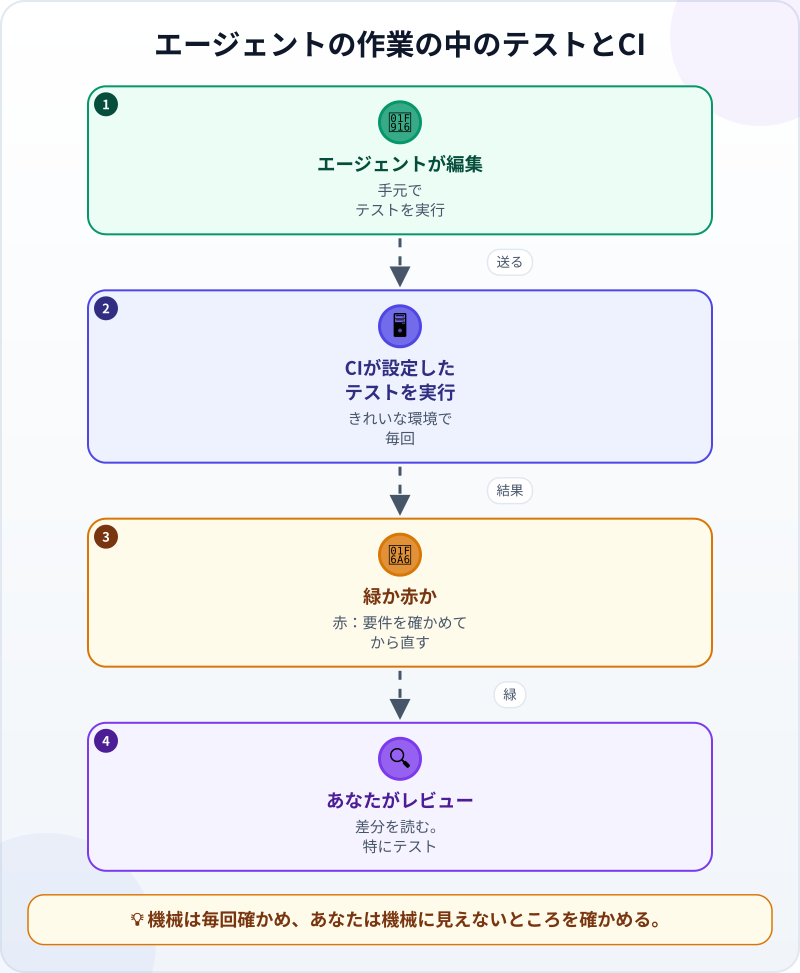
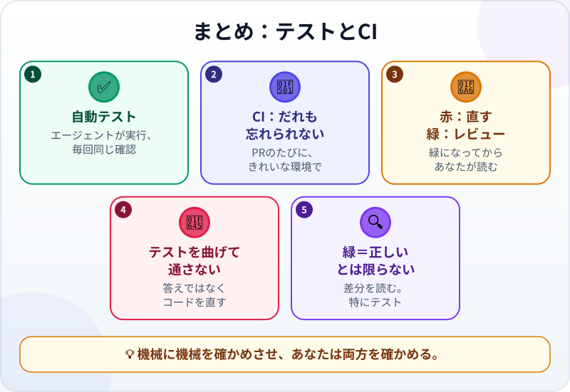

🌐 [Tiếng Việt](../../vi/lessons/tests-and-ci-for-agents.md) · [English](../../en/lessons/tests-and-ci-for-agents.md) · **日本語**

# テストとCI：機械に機械をチェックさせる

<!-- section: objective -->
## この授業のゴール

この授業を終えると、次のことができるようになります。

- エージェントが速く、たくさんの場所を変えるとき、**自動テスト**と**CI**がどう役立つかを説明できる。
- CIの緑・赤の結果を読み、次に何をすべきかがわかる。
- エージェントがコードを正しくするかわりに「テストを緑にする」サインに気づき、断れる。

<!-- section: hook -->
## なぜ大事なの？

フイさんは、[バイブコーディングとエージェント型コーディングの違い](vibe-vs-agentic.md)で作ったサークルの割り勘ページを、今はGitHubのリポジトリで管理しています。確認用のファイル `check_split.py` もいっしょです。サークルから、10%のチップを足したいと頼まれました。

フイさんはエージェントに任せます。エージェントの報告は「*チップを追加しました。テストは合格です。*」数分後、サーバーから赤い ❌ が届きます。**テスト失敗**。

エージェントは合格と言い、サーバーは不合格と言う。正しいのはどちら？ そして、そのサーバーがなかったら、バグはどこへ行っていたでしょう。

<!-- section: concept -->
## 本題

### テスト：エージェントが自分で実行する確認

[「たぶん合っている」をチェックに変える](testing-basics.md)方法と、[エージェントには自分で実行できる確認方法が必要](traditional-vs-agentic.md)な理由は、もう学びました。その確認をプログラムとして書いたものが**自動テスト**です。数秒で動き、ケースごとに*合格・不合格*を出します。エージェントはループの中でそれを実行し、結果を読み、合格するまで直します。

エージェントは速く、たくさんの場所を一度に変えます。人が手ですべてを確かめ直すのは大変ですが、テストなら、書いてあるケースを毎回同じように確かめ直せます。疲れることもありません。ただし、全部を実行すればの話です。

### CI：だれも忘れられない場所でテストを実行する

テストは、実行されてはじめて役に立ちます。エージェントは一部だけ実行したり、実行を忘れたりすることがあります。**CI**（継続的インテグレーション）はこれを解決します。いつ動くかは設定で決めます。ふつうは、共有のリポジトリに変更を取りこむための提案である*プルリクエスト*のたびです。そのとき、サーバーがコードを取ってきて、設定したテストを実行します。ふつうは、下のフイさんのCIのように**全部**です。結果はみんなに見えます。✅ 緑か ❌ 赤か。



CIは、だれの記憶にも頼らず必ず動くという点で[フック](hooks-and-permissions.md)に似ています。違うのは、共有のリポジトリで、きれいな環境で動き、結果をだれもが見られることです。この講座も同じです。どの変更も、取りこむ前にCIが内容のチェックとテストを実行しています。

### 注意：「テストを緑にする」は「コードを正しくする」ではない

テストが赤のとき、緑にする方法は2つあります。コードを正しく直すか、**テストを**まちがったコードに合わせて変えるか。エージェントはときどき後者を選びます。テストの期待する答えを書き換えたり、テストにあるケースでだけ正しく動くコードを書いたり。Anthropicのプロンプトのガイド（2026年9月時点）ははっきり言っています。テストは正しさを確かめるためのもので、解き方を決めるものではない。テストがおかしく見えたら、回り道せずに知らせること。

だから変更をレビューするときは、**テストのファイルで変わった行をすべてよく読みます**。期待する答えが変わっていたら、それはあなた自身が答えるべき問いです。古い答えがまちがっていたのか、新しいコードがまちがっているのか。

<!-- section: example -->
## 具体例

フイさんは、リポジトリにCIを設定済みです。プルリクエストのたびに、サーバーが `python check_split.py` を実行します。すべてのケースです。フイさんはこう頼みます。

```text
warikan.html に10%のチップのオプションを足して。チップは100円単位に切り上げ、割る前に伝票に足す。
これまでの決まりはそのまま：1人分は100円単位、できるだけ均等に割る、
全員分の合計は伝票＋チップとぴったり同じ。
チップのテストケースも足して。テストを実行してから、プルリクエストを開いて。
```

**1. エージェントが作業し、テストを実行する。** エージェントはチップを足し、新しいテストケースを3つ足し、時間を節約するため**名前に「tip」が入ったテストだけ**を実行しました。3つとも合格。「*テストは合格です*」と報告し、プルリクエストを開きます。

**2. CIが赤を出す。** サーバーはすべてのテストを実行します。**古い**ケースが1つ失敗しました。*3,000円を3人、チップなし*で、1人1,100円。チップを足すとき、エージェントはうっかり、チップをオフにしていても10%を足していたのです。

**3. エージェントがまちがった「修正」を提案する。** フイさんがCIの結果をエージェントに貼ると、エージェントは「*テストの期待する答えを1,100円に更新します*」と提案しました。フイさんは**断ります**。「*答えは変えないで。チップなしならチップはなし。3,000円を3人なら、やっぱり1,000円。コードを直して。*」

**4. コードを直し、CIが緑になる。** エージェントは、オプションがオンのときだけチップを足すようにコードを直し、手元で**全部**のテストを実行します。すべて合格。送ると、CIがもう一度動いて ✅ 緑。

**5. フイさんがレビューする。** 差分を読みます。チップのコードはオプションがオンのときだけ動く。テストのファイルは新しいケースが**足された**だけで、古いケースの答えはどれも変わっていない。自分でも一度ページで試します。5,000円にチップ10%で6人。全員分の合計は5,500円。そこで初めて、変更を取りこみました。

CIがなければ、手順2のバグはそのままサークルに届いていました。チップなしの伝票のたびに、10%多く集めていたのです。そしてフイさんが手順3を承認していたら、CIはやはり緑になっていたでしょう。まちがった答えのままで。

<!-- section: misconceptions -->
## よくある誤解

- **「エージェントがもうテストを実行したから、CIはいらない」** ―― エージェントは一部しか実行していないかもしれないし、リポジトリにないものがある環境で実行したかもしれません。CIは毎回、きれいな環境で、設定したとおりのテストを実行します（全部を実行するように設定しておきます）。
- **「CIが緑ならコードは正しい」** ―― CIが確かめるのは、テストが確かめることだけです。テストの答えがまちがって書き換えられていても、CIは緑です。差分、特にテストのファイルは、やはりあなたが読みます。
- **「CIは大企業のもの」** ―― GitHubのリポジトリがあれば、小さなプロジェクトでも、送るたびにテストを実行するCIを持てます。設定はエージェントに手伝ってもらえます。承認する前に、あなたが読みます。

<!-- section: recap -->
## 1枚でわかるこのレッスン



<!-- section: takeaways -->
## まとめ

- 自動テスト：エージェントが自分で実行し、毎回同じように確かめる確認。
- CIは、設定したタイミング（ふつうはプルリクエストのたび）に、だれが忘れてもサーバーで設定したテスト（ふつうは全部）を実行する。
- 赤なら戻って直す。緑になってはじめてあなたがレビューする番。
- 「テストを緑にする」は「コードを正しくする」ではない。合わせるためだけに答えを変えさせず、まず要件を確かめる。
- CIの緑は証明ではない。差分、特にテストで変わった行をすべて読む。

<!-- section: quiz -->
## 確認クイズ

**問1.** CIがテストを実行するのはいつ？

- A) エージェントが覚えていたときだけ
- B) 設定したタイミングで自動で（たとえばプルリクエストのたび）
- C) 月に1回

**問2.** テストが赤で、エージェントが「新しい結果に合わせて、テストの期待する答えを変えましょう」と提案しました。どうすべき？

- A) まちがっているのは古い答えか新しいコードかを自分で考え、古い答えが正しければコードを直させる
- B) エージェントのほうがコードをわかっているので、同意する
- C) CIを緑にするため、そのテストを消す

**問3.** エージェントは「テストは合格」と言うのに、CIは赤です。一番ありそうな理由は？

- A) CIのサーバーが壊れている
- B) CIはいつも必要以上に厳しい
- C) エージェントはテストの一部だけを実行し、CIは全部を実行した

<details>
<summary>答えを見る</summary>

1. **B** ―― CIは、だれの記憶にも関係なく、設定したとおりに自動で動きます。
2. **A** ―― テストの期待する答えは要件から来るもので、それ自体が「正しい」を決めるのではありません。まず要件と照らし合わせ、要件から見て古い答えがまちがっていたときだけ変えます。
3. **C** ―― フイさんのエージェントと同じです。新しいテストだけ実行しても、古いテストが壊れたことは見えません。

</details>

<!-- section: sources -->
## 参考資料

- Anthropic — [Prompting best practices](https://platform.claude.com/docs/en/build-with-claude/prompt-engineering/claude-prompting-best-practices)（英語、2026年9月時点）：テストケースだけでなく、すべての正しい入力で動く解き方を求める。テストは正しさを確かめるもので、解き方を決めるものではない。テストがまちがっていたら、そう伝える。
- Anthropic — [Best practices for Claude Code](https://code.claude.com/docs/en/best-practices)（英語、2026年9月時点）：エージェントが自分で実行できる確認方法を渡す。非対話モード `claude -p` で、ClaudeをCIや自動の流れに組みこめる。
- Anthropic — [Claude Code GitHub Actions](https://code.claude.com/docs/en/github-actions)（英語、2026年9月時点）：Claude CodeはGitHubリポジトリの自動の流れの中で動かせる。プルリクエストでの呼びかけや、イベントをきっかけに実行できる。
