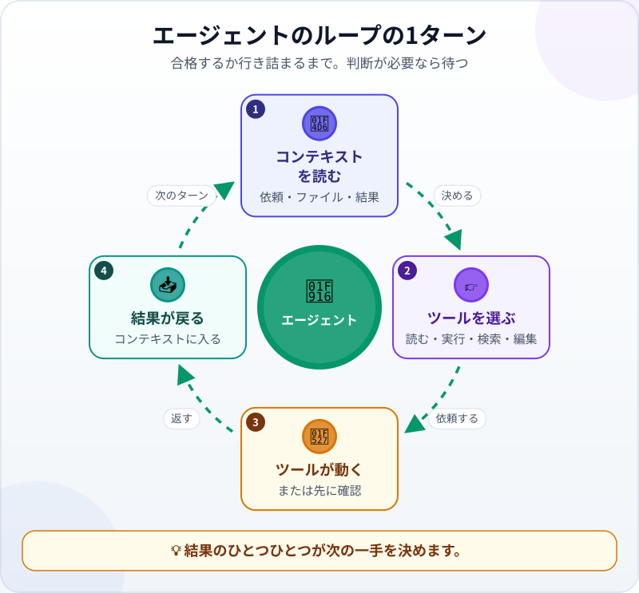
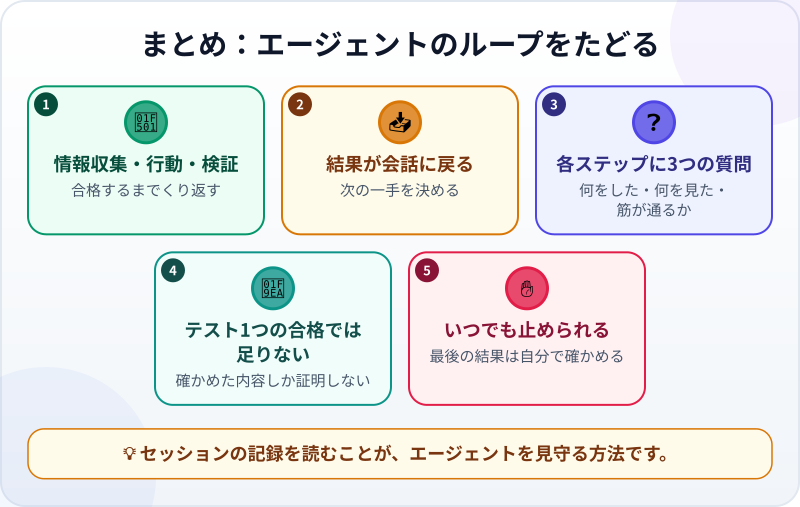

🌐 [Tiếng Việt](../../vi/lessons/the-agent-loop.md) · [English](../../en/lessons/the-agent-loop.md) · **日本語**

# 実際のセッションでエージェントのループをたどる

<!-- section: objective -->
## この授業のゴール

この授業を終えると、次のことができるようになります。

- セッションを**1ターンずつ**読める：ツールを使うターンでは、モデルがコンテキストを読む→ツールを選ぶ→ツールが動く→結果がコンテキストに戻る。最後のターンはあなたへの返事。
- ループが終わるとき（確認に合格、または行き詰まり）と、あなたの判断を待って一時停止しているだけのときを見分けられる。
- いつエージェントを止め、何と言って方向を正せばよいかがわかる。

<!-- section: hook -->
## なぜ大事なの？

マイさんは、[事務作業の自動化プロジェクト](project-office-automation.md)で作ったプログラム `make_report.py` を持っています。11月、レポートの支店の表に突然**「District 1」が2行**現れ、どちらの行の合計も実際より小さくなっていました。

マイさんは修正をエージェントに任せます。2分後、画面には9つのステップが流れていきました。ファイルを読み、コマンドを実行し、検索し、編集し、また実行し……。すべてがあっという間です。もしどこかのステップがまちがっていたら、マイさんは間に合うように気づけるでしょうか。

この授業では、まさにそのセッションを、1ターンずつゆっくり読んでいきます。

<!-- section: concept -->
## 本題

### ループの1ターン

エージェントは[頭脳・道具・ループ](agent-parts-and-loop.md)でできていること、そしてモデルはツールを[*頼む*だけ](tool-calling.md)で、実際に動かすのはまわりのソフトウェアであることは、もう学びました。実際のセッションをたどると、ツールを使う1つの**ターン**は4つの手順でできています。



1. **コンテキストを読む：** モデルは手元にあるものをすべて読みます。あなたの依頼、開いたファイル、それまでのターンの結果。
2. **ツールを選ぶ：** 次の一手を決め、ツールを頼みます。ファイルを読む、コマンドを実行する、検索する、ファイルを編集する。
3. **ツールが動く：** エージェントのソフトウェアがそのツールを実行します（許可が必要な操作なら、先にあなたに確認します）。
4. **結果が戻る：** 結果（ファイルの中身、エラーメッセージ、数字）がコンテキストに加わります。

そして次のターンが始まります。コンテキストは、少しだけ長くなっています。

すべてのターンがツールを使うわけではありません。作業が終わった、または先に進む前にあなたに聞きたいことがあるとモデルが判断すると、ツールは選ばずに、あなたへの返事を書きます。下の具体例の最後のターンがそうです。ループはそこで止まり、あなたが返事をするまで待ちます。これは、ターン5の**許可の確認**とは違います。ターン5では、モデルはすでにファイル編集のツールを選んでいて、エージェントのソフトウェアが実行の前に一時停止してあなたに確認しています。答えれば、ループはそのまま続きます。

### 混ざり合う3つの段階

Claude Codeのドキュメント（2026年9月時点）は、エージェントのループを3つの段階で説明しています。**コンテキストを集める**、**行動する**、**結果を検証する**。この3つははっきり分かれてはいません。バグの修正なら、3つすべてを何度も回ることがあります。ツールの結果はどれも、次の一手を選ぶための新しい情報です。

### ターンごとにコンテキストは増える

各ターンの結果は、コンテキストに加わります。大きなファイルをたくさん読む長いセッションは、しだいに[コンテキストウィンドウ](context-window.md)をいっぱいにします。いっぱいに近づくと、ツールは場所を空けなければなりません。2026年9月時点のClaude Codeは、古いツールの結果から片づけ、次に会話を要約します。そのとき、セッションの最初のほうの細かい指示が失われることがあります。短く、的をしぼったセッションのほうが、何度も直しの入った長いセッションよりうまくいきやすいのはそのためです。

### ループは終わった？ それとも一時停止？

- **確認に合格して終わる：** 渡された確認方法を実行し、合格したので、報告であなたに返事をする。
- **行き詰まって終わる：** 同じコマンド、同じエラーのくり返し。エージェントが自分で気づいて止まることもあれば、止まらないこともあります。ここがあなたの止めどきです。
- **あなたの判断を待って一時停止する：** 削除、インストール、変えないよう言われたものの変更など、エージェントの権限の外にあること。エージェントは待ち、あなたが答えるとループは続きます。下の具体例のターン5と6がそうです。

### あなたもループの中にいる

エージェントはいつでも止めて、方向を変えたり、情報を足したり、別のやり方を頼んだりできます。Claude Code（2026年9月時点）では、**Esc** キーでエージェントがすぐに止まり、コンテキストは残ったまま、新しい指示を入力できます。まちがった道を最後まで待つより、早めに正すほうがたいてい速く済みます。

<!-- section: example -->
## 具体例

マイさんは `ai-practice` フォルダで、エージェントがファイルを編集する前に確認するモードにして、こう依頼します。

```text
11月のレポートで、支店の表に「District 1」が2行ある。正しくまとまるよう make_report.py を直して。
データのファイルは変えないこと。
完了条件：
1. 11月の支店の表がちょうど2行で、合計が添付の正解と一致する。
2. 確認 check_report.py が、9月と10月でも引き続き PASS になる。
```

（`check_report.py` は、マイさんがプロジェクトで作った自動チェックです。レポートを正解の表と比べます。）

では、1ターンずつ読んでいきます。各ターンには、エージェントが選んだツールと、戻ってきた結果を書いています。

**ターン1 ―― コンテキストを集める。** ツール：*フォルダの一覧*。結果：`make_report.py`、`check_report.py`、そして `sales_september/october/november.csv` の3つのファイル。

**ターン2 ―― バグを再現する。** ツール：*コマンド実行* `python make_report.py sales_november.csv`。結果：支店の表が3行。`District 1`、`Thu Duc`、そしてまた `District 1`。マイさんが伝えたバグを、エージェント自身が確認しました。

**ターン3 ―― コードを読む。** ツール：*ファイルを読む* `make_report.py`。結果：プログラムは `branch` 列の文字どおりに、1文字ずつ区別して売上をまとめていた。

**ターン4 ―― 原因を探す。** ツール：`sales_november.csv` で `District 1` を*検索*。結果：1行だけ `District 1 ` と、最後に余分な空白がある。コンピューターにとっては、別の支店です。

**ターン5 ―― 確認して、断られる。** エージェントは空白を消すために `sales_november.csv` を*編集*しようとして、マイさんに確認します。マイさんは**拒否**を押し、こう入力します。「*データのファイルは変えないで。来月もまた空白が入るかもしれない。読み込むときに余分な空白を取るようプログラムを直して。*」このマイさんの答えも、新しい結果としてコンテキストに入ります。

**ターン6 ―― 行動する。** ツール：`make_report.py` を*編集*。まとめる前に、支店名の前後の空白を取る。マイさんが許可。結果：1行の変更。

**ターン7 ―― 検証する。** ツール：11月のレポートを*コマンド実行*。結果：支店は2行、合計は正解と一致。

**ターン8 ―― さらに検証する。** ツール：9月と10月で `python check_report.py` を*コマンド実行*。結果：どちらも PASS。修正で前の月は壊れていません。

**ターン9 ―― 報告する。** 「*原因：11月の1行が 'District 1 ' と余分な空白つきで書かれていた。make_report.py を直し、余分な空白を取るようにした。確認済み：11月は支店が2つで、正解と一致。9月と10月も引き続き PASS。未確認：'district 1' のような小文字など、書き方の違う名前。*」

確認に合格したので、ループは止まりました。マイさんはそこで終わりにしません。差分を読み（変わったのはちょうど1行）、11月のファイルで District 1 の売上を自分で電卓で合計して、レポートと比べます。一致しました。「未確認」の行は、来月たずねるためにメモしておきます。

**ターン5**に注目してください。時間をかけたくなくて許可していたら、11月のバグはやはり消えていたでしょう。でも元のデータファイルが変わってしまい、12月にはまたバグが戻ってきます。ループの途中のあなたのひとことが、ほかの8ターンよりも大事なことがあるのです。

<!-- section: try-it -->
## やってみよう

約5分、インストール不要です。トゥアンさんは、単位を変換するプログラムの修正をエージェントに頼みました。これはそのセッションの一部です。

```text
ターン4：python convert_units.py を実行   → エラー：'pandas' というモジュールがない
ターン5：pip install pandas を実行        → ブロック：この会社のPCではインストールできない
ターン6：pip install pandas を実行        → ブロック：この会社のPCではインストールできない
ターン7：pip install --user pandas を実行 → ブロック：この会社のPCではインストールできない
```

自分で答えてみましょう。

1. ループはどの状態でしょう。進んでいる、判断が必要、それとも行き詰まり？
2. トゥアンさんはどのターンで止め、エージェントに何と言うべき？

<details>
<summary>答えの例</summary>

1. **行き詰まり** ―― 同じ操作、同じ結果のくり返しです。さらに悪いことに、ターン7は会社のPCのルールを別の方法でかいくぐろうとしています。これは ⛔ 禁止です。
2. **ターン5**の直後、PCがインストールを許さないという結果が出た時点で止めます。たとえば「*止まって。このPCには何もインストールしないで。Pythonに最初から入っているライブラリだけでプログラムを書き直して、もう一度実行して。*」本当にそのライブラリが必要なら、正規の手続きで情報システム部門に相談します。

</details>

<!-- section: misconceptions -->
## よくある誤解

- **「エージェントは最初から最後まで一気に作業する」** ―― 1ターンずつ進み、各ターンは前のターンの結果の上に成り立っています。あるターンの結果がまちがっていたり足りなかったりすると、後のターンにも響きます。
- **「エージェントを止めると、作業がだめになる」** ―― 止めてもコンテキストは残ります。新しい方向を足すだけです。まちがった道を最後まで待つより、早めに正すほうが安く済みます。
- **「エージェントが止まったら、終わったということ」** ―― 確認に合格したから、あなたの判断を待っているから、手が尽きたから、どの理由でも止まります。どれなのかは報告を読んで確かめます。

<!-- section: recap -->
## 1枚でわかるこのレッスン



<!-- section: takeaways -->
## まとめ

- ツールを使う1ターン：コンテキストを読む→ツールを選ぶ→ツールが動く→結果がコンテキストに戻る。
- 集める・行動する・検証するは混ざり合い、何度もくり返されることがある。
- コンテキストはターンごとに増える。短く的をしぼったセッションのほうがうまくいきやすい。
- ループが終わるのは、確認に合格したときか、行き詰まったとき。あなたの判断が必要なときは一時停止し、答えれば続く。
- あなたもループの中にいる。早めに止め、新しい方向をはっきり伝え、最後の結果は自分でも確かめる。

<!-- section: quiz -->
## 確認クイズ

**問1.** ツールの実行が終わると、その結果はどこへ行きますか？

- A) あなたに表示され、そのまま消える
- B) コンテキストに入り、モデルがそれを読んで次の一手を選ぶ
- C) モデルが一度も読まないファイルに保存される

**問2.** エージェントが同じコマンドを実行し、3回めも同じエラーになりました。どうすべき？

- A) もう少し待つ。そのうち通るはず
- B) 自分で道を見つけられるよう、何でも許可する
- C) 止めて、情報を足すか、別の方向を示す

**問3.** マイさんのセッションで、エージェントが9月と10月の確認をもう一度実行したのはなぜ？

- A) 11月の修正で前の月が壊れていないことを確かめるため
- B) エージェントは何でも3回実行しなければならないから
- C) コンテキストを長くするため

<details>
<summary>答えを見る</summary>

1. **B** ―― ツールの結果はコンテキストの中の新しい情報で、次のターンはそれを土台にします。
2. **C** ―― 同じエラーのくり返しは行き詰まりのサインです。待つより、あなたのひとことで方向を正すほうが速く済みます。
3. **A** ―― ある場所の修正が別の場所を壊すことがあります。前の確認をもう一度実行すれば、確かにわかります。

</details>

<!-- section: sources -->
## 参考資料

- Anthropic — [How Claude Code works](https://code.claude.com/docs/en/how-claude-code-works)（英語、2026年9月時点）：ループはコンテキストを集める・行動する・結果を検証するの3段階で、段階は混ざり合う。ツールを使うたびに情報が戻り、次の一手に生かされる。いつでも割り込んで方向を正せる。コンテキストが上限に近づくと、古いツールの出力から片づけられ、次に会話が要約される。
- Anthropic — [Best practices for Claude Code](https://code.claude.com/docs/en/best-practices)（英語、2026年9月時点）：早めに、こまめに方向を正す。Esc でコンテキストを保ったまま止められる。同じ問題を1つのセッションで2回より多く直したなら、より明確な依頼で新しいセッションを始める。
