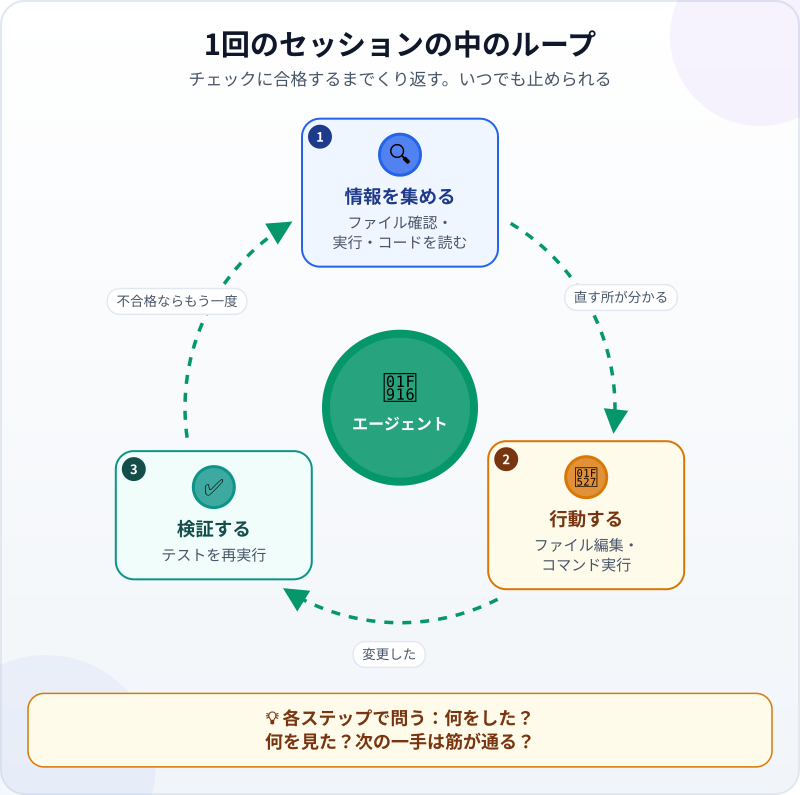

🌐 [Tiếng Việt](../../vi/lessons/the-agent-loop.md) · [English](../../en/lessons/the-agent-loop.md) · **日本語**

# 実際のセッションでエージェントのループをたどる

<!-- section: objective -->
## この授業のゴール

この授業を終えると、次のことができるようになります。

- 実際のセッションの中で、**エージェントループ**の3つの段階（情報を集める・行動する・検証する）を見分けられる。
- 各ステップに3つの質問をして、セッションの記録を読める。
- エージェントを止めたり方向を直したりするべきときが分かり、最後の結果を自分で確かめる理由を説明できる。

<!-- section: hook -->
## なぜ大事なの？

トゥアンさんは日本で働く機械エンジニアです。チームで使っている、経費を合計する小さなコードのバグを直すよう、エージェントに頼みました。数秒後、エージェントが報告します。「修正しました。テストはすべて合格です」。その上には、コマンドと結果が長く並んでいますが、トゥアンさんは読まずにスクロールしてしまいました。

「修正しました」を信じていいのでしょうか。あの長い一覧がセッションの記録です。それを読めることが、報告をただ信じるのではなく、エージェントを見守るためのスキルです。

<!-- section: concept -->
## 本題

### セッションの3つの段階

[頭脳・道具・ループ](agent-parts-and-loop.md)で、エージェントは「考える・道具を使う・結果を観察する」をくり返すと学びました。Claude Codeのドキュメント（2026年9月時点）は、1回のセッションの作業を、互いに混ざり合う3つの段階に分けています。

1. **情報を集める：** どんなファイルがあるか見る、試しに実行する、コードを読む。
2. **行動する：** ファイルを編集・作成する、何かを変えるコマンドを実行する。
3. **検証する：** テストやチェックをもう一度実行し、変更がうまくいったか確かめる。

まだ合格しなければ、ループはもう一周します。エージェントが道具を使うたびに、その結果は会話に戻されます。[ツール呼び出し](tool-calling.md)で見たとおりです。エージェントはそれをもとに次の一手を選びます。



### 各ステップに3つの質問

セッションの記録を読むのに、コードを全部理解する必要はありません。各ステップで、次の3つを聞くだけです。

1. **エージェントは今、何をした？** ―― どの道具を、何に使ったか。
2. **何を見た？** ―― 返ってきた結果。
3. **今見たことから考えて、次の一手は筋が通っている？**

3つ目の答えが「いいえ」なら、つまり関係のないファイルを編集しに行ったり、コードを直す代わりにテストのほうを書き換えて合格させようとしたりしたら、そこで口をはさむときです。

### あなたもループの中にいる

Claude Codeのドキュメント（2026年9月時点）によると、エージェントはいつでも止められます。`Esc` を押せばすぐに止まり、修正の指示を打ってEnterを押せば方向を変えられます。エージェントは自分で作業を進めますが、あなたの声も聞いています。

<!-- section: example -->
## 具体例

以下は、この授業を書いている間にClaude Codeが実際に行ったセッションです（2026年9月）。表示だけを短くしています。`ai-practice` フォルダーには2つのファイルがあります。金額のリストを合計する関数 `total` が入った `expenses.py` と、2つのテストが入った `test_expenses.py` です。エージェントに与えた目標：「テストを実行し、不合格があれば原因を探してコードを直すこと。テストは直さないこと。合格するまで実行し直すこと」。

**ステップ1 ―― 情報を集める：フォルダーを見る。**

```text
$ ls
expenses.py
test_expenses.py
```

エージェントはファイルが2つあるのを見ました。筋が通っています。次は、何がおかしいのか知るためにテストを実行します。

**ステップ2 ―― 情報を集める：テストを実行する。**

```text
$ python -m pytest -q
E       assert 205000 == 250000
E        +  where 205000 = total([85000, 120000, 45000])
FAILED test_expenses.py::test_total - assert 205000 == 250000
1 failed, 1 passed
```

エージェントが見たもの：テストが1つ不合格。正しい合計は250,000なのに、関数は205,000を返しています。これはちょうど85,000＋120,000で、**最後の金額**45,000が抜けています。筋が通っています。次は、理由を探すためにコードを読みます。

**ステップ3 ―― 情報を集める：コードを読む。**

```text
$ cat expenses.py
def total(amounts):
    """Return the sum of a list of amounts."""
    result = 0
    for i in range(len(amounts) - 1):
        result += amounts[i]
    return result
```

エージェントが見たもの：ループが `range(len(amounts) - 1)` で回っていて、最後の要素の手前で止まります。ステップ2で見たことと一致します。

**ステップ4 ―― 行動する：ちょうど1行だけ直す。**

```text
-    for i in range(len(amounts) - 1):
+    for i in range(len(amounts)):
```

エージェントはコードを直し、テストには手を付けていません。指示どおりです。

**ステップ5 ―― 検証する：テストをもう一度実行する。**

```text
$ python -m pytest -q
2 passed
```

チェックに合格したので、ループは止まり、エージェントは報告します。

**注目したい点。** ステップ2で、2つ目のテスト（`test_empty`：空のリストの合計は0）は、**コードにバグが残っている間も合格していました**。テストが1つ合格しただけでは、コードが正しいことは証明できません。証明できるのは、そのテストが確かめている内容だけです。だからこそ、[「たぶん合っている」をチェックに変える](testing-basics.md)で学んだように、性質の違うテストをいくつか用意する価値があります。

**あなたの役目。** 上の5つのステップを読むのに1分もかかりません。トゥアンさんはさらに2つのことをしました。変更を見る（1行、正しい場所）ことと、自分のパソコンでテストを実行し直すことです。そこで初めて「修正しました」は、聞いただけのことではなく、自分で確かめたことになります。

<!-- section: try-it -->
## やってみよう

約5分。`ai-practice` の中で、個人のパソコンでコマンドの実行を許可したエージェントを使います。会社のパソコンでは、会社が認めている場合だけ行ってください。認められていなければ、上のセッションを読み、各ステップの3つの質問に自分で答えましょう。

1. 次の2つのファイルを、このとおりに作るようエージェントに頼みます。

   ```python
   # expenses.py
   def total(amounts):
       """Return the sum of a list of amounts."""
       result = 0
       for i in range(len(amounts) - 1):
           result += amounts[i]
       return result
   ```

   ```python
   # test_expenses.py
   from expenses import total

   def test_total():
       assert total([85000, 120000, 45000]) == 250000

   def test_empty():
       assert total([]) == 0

   if __name__ == "__main__":
       test_total()
       test_empty()
       print("All tests passed")
   ```

2. 目標を伝えます。「`python test_expenses.py` を実行し、不合格があれば原因を探してコードを直すこと。テストは直さないこと。合格するまで実行し直すこと」。エージェントが何かをインストールしたがったら、それは ✋ 先に確認すべきことです。
3. エージェントが作業している間、各ステップの横に1文字書きます。**集**（情報を集める）、**行**（行動する）、**検**（検証する）。
4. 自分で確かめます。`test_expenses.py` を開いて変わっていないことを見てから、自分で `python test_expenses.py` を実行します。`All tests passed` と表示されれば合格です。

- *見せられるもの…* 各ステップの横に集・行・検を書いたセッションの記録。
- *確かめたこと…* テストのファイルが変わっていないこと、そして自分でテストを実行し直して合格したこと。
- *使わないほうがいい場面…* たとえば、テストがまだ1つもないとき。それではエージェントに検証の手がかりがありません。

<!-- section: misconceptions -->
## よくある誤解

- **「エージェントがテスト合格と言ったら完了」** ―― 何を変えたかを見ましょう。エージェントはテストそのものを書き換えて合格させることもあります。そして一度は自分で実行し直しましょう。
- **「セッションの記録を読むにはプログラミングの知識が必要」** ―― 何をした・何を見た・次の一手は筋が通るか、の3つの質問で、怪しいステップの多くは見つけられます。
- **「エージェントが動き出したら、口をはさめない」** ―― いつでも止めたり方向を変えたりできます。後で被害を直すより、早めに止めるほうがずっといいのです。

<!-- section: recap -->
## 1枚でわかるこのレッスン


<!-- section: takeaways -->
## まとめ

- セッションはループ：情報を集め、行動し、検証する。チェックに合格するまで。
- 道具を使った結果は会話に戻り、次の一手を決めます。
- 各ステップを3つの質問で読みます：何をした、何を見た、次の一手は筋が通るか。
- テストが1つ合格しても、コードが正しいとは限りません。証明できるのは、そのテストが確かめた内容だけです。
- いつでも止められます。そして最後の結果は自分で確かめます。

<!-- section: quiz -->
## 確認クイズ

**問1.** 上のセッションで「修正後にテストを実行し直す」は、どの段階ですか？

- A) 情報を集める
- B) 検証する
- C) 行動する

**問2.** 記録を読んでいると、エージェントがテストを合格させるために `test_expenses.py` を書き換えています。どうしますか？

- A) エージェントを止めて、「テストではなくコードを直して」と伝える
- B) 最後にはテストが合格するので、そのまま続けさせる
- C) フォルダーごと消して、最初からやり直す

**問3.** コードにバグが残っている間も、`test_empty` が合格したのはなぜですか？

- A) pytestがそのテストを飛ばしたから
- B) エージェントが先に直していたから
- C) 空のリストでは、間違ったループでも正しいループでも合計は0になり、そのテストはバグに届かないから

<details>
<summary>答えを見る</summary>

1. **B** ―― 変更がうまくいったか確かめるためにチェックをもう一度実行するのは、検証です。
2. **A** ―― その一手は目標に合っていないので、すぐに止めて方向を直します。フォルダーごと消すのはやりすぎです。
3. **C** ―― テストは確かめた内容しか証明しません。間違いが起こりうる場所に届くテストが必要です。

</details>

<!-- section: sources -->
## 参考資料

- Anthropic ―― [How Claude Code works](https://code.claude.com/docs/en/how-claude-code-works)（英語、2026年9月時点）：タスクを受けたClaudeは、混ざり合う3つの段階（情報を集める・行動する・結果を検証する）を通り、完了するまでくり返す。道具を使うたびに得た情報がループに戻り、次の一手を決める。`Esc` で止める、修正を打ち込むなど、いつでも割り込める。
