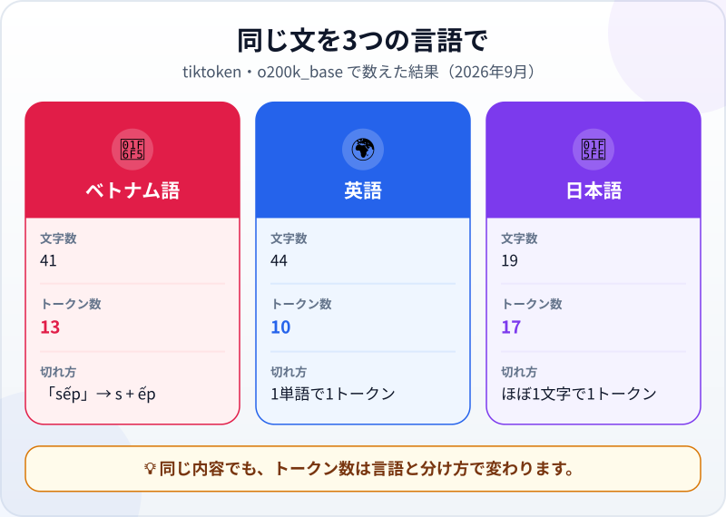
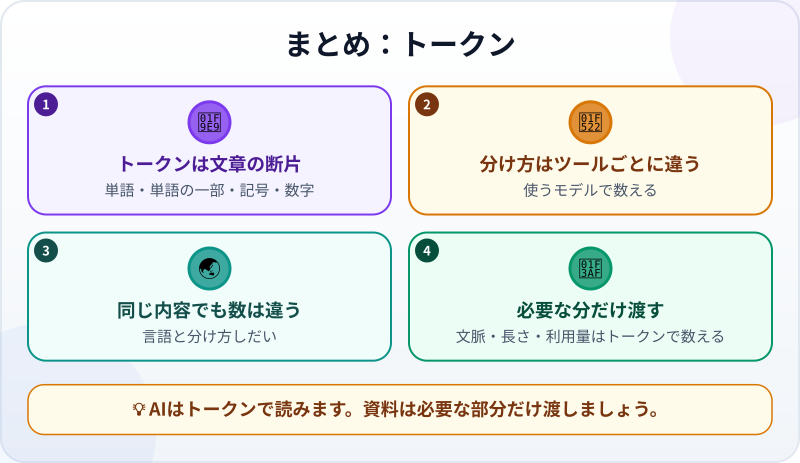

🌐 [Tiếng Việt](../../vi/lessons/tokens.md) · [English](../../en/lessons/tokens.md) · **日本語**

# トークン：AIは文章を小さな断片で読む

<!-- section: objective -->
## この授業のゴール

この授業を終えると、次のことができるようになります。

- **トークン**とは何か、なぜ単語や文字と同じではないのかを説明する。
- 文がトークンに切り分けられる様子を見て、言語や分け方によって数が変わることを確かめる。
- トークンで数えられるものを知り、資料をまるごとではなく必要な分だけAIに渡す。

<!-- section: hook -->
## なぜ大事なの？

トゥアンさんは日本で働く機械エンジニアです。毎日、家族にはベトナム語、同僚には日本語でメッセージを書き、報告書は英語で書きます。会社で使ってよいAIツールの資料を読むと、上限はすべて見慣れない単位で書かれていました。**トークン**です。ページ数でも単語数でもありません。

1トークンは何文字くらいでしょうか。同じ内容を3つの言語で書くと、同じだけ使うのでしょうか。この授業で実際に見てみましょう。

<!-- section: concept -->
## 本題

### トークンは、モデルが読み書きする文章の断片

[次のトークンの予測](next-token-prediction.md)で、LLMは回答をトークン一つずつ書くと学びました。モデルがあなたの文を読む前に、**トークナイザー（tokenizer）** というプログラムが文を断片に切り分け、断片ごとに番号に変えます。モデルが扱うのは、その番号の並びだけです。

トークンは、単語まるごとのこともあれば、単語の一部、句読点、数字、さらには1文字のさらに一部のこともあります。トークナイザーは決まった「断片のセット」を持っています。データによく出てくる文字の並びには専用の断片があり、めったに出てこない並びはもっと細かく切られます。

### 分け方はトークナイザーごとに違う

すべてのAIに共通する分け方はありません。モデルのシリーズごとに専用のトークナイザーがあることが多く、世代が変わるとトークナイザーが変わることもあります。Anthropicの資料（2026年9月時点）によると、Claude 4.7以降のモデルは新しいトークナイザーを使い、同じ文章でも以前のモデルより約30%多いトークン数になります。つまり、トークン数はそれを数えたトークナイザーでしか正しくありません。

### トークンで数えられるもの

- **[コンテキストウィンドウ](context-window.md)：** モデルが一度に見られる量（メッセージ、ファイル、コマンドの結果）はトークンで数えます。
- **回答の長さ：** ツールは多くの場合、1回の回答のトークン数に上限を設けています。
- **利用量：** 多くのプランやAPIは、入力と出力のトークン数で上限や料金を決めています。

トークンを手で数える必要はありません。でも単位を知っていれば、長い資料が「長すぎます」と断られる理由や、作業のセッションが思ったより早くいっぱいになる理由がわかります。

<!-- section: analogy -->
## 身近なたとえ

はんこ屋さんに、はんこの入った箱があると想像してください。「ありがとう」や「売上」のようによく使う言葉には専用のはんこがあり、一回押せば終わりです。珍しい名前やめったに使わない言葉には専用のはんこがないので、小さなはんこをいくつも組み合わせます。別のお店には別の箱があるので、同じ文でも押す回数が変わります。

このたとえが合わないところ：はんこはふつう意味のある言葉を押しますが、トークンは意味を持つとは限りません。下の例の「sếp」のように、単語の途中で切られることもあります。また、箱はあなたが書く文ごとに変わるわけではなく、モデルと一緒にあらかじめ用意されています。

<!-- section: example -->
## 具体例

トゥアンさんは、同じ内容の文を3つの言語で試しました。OpenAIのオープンソースのトークナイザー **tiktoken**（JavaScript版）の `o200k_base` という表で、2026年9月に切り分けています。角かっこ1組が1トークンです。スペースはふつう、後ろのトークンの先頭にくっつきます。

```text
ベトナム語：[Mai][ gửi][ báo][ cáo][ bán][ hàng][ tháng][ ][6][ cho][ s][ếp][.]
英語：      [Mai][ sends][ the][ June][ sales][ report][ to][ her][ boss][.]
日本語：    [マ][イ][は][6][月][の][売][上][報][告][を][上][司][に][送][ります][。]
```



トゥアンさんがわかったことは3つです。

1. **トークンは単語ではない。** 「sếp」（上司）は `[ s]` と `[ếp]` の2つに切られました。数字の `6` とその前のスペースも、別々のトークンです。
2. **同じ内容でも数が違う。** 英語は10トークン、ベトナム語は13、日本語は17トークン。日本語の文は19文字しかないのにです。この表では、漢字はほぼ1文字で1トークンでした。
3. **分け方を変えると数も変わる。** 同じベトナム語の文を、同じライブラリの古い表 `cl100k_base` で切ると、13ではなく **22** トークンになりました。声調記号のついた音節の多くが `[ g][ử][i]` のように細かく切られるからです。

トゥアンさんの結論：数字そのものより、習慣が大事です。長い資料についてAIに聞くときは、関係のある部分だけを渡します。余計な部分も、何語で書かれていてもコンテキストウィンドウの場所を取るからです。

<!-- section: try-it -->
## やってみよう

約3分、インストールは不要です。上と同じ `o200k_base` の表で数えたとき、**トークン数が少ない順**を予想してください。

- A) `Cảm ơn anh nhiều.`
- B) `Thanks a lot.`
- C) `ありがとうございます。`
- D) `27/09/2026`

先に自分の答えを紙に書いてから、結果を開きましょう。

<details>
<summary>結果を見る</summary>

- **C) 2トークン：** `[ありがとうございます][。]`：よく使うお礼の言葉は、まるごと1つの断片です。
- **B) 4トークン：** `[Thanks][ a][ lot][.]`
- **D) 6トークン：** `[27][/][09][/][202][6]`：日付は1トークンではありません。
- **A) 7トークン：** `[C][ảm][ ][ơn][ anh][ nhiều][.]`

日本語がいちばん多いと予想したなら、おそらく上の文の結果を見たからでしょう。あの文では日本語がいちばん多くのトークンを使いました。でも、よく使う言い回しは長くても1つの断片になります。

</details>

<!-- section: misconceptions -->
## よくある誤解

- **「1トークンは1単語」** — 単語のこともあれば、単語の一部、句読点、数字のこともあります。
- **「あるツールで数えた数は、どのAIでも同じ」** — 分け方はトークナイザーごとに違い、モデルの世代で変わることもあります。正確な数が必要なら、実際に使うモデルのトークン計測ツールで数えましょう。
- **「ベトナム語はいつも英語の2倍かかる」** — トークナイザーしだいです。上の例では、同じベトナム語の文が一方の表では13、もう一方では22トークンでした。決まった倍率を覚えるのはやめましょう。

<!-- section: recap -->
## 1枚でわかるこのレッスン



<!-- section: takeaways -->
## まとめ

- トークンは、モデルが読み書きする文章の断片です（単語、単語の一部、句読点、数字）。
- トークナイザーが文章を断片に切り分けます。モデルのシリーズごとに専用のものがあることが多いです。
- 同じ内容でも、トークン数は言語とトークナイザーによって変わります。
- コンテキストウィンドウ、回答の長さ、利用量はすべてトークンで数えます。AIには必要な分だけ渡しましょう。

<!-- section: quiz -->
## 確認クイズ

**問1.** トークンとは何ですか？

- A) いつも単語まるごと1つ
- B) いつもアルファベット1文字
- C) トークナイザーが切り分けた文章の断片（単語、単語の一部、句読点など）

**問2.** 同じベトナム語の文が、一方の表では13トークン、もう一方では22トークンになりました。なぜですか？

- A) 2つのトークナイザーが持つ断片のセットが違うから
- B) どちらかの数え方にバグがあるから
- C) 数える前に、ベトナム語の文が英語に翻訳されるから

**問3.** トゥアンさんは、200ページある技術マニュアルの1つの節について、AIに質問したいと考えています。いちばんよい方法はどれですか？

- A) 情報は多いほどよいので、200ページすべてを貼りつける
- B) 貼りつけたものはすべてコンテキストウィンドウのトークンを使うので、関係のある節だけを渡す
- C) トークンが確実に少なくなるように、マニュアルを英語に翻訳してから渡す

<details>
<summary>答えを見る</summary>

1. **C** — トークナイザーによって、単語、単語の一部、句読点、数字のどれにもなります。
2. **A** — トークナイザーごとに断片のセットが違うので、同じ文でも数が変わります。
3. **B** — 余計な部分も場所を取ります。英語に翻訳してもトークンが減るとは限らず、内容が変わってしまうおそれもあります。

</details>

<!-- section: sources -->
## 参考資料

- Anthropic — [Glossary](https://platform.claude.com/docs/en/about-claude/glossary)（英語）の *Tokens* の項：トークンは単語、単語の一部、文字、バイトのいずれにもなり得ます。Claudeでは1トークンが平均で英語の約3.5文字にあたり、この数は言語によって変わります。
- Anthropic — [Token counting](https://platform.claude.com/docs/en/build-with-claude/token-counting)（英語、2026年9月時点）：送る前にトークン数を数えられます。Claude 4.7以降は新しいトークナイザーのため、同じ文章で約30%多いトークン数になるので、使うモデルで数え直すよう勧めています。
- OpenAI — [tiktoken](https://github.com/openai/tiktoken)（英語）：オープンソースのトークナイザー。モデルは文章ではなくトークンという番号の並びを見ていて、1トークンは平均で約4バイトにあたります。この授業の数はすべて、JavaScript版の `js-tiktoken` 1.0.21 と、表 `o200k_base`・`cl100k_base` を使って2026年9月に数えたものです。
