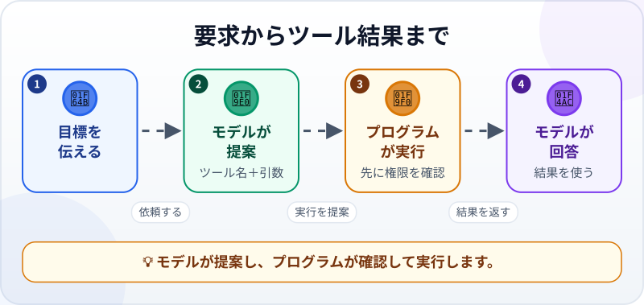
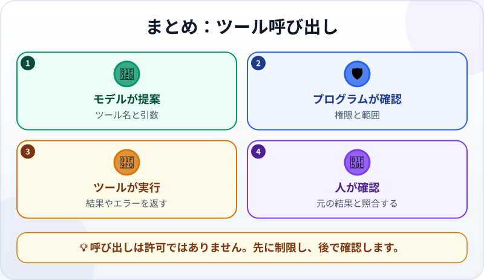

🌐 [Tiếng Việt](../../vi/lessons/tool-calling.md) · [English](../../en/lessons/tool-calling.md) · **日本語**

# ツール呼び出し：LLMが現実のボタンを押すしくみ

<!-- section: objective -->
## この授業のゴール

この授業を終えると、次のことができるようになります。

- モデルのツール要求と、実際に実行するプログラムを区別する。
- ツール名、引数、結果から一回の呼び出しを読み取る。
- 権限、入力、結果を確認する場所を見つける。

<!-- section: hook -->
## なぜ大事なの？

ハナは「`ai-practice/meeting.txt` の会議は何時に始まる？」と質問します。モデルが受け取ったものが質問だけなら、ファイルの中身はわかりません。「開く」ボタンを押す手もありません。

ファイルを読む**ツール**が必要です。ただし、モデルが直接ツールを実行するわけではありません。モデルが呼び出しを提案し、周りのプログラムが実行するか決めます。

<!-- section: concept -->
## 本題

**ツール呼び出し（tool calling／function calling）**では、モデルが構造化された要求を返します。要求には次の情報があります。

- **ツール名：** `read_file` など、使いたい機能。
- **引数：** `ai-practice/meeting.txt` など、ツールに渡す入力。



流れには四つの役割があります。

1. **利用者**が目標を伝えます。
2. **モデル**がツールを選び、構造化された呼び出しを作ります。
3. **周りのプログラム**が権限を確認し、ツールを実行して結果を受け取ります。
4. **モデル**が会話に戻された結果を読み、回答します。

魔法の言葉ではありません。名前と引数は、プログラムが用意したツールに合う必要があります。ファイルを読むツールがなければ、モデルは読む権限を作れません。パスが違えばエラーが返ります。そのエラーを使って要求を直すか、利用者に質問できます。

### 三つの確認場所

- **実行前：** プログラムは危険なツールを止めたり、許可を求めたりできます。`ai-practice` の架空ファイルを読むのは✅安全、削除・送信・フォルダ外の操作は✋先に確認、パスワード・APIキー・会社の実データは⛔渡しません。
- **実行中：** 許可された引数だけを渡します。一つのパスだけを指定するほうが、すべての場所へのアクセスより安全です。
- **実行後：** ツール結果は新しいデータであり、正しい結論とは限りません。モデルの読み違いもあるため、元の結果と回答を照合します。

ツール呼び出しは、[エージェントのループ](agent-parts-and-loop.md)にある**行動**です。行動を選ぶ→実行する→結果を観察する→もう一度決める、という流れです。簡単な質問は一回、長い作業では何回も繰り返します。

<!-- section: example -->
## 具体例

架空データで一回のやり取りを見ます。`ai-practice/meeting.txt` の内容は次のとおりです。

```text
プロジェクト会議：木曜日14時30分
会議室：さくらB
```

**ステップ1 — ハナが質問する**

> `ai-practice/meeting.txt` の会議は何時に始まりますか？そのファイルだけを読んでください。

**ステップ2 — モデルがツール呼び出しを提案する**

```json
{"tool": "read_file", "arguments": {"path": "ai-practice/meeting.txt"}}
```

これは構造化された提案であり、ファイル内容ではありません。モデルは `read_file` を選び、`path` 引数でハナのファイルだけに限定しました。

**ステップ3 — プログラムが確認して実行する**

プログラムはパスが `ai-practice` 内にあると確認して、読み取りを許可します。ツールは次を返します。

```text
プロジェクト会議：木曜日14時30分
会議室：さくらB
```

**ステップ4 — 結果がモデルに戻る**

モデルは時刻を推測する必要がありません。「会議は木曜日14時30分に始まります」と答えます。ハナは元の行と照合します。

モデルが `ai-practice/meting.txt` と送ると、「ファイルが見つかりません」と返ります。このエラーも役立ちます。ファイル名を確認して再実行できます。空白を埋めるために内容を作ってはいけません。

メール送信を頼んだ場合は別の行動です。プログラムは止まり、ハナが宛先と本文を見てから許可できるようにします。モデルの提案は実行の許可ではありません。

<!-- section: recap -->
## 1枚でわかるこのレッスン



<!-- section: takeaways -->
## まとめ

- モデルはツール名と引数を提案し、周りのプログラムが実行します。
- ツール結果は会話に戻り、モデルが回答や次の判断に使います。
- ツールは用意された機能と許可された権限の範囲だけで動きます。
- 実行前に確認し、引数を限定し、実行後に結果と照合します。
- ツール呼び出しはエージェントループの行動と観察の一回分です。

<!-- section: quiz -->
## 確認クイズ

**問1.** `read_file` の要求を実際に実行するのは誰ですか？

- A) モデルがプログラムなしでディスクを開く
- B) ファイルを書いた人
- C) 呼び出しと権限を確認した周りのプログラム

**問2.** 例の呼び出しで、引数はどれですか？

- A) パス `ai-practice/meeting.txt`
- B) ツール名 `read_file`
- C) ハナへの最後の回答

**問3.** モデルがメール送信ツールを提案しました。どうすべきですか？

- A) モデルが選んだので、必ずすぐ送る
- B) 止まって、利用者が確認して許可できるようにする
- C) 代わりにファイルを読み、送信済みとする

<details>
<summary>答えを見る</summary>

1. **C** — モデルが要求を作り、プログラムが確認して実行します。
2. **A** — `read_file` はツール名で、パスがツールへの入力です。
3. **B** — 外部への送信は、利用者の確認と許可が必要な行動です。

</details>
